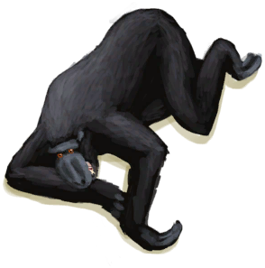

# The Macaque is down!(未实装)  
> You managed to get it. It's yours now!  
  
<table class="table table-bordered" data-toggle="table"  data-show-header="false"><thead style="display:none"><tr ><th  style="width:50%;text-align:left;vertical-align:top;"  data-sortable="true"  >title</th><th  style="width:50%;text-align:left;vertical-align:top;"  ></th></tr></thead><tr ><td  style="width:50%;text-align:left;vertical-align:top;"  ></td><td  style="width:50%;text-align:left;vertical-align:top;"  >

<a href="Event_MacaqueUndeadFightSuccess.md" style="color:black">The Macaque is down!</a>

</td></tr></tbody></table>  
  
## Action  

<table><tr><td rowspan="2" style="width:200px;text-align:center;font-size:1.3em;font-weight:bold">

Continue

</td><td></td></tr><tr><td><b>Self：</b>→Dismiss</td></tr><tr><td colspan="2"><b>StatChange：</b>[

[Morale](Morale.md)](Morale.md)<b>+20</b>, [Population Macaques](Pop_Macaque.md)<b>-1000</b></td></tr><tr><td colspan="2">

<table style="margin-bottom:3px;"><tr><td rowspan=2 style="text-align:center" width="80px">
Base Weight

90
</td><td style="font-size:0.6em;line-height:0.6em;font-weight:bold">Carcass</td></tr><tr><td>[

[Macaque Carcass](MacaqueCarcass.md)](MacaqueCarcass.md)(<b>+1</b>)</td></tr></table>

<table style="margin-bottom:3px;"><tr><td rowspan=2 style="text-align:center" width="80px">
Base Weight

10
</td><td style="font-size:0.6em;line-height:0.6em;font-weight:bold">Wounded</td></tr><tr><td>[

[Wounded Macaque](MacaqueWounded.md)](MacaqueWounded.md)(<b>+1</b>)</td></tr></table>

</td></tr></table>
  
  
  

