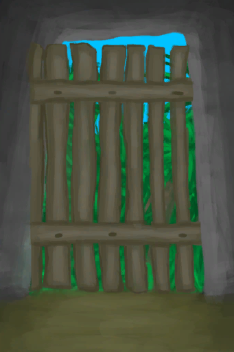

# Mouse Damage  
> There are signs of mouse activity in the area.  
  
<table class="table table-bordered" data-toggle="table"  data-show-header="false"><thead style="display:none"><tr ><th  style="width:50%;text-align:left;vertical-align:top;"  >title</th><th  style="width:50%;text-align:left;vertical-align:top;"  ></th></tr></thead><tr ><td  style="width:50%;text-align:left;vertical-align:top;"  >
<b>Trigger: </b>
[Mouse Raid Counter](MouseDamageCounter.md): <b>192-192</b>, [

[Distance](Distance.md)](Distance.md): <b>0-0</b>, ~~[

[Door](Imp_Door.md)](Imp_Door.md) On Hand/Board~~，~~In [

[Bird Rock(Environment)](Env_BirdRock.md)](Env_BirdRock.md)~~, [“Feed”](tag_Feed.md) On Board/不在容器中 
<b>Effect: </b>
[Mouse Raid Counter](MouseDamageCounter.md)<b>-192</b></td><td  style="width:50%;text-align:left;vertical-align:top;"  >

<a href="Event_MouseDamage.md" style="color:black">Mouse Damage</a>

</td></tr></tbody></table>  
  
## Action  

<table><tr><td rowspan="2" style="width:200px;text-align:center;font-size:1.3em;font-weight:bold">

Assess the damage

</td><td></td></tr><tr><td><b>Self：</b>→Dismiss</td></tr><tr><td colspan="2"><b>CardChanges：</b>地上所有[“Feed”](tag_Feed.md)</td></tr><tr><td colspan="2"><b>StatChange：</b>[

[Morale](Morale.md)](Morale.md)<b>-10</b>, [Population Mouse](Pop_Mouse.md)<b>+250</b></td></tr><tr><td colspan="2">

<table style="margin-bottom:3px;"><tr><td rowspan=2 style="text-align:center" width="80px">
Base Weight

200
</td><td style="font-size:0.6em;line-height:0.6em;font-weight:bold">Nothing</td></tr><tr><td></td></tr></table>

<table style="margin-bottom:3px;"><tr><td rowspan=2 style="text-align:center" width="80px">
Base Weight

0
</td><td style="font-size:0.6em;line-height:0.6em;font-weight:bold">Mouse</td></tr><tr><td>[

[Dead Mouse](Mouse.md)](Mouse.md)(<b>+1</b>)[Population Mouse](Pop_Mouse.md)<b>-1000</b></td></tr><tr><td colspan=2><li>[Population Mouse](Pop_Mouse.md) in <b>1000～100000</b>, weight<b>+1～+25</b></li></td></tr></table>

<table style="margin-bottom:3px;"><tr><td rowspan=2 style="text-align:center" width="80px">
Base Weight

0
</td><td style="font-size:0.6em;line-height:0.6em;font-weight:bold">Mice</td></tr><tr><td>[

[Dead Mouse](Mouse.md)](Mouse.md)(<b>+2～+3</b>)[Population Mouse](Pop_Mouse.md)<b>-2500</b></td></tr><tr><td colspan=2><li>[Population Mouse](Pop_Mouse.md) in <b>1000～100000</b>, weight<b>+1～+5</b></li></td></tr></table>
<button class="btn btn-secondary btn-sm" style="" data-toggle="modal" onclick="setCollectionDataBase64('eyJ0aXRsZSI6IlNpbXVsYXRvcjogQXNzZXNzIHRoZSBkYW1hZ2UgKE1vdXNlIERhbWFnZSkiLCJjb2xsZWN0aW9ucyI6W3siZHJvcCI6Ii0iLCJiYXNlIjoyMDAsImNvbmRpdGlvbiI6W119LHsiZHJvcCI6IjxkaXYgc3R5bGU9XCJ3aWR0aDoyNXB4O2Rpc3BsYXk6aW5saW5lLWJsb2NrO3RleHQtYWxpZ246Y2VudGVyXCI+PGltZyBkZWNvZGluZz1cImFzeW5jXCIgc3JjPVwiU3ByaXRlL01vdXNlLnBuZ1wiIGhyZWY9XCJhLm1kXCIgc3R5bGU9XCJtYXgtd2lkdGg6MjVweDttYXgtaGVpZ2h0OjI1cHg7XCI+PC9kaXY+RGVhZCBNb3VzZSIsImJhc2UiOjAsImNvbmRpdGlvbiI6W3sia2V5IjoiUG9wX01vdXNlIiwidGl0bGUiOiJQb3B1bGF0aW9uIE1vdXNlIiwidHlwZSI6InJhbmdlIiwibWF4IjpbMCwxMDAwMDBdLCJyYW5nZSI6WzEwMDAsMTAwMDAwXSwid2VpZ2h0IjpbMSwyNV0sImRlZmF1bHRWYWx1ZSI6NTAwMDAsIndoZW5PdXRPZlJhbmdlIjowfV19LHsiZHJvcCI6IjxkaXYgc3R5bGU9XCJ3aWR0aDoyNXB4O2Rpc3BsYXk6aW5saW5lLWJsb2NrO3RleHQtYWxpZ246Y2VudGVyXCI+PGltZyBkZWNvZGluZz1cImFzeW5jXCIgc3JjPVwiU3ByaXRlL01vdXNlLnBuZ1wiIGhyZWY9XCJhLm1kXCIgc3R5bGU9XCJtYXgtd2lkdGg6MjVweDttYXgtaGVpZ2h0OjI1cHg7XCI+PC9kaXY+RGVhZCBNb3VzZSIsImJhc2UiOjAsImNvbmRpdGlvbiI6W3sia2V5IjoiUG9wX01vdXNlIiwidGl0bGUiOiJQb3B1bGF0aW9uIE1vdXNlIiwidHlwZSI6InJhbmdlIiwibWF4IjpbMCwxMDAwMDBdLCJyYW5nZSI6WzEwMDAsMTAwMDAwXSwid2VpZ2h0IjpbMSw1XSwiZGVmYXVsdFZhbHVlIjo1MDAwMCwid2hlbk91dE9mUmFuZ2UiOjB9XX1dfQ==')" data-target="#modelCollectionSimulator">Simulator</button>
</td></tr></table>
  
  
  

