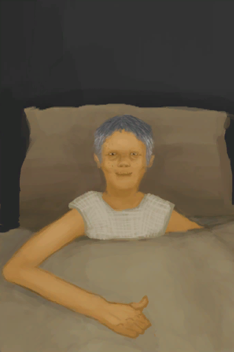

# Grandpa has recovered!  
> "Your Grandfather is feeling better now and it's all thanks to your efforts.  He's still weak so he can't help in the farm  
  
<table class="table table-bordered" data-toggle="table"  data-show-header="false"><thead style="display:none"><tr ><th  style="width:50%;text-align:left;vertical-align:top;"  data-sortable="true"  >title</th><th  style="width:50%;text-align:left;vertical-align:top;"  ></th></tr></thead><tr ><td  style="width:50%;text-align:left;vertical-align:top;"  ></td><td  style="width:50%;text-align:left;vertical-align:top;"  >

<a href="Event_OutroFarmer1.md" style="color:black">Grandpa has recovered!</a>

</td></tr></tbody></table>  
  
## Got From  

Grandpa's Back

[Grandfather](Grandfather.md)

  
  
## Action  

<table><tr><td rowspan="2" style="width:200px;text-align:center;font-size:1.3em;font-weight:bold">

Good!

</td><td></td></tr><tr><td><b>Self：</b>→Dismiss</td></tr><tr><td colspan="2">[

[Grandpa has recovered!(Event)](Event_OutroFarmer2.md)](Event_OutroFarmer2.md)(<b>+1</b>)</td></tr></table>
  
  
  

