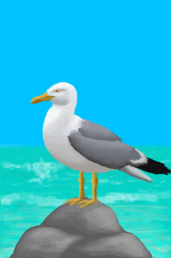

# Seagull(未实装)  
> It's trying to destroy my crops!  
  
<table class="table table-bordered" data-toggle="table"  data-show-header="false"><thead style="display:none"><tr ><th  style="width:50%;text-align:left;vertical-align:top;"  data-sortable="true"  >title</th><th  style="width:50%;text-align:left;vertical-align:top;"  ></th></tr></thead><tr ><td  style="width:50%;text-align:left;vertical-align:top;"  ></td><td  style="width:50%;text-align:left;vertical-align:top;"  >

<a href="Event_SeagullRaidCropDestruction.md" style="color:black">Seagull</a>

</td></tr></tbody></table>  
  
## Got From  

Ignore it

[A seagull!(Event)](Event_SeagullRaidCrop.md)(未实装)

Throw Rock at it

[A seagull!(Event)](Event_SeagullRaidCrop.md)(未实装)

Use Sling

[A seagull!(Event)](Event_SeagullRaidCrop.md)(未实装)

Use Spear

[A seagull!(Event)](Event_SeagullRaidCrop.md)(未实装)

Attack with Bow

[A seagull!(Event)](Event_SeagullRaidCrop.md)(未实装)

Attack with Gun!

[A seagull!(Event)](Event_SeagullRaidCrop.md)(未实装)

  
  
## Action  

<table><tr><td rowspan="2" style="width:200px;text-align:center;font-size:1.3em;font-weight:bold">

Watch impotently...

15m

</td><td></td></tr><tr><td><b>Self：</b>→Dismiss</td></tr><tr><td colspan="2"><b>CardChanges：</b>地上所有[“Crop”](tag_Crop.md)Growth  <b>-450～-150(-66.96%～-22.32%)</b></td></tr><tr><td colspan="2"><b>StatChange：</b>[

[Morale](Morale.md)](Morale.md)<b>-10</b></td></tr></table>
  
  
  

