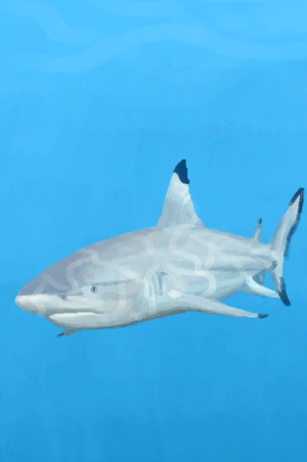

# A Shark!  
> It's coming for me!  
  
<table class="table table-bordered" data-toggle="table"  data-show-header="false"><thead style="display:none"><tr ><th  style="width:50%;text-align:left;vertical-align:top;"  >title</th><th  style="width:50%;text-align:left;vertical-align:top;"  ></th></tr></thead><tr ><td  style="width:50%;text-align:left;vertical-align:top;"  >**Tag：**	[“Fight Event”](tag_FightEvent.md)</td><td  style="width:50%;text-align:left;vertical-align:top;"  >

<a href="Event_SharkFight.md" style="color:black">A Shark!</a>

</td></tr></tbody></table>  
  
## Got From  

Dive

[Sea(Bay)](Sea_Bay.md)

Dive

[Sea](Sea_Raft.md)

Wash yourself

[Sea](Sea_Raft.md)

** With：**[Harpoon](HarpoonBone.md)Spear Fish

[Sea](Sea_Raft.md)

  
  
## Action  

<table><tr><td rowspan="2" style="width:200px;text-align:center;font-size:1.3em;font-weight:bold">

Attack with Spear!

30m

</td><td></td></tr><tr><td><b>Self：</b>→Dismiss</td></tr><tr><td colspan="2"><b>Require：</b>[“Spear T1”](tag_Spear.md) On Hand/Equip(Partial)</td></tr><tr><td colspan="2"><b>CardChanges：</b>手牌中的一个[“Spear T1”](tag_Spear.md)Usage  <b>-30～-5</b>, 手牌中的一个[Shield](Shield.md)Usage  <b>-15～-5</b></td></tr><tr><td colspan="2"><b>StatChange：</b>[

[Spear Fighting(Skill)](Skill_SpearFighting.md)](Skill_SpearFighting.md)<b>+1</b></td></tr><tr><td colspan="2">

<table style="margin-bottom:3px;"><tr><td rowspan=2 style="text-align:center" width="80px">
Base Weight

10
</td><td style="font-size:0.6em;line-height:0.6em;font-weight:bold">Success</td></tr><tr><td>[

[The Shark is down!(Event)](Event_SharkFightSuccess.md)](Event_SharkFightSuccess.md)(<b>+1</b>)</td></tr><tr><td colspan=2><li>[

[Spear Fishing(Skill)](Skill_SpearFishing.md)](Skill_SpearFishing.md) in <b>0～150(0%～100%)</b>, weight <b>+0～+150</b></li><li>[

[Spear Fighting(Skill)](Skill_SpearFighting.md)](Skill_SpearFighting.md) in <b>0～150(0%～100%)</b>, weight <b>+0～+50</b></li><li>[Climb Modifier](ModifierClimb.md) in <b>0～3</b>, weight <b>+0～-125</b></li>Max 1 of：<li>[

[Flint Spear](SpearFlint.md)](SpearFlint.md) On *Hand/Equip*，Weight<b>+5</b>,</li><li>[

[Copper Spear](SpearCopper.md)](SpearCopper.md) On *Hand/Equip*，Weight<b>+10</b>,</li><li>[

[Scrap Spear](SpearScrap.md)](SpearScrap.md) On *Hand/Equip*，Weight<b>+20</b>,</li><li>[

[Obsidian Spear](SpearObsidian.md)](SpearObsidian.md) On *Hand/Equip*，Weight<b>+13</b>,</li><li>[

[Harpoon](HarpoonBone.md)](HarpoonBone.md) On *Hand/Equip*，Weight<b>+25</b>,</li></td></tr></table>

<table style="margin-bottom:3px;"><tr><td rowspan=2 style="text-align:center" width="80px">
Base Weight

20
</td><td style="font-size:0.6em;line-height:0.6em;font-weight:bold">Mixed Success</td></tr><tr><td>[

["I got it(Event)](Event_SharkFightMixedSuccess.md)](Event_SharkFightMixedSuccess.md)(<b>+1</b>)</td></tr><tr><td colspan=2><li>[

[Spear Fishing(Skill)](Skill_SpearFishing.md)](Skill_SpearFishing.md) in <b>0～150(0%～100%)</b>, weight <b>+0～+150</b></li><li>[

[Spear Fighting(Skill)](Skill_SpearFighting.md)](Skill_SpearFighting.md) in <b>0～150(0%～100%)</b>, weight <b>+0～+25</b></li><li>[

[Swimming(Skill)](Skill_Swimming.md)](Skill_Swimming.md) in <b>0～150(0%～100%)</b>, weight <b>+0～-25</b></li><li>[Climb Modifier](ModifierClimb.md) in <b>0～3</b>, weight <b>+0～-60</b></li><li>[

[Leg Protection](LegProtection.md)](LegProtection.md) in <b>1～10</b>, weight<b>-1～-15</b></li>Max 1 of：<li>[

[Flint Spear](SpearFlint.md)](SpearFlint.md) On *Hand/Equip*，Weight<b>+5</b>,</li><li>[

[Copper Spear](SpearCopper.md)](SpearCopper.md) On *Hand/Equip*，Weight<b>+10</b>,</li><li>[

[Scrap Spear](SpearScrap.md)](SpearScrap.md) On *Hand/Equip*，Weight<b>+20</b>,</li><li>[

[Obsidian Spear](SpearObsidian.md)](SpearObsidian.md) On *Hand/Equip*，Weight<b>+13</b>,</li><li>[

[Harpoon](HarpoonBone.md)](HarpoonBone.md) On *Hand/Equip*，Weight<b>+25</b>,</li></td></tr></table>

<table style="margin-bottom:3px;"><tr><td rowspan=2 style="text-align:center" width="80px">
Base Weight

30
</td><td style="font-size:0.6em;line-height:0.6em;font-weight:bold">Failure</td></tr><tr><td>[

[It Escaped!(Event)](Event_SharkFightFailure.md)](Event_SharkFightFailure.md)(<b>+1</b>)</td></tr></table>

<table style="margin-bottom:3px;"><tr><td rowspan=2 style="text-align:center" width="80px">
Base Weight

20
</td><td style="font-size:0.6em;line-height:0.6em;font-weight:bold">Bad Failure</td></tr><tr><td>[

[It got me...(Event)](Event_SharkFightBadFailure.md)](Event_SharkFightBadFailure.md)(<b>+1</b>)</td></tr><tr><td colspan=2><li>[

[Leg Protection](LegProtection.md)](LegProtection.md) in <b>1～10</b>, weight<b>-1～-10</b></li><li>[

[Swimming(Skill)](Skill_Swimming.md)](Skill_Swimming.md) in <b>0～150(0%～100%)</b>, weight <b>+0～-15</b></li></td></tr></table>
<button class="btn btn-secondary btn-sm" style="" data-toggle="modal" onclick="setCollectionDataBase64('eyJ0aXRsZSI6IlNpbXVsYXRvcjogQXR0YWNrIHdpdGggU3BlYXIhIChBIFNoYXJrISkiLCJjb2xsZWN0aW9ucyI6W3siZHJvcCI6IjxkaXYgc3R5bGU9XCJ3aWR0aDoyNXB4O2Rpc3BsYXk6aW5saW5lLWJsb2NrO3RleHQtYWxpZ246Y2VudGVyXCI+PGltZyBkZWNvZGluZz1cImFzeW5jXCIgc3JjPVwiU3ByaXRlL1NoYXJrRXZlbnQucG5nXCIgaHJlZj1cImEubWRcIiBzdHlsZT1cIm1heC13aWR0aDoyNXB4O21heC1oZWlnaHQ6MjVweDtcIj48L2Rpdj5UaGUgU2hhcmsgaXMgZG93biEoRXZlbnQpIiwiYmFzZSI6MTAsImNvbmRpdGlvbiI6W3sia2V5IjoiU2tpbGxfU3BlYXJGaXNoaW5nIiwidGl0bGUiOiJTcGVhciBGaXNoaW5nKFNraWxsKSIsInR5cGUiOiJyYW5nZSIsIm1heCI6WzAsMTUwXSwicmFuZ2UiOlswLDE1MF0sIndlaWdodCI6WzAsMTUwXSwiZGVmYXVsdFZhbHVlIjowLCJ3aGVuT3V0T2ZSYW5nZSI6MX0seyJrZXkiOiJTa2lsbF9TcGVhckZpZ2h0aW5nIiwidGl0bGUiOiJTcGVhciBGaWdodGluZyhTa2lsbCkiLCJ0eXBlIjoicmFuZ2UiLCJtYXgiOlswLDE1MF0sInJhbmdlIjpbMCwxNTBdLCJ3ZWlnaHQiOlswLDUwXSwiZGVmYXVsdFZhbHVlIjowLCJ3aGVuT3V0T2ZSYW5nZSI6MX0seyJrZXkiOiJNb2RpZmllckNsaW1iIiwidGl0bGUiOiJDbGltYiBNb2RpZmllciIsInR5cGUiOiJyYW5nZSIsIm1heCI6WzAsM10sInJhbmdlIjpbMCwzXSwid2VpZ2h0IjpbMCwtMTI1XSwiZGVmYXVsdFZhbHVlIjowLCJ3aGVuT3V0T2ZSYW5nZSI6MX0seyJrZXkiOiJTcGVhckZsaW50IiwidGl0bGUiOiI8ZGl2IHN0eWxlPVwid2lkdGg6MjBweDtkaXNwbGF5OmlubGluZS1ibG9jazt0ZXh0LWFsaWduOmNlbnRlclwiPjxpbWcgZGVjb2Rpbmc9XCJhc3luY1wiIHNyYz1cIlNwcml0ZS9TcGVhckZsaW50LnBuZ1wiIGhyZWY9XCJhLm1kXCIgc3R5bGU9XCJtYXgtd2lkdGg6MjBweDttYXgtaGVpZ2h0OjIwcHg7XCI+PC9kaXY+RmxpbnQgU3BlYXIgT24gKkhhbmQvRXF1aXAq77yMIiwidHlwZSI6InRvZ2dsZSIsInJhbmdlIjpbMCwxXSwibWF4IjpbMCwxXSwid2VpZ2h0IjpbMCw1XSwiZGVmYXVsdFZhbHVlIjowLCJ3aGVuT3V0T2ZSYW5nZSI6MCwibWF4U3RhY2tHcm91cCI6Ik1BWF9TVEFDS19TdWNjZXNzIn0seyJrZXkiOiJTcGVhckNvcHBlciIsInRpdGxlIjoiPGRpdiBzdHlsZT1cIndpZHRoOjIwcHg7ZGlzcGxheTppbmxpbmUtYmxvY2s7dGV4dC1hbGlnbjpjZW50ZXJcIj48aW1nIGRlY29kaW5nPVwiYXN5bmNcIiBzcmM9XCJTcHJpdGUvU3BlYXJDb3BwZXIucG5nXCIgaHJlZj1cImEubWRcIiBzdHlsZT1cIm1heC13aWR0aDoyMHB4O21heC1oZWlnaHQ6MjBweDtcIj48L2Rpdj5Db3BwZXIgU3BlYXIgT24gKkhhbmQvRXF1aXAq77yMIiwidHlwZSI6InRvZ2dsZSIsInJhbmdlIjpbMCwxXSwibWF4IjpbMCwxXSwid2VpZ2h0IjpbMCwxMF0sImRlZmF1bHRWYWx1ZSI6MCwid2hlbk91dE9mUmFuZ2UiOjAsIm1heFN0YWNrR3JvdXAiOiJNQVhfU1RBQ0tfU3VjY2VzcyJ9LHsia2V5IjoiU3BlYXJTY3JhcCIsInRpdGxlIjoiPGRpdiBzdHlsZT1cIndpZHRoOjIwcHg7ZGlzcGxheTppbmxpbmUtYmxvY2s7dGV4dC1hbGlnbjpjZW50ZXJcIj48aW1nIGRlY29kaW5nPVwiYXN5bmNcIiBzcmM9XCJTcHJpdGUvU3BlYXJTY3JhcC5wbmdcIiBocmVmPVwiYS5tZFwiIHN0eWxlPVwibWF4LXdpZHRoOjIwcHg7bWF4LWhlaWdodDoyMHB4O1wiPjwvZGl2PlNjcmFwIFNwZWFyIE9uICpIYW5kL0VxdWlwKu+8jCIsInR5cGUiOiJ0b2dnbGUiLCJyYW5nZSI6WzAsMV0sIm1heCI6WzAsMV0sIndlaWdodCI6WzAsMjBdLCJkZWZhdWx0VmFsdWUiOjAsIndoZW5PdXRPZlJhbmdlIjowLCJtYXhTdGFja0dyb3VwIjoiTUFYX1NUQUNLX1N1Y2Nlc3MifSx7ImtleSI6IlNwZWFyT2JzaWRpYW4iLCJ0aXRsZSI6IjxkaXYgc3R5bGU9XCJ3aWR0aDoyMHB4O2Rpc3BsYXk6aW5saW5lLWJsb2NrO3RleHQtYWxpZ246Y2VudGVyXCI+PGltZyBkZWNvZGluZz1cImFzeW5jXCIgc3JjPVwiU3ByaXRlL1NwZWFyT2JzaWRpYW4ucG5nXCIgaHJlZj1cImEubWRcIiBzdHlsZT1cIm1heC13aWR0aDoyMHB4O21heC1oZWlnaHQ6MjBweDtcIj48L2Rpdj5PYnNpZGlhbiBTcGVhciBPbiAqSGFuZC9FcXVpcCrvvIwiLCJ0eXBlIjoidG9nZ2xlIiwicmFuZ2UiOlswLDFdLCJtYXgiOlswLDFdLCJ3ZWlnaHQiOlswLDEzXSwiZGVmYXVsdFZhbHVlIjowLCJ3aGVuT3V0T2ZSYW5nZSI6MCwibWF4U3RhY2tHcm91cCI6Ik1BWF9TVEFDS19TdWNjZXNzIn0seyJrZXkiOiJIYXJwb29uQm9uZSIsInRpdGxlIjoiPGRpdiBzdHlsZT1cIndpZHRoOjIwcHg7ZGlzcGxheTppbmxpbmUtYmxvY2s7dGV4dC1hbGlnbjpjZW50ZXJcIj48aW1nIGRlY29kaW5nPVwiYXN5bmNcIiBzcmM9XCJTcHJpdGUvSGFycG9vbi5wbmdcIiBocmVmPVwiYS5tZFwiIHN0eWxlPVwibWF4LXdpZHRoOjIwcHg7bWF4LWhlaWdodDoyMHB4O1wiPjwvZGl2PkhhcnBvb24gT24gKkhhbmQvRXF1aXAq77yMIiwidHlwZSI6InRvZ2dsZSIsInJhbmdlIjpbMCwxXSwibWF4IjpbMCwxXSwid2VpZ2h0IjpbMCwyNV0sImRlZmF1bHRWYWx1ZSI6MCwid2hlbk91dE9mUmFuZ2UiOjAsIm1heFN0YWNrR3JvdXAiOiJNQVhfU1RBQ0tfU3VjY2VzcyJ9XX0seyJkcm9wIjoiPGRpdiBzdHlsZT1cIndpZHRoOjI1cHg7ZGlzcGxheTppbmxpbmUtYmxvY2s7dGV4dC1hbGlnbjpjZW50ZXJcIj48aW1nIGRlY29kaW5nPVwiYXN5bmNcIiBzcmM9XCJTcHJpdGUvU2hhcmtFdmVudC5wbmdcIiBocmVmPVwiYS5tZFwiIHN0eWxlPVwibWF4LXdpZHRoOjI1cHg7bWF4LWhlaWdodDoyNXB4O1wiPjwvZGl2PlwiSSBnb3QgaXQoRXZlbnQpIiwiYmFzZSI6MjAsImNvbmRpdGlvbiI6W3sia2V5IjoiU2tpbGxfU3BlYXJGaXNoaW5nIiwidGl0bGUiOiJTcGVhciBGaXNoaW5nKFNraWxsKSIsInR5cGUiOiJyYW5nZSIsIm1heCI6WzAsMTUwXSwicmFuZ2UiOlswLDE1MF0sIndlaWdodCI6WzAsMTUwXSwiZGVmYXVsdFZhbHVlIjowLCJ3aGVuT3V0T2ZSYW5nZSI6MX0seyJrZXkiOiJTa2lsbF9TcGVhckZpZ2h0aW5nIiwidGl0bGUiOiJTcGVhciBGaWdodGluZyhTa2lsbCkiLCJ0eXBlIjoicmFuZ2UiLCJtYXgiOlswLDE1MF0sInJhbmdlIjpbMCwxNTBdLCJ3ZWlnaHQiOlswLDI1XSwiZGVmYXVsdFZhbHVlIjowLCJ3aGVuT3V0T2ZSYW5nZSI6MX0seyJrZXkiOiJTa2lsbF9Td2ltbWluZyIsInRpdGxlIjoiU3dpbW1pbmcoU2tpbGwpIiwidHlwZSI6InJhbmdlIiwibWF4IjpbMCwxNTBdLCJyYW5nZSI6WzAsMTUwXSwid2VpZ2h0IjpbMCwtMjVdLCJkZWZhdWx0VmFsdWUiOjAsIndoZW5PdXRPZlJhbmdlIjoxfSx7ImtleSI6Ik1vZGlmaWVyQ2xpbWIiLCJ0aXRsZSI6IkNsaW1iIE1vZGlmaWVyIiwidHlwZSI6InJhbmdlIiwibWF4IjpbMCwzXSwicmFuZ2UiOlswLDNdLCJ3ZWlnaHQiOlswLC02MF0sImRlZmF1bHRWYWx1ZSI6MCwid2hlbk91dE9mUmFuZ2UiOjF9LHsia2V5IjoiTGVnUHJvdGVjdGlvbiIsInRpdGxlIjoiTGVnIFByb3RlY3Rpb24iLCJ0eXBlIjoicmFuZ2UiLCJtYXgiOlswLDEwXSwicmFuZ2UiOlsxLDEwXSwid2VpZ2h0IjpbLTEsLTE1XSwiZGVmYXVsdFZhbHVlIjowLCJ3aGVuT3V0T2ZSYW5nZSI6MH0seyJrZXkiOiJTcGVhckZsaW50IiwidGl0bGUiOiI8ZGl2IHN0eWxlPVwid2lkdGg6MjBweDtkaXNwbGF5OmlubGluZS1ibG9jazt0ZXh0LWFsaWduOmNlbnRlclwiPjxpbWcgZGVjb2Rpbmc9XCJhc3luY1wiIHNyYz1cIlNwcml0ZS9TcGVhckZsaW50LnBuZ1wiIGhyZWY9XCJhLm1kXCIgc3R5bGU9XCJtYXgtd2lkdGg6MjBweDttYXgtaGVpZ2h0OjIwcHg7XCI+PC9kaXY+RmxpbnQgU3BlYXIgT24gKkhhbmQvRXF1aXAq77yMIiwidHlwZSI6InRvZ2dsZSIsInJhbmdlIjpbMCwxXSwibWF4IjpbMCwxXSwid2VpZ2h0IjpbMCw1XSwiZGVmYXVsdFZhbHVlIjowLCJ3aGVuT3V0T2ZSYW5nZSI6MCwibWF4U3RhY2tHcm91cCI6Ik1BWF9TVEFDS19NaXhlZCBTdWNjZXNzIn0seyJrZXkiOiJTcGVhckNvcHBlciIsInRpdGxlIjoiPGRpdiBzdHlsZT1cIndpZHRoOjIwcHg7ZGlzcGxheTppbmxpbmUtYmxvY2s7dGV4dC1hbGlnbjpjZW50ZXJcIj48aW1nIGRlY29kaW5nPVwiYXN5bmNcIiBzcmM9XCJTcHJpdGUvU3BlYXJDb3BwZXIucG5nXCIgaHJlZj1cImEubWRcIiBzdHlsZT1cIm1heC13aWR0aDoyMHB4O21heC1oZWlnaHQ6MjBweDtcIj48L2Rpdj5Db3BwZXIgU3BlYXIgT24gKkhhbmQvRXF1aXAq77yMIiwidHlwZSI6InRvZ2dsZSIsInJhbmdlIjpbMCwxXSwibWF4IjpbMCwxXSwid2VpZ2h0IjpbMCwxMF0sImRlZmF1bHRWYWx1ZSI6MCwid2hlbk91dE9mUmFuZ2UiOjAsIm1heFN0YWNrR3JvdXAiOiJNQVhfU1RBQ0tfTWl4ZWQgU3VjY2VzcyJ9LHsia2V5IjoiU3BlYXJTY3JhcCIsInRpdGxlIjoiPGRpdiBzdHlsZT1cIndpZHRoOjIwcHg7ZGlzcGxheTppbmxpbmUtYmxvY2s7dGV4dC1hbGlnbjpjZW50ZXJcIj48aW1nIGRlY29kaW5nPVwiYXN5bmNcIiBzcmM9XCJTcHJpdGUvU3BlYXJTY3JhcC5wbmdcIiBocmVmPVwiYS5tZFwiIHN0eWxlPVwibWF4LXdpZHRoOjIwcHg7bWF4LWhlaWdodDoyMHB4O1wiPjwvZGl2PlNjcmFwIFNwZWFyIE9uICpIYW5kL0VxdWlwKu+8jCIsInR5cGUiOiJ0b2dnbGUiLCJyYW5nZSI6WzAsMV0sIm1heCI6WzAsMV0sIndlaWdodCI6WzAsMjBdLCJkZWZhdWx0VmFsdWUiOjAsIndoZW5PdXRPZlJhbmdlIjowLCJtYXhTdGFja0dyb3VwIjoiTUFYX1NUQUNLX01peGVkIFN1Y2Nlc3MifSx7ImtleSI6IlNwZWFyT2JzaWRpYW4iLCJ0aXRsZSI6IjxkaXYgc3R5bGU9XCJ3aWR0aDoyMHB4O2Rpc3BsYXk6aW5saW5lLWJsb2NrO3RleHQtYWxpZ246Y2VudGVyXCI+PGltZyBkZWNvZGluZz1cImFzeW5jXCIgc3JjPVwiU3ByaXRlL1NwZWFyT2JzaWRpYW4ucG5nXCIgaHJlZj1cImEubWRcIiBzdHlsZT1cIm1heC13aWR0aDoyMHB4O21heC1oZWlnaHQ6MjBweDtcIj48L2Rpdj5PYnNpZGlhbiBTcGVhciBPbiAqSGFuZC9FcXVpcCrvvIwiLCJ0eXBlIjoidG9nZ2xlIiwicmFuZ2UiOlswLDFdLCJtYXgiOlswLDFdLCJ3ZWlnaHQiOlswLDEzXSwiZGVmYXVsdFZhbHVlIjowLCJ3aGVuT3V0T2ZSYW5nZSI6MCwibWF4U3RhY2tHcm91cCI6Ik1BWF9TVEFDS19NaXhlZCBTdWNjZXNzIn0seyJrZXkiOiJIYXJwb29uQm9uZSIsInRpdGxlIjoiPGRpdiBzdHlsZT1cIndpZHRoOjIwcHg7ZGlzcGxheTppbmxpbmUtYmxvY2s7dGV4dC1hbGlnbjpjZW50ZXJcIj48aW1nIGRlY29kaW5nPVwiYXN5bmNcIiBzcmM9XCJTcHJpdGUvSGFycG9vbi5wbmdcIiBocmVmPVwiYS5tZFwiIHN0eWxlPVwibWF4LXdpZHRoOjIwcHg7bWF4LWhlaWdodDoyMHB4O1wiPjwvZGl2PkhhcnBvb24gT24gKkhhbmQvRXF1aXAq77yMIiwidHlwZSI6InRvZ2dsZSIsInJhbmdlIjpbMCwxXSwibWF4IjpbMCwxXSwid2VpZ2h0IjpbMCwyNV0sImRlZmF1bHRWYWx1ZSI6MCwid2hlbk91dE9mUmFuZ2UiOjAsIm1heFN0YWNrR3JvdXAiOiJNQVhfU1RBQ0tfTWl4ZWQgU3VjY2VzcyJ9XX0seyJkcm9wIjoiPGRpdiBzdHlsZT1cIndpZHRoOjI1cHg7ZGlzcGxheTppbmxpbmUtYmxvY2s7dGV4dC1hbGlnbjpjZW50ZXJcIj48aW1nIGRlY29kaW5nPVwiYXN5bmNcIiBzcmM9XCJTcHJpdGUvU2hhcmtFdmVudC5wbmdcIiBocmVmPVwiYS5tZFwiIHN0eWxlPVwibWF4LXdpZHRoOjI1cHg7bWF4LWhlaWdodDoyNXB4O1wiPjwvZGl2Pkl0IEVzY2FwZWQhKEV2ZW50KSIsImJhc2UiOjMwLCJjb25kaXRpb24iOltdfSx7ImRyb3AiOiI8ZGl2IHN0eWxlPVwid2lkdGg6MjVweDtkaXNwbGF5OmlubGluZS1ibG9jazt0ZXh0LWFsaWduOmNlbnRlclwiPjxpbWcgZGVjb2Rpbmc9XCJhc3luY1wiIHNyYz1cIlNwcml0ZS9TaGFya0V2ZW50LnBuZ1wiIGhyZWY9XCJhLm1kXCIgc3R5bGU9XCJtYXgtd2lkdGg6MjVweDttYXgtaGVpZ2h0OjI1cHg7XCI+PC9kaXY+SXQgZ290IG1lLi4uKEV2ZW50KSIsImJhc2UiOjIwLCJjb25kaXRpb24iOlt7ImtleSI6IkxlZ1Byb3RlY3Rpb24iLCJ0aXRsZSI6IkxlZyBQcm90ZWN0aW9uIiwidHlwZSI6InJhbmdlIiwibWF4IjpbMCwxMF0sInJhbmdlIjpbMSwxMF0sIndlaWdodCI6Wy0xLC0xMF0sImRlZmF1bHRWYWx1ZSI6MCwid2hlbk91dE9mUmFuZ2UiOjB9LHsia2V5IjoiU2tpbGxfU3dpbW1pbmciLCJ0aXRsZSI6IlN3aW1taW5nKFNraWxsKSIsInR5cGUiOiJyYW5nZSIsIm1heCI6WzAsMTUwXSwicmFuZ2UiOlswLDE1MF0sIndlaWdodCI6WzAsLTE1XSwiZGVmYXVsdFZhbHVlIjowLCJ3aGVuT3V0T2ZSYW5nZSI6MX1dfV19')" data-target="#modelCollectionSimulator">Simulator</button>
</td></tr></table>
  

<table><tr><td rowspan="2" style="width:200px;text-align:center;font-size:1.3em;font-weight:bold">

Retreat

15m

</td><td></td></tr><tr><td><b>Self：</b>→Dismiss</td></tr><tr><td colspan="2"><b>StatChange：</b>[

[Stealth(Skill)](Skill_Stealth.md)](Skill_Stealth.md)<b>+1</b></td></tr><tr><td colspan="2">

<table style="margin-bottom:3px;"><tr><td rowspan=2 style="text-align:center" width="80px">
Base Weight

50
</td><td style="font-size:0.6em;line-height:0.6em;font-weight:bold">Success</td></tr><tr><td></td></tr><tr><td colspan=2><li>[

[Leg Protection](LegProtection.md)](LegProtection.md) in <b>1～10</b>, weight<b>+1～+25</b></li><li>[

[Swimming(Skill)](Skill_Swimming.md)](Skill_Swimming.md) in <b>1～150(0.67%～100%)</b>, weight<b>+1～+250</b></li></td></tr></table>

<table style="margin-bottom:3px;"><tr><td rowspan=2 style="text-align:center" width="80px">
Base Weight

50
</td><td style="font-size:0.6em;line-height:0.6em;font-weight:bold">Failure</td></tr><tr><td>[

[The shark attacked!(Event)](Event_SharkFightFailedRetreat.md)](Event_SharkFightFailedRetreat.md)(<b>+1</b>)</td></tr></table>
<button class="btn btn-secondary btn-sm" style="" data-toggle="modal" onclick="setCollectionDataBase64('eyJ0aXRsZSI6IlNpbXVsYXRvcjogUmV0cmVhdCAoQSBTaGFyayEpIiwiY29sbGVjdGlvbnMiOlt7ImRyb3AiOiItIiwiYmFzZSI6NTAsImNvbmRpdGlvbiI6W3sia2V5IjoiTGVnUHJvdGVjdGlvbiIsInRpdGxlIjoiTGVnIFByb3RlY3Rpb24iLCJ0eXBlIjoicmFuZ2UiLCJtYXgiOlswLDEwXSwicmFuZ2UiOlsxLDEwXSwid2VpZ2h0IjpbMSwyNV0sImRlZmF1bHRWYWx1ZSI6MCwid2hlbk91dE9mUmFuZ2UiOjB9LHsia2V5IjoiU2tpbGxfU3dpbW1pbmciLCJ0aXRsZSI6IlN3aW1taW5nKFNraWxsKSIsInR5cGUiOiJyYW5nZSIsIm1heCI6WzAsMTUwXSwicmFuZ2UiOlsxLDE1MF0sIndlaWdodCI6WzEsMjUwXSwiZGVmYXVsdFZhbHVlIjowLCJ3aGVuT3V0T2ZSYW5nZSI6MH1dfSx7ImRyb3AiOiI8ZGl2IHN0eWxlPVwid2lkdGg6MjVweDtkaXNwbGF5OmlubGluZS1ibG9jazt0ZXh0LWFsaWduOmNlbnRlclwiPjxpbWcgZGVjb2Rpbmc9XCJhc3luY1wiIHNyYz1cIlNwcml0ZS9TaGFya0V2ZW50LnBuZ1wiIGhyZWY9XCJhLm1kXCIgc3R5bGU9XCJtYXgtd2lkdGg6MjVweDttYXgtaGVpZ2h0OjI1cHg7XCI+PC9kaXY+VGhlIHNoYXJrIGF0dGFja2VkIShFdmVudCkiLCJiYXNlIjo1MCwiY29uZGl0aW9uIjpbXX1dfQ==')" data-target="#modelCollectionSimulator">Simulator</button>
</td></tr></table>
  
  
  

