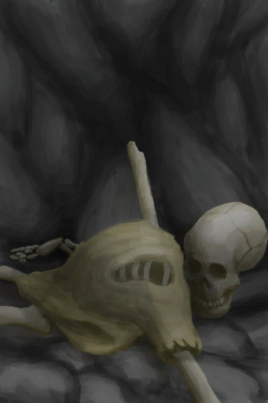

# A Skeleton!  
> There's a skeleton here. Someone's remains... will I end up the same way? This is not good...  
  
<table class="table table-bordered" data-toggle="table"  data-show-header="false"><thead style="display:none"><tr ><th  style="width:50%;text-align:left;vertical-align:top;"  >title</th><th  style="width:50%;text-align:left;vertical-align:top;"  ></th></tr></thead><tr ><td  style="width:50%;text-align:left;vertical-align:top;"  >** Unique On Board **  **Environment：**[Hole(Environment)](Env_HighlandHole.md)  
<b>Trigger: </b>
[

[Satiation](Satiation.md)](Satiation.md): <b>0-1000</b>, [

[Skeleton(Hole)](Skeleton.md)](Skeleton.md) On Hand/Board</td><td  style="width:50%;text-align:left;vertical-align:top;"  >

<a href="Event_SkeletonSeen.md" style="color:black">A Skeleton!</a>

</td></tr></tbody></table>  
  
## Action  

<table><tr><td rowspan="2" style="width:200px;text-align:center;font-size:1.3em;font-weight:bold">

Continue

</td><td></td></tr><tr><td><b>Self：</b>→Dismiss</td></tr><tr><td colspan="2"><b>StatChange：</b>[

[Morale](Morale.md)](Morale.md)<b>-50</b></td></tr></table>
  
  
  

