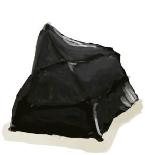

# Knapping Improved!  
> I've become a master at knapping.  
  
<table class="table table-bordered" data-toggle="table"  data-show-header="false"><thead style="display:none"><tr ><th  style="width:50%;text-align:left;vertical-align:top;"  >title</th><th  style="width:50%;text-align:left;vertical-align:top;"  ></th></tr></thead><tr ><td  style="width:50%;text-align:left;vertical-align:top;"  >
<b>Trigger: </b>
[

[Knapping(Skill)](Skill_Knapping.md)](Skill_Knapping.md): <b>150-150</b></td><td  style="width:50%;text-align:left;vertical-align:top;"  >

<a href="Event_SkillKnapping4.md" style="color:black">Knapping Improved!</a>

</td></tr></tbody></table>  
  
## Action  

<table><tr><td rowspan="2" style="width:200px;text-align:center;font-size:1.3em;font-weight:bold">

Nice!

</td><td></td></tr><tr><td><b>Self：</b>→Dismiss</td></tr><tr><td colspan="2">

<table style="margin-bottom:3px;"><tr><td rowspan=2 style="text-align:center" width="80px">
Base Weight

0
</td><td style="font-size:0.6em;line-height:0.6em;font-weight:bold"></td></tr><tr><td></td></tr><tr><td colspan=2><li>[Tick Counter](TickCounter.md) in <b>0</b>, weight<b>+1</b></li></td></tr></table>

<table style="margin-bottom:3px;"><tr><td rowspan=2 style="text-align:center" width="80px">
Base Weight

0
</td><td style="font-size:0.6em;line-height:0.6em;font-weight:bold"></td></tr><tr><td>[

[Morale](Morale.md)](Morale.md)<b>+100</b></td></tr><tr><td colspan=2><li>[Tick Counter](TickCounter.md) in <b>1～999999</b>, weight<b>+1</b></li></td></tr></table>
<button class="btn btn-secondary btn-sm" style="" data-toggle="modal" onclick="setCollectionDataBase64('eyJ0aXRsZSI6IlNpbXVsYXRvcjogTmljZSEgKEtuYXBwaW5nIEltcHJvdmVkISkiLCJjb2xsZWN0aW9ucyI6W3siZHJvcCI6Ii0iLCJiYXNlIjowLCJjb25kaXRpb24iOlt7ImtleSI6IlRpY2tDb3VudGVyIiwidGl0bGUiOiJUaWNrIENvdW50ZXIiLCJ0eXBlIjoicmFuZ2UiLCJtYXgiOlswLDBdLCJyYW5nZSI6WzAsMF0sIndlaWdodCI6WzEsMV0sImRlZmF1bHRWYWx1ZSI6MCwid2hlbk91dE9mUmFuZ2UiOjB9XX0seyJkcm9wIjoiLSIsImJhc2UiOjAsImNvbmRpdGlvbiI6W3sia2V5IjoiVGlja0NvdW50ZXIiLCJ0aXRsZSI6IlRpY2sgQ291bnRlciIsInR5cGUiOiJyYW5nZSIsIm1heCI6WzAsMF0sInJhbmdlIjpbMSw5OTk5OTldLCJ3ZWlnaHQiOlsxLDFdLCJkZWZhdWx0VmFsdWUiOjAsIndoZW5PdXRPZlJhbmdlIjowfV19XX0=')" data-target="#modelCollectionSimulator">Simulator</button>
</td></tr></table>
  
  
  

