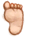

# A spider!!  
> I stepped on a spider!  
  
<table class="table table-bordered" data-toggle="table"  data-show-header="false"><thead style="display:none"><tr ><th  style="width:50%;text-align:left;vertical-align:top;"  data-sortable="true"  >title</th><th  style="width:50%;text-align:left;vertical-align:top;"  ></th></tr></thead><tr ><td  style="width:50%;text-align:left;vertical-align:top;"  ></td><td  style="width:50%;text-align:left;vertical-align:top;"  >

<a href="Event_Spider.md" style="color:black">A spider!!</a>

</td></tr></tbody></table>  
  
## Got From  

Explore

[Deep Jungle(Jungle)](DeepJungle.md)

Explore

[Jungle](Jungle.md)

Explore

[Wetland Jungle(Wetlands)](Wetlands.md)

  
  
## Action  

<table><tr><td rowspan="2" style="width:200px;text-align:center;font-size:1.3em;font-weight:bold">

Didn't manage to hurt me

</td><td></td></tr><tr><td><b>Self：</b>→Dismiss</td></tr><tr><td colspan="2"><b>Require：</b>[

[Foot Protection](FootProtection.md)](FootProtection.md): <b>4-10</b></td></tr></table>
  

<table><tr><td rowspan="2" style="width:200px;text-align:center;font-size:1.3em;font-weight:bold">

Check Wound

</td><td></td></tr><tr><td><b>Self：</b>→Dismiss</td></tr><tr><td colspan="2"><b>Require：</b>[

[Foot Protection](FootProtection.md)](FootProtection.md): <b>1-3.9</b></td></tr><tr><td colspan="2">[

[Spider Bite](W_SpiderBite.md)](W_SpiderBite.md)(<b>+1</b>)</td></tr></table>
  

<table><tr><td rowspan="2" style="width:200px;text-align:center;font-size:1.3em;font-weight:bold">

Check Wound

</td><td></td></tr><tr><td><b>Self：</b>→Dismiss</td></tr><tr><td colspan="2"><b>Require：</b>[

[Foot Protection](FootProtection.md)](FootProtection.md): <b>0-0</b></td></tr><tr><td colspan="2">[

[Spider Bite](W_SpiderBite.md)](W_SpiderBite.md)(<b>+1</b>)</td></tr></table>
  
  
  

