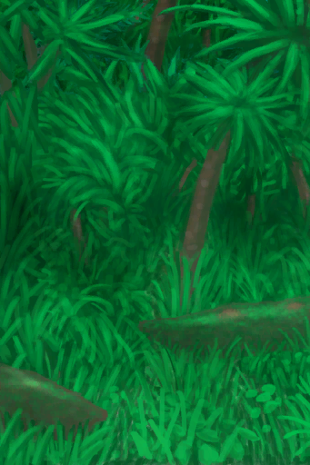

# Storm Damage  
> The storm hit this area...  
  
<table class="table table-bordered" data-toggle="table"  data-show-header="false"><thead style="display:none"><tr ><th  style="width:50%;text-align:left;vertical-align:top;"  >title</th><th  style="width:50%;text-align:left;vertical-align:top;"  ></th></tr></thead><tr ><td  style="width:50%;text-align:left;vertical-align:top;"  >
<b>Trigger: </b>
[Storm Bay](Storm_Bay.md): <b>1-1</b>, ~~[

[Storm](TropicalIsland_Storm.md)](TropicalIsland_Storm.md) On Hand/Board~~，In [

[Bay(Environment)](Env_Bay.md)](Env_Bay.md)或[Storm Beach](Storm_Beach.md): <b>1-1</b>, ~~[

[Storm](TropicalIsland_Storm.md)](TropicalIsland_Storm.md) On Hand/Board~~，In [

[Beach(Environment)](Env_Beach.md)](Env_Beach.md)或[Storm Desolate Beach](Storm_DesolateBeach.md): <b>1-1</b>, ~~[

[Storm](TropicalIsland_Storm.md)](TropicalIsland_Storm.md) On Hand/Board~~，[

[Desolate Beach](DesolateBeach.md)](DesolateBeach.md) On Hand/Board或[Storm Mangroves](Storm_Mangroves.md): <b>1-1</b>, ~~[

[Storm](TropicalIsland_Storm.md)](TropicalIsland_Storm.md) On Hand/Board~~，In [

[Mangrove Forest(Environment)](Env_Mangroves.md)](Env_Mangroves.md)或[Storm Outskirts](Storm_Outskirts.md): <b>1-1</b>, ~~[

[Storm](TropicalIsland_Storm.md)](TropicalIsland_Storm.md) On Hand/Board~~，In [

[Outskirts(Environment)](Env_Outskirts.md)](Env_Outskirts.md)或[Storm Rocks](Storm_Rocks.md): <b>1-1</b>, ~~[

[Storm](TropicalIsland_Storm.md)](TropicalIsland_Storm.md) On Hand/Board~~，In [

[Rocks(Environment)](Env_Rocks.md)](Env_Rocks.md) <b>Blocked By ：</b>[

[Dark Cave(Environment)](Env_CaveDark.md)](Env_CaveDark.md),[Cave(Environment)](Env_CaveGrasslands.md),[Cave(Environment)](Env_CaveSea.md),[Tidal Cave(Environment)](Env_CaveTidal.md),[

[Cellar(Environment)](Env_Cellar.md)](Env_Cellar.md),[

[Enclosure(Environment)](Env_Enclosure.md)](Env_Enclosure.md),[

[Flooded Chamber(Environment)](Env_FloodedChamber.md)](Env_FloodedChamber.md),[

[Eastern Grasslands(Environment)](Env_GrasslandsE.md)](Env_GrasslandsE.md),[

[Western Grasslands(Environment)](Env_GrasslandsW.md)](Env_GrasslandsW.md),[

[Eastern Highlands(Environment)](Env_HighlandsEastern.md)](Env_HighlandsEastern.md),[

[Western Highlands(Environment)](Env_HighlandsWestern.md)](Env_HighlandsWestern.md),[

[Jungle(Environment)](Env_Jungle.md)](Env_Jungle.md),[

[Mud Hut(Environment)](Env_MudHut.md)](Env_MudHut.md),[

[Shed(Environment)](Env_Shed.md)](Env_Shed.md),[

[Stone Hut(Environment)](Env_StoneHut.md)](Env_StoneHut.md),[

[Tunnel(Environment)](Env_Tunnel.md)](Env_Tunnel.md),[

[Volcano(Environment)](Env_Volcano.md)](Env_Volcano.md),[

[Wetlands(Environment)](Env_Wetlands.md)](Env_Wetlands.md)</td><td  style="width:50%;text-align:left;vertical-align:top;"  >

<a href="Event_StormDamage.md" style="color:black">Storm Damage</a>

</td></tr></tbody></table>  
  
## Action  

<table><tr><td rowspan="2" style="width:200px;text-align:center;font-size:1.3em;font-weight:bold">

Assess the damage

</td><td></td></tr><tr><td><b>Self：</b>→Dismiss</td></tr><tr><td colspan="2"><b>CardChanges：</b>地上所有[“Crop”](tag_Crop.md)Growth  <b>-450～-150(-66.96%～-22.32%)</b>, 所有[Leaf Bed](LeafBed.md), [Shelter](Shelter.md), [Sheltered Leaf Bed](ShelteredLeafBed.md), [Rain Catcher](RainCatcher.md), [Solar Still](SolarStill.md), [Hammock](Hammock.md), [Scarecrow](Scarecrow.md), [Tent](TentDeployed.md), [Loom](Loom.md), [Loom (Empty)(Empty)](LoomEmpty.md), [Drying Rack](DryingRack.md), [Deadfall Trap](DeadfallTrap.md), [Snare Trap](SnareTrap.md), [Fish Trap](FishTrapDeployed.md)</td></tr></table>
  
  
  

