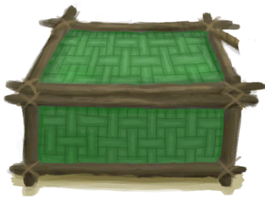
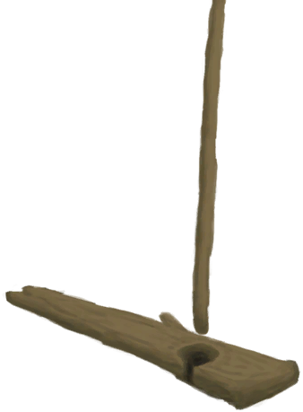
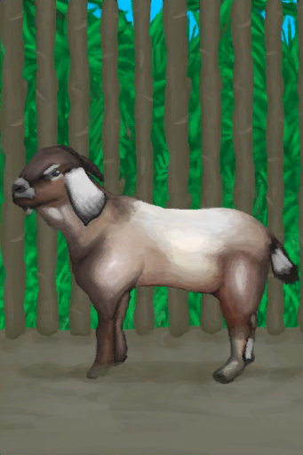

## Farmer  

<table style="margin-bottom:0px;"><tr><td rowspan=2 style="width:160px"></td><td style="font-size:1.8em"><b>Farmer</b></td><td style="width:50%">UnlockPrice：1☀️</td></tr><tr><td  colspan=2 style=""><i>"Having nowhere else to go you were brought to this island to live at your grandfather's farm.

Unfortunately</i></td><tr><td colspan=2><b>Environment：</b>[

[Mud Hut](MudHutRuins.md)](MudHutRuins.md)<td colspan=1><b>Weather：</b>[

[Storm](TropicalIsland_StormStart.md)](TropicalIsland_StormStart.md)</tr></tr><tr><td colspan=3><b>Perks：</b>

[Dark Skin](Pk_3_DarkSkin.md)

[Optimist](Pk_4_Optimist.md)

[Loner](Pk_4_Loner.md)

[Herbologist](Pk_5_Herbologist.md)

[Trapper](Pk_5_Trapper.md)

[Cook](Pk_5_Cook.md)

[Woodworker](Pk_5_Woodworker.md)

[Stealth Master](Pk_5_StealthMaster.md)

[Immunized](Pk_4_Immunized.md)

[Strong Immune System](Pk_4_ImmuneSystemStrong.md)

[Bug Resistant](Pk_4_BugResistant.md)

[Rough Sleeper](Pk_4_RoughSleeper.md)

[Grandfather](Pk_6_Grandfather.md)

  
  
</tr><tr><td colspan=3><b>Clothes：</b> 

<a href="T-Shirt.md" style="color:black">T-Shirt</a>

<a href="Shorts.md" style="color:black">Shorts</a>

<a href="Flipflops.md" style="color:black">Flipflops</a>

  
  
</tr><tr><td colspan=3><b>Starting Cards：</b> 

<a href="Grandfather.md" style="color:black">Grandfather</a>

<a href="ChestFarmer.md" style="color:black">Storage Chest</a>

<a href="Event_IntroFarmer.md" style="color:black">Intro</a>

<a href="ClayBowl.md" style="color:black">Clay Bowlx3</a>

<a href="ClayVase.md" style="color:black">Clay Vase</a>

<a href="HandDrill.md" style="color:black">Hand Drill</a>

<a href="KnifeGrandpaBlunt.md" style="color:black">Grandfather's Blunt Knife</a>

<a href="T-Shirt.md" style="color:black">T-Shirt</a>

<a href="PlasticBottle.md" style="color:black">Plastic Bottle</a>

<a href="Broom.md" style="color:black">Broom</a>

  
  
</tr><tr><td colspan=3><b>初始蓝图：</b> 

<a href="Bp_AloeGel.md" style="color:black">Aloe Gel</a>

<a href="Bp_BugRepellent.md" style="color:black">Bug Repellant</a>

<a href="Bp_CropPlot.md" style="color:black">Crop Plot</a>

<a href="Bp_PesticideChilli.md" style="color:black">Chilli Pesticide</a>

<a href="Bp_CompostBin.md" style="color:black">Compost Bin</a>

<a href="Bp_DeadfallTrap.md" style="color:black">Deadfall Trap</a>

<a href="Bp_SnareTrap.md" style="color:black">Snare Trap</a>

<a href="Bp_FishTrap.md" style="color:black">Fish Trap</a>

<a href="Bp_LogTrap.md" style="color:black">Log Trap</a>

<a href="Bp_CageTrap.md" style="color:black">Cage Trap</a>

<a href="Bp_TrappingPit.md" style="color:black">Trapping Pit</a>

<a href="Bp_CookingPot.md" style="color:black">Cooking Pot</a>

<a href="Bp_WoodShavings.md" style="color:black">Wood Shavings</a>

<a href="Bp_WoodCarvings.md" style="color:black">Wood Carvings</a>

<a href="Bp_Planks.md" style="color:black">Wooden Planks</a>

<a href="Bp_Treenails.md" style="color:black">Treenails</a>

  
  
</tr></table>
    
  
## 目标  

<b>SURVIVAL BASICS</b>

<table style="margin-bottom:0px;"><tr><td rowSpan=3 style="width:50px;max-height:100px;text-align:center;vertical-align:top"></td><td colspan=2 >
<b>Sharpen your grandfather's old Knife</b>
<i>To use it as a cutting tool.</i></td></tr><tr style=""><td><b>Require：</b>[

[Grandfather's Knife](KnifeGrandpa.md)](KnifeGrandpa.md)x1 </td></tr><tr style=""><td ><b>Reward：</b>[

[Stress](Stress.md)](Stress.md)<b>-48</b></td></tr><tr style="border-bottom:2px solid #CCC;height:1px;"></tr><tr><td rowSpan=3 style="width:50px;max-height:100px;text-align:center;vertical-align:top"></td><td colspan=2 >
<b>Make a Campfire</b>
<i>To get light at night and a place to cook your food.</i></td></tr><tr style=""><td><b>Require：</b>[

[Campfire(Off)](CampfireExtinguished.md)](CampfireExtinguished.md)x1 </td></tr><tr style=""><td ><b>Reward：</b>[

[Determination](Determination.md)](Determination.md)<b>+100</b>&nbsp;&nbsp;&nbsp;&nbsp;[

[Stress](Stress.md)](Stress.md)<b>-48</b></td></tr><tr style="border-bottom:2px solid #CCC;height:1px;"></tr><tr><td rowSpan=3 style="width:50px;max-height:100px;text-align:center;vertical-align:top"></td><td colspan=2 >
<b>Boil some Rice</b>
<i>To fill up your stomach.</i></td></tr><tr style=""><td><b>Require：</b>[

[Rice](RiceCooked.md)](RiceCooked.md)x1 </td></tr><tr style=""><td ><b>Reward：</b>[

[Stress](Stress.md)](Stress.md)<b>-48</b></td></tr><tr style="border-bottom:2px solid #CCC;height:1px;"></tr></table>
 
<b>TIME TO RECOVER</b>

<table style="margin-bottom:0px;"><tr><td rowSpan=3 style="width:50px;max-height:100px;text-align:center;vertical-align:top"></td><td colspan=2 >
<b>Feed your Grandfather</b>
<i>To help him regain his strength.</i></td></tr><tr style=""><td><b>Require：</b>Feed [

[Grandfather](Grandfather.md)](Grandfather.md) </td></tr><tr style=""><td ><b>Reward：</b>[

[Stress](Stress.md)](Stress.md)<b>-48</b></td></tr><tr style="border-bottom:2px solid #CCC;height:1px;"></tr><tr><td rowSpan=3 style="width:50px;max-height:100px;text-align:center;vertical-align:top"></td><td colspan=2 >
<b>Make a Leafbed</b>
<i>To rest better during the night.</i></td></tr><tr style=""><td><b>Require：</b>[

[Leaf Bed](LeafBed.md)](LeafBed.md)x1 </td></tr><tr style=""><td ><b>Reward：</b>[

[Stress](Stress.md)](Stress.md)<b>-48</b></td></tr><tr style="border-bottom:2px solid #CCC;height:1px;"></tr><tr><td rowSpan=3 style="width:50px;max-height:100px;text-align:center;vertical-align:top"></td><td colspan=2 >
<b>Explore the Deep Jungle</b>
<i>To remember the layout of the area.</i></td></tr><tr style=""><td><b>Require：</b>[Exploration Deep Jungle](Exploration_DeepJungle.md): <b>20</b> </td></tr><tr style=""><td ><b>Reward：</b>[

[Stress](Stress.md)](Stress.md)<b>-48</b></td></tr><tr style="border-bottom:2px solid #CCC;height:1px;"></tr></table>
 
<b>REPAIRING THE HOUSE</b>

<table style="margin-bottom:0px;"><tr><td rowSpan=3 style="width:50px;max-height:100px;text-align:center;vertical-align:top"></td><td colspan=2 >
<b>Clean your house</b>
<i>To prevent discomfort by using a broom.</i></td></tr><tr style=""><td><b>Require：</b>Clean [

[Mud Hut](MudHutRuins.md)](MudHutRuins.md) </td></tr><tr style=""><td ><b>Reward：</b>[

[Stress](Stress.md)](Stress.md)<b>-48</b></td></tr><tr style="border-bottom:2px solid #CCC;height:1px;"></tr><tr><td rowSpan=3 style="width:50px;max-height:100px;text-align:center;vertical-align:top"></td><td colspan=2 >
<b>Clear all the Debris</b>
<i>To get resources and clear the place.</i></td></tr><tr style=""><td><b>Require：</b>Clear [

[Debris(Mud Hut)](Debris.md)](Debris.md) </td></tr><tr style=""><td ><b>Reward：</b>[

[Stress](Stress.md)](Stress.md)<b>-48</b></td></tr><tr style="border-bottom:2px solid #CCC;height:1px;"></tr><tr><td rowSpan=3 style="width:50px;max-height:100px;text-align:center;vertical-align:top"></td><td colspan=2 >
<b>Repair the Roof</b>
<i>To get things back to normal.</i></td></tr><tr style=""><td><b>Require：</b>Build [

[Collapsed Roof(Mud Hut)](Dmg_RoofCollapsed.md)](Dmg_RoofCollapsed.md)[

[Mud Hut(Environment)](Env_MudHutRuins.md)](Env_MudHutRuins.md)x1 </td></tr><tr style=""><td ><b>Reward：</b>[

[Stress](Stress.md)](Stress.md)<b>-48</b></td></tr><tr style="border-bottom:2px solid #CCC;height:1px;"></tr></table>
 
<b>REFURBISHING THE FARM</b>

<table style="margin-bottom:0px;"><tr><td rowSpan=3 style="width:50px;max-height:100px;text-align:center;vertical-align:top"></td><td colspan=2 >
<b>Find a Puddle in the Wetlands</b>
<i>To use as an emergency water source.</i></td></tr><tr style=""><td><b>Require：</b>[

[Dry Puddle(Wetlands)](Puddle.md)](Puddle.md)x1 </td></tr><tr style=""><td ><b>Reward：</b>[

[Determination](Determination.md)](Determination.md)<b>+250</b>&nbsp;&nbsp;&nbsp;&nbsp;[

[Stress](Stress.md)](Stress.md)<b>-48</b></td></tr><tr style="border-bottom:2px solid #CCC;height:1px;"></tr><tr><td rowSpan=3 style="width:50px;max-height:100px;text-align:center;vertical-align:top"></td><td colspan=2 >
<b>Build a stove</b>
<i>To have a proper cooking station.</i></td></tr><tr style=""><td><b>Require：</b>[

[Stove](Stove.md)](Stove.md)x1&nbsp;&nbsp;&nbsp;&nbsp;[

[Stove(Off)](StoveExtinguished.md)](StoveExtinguished.md)x1 </td></tr><tr style=""><td ><b>Reward：</b>[

[Stress](Stress.md)](Stress.md)<b>-48</b></td></tr><tr style="border-bottom:2px solid #CCC;height:1px;"></tr><tr><td rowSpan=3 style="width:50px;max-height:100px;text-align:center;vertical-align:top"></td><td colspan=2 >
<b>Build a Compost Bin</b>
<i>To get enough fertilizer for your crops.</i></td></tr><tr style=""><td><b>Require：</b>[

[Compost Bin](CompostBin.md)](CompostBin.md)x1 </td></tr><tr style=""><td ><b>Reward：</b>[

[Stress](Stress.md)](Stress.md)<b>-48</b></td></tr><tr style="border-bottom:2px solid #CCC;height:1px;"></tr></table>
 
<b>REBUILDING THE FARM</b>

<table style="margin-bottom:0px;"><tr><td rowSpan=3 style="width:50px;max-height:100px;text-align:center;vertical-align:top"></td><td colspan=2 >
<b>Bring the farm to its former glory</b>
<i>So you can be ready to face your destiny.</i></td></tr><tr style=""></tr><tr style=""><td ><b>Reward：</b>[

[Stress](Stress.md)](Stress.md)<b>-48</b></td></tr><tr style="border-bottom:2px solid #CCC;height:1px;"></tr><tr><td rowSpan=3 style="width:50px;max-height:100px;text-align:center;vertical-align:top"></td><td colspan=2 >
<b>Crops</b>
</td></tr><tr style=""><td>
<table style="margin-bottom:0px;"><tr><td rowSpan=3 style="width:50px;max-height:100px;text-align:center;vertical-align:top"></td><td colspan=2 >
<b>Make some Pesticide</b>
<i>To provide protection for your crops.</i></td></tr><tr style=""><td><b>Require：</b>[

[Chilli Pesticide](LQ_PesticideChilli.md)](LQ_PesticideChilli.md)x1&nbsp;&nbsp;&nbsp;&nbsp;[

[Brimstone Pesticide](LQ_PesticideBrimstone.md)](LQ_PesticideBrimstone.md)x1 </td></tr><tr style=""><td ><b>Reward：</b>[

[Stress](Stress.md)](Stress.md)<b>-48</b></td></tr><tr style="border-bottom:2px solid #CCC;height:1px;"></tr><tr><td rowSpan=3 style="width:50px;max-height:100px;text-align:center;vertical-align:top"></td><td colspan=2 >
<b>Build an Irrigation System</b>
<i>To make it easier to water your crop plots.</i></td></tr><tr style=""><td><b>Require：</b>[

[Irrigation System](Imp_Irrigation.md)](Imp_Irrigation.md)x1 </td></tr><tr style=""><td ><b>Reward：</b>[

[Stress](Stress.md)](Stress.md)<b>-48</b></td></tr><tr style="border-bottom:2px solid #CCC;height:1px;"></tr><tr><td rowSpan=3 style="width:50px;max-height:100px;text-align:center;vertical-align:top"></td><td colspan=2 >
<b>Plant all the crops in the island</b>
<i>To make sure you have all your needs covered.</i></td></tr><tr style=""><td>
<table style="margin-bottom:0px;"><tr><td rowSpan=3 style="width:50px;max-height:100px;text-align:center;vertical-align:top"></td><td colspan=2 >
<b>Plant all the crops in the island</b>
<i>To make sure you have all your needs covered.</i></td></tr><tr style=""></tr><tr style=""><td ><b>Reward：</b>[

[Stress](Stress.md)](Stress.md)<b>-48</b></td></tr><tr style="border-bottom:2px solid #CCC;height:1px;"></tr><tr><td rowSpan=3 style="width:50px;max-height:100px;text-align:center;vertical-align:top"></td><td colspan=2 >
<b>Weevil Lily</b>
</td></tr><tr style=""><td><b>Require：</b>[

[Weevil Lily Crop Plot](CropPlotWeevilLily.md)](CropPlotWeevilLily.md)x1 </td></tr><tr style=""><td ><b>Reward：</b>[

[Stress](Stress.md)](Stress.md)<b>-48</b></td></tr><tr style="border-bottom:2px solid #CCC;height:1px;"></tr><tr><td rowSpan=3 style="width:50px;max-height:100px;text-align:center;vertical-align:top"></td><td colspan=2 >
<b>Kava</b>
</td></tr><tr style=""><td><b>Require：</b>[

[Kava Crop Plot](CropPlotKava.md)](CropPlotKava.md)x1 </td></tr><tr style=""><td ><b>Reward：</b>[

[Stress](Stress.md)](Stress.md)<b>-48</b></td></tr><tr style="border-bottom:2px solid #CCC;height:1px;"></tr><tr><td rowSpan=3 style="width:50px;max-height:100px;text-align:center;vertical-align:top"></td><td colspan=2 >
<b>Jasmine</b>
</td></tr><tr style=""><td><b>Require：</b>[

[Jasmine Crop Plot](CropPlotJasmine.md)](CropPlotJasmine.md)x1 </td></tr><tr style=""><td ><b>Reward：</b>[

[Stress](Stress.md)](Stress.md)<b>-48</b></td></tr><tr style="border-bottom:2px solid #CCC;height:1px;"></tr><tr><td rowSpan=3 style="width:50px;max-height:100px;text-align:center;vertical-align:top"></td><td colspan=2 >
<b>Spider Lily</b>
</td></tr><tr style=""><td><b>Require：</b>[

[Spider Lily Crop Plot](CropPlotSpiderLily.md)](CropPlotSpiderLily.md)x1 </td></tr><tr style=""><td ><b>Reward：</b>[

[Stress](Stress.md)](Stress.md)<b>-48</b></td></tr><tr style="border-bottom:2px solid #CCC;height:1px;"></tr><tr><td rowSpan=3 style="width:50px;max-height:100px;text-align:center;vertical-align:top"></td><td colspan=2 >
<b>Ginger</b>
</td></tr><tr style=""><td><b>Require：</b>[

[Ginger Crop Plot](CropPlotGinger.md)](CropPlotGinger.md)x1 </td></tr><tr style=""><td ><b>Reward：</b>[

[Stress](Stress.md)](Stress.md)<b>-48</b></td></tr><tr style="border-bottom:2px solid #CCC;height:1px;"></tr><tr><td rowSpan=3 style="width:50px;max-height:100px;text-align:center;vertical-align:top"></td><td colspan=2 >
<b>Sago Palm</b>
</td></tr><tr style=""><td><b>Require：</b>[

[Sago Palm Crop Plot](CropPlotSagoPalm.md)](CropPlotSagoPalm.md)x1 </td></tr><tr style=""><td ><b>Reward：</b>[

[Stress](Stress.md)](Stress.md)<b>-48</b></td></tr><tr style="border-bottom:2px solid #CCC;height:1px;"></tr><tr><td rowSpan=3 style="width:50px;max-height:100px;text-align:center;vertical-align:top"></td><td colspan=2 >
<b>Bananas</b>
</td></tr><tr style=""><td><b>Require：</b>[

[Banana Crop Plot](CropPlotBananaTree.md)](CropPlotBananaTree.md)x1 </td></tr><tr style=""><td ><b>Reward：</b>[

[Stress](Stress.md)](Stress.md)<b>-48</b></td></tr><tr style="border-bottom:2px solid #CCC;height:1px;"></tr><tr><td rowSpan=3 style="width:50px;max-height:100px;text-align:center;vertical-align:top"></td><td colspan=2 >
<b>Yam</b>
</td></tr><tr style=""><td><b>Require：</b>[

[Yam Crop Plot](CropPlotYam.md)](CropPlotYam.md)x1 </td></tr><tr style=""><td ><b>Reward：</b>[

[Stress](Stress.md)](Stress.md)<b>-48</b></td></tr><tr style="border-bottom:2px solid #CCC;height:1px;"></tr><tr><td rowSpan=3 style="width:50px;max-height:100px;text-align:center;vertical-align:top"></td><td colspan=2 >
<b>Mango</b>
</td></tr><tr style=""><td><b>Require：</b>[

[Mango Crop Plot](CropPlotMangoTree.md)](CropPlotMangoTree.md)x1 </td></tr><tr style=""><td ><b>Reward：</b>[

[Stress](Stress.md)](Stress.md)<b>-48</b></td></tr><tr style="border-bottom:2px solid #CCC;height:1px;"></tr></table>
  </td></tr><tr style=""><td ><b>Reward：</b>[

[Stress](Stress.md)](Stress.md)<b>-48</b></td></tr><tr style="border-bottom:2px solid #CCC;height:1px;"></tr></table>
  </td></tr><tr style=""><td ><b>Reward：</b>[

[Stress](Stress.md)](Stress.md)<b>-48</b></td></tr><tr style="border-bottom:2px solid #CCC;height:1px;"></tr><tr><td rowSpan=3 style="width:50px;max-height:100px;text-align:center;vertical-align:top"></td><td colspan=2 >
<b>Equipment</b>
</td></tr><tr style=""><td>
<table style="margin-bottom:0px;"><tr><td rowSpan=3 style="width:50px;max-height:100px;text-align:center;vertical-align:top"></td><td colspan=2 >
<b>Build a Cistern</b>
<i>To improve your water reserves for dry periods.</i></td></tr><tr style=""><td><b>Require：</b>[

[Cistern](Cistern.md)](Cistern.md)x1 </td></tr><tr style=""><td ><b>Reward：</b>[

[Stress](Stress.md)](Stress.md)<b>-48</b></td></tr><tr style="border-bottom:2px solid #CCC;height:1px;"></tr><tr><td rowSpan=3 style="width:50px;max-height:100px;text-align:center;vertical-align:top"></td><td colspan=2 >
<b>Build a Cellar</b>
<i>To better store your perishables.</i></td></tr><tr style=""><td><b>Require：</b>[

[Cellar](CellarEntrance.md)](CellarEntrance.md)x1 </td></tr><tr style=""><td ><b>Reward：</b>[

[Stress](Stress.md)](Stress.md)<b>-48</b></td></tr><tr style="border-bottom:2px solid #CCC;height:1px;"></tr><tr><td rowSpan=3 style="width:50px;max-height:100px;text-align:center;vertical-align:top"></td><td colspan=2 >
<b>Make Copper Tools</b>
<i>An <b>Axe</b> and a <b>Shovel</b> should suffice.</i></td></tr><tr style=""><td><b>Require：</b>[

[Copper Shovel](ShovelCopper.md)](ShovelCopper.md)x1&nbsp;&nbsp;&nbsp;&nbsp;[

[Copper Axe](AxeCopper.md)](AxeCopper.md)x1 </td></tr><tr style=""><td ><b>Reward：</b>[

[Stress](Stress.md)](Stress.md)<b>-48</b></td></tr><tr style="border-bottom:2px solid #CCC;height:1px;"></tr></table>
  </td></tr><tr style=""><td ><b>Reward：</b>[

[Stress](Stress.md)](Stress.md)<b>-48</b></td></tr><tr style="border-bottom:2px solid #CCC;height:1px;"></tr><tr><td rowSpan=3 style="width:50px;max-height:100px;text-align:center;vertical-align:top"></td><td colspan=2 >
<b>Animals</b>
</td></tr><tr style=""><td>
<table style="margin-bottom:0px;"><tr><td rowSpan=3 style="width:50px;max-height:100px;text-align:center;vertical-align:top"></td><td colspan=2 >
<b>Get a Bee Skep</b>
<i>To get some honey going. Make sure to plant some flowers first.</i></td></tr><tr style=""><td><b>Require：</b>[

[Bee Skep](BeeSkep.md)](BeeSkep.md)x1 </td></tr><tr style=""><td ><b>Reward：</b>[

[Stress](Stress.md)](Stress.md)<b>-48</b></td></tr><tr style="border-bottom:2px solid #CCC;height:1px;"></tr><tr><td rowSpan=3 style="width:50px;max-height:100px;text-align:center;vertical-align:top"></td><td colspan=2 >
<b>Get 4 Partridges</b>
<i>"To get eggs</i></td></tr><tr style=""><td><b>Require：</b>[“Partridge”](tag_Partridge.md)x4 </td></tr><tr style=""><td ><b>Reward：</b>[

[Stress](Stress.md)](Stress.md)<b>-48</b></td></tr><tr style="border-bottom:2px solid #CCC;height:1px;"></tr><tr><td rowSpan=3 style="width:50px;max-height:100px;text-align:center;vertical-align:top"></td><td colspan=2 >
<b>Get a Goat</b>
<i>"To get milk</i></td></tr><tr style=""><td><b>Require：</b>[

[Male Goat](GoatEnclosureMale.md)](GoatEnclosureMale.md)x1&nbsp;&nbsp;&nbsp;&nbsp;[

[Goat](GoatEnclosureFemale.md)](GoatEnclosureFemale.md)x1 </td></tr><tr style=""><td ><b>Reward：</b>[

[Stress](Stress.md)](Stress.md)<b>-48</b></td></tr><tr style="border-bottom:2px solid #CCC;height:1px;"></tr></table>
  </td></tr><tr style=""><td ><b>Reward：</b>[

[Stress](Stress.md)](Stress.md)<b>-48</b></td></tr><tr style="border-bottom:2px solid #CCC;height:1px;"></tr></table>
 
<b>FACING DESTINY</b>

<table style="margin-bottom:0px;"><tr><td rowSpan=3 style="width:50px;max-height:100px;text-align:center;vertical-align:top"></td><td colspan=2 >
<b>Make your Grandfather Happy</b>
<i>By cooking his favourite meals.</i></td></tr><tr style=""><td>
<table style="margin-bottom:0px;"><tr><td rowSpan=3 style="width:50px;max-height:100px;text-align:center;vertical-align:top"></td><td colspan=2 >
<b>Make your Grandfather happy</b>
<i>By cooking his favourite meals.</i></td></tr><tr style=""></tr><tr style=""><td ><b>Reward：</b>[

[Stress](Stress.md)](Stress.md)<b>-48</b></td></tr><tr style="border-bottom:2px solid #CCC;height:1px;"></tr><tr><td rowSpan=3 style="width:50px;max-height:100px;text-align:center;vertical-align:top"></td><td colspan=2 >
<b>Coconut Fish</b>
</td></tr><tr style=""><td><b>Require：</b>[Is Grandpa Dead?](IsGrandpaDead.md): <b>1</b>[

[Coconut Fish](CoconutFish.md)](CoconutFish.md)x1&nbsp;&nbsp;&nbsp;&nbsp;[

[Grandfather](Grandfather.md)](Grandfather.md)x1 </td></tr><tr style=""><td ><b>Reward：</b>[

[Stress](Stress.md)](Stress.md)<b>-48</b></td></tr><tr style="border-bottom:2px solid #CCC;height:1px;"></tr><tr><td rowSpan=3 style="width:50px;max-height:100px;text-align:center;vertical-align:top"></td><td colspan=2 >
<b>Seafood Cup</b>
</td></tr><tr style=""><td><b>Require：</b>[Is Grandpa Dead?](IsGrandpaDead.md): <b>1</b>[

[Seafood Cup](SeafoodCup.md)](SeafoodCup.md)x1&nbsp;&nbsp;&nbsp;&nbsp;[

[Grandfather](Grandfather.md)](Grandfather.md)x1 </td></tr><tr style=""><td ><b>Reward：</b>[

[Stress](Stress.md)](Stress.md)<b>-48</b></td></tr><tr style="border-bottom:2px solid #CCC;height:1px;"></tr><tr><td rowSpan=3 style="width:50px;max-height:100px;text-align:center;vertical-align:top"></td><td colspan=2 >
<b>Butter Baked Oysters</b>
</td></tr><tr style=""><td><b>Require：</b>[Is Grandpa Dead?](IsGrandpaDead.md): <b>1</b>[

[Butter Baked Oyster](OysterMeatBaked.md)](OysterMeatBaked.md)x1&nbsp;&nbsp;&nbsp;&nbsp;[

[Grandfather](Grandfather.md)](Grandfather.md)x1 </td></tr><tr style=""><td ><b>Reward：</b>[

[Stress](Stress.md)](Stress.md)<b>-48</b></td></tr><tr style="border-bottom:2px solid #CCC;height:1px;"></tr><tr><td rowSpan=3 style="width:50px;max-height:100px;text-align:center;vertical-align:top"></td><td colspan=2 >
<b>Jungle Salad</b>
</td></tr><tr style=""><td><b>Require：</b>[Is Grandpa Dead?](IsGrandpaDead.md): <b>1</b>[

[Jungle Salad](JungleSalad.md)](JungleSalad.md)x1&nbsp;&nbsp;&nbsp;&nbsp;[

[Grandfather](Grandfather.md)](Grandfather.md)x1 </td></tr><tr style=""><td ><b>Reward：</b>[

[Stress](Stress.md)](Stress.md)<b>-48</b></td></tr><tr style="border-bottom:2px solid #CCC;height:1px;"></tr><tr><td rowSpan=3 style="width:50px;max-height:100px;text-align:center;vertical-align:top"></td><td colspan=2 >
<b>Yam Curry</b>
</td></tr><tr style=""><td><b>Require：</b>[Is Grandpa Dead?](IsGrandpaDead.md): <b>1</b>[

[Yam Curry](YamCurry.md)](YamCurry.md)x1&nbsp;&nbsp;&nbsp;&nbsp;[

[Grandfather](Grandfather.md)](Grandfather.md)x1 </td></tr><tr style=""><td ><b>Reward：</b>[

[Stress](Stress.md)](Stress.md)<b>-48</b></td></tr><tr style="border-bottom:2px solid #CCC;height:1px;"></tr><tr><td rowSpan=3 style="width:50px;max-height:100px;text-align:center;vertical-align:top"></td><td colspan=2 >
<b>Honey Glazed Pork</b>
</td></tr><tr style=""><td><b>Require：</b>[Is Grandpa Dead?](IsGrandpaDead.md): <b>1</b>[

[Honey Glazed Pork](HoneyGlazedPork.md)](HoneyGlazedPork.md)x1&nbsp;&nbsp;&nbsp;&nbsp;[

[Grandfather](Grandfather.md)](Grandfather.md)x1 </td></tr><tr style=""><td ><b>Reward：</b>[

[Stress](Stress.md)](Stress.md)<b>-48</b></td></tr><tr style="border-bottom:2px solid #CCC;height:1px;"></tr><tr><td rowSpan=3 style="width:50px;max-height:100px;text-align:center;vertical-align:top"></td><td colspan=2 >
<b>Candied Ginger</b>
</td></tr><tr style=""><td><b>Require：</b>[Is Grandpa Dead?](IsGrandpaDead.md): <b>1</b>[

[Candied Ginger](CandiedGinger.md)](CandiedGinger.md)x1&nbsp;&nbsp;&nbsp;&nbsp;[

[Grandfather](Grandfather.md)](Grandfather.md)x1 </td></tr><tr style=""><td ><b>Reward：</b>[

[Stress](Stress.md)](Stress.md)<b>-48</b></td></tr><tr style="border-bottom:2px solid #CCC;height:1px;"></tr><tr><td rowSpan=3 style="width:50px;max-height:100px;text-align:center;vertical-align:top"></td><td colspan=2 >
<b>Yam Jam</b>
</td></tr><tr style=""><td><b>Require：</b>[Is Grandpa Dead?](IsGrandpaDead.md): <b>1</b>[

[Yam Jam](YamJam.md)](YamJam.md)x1&nbsp;&nbsp;&nbsp;&nbsp;[

[Grandfather](Grandfather.md)](Grandfather.md)x1 </td></tr><tr style=""><td ><b>Reward：</b>[

[Stress](Stress.md)](Stress.md)<b>-48</b></td></tr><tr style="border-bottom:2px solid #CCC;height:1px;"></tr><tr><td rowSpan=3 style="width:50px;max-height:100px;text-align:center;vertical-align:top"></td><td colspan=2 >
<b>Sago Cake</b>
</td></tr><tr style=""><td><b>Require：</b>[Is Grandpa Dead?](IsGrandpaDead.md): <b>1</b>[

[Sago Cake](SagoCake.md)](SagoCake.md)x1&nbsp;&nbsp;&nbsp;&nbsp;[

[Grandfather](Grandfather.md)](Grandfather.md)x1 </td></tr><tr style=""><td ><b>Reward：</b>[

[Stress](Stress.md)](Stress.md)<b>-48</b></td></tr><tr style="border-bottom:2px solid #CCC;height:1px;"></tr></table>
  </td></tr><tr style=""><td ><b>Reward：</b>[

[Stress](Stress.md)](Stress.md)<b>-48</b></td></tr><tr style="border-bottom:2px solid #CCC;height:1px;"></tr><tr><td rowSpan=3 style="width:50px;max-height:100px;text-align:center;vertical-align:top"></td><td colspan=2 >
<b>Escape from the Island</b>
</td></tr><tr style=""><td>
<table style="margin-bottom:0px;"><tr><td rowSpan=3 style="width:50px;max-height:100px;text-align:center;vertical-align:top"></td><td colspan=2 >
<b>Build a Raft</b>
<i>To escape the island and get back to civilization.</i></td></tr><tr style=""><td><b>Require：</b>[

[Raft](RaftEntrance.md)](RaftEntrance.md)x1 </td></tr><tr style="border-bottom:2px solid #CCC;height:1px;"></tr><tr><td rowSpan=3 style="width:50px;max-height:100px;text-align:center;vertical-align:top"></td><td colspan=2 >
<b>Return to Civilization</b>
<i>To finish this adventure.</i></td></tr><tr style=""><td><b>Require：</b>[

[Distance](Distance.md)](Distance.md): <b>2016</b> </td></tr><tr style="border-bottom:2px solid #CCC;height:1px;"></tr></table>
  </td></tr><tr style="border-bottom:2px solid #CCC;height:1px;"></tr><tr><td rowSpan=3 style="width:50px;max-height:100px;text-align:center;vertical-align:top"></td><td colspan=2 >
<b>Make the Island your Home</b>
</td></tr><tr style=""><td>
<table style="margin-bottom:0px;"><tr><td rowSpan=3 style="width:50px;max-height:100px;text-align:center;vertical-align:top"></td><td colspan=2 >
<b>Survive in the Island for 120 days</b>
<i>to become familiar with it.</i></td></tr><tr style=""><td><b>Require：</b>[Counter](Counter.md): <b>11520～999999</b> </td></tr><tr style="border-bottom:2px solid #CCC;height:1px;"></tr><tr><td rowSpan=3 style="width:50px;max-height:100px;text-align:center;vertical-align:top"></td><td colspan=2 >
<b>Reach Maximum Comfort</b>
<i>To turn your house into your home.</i></td></tr><tr style=""><td><b>Require：</b>[

[Comfort](Comfort.md)](Comfort.md): <b>1751～2500</b> </td></tr><tr style="border-bottom:2px solid #CCC;height:1px;"></tr></table>
  </td></tr><tr style="border-bottom:2px solid #CCC;height:1px;"></tr></table>
   

