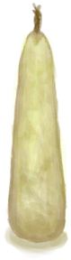
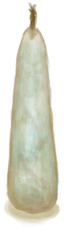

# Fat  
> A chunk of fat.   
  
<table class="table table-bordered" data-toggle="table"  data-show-header="false"><thead style="display:none"><tr ><th  style="width:50%;text-align:left;vertical-align:top;"  >title</th><th  style="width:50%;text-align:left;vertical-align:top;"  ></th></tr></thead><tr ><td  style="width:50%;text-align:left;vertical-align:top;"  >**Weight：**100  **Tag：**	[“Feed”](tag_Meat.md), [“Feed”](tag_Feed.md), [“Cookable”](tag_Cookable.md), [“Rich Proteins”](tag_ProteinsRich.md)  **Usage：**3</td><td  style="width:50%;text-align:left;vertical-align:top;"  >

<a href="Fat.md" style="color:black">Fat</a>

Fat is an extremely useful material and food item extracted from the bodies or large animals like <b>Boars and Goats</b>.  It can be used to cook multiple <b>Cooking Recipes</b> and in many crafts such as <b>Candles and Waterskins</b>.</td></tr></tbody></table>  
  
## Got From  

** With：**[Obsidian Knife](KnifeObsidian.md)Butcher

[Skinned Boar](BoarSkinned.md)

** With：**[“Cutter”](tag_Cutter.md)Butcher

[Skinned Boar](BoarSkinned.md)

** With：**[Obsidian Knife](KnifeObsidian.md)Butcher

[Skinned Goat](GoatSkinned.md)

** With：**[“Cutter”](tag_Cutter.md)Butcher

[Skinned Goat](GoatSkinned.md)

** With：**[Obsidian Knife](KnifeObsidian.md)Cut Meat

[Sea Hound Carcass](SeahoundCarcass.md)

** With：**[“Cutter”](tag_Cutter.md)Cut Meat

[Sea Hound Carcass](SeahoundCarcass.md)

  
  
## Action  

<table><tr><td rowspan="2" style="width:200px;text-align:center;font-size:1.3em;font-weight:bold">

Eat

15m

</td><td>[“CarnivorousAction(Group)”](CarnivorousAction.md), [“EatingAction(Group)”](EatingAction.md)</td></tr><tr><td><b>Self：</b>Usage  <b>-1(-33.33%)</b></td></tr><tr><td colspan="2"><b>StatChange：</b>[

[Satiation](Satiation.md)](Satiation.md)<b>+30</b>, [

[Stomach](Stomach.md)](Stomach.md)<b>+40</b>, [

[Hydration ](Hydration.md)](Hydration.md)<b>+2</b>, [

[Morale](Morale.md)](Morale.md)<b>-3</b>, [

[Saturation Meat](SaturationMeat.md)](SaturationMeat.md)<b>+100</b>, [

[Filth](Filth.md)](Filth.md)<b>+3</b>, [

[Bacteria Fever](BacteriaFever.md)](BacteriaFever.md)<b>+0～+10</b></td></tr></table>
  
  
  
## Drag With  

<table style="margin-bottom:0px;"><tr><td style="width:40%;text-align:left; background-color:#FEFEFE"><b>With：</b>[

[Lye](LQ_Lye.md)](LQ_Lye.md)</td><td style="width:40%;font-size:1em;font-weight:bold;background-color:#FEFEFE">Soak  </td></tr><tr style="background-color:#FFFFFF"><td style=""><b>Receiving：</b>→ [

[Soap Mix](LQ_SoapMix.md)](LQ_SoapMix.md)</td><td style=""><b>Self：</b>Spoilage  <b>-900</b></td></tr></table>
  
  
## Drag To  

[Boar Feeder](BoarFeeder.md)

[Boar Feeder(Empty)](BoarFeederEmpty.md)

[Compost Bin](CompostBin.md)

[Partridge Feeder](PartridgeFeeder.md)

[Partridge Feeder(Empty)](PartridgeFeederEmpty.md)

[Trapped Macaque](CageTrapMacaque.md)

[Sow](BoarEnclosureFemale.md)

[Boar](BoarEnclosureMale.md)

[Piglet](BoarEnclosurePiglet.md)

[Sow](BoarTiedFemale.md)

[Boar](BoarTiedMale.md)

[Piglet](BoarTiedPiglet.md)

[Dog Friend](DogFriend.md)

[Macaque Friend](MacaqueFriend.md)

[Wounded Macaque](MacaqueWounded.md)

[Chick](PartridgeChick.md)

[Partridge](PartridgeFemaleEnclosure.md)

[Partridge](PartridgeFemaleLive.md)

[Male Partridge](PartridgeMaleEnclosure.md)

[Male Partridge](PartridgeMaleLive.md)

  
  
## Use In BluePrint  

<a href="Bp_Candles.md" style="color:black">Candles</a>

<a href="Bp_CandlesCitronella.md" style="color:black">Citronella Candles</a>

<a href="Bp_CandlesJasmine.md" style="color:black">Jasmine Candles</a>

<a href="Bp_Dynamite.md" style="color:black">Dynamite</a>

<a href="Bp_FeedBoar.md" style="color:black">Boar Feed</a>

<a href="Bp_Soap.md" style="color:black">Soap</a>

<a href="Bp_EggFriedRice.md" style="color:black">Egg Fried Rice</a>

<a href="Bp_FishNChips.md" style="color:black">Fish N' Chips</a>

<a href="Bp_FriedBananas.md" style="color:black">Fried Bananas</a>

<a href="Bp_FriedPuffballs.md" style="color:black">Fried Puffballs</a>

<a href="Bp_HeartyFeast.md" style="color:black">Hearty Feast</a>

<a href="Bp_HoneyGlazedPork.md" style="color:black">Honey Glazed Pork</a>

<a href="Bp_IslandChicken.md" style="color:black">Island Chicken</a>

<a href="Bp_LizardFry.md" style="color:black">Lizard Fry</a>

<a href="Bp_ProteinBar.md" style="color:black">Protein Bar</a>

<a href="Bp_YamCurry.md" style="color:black">Yam Curry</a>

<a href="Bp_YamJam.md" style="color:black">Yam Jam</a>

<a href="Bp_Bellows.md" style="color:black">Bellows</a>

<a href="Bp_Waterskin.md" style="color:black">Waterskin</a>

  
  
  
## Durability   

<table style="margin-bottom:0px;"><tr><td style="width:30%;text-align:left; background-color:#FEFEFE;font-size:1.3em;font-weight:bold;">Spoilage</td><td style="font-size:1em;background-color:#FEFEFE">Starting：2880 -1/TP , Duration ：30d</td></tr><tr style="background-color:#FFFFFF"><td colspan=2>** On Zero： ** Self: → [

[Rotten Remains](RottenRemains.md)](RottenRemains.md)</td></tr></table>
  

<table style="margin-bottom:0px;"><tr><td style="width:30%;text-align:left; background-color:#FEFEFE;font-size:1.3em;font-weight:bold;">Usage</td><td style="font-size:1em;background-color:#FEFEFE">Starting：3 , Max：3 -</td></tr><tr style="background-color:#FFFFFF"><td colspan=2>** On Zero： ** Self: →Dismiss</td></tr></table>
  

