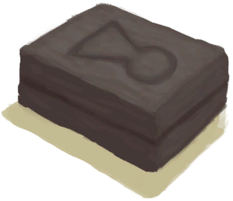

# Feathers  
> A pile of feathers.  
  
<table class="table table-bordered" data-toggle="table"  data-show-header="false"><thead style="display:none"><tr ><th  style="width:50%;text-align:left;vertical-align:top;"  >title</th><th  style="width:50%;text-align:left;vertical-align:top;"  ></th></tr></thead><tr ><td  style="width:50%;text-align:left;vertical-align:top;"  >**Environment：**[Macaque Den(Environment)](Env_MacaqueDen.md)  **Weight：**10  **Tag：**	[“Temper”](tag_Temper.md), [“Tinder”](tag_Tinder.md)</td><td  style="width:50%;text-align:left;vertical-align:top;"  >

<a href="Feathers.md" style="color:black">Feathers</a>

"Feathers can be found in <b>Bird Nests</b> or extracted from the <b>Carcasses of Dead Birds</b>.  They can be used for numberous crafts including <b>Artificial Fishing Bait</td></tr></tbody></table>  
  
## Got From  

Check Gift

[A gift!(Event)](Event_MacaqueFriendGift.md)

Continue

[A partridge nest!(Event)](Event_PartridgeNest.md)

Continue

[You made it!(Event)](Event_SeagullNest.md)

Transform

[Seagull Charm](SeagullCharm.md)

Dismantle

[Shark Headpiece](SharkHeadpiece.md)

Harvest

[Partridge Carcass](PartridgeCarcass.md)

** With：**[Obsidian Knife](KnifeObsidian.md)Cut Open

[Dead Partridge](PartridgeDead.md)

** With：**[“Cutter”](tag_Cutter.md)Cut Open

[Dead Partridge](PartridgeDead.md)

** With：**[“Cutter”](tag_Cutter.md)Cut Open

[Partridge](PartridgeFemaleEnclosure.md)

** With：**[“Cutter”](tag_Cutter.md)Cut Open

[Partridge](PartridgeFemaleLive.md)

** With：**[“Cutter”](tag_Cutter.md)Cut Open

[Male Partridge](PartridgeMaleEnclosure.md)

** With：**[“Cutter”](tag_Cutter.md)Cut Open

[Male Partridge](PartridgeMaleLive.md)

Harvest

[Seagull Carcass](SeagullCarcass.md)

** With：**[Obsidian Knife](KnifeObsidian.md)Cut Open

[Dead Seagull](SeagullDead.md)

** With：**[“Cutter”](tag_Cutter.md)Cut Open

[Dead Seagull](SeagullDead.md)

Explore

[Bird Rock](BirdRock.md)

  
  
## Drag With  

<table style="margin-bottom:0px;"><tr><td style="width:40%;text-align:left; background-color:#FEFEFE"><b>With：</b>[“Hammer”](tag_Hammer.md)</td><td style="width:40%;font-size:1em;font-weight:bold;background-color:#FEFEFE">Ground (1h) </td></tr><tr style="background-color:#FFFFFF"><td style=""><b>Receiving：</b></td><td style=""><b>Self：</b>→ [

[Feathermeal](Feathermeal.md)](Feathermeal.md)</td></tr></table>
  

<table style="margin-bottom:0px;"><tr><td style="width:40%;text-align:left; background-color:#FEFEFE"><b>With：</b>[

[Hand Drill](HandDrill.md)](HandDrill.md)</td><td style="width:40%;font-size:1em;font-weight:bold;background-color:#FEFEFE">Light with Hand Drill (30m) [“HandAction(Group)”](HandAction.md)</td></tr><tr style="background-color:#FFFFFF"><td style=""><b>Receiving：</b>Usage  <b>-1</b></td><td style=""><b>Self：</b>→ [

[Lit Tinder](TinderLit.md)](TinderLit.md)</td></tr><tr><td colspan="2"><b>StatChange：</b>[

[Morale](Morale.md)](Morale.md)<b>+1</b>, [

[Hand Damage](HandDamage.md)](HandDamage.md)<b>+40</b></td></tr></table>
  

<table style="margin-bottom:0px;"><tr><td style="width:40%;text-align:left; background-color:#FEFEFE"><b>With：</b>[

[Bow Drill](BowDrill.md)](BowDrill.md)</td><td style="width:40%;font-size:1em;font-weight:bold;background-color:#FEFEFE">Light with Bow Drill (15m) [“HandAction(Group)”](HandAction.md)</td></tr><tr style="background-color:#FFFFFF"><td style=""><b>Receiving：</b>Usage  <b>-1</b></td><td style=""><b>Self：</b>→ [

[Lit Tinder](TinderLit.md)](TinderLit.md)</td></tr><tr><td colspan="2"><b>StatChange：</b>[

[Morale](Morale.md)](Morale.md)<b>+1</b>, [

[Hand Damage](HandDamage.md)](HandDamage.md)<b>+10</b></td></tr></table>
  

<table style="margin-bottom:0px;"><tr><td style="width:40%;text-align:left; background-color:#FEFEFE"><b>With：</b>[“Fire Source”](tag_FireSource.md)</td><td style="width:40%;font-size:1em;font-weight:bold;background-color:#FEFEFE">Light Tinder  </td></tr><tr style="background-color:#FFFFFF"><td style=""><b>Receiving：</b></td><td style=""><b>Self：</b>→ [

[Lit Tinder](TinderLit.md)](TinderLit.md)</td></tr><tr><td colspan="2"><b>StatChange：</b>[

[Morale](Morale.md)](Morale.md)<b>+1</b></td></tr></table>
  
  
## Drag To  

[Alembic(On)](AlembicOn.md)

[Campfire](Campfire.md)

[Clay Fire Pit](ClayFirePit.md)

[Fire](Fire.md)

[Forge](Forge.md)

[Gas Cooker(On)](GasCookerOn.md)

[Kiln](Kiln.md)

[Advanced Kiln](KilnAdvanced.md)

[Stove](Stove.md)

[Mud Pile](MudPile.md)

[Clay](Clay.md)

[Embers](Embers.md)

[Bee Smoker(Off)](BeeSmokerOff.md)

[Hand Drill](FirePlow.md)

  
  
## Use In BluePrint  

<a href="Bp_Arrow.md" style="color:black">Arrows</a>

<a href="Bp_BedWooden.md" style="color:black">Wooden Bed</a>

<a href="Bp_CeremonialDagger.md" style="color:black">Ceremonial Dagger</a>

<a href="Bp_FishBait.md" style="color:black">Fish Bait</a>

<a href="Bp_MoldAxe.md" style="color:black">Axe Mold</a>

<a href="Bp_MoldKnife.md" style="color:black">Knife Mold</a>

<a href="Bp_MoldShovel.md" style="color:black">Shovel Mold</a>

<a href="Bp_MoldSpear.md" style="color:black">Spear Mold</a>

<a href="Bp_ObsidianSpear.md" style="color:black">Obsidian Spear</a>

<a href="Bp_Alembic.md" style="color:black">Alembic</a>

<a href="Bp_ClayBowl.md" style="color:black">Clay Bowl</a>

<a href="Bp_ClayFirePit.md" style="color:black">Clay Fire Pit</a>

<a href="Bp_ClayJar.md" style="color:black">Clay Jar</a>

<a href="Bp_ClayPotCooler.md" style="color:black">Clay Pot Cooler</a>

<a href="Bp_ClayVase.md" style="color:black">Clay Vase</a>

<a href="Bp_CookingPot.md" style="color:black">Cooking Pot</a>

<a href="Bp_GlazedVase.md" style="color:black">Glazed Vase</a>

<a href="Bp_SeagullCharm.md" style="color:black">Seagull Charm</a>

<a href="Bp_SharkHeadpiece.md" style="color:black">Shark Headpiece</a>

  
  
  

