# Fibers  
> Could combine it with more fiber to weave it into a cord. Could also be used as tinder.  
  
<table class="table table-bordered" data-toggle="table"  data-show-header="false"><thead style="display:none"><tr ><th  style="width:50%;text-align:left;vertical-align:top;"  >title</th><th  style="width:50%;text-align:left;vertical-align:top;"  ></th></tr></thead><tr ><td  style="width:50%;text-align:left;vertical-align:top;"  >**Weight：**20  **Tag：**	[“Temper”](tag_Temper.md), [“Tinder”](tag_Tinder.md), [“Poor Fibers”](tag_FibersPoor.md)</td><td  style="width:50%;text-align:left;vertical-align:top;"  >

<a href="Fibers.md" style="color:black">Fibers</a>

"Plant fibers can be gathered from <b>Snakegrass or Coconut husks.</b>  An essential material for survival: braid two pieces of fibers together to get <b>Fiber Cord</b></td></tr></tbody></table>  
  
## Got From  

** With：**[“Axe”](tag_Axe.md)Take Apart

[Seat](Seat.md)

** With：**[“Axe”](tag_Axe.md) , [“Axe”](tag_Axe.md)Take Apart

[Seat](SeatPlaced.md)

Transform

[Coconut Sandals](CoconutSandals.md)

Extract Fibers

[Coconut Husk](CoconutHusk.md)

Extract Fibers

[Snake Grass](SnakeGrass.md)

  
  
## Drag With  

<table style="margin-bottom:0px;"><tr><td style="width:40%;text-align:left; background-color:#FEFEFE"><b>With：</b>[
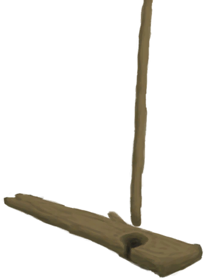
[Hand Drill](HandDrill.md)](HandDrill.md)</td><td style="width:40%;font-size:1em;font-weight:bold;background-color:#FEFEFE">Light with Hand Drill (30m) [“HandAction(Group)”](HandAction.md)</td></tr><tr style="background-color:#FFFFFF"><td style=""><b>Receiving：</b>Usage  <b>-1</b></td><td style=""><b>Self：</b>→ [
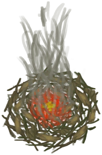
[Lit Tinder](TinderLit.md)](TinderLit.md)</td></tr><tr><td colspan="2"><b>StatChange：</b>[

[Morale](Morale.md)](Morale.md)<b>+1</b>, [

[Hand Damage](HandDamage.md)](HandDamage.md)<b>+40</b></td></tr></table>
  

<table style="margin-bottom:0px;"><tr><td style="width:40%;text-align:left; background-color:#FEFEFE"><b>With：</b>[
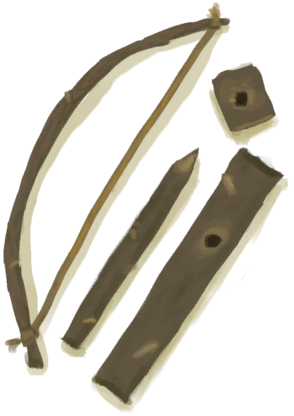
[Bow Drill](BowDrill.md)](BowDrill.md)</td><td style="width:40%;font-size:1em;font-weight:bold;background-color:#FEFEFE">Light with Bow Drill (15m) [“HandAction(Group)”](HandAction.md)</td></tr><tr style="background-color:#FFFFFF"><td style=""><b>Receiving：</b>Usage  <b>-1</b></td><td style=""><b>Self：</b>→ [

[Lit Tinder](TinderLit.md)](TinderLit.md)</td></tr><tr><td colspan="2"><b>StatChange：</b>[

[Morale](Morale.md)](Morale.md)<b>+1</b>, [

[Hand Damage](HandDamage.md)](HandDamage.md)<b>+10</b></td></tr></table>
  

<table style="margin-bottom:0px;"><tr><td style="width:40%;text-align:left; background-color:#FEFEFE"><b>With：</b>[“Fire Source”](tag_FireSource.md)</td><td style="width:40%;font-size:1em;font-weight:bold;background-color:#FEFEFE">Light Tinder  </td></tr><tr style="background-color:#FFFFFF"><td style=""><b>Receiving：</b></td><td style=""><b>Self：</b>→ [

[Lit Tinder](TinderLit.md)](TinderLit.md)</td></tr><tr><td colspan="2"><b>StatChange：</b>[

[Morale](Morale.md)](Morale.md)<b>+1</b></td></tr></table>
  

<table style="margin-bottom:0px;"><tr><td style="width:40%;text-align:left; background-color:#FEFEFE"><b>With：</b>[
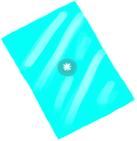
[Signaling Mirror](SignalingMirror.md)](SignalingMirror.md) | [
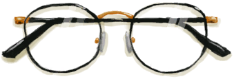
[Glasses](Glasses.md)](Glasses.md)</td><td style="width:40%;font-size:1em;font-weight:bold;background-color:#FEFEFE">Light Tinder (45m) </td></tr><tr><td colspan="2"><b>Require：</b>[

[Rain Value](RainValue.md)](RainValue.md): <b>0-0</b>, [

[Sun Strength](SunStrength.md)](SunStrength.md): <b>1-6</b></td></tr><tr style="background-color:#FFFFFF"><td style=""><b>Receiving：</b></td><td style=""><b>Self：</b>→ [

[Lit Tinder](TinderLit.md)](TinderLit.md)</td></tr><tr><td colspan="2"><b>StatChange：</b>[

[Morale](Morale.md)](Morale.md)<b>+1</b></td></tr></table>
  

<table style="margin-bottom:0px;"><tr><td style="width:40%;text-align:left; background-color:#FEFEFE"><b>With：</b>[

[Fibers](Fibers.md)](Fibers.md)</td><td style="width:40%;font-size:1em;font-weight:bold;background-color:#FEFEFE">Cord (30m) [“HandAction(Group)”](HandAction.md), [“CraftAction(Group)”](CraftAction.md)</td></tr><tr><td colspan="2"><b>Require：</b>[

[Light](Light.md)](Light.md): <b>10-100</b></td></tr><tr style="background-color:#FFFFFF"><td style=""><b>Receiving：</b>→Dismiss</td><td style=""><b>Self：</b>→ [
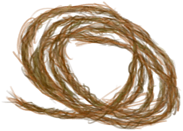
[Fiber Cord](CordFiber.md)](CordFiber.md)</td></tr><tr><td colspan="2"><b>StatChange：</b>[
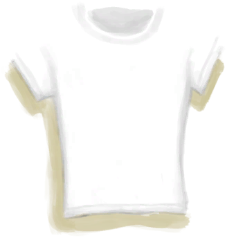
[Tailoring(Skill)](Skill_Tailoring.md)](Skill_Tailoring.md)<b>+0.5</b>, [

[Stress](Stress.md)](Stress.md)<b>-10</b> addition<b>-1</b></td></tr></table>
  
  
## Drag To  

[Compost Bin](CompostBin.md)

[Alembic(On)](AlembicOn.md)

[Campfire](Campfire.md)

[Clay Fire Pit](ClayFirePit.md)

[Fire](Fire.md)

[Forge](Forge.md)

[Forge(Off)](ForgeExtinguished.md)

[Gas Cooker(On)](GasCookerOn.md)

[Kiln](Kiln.md)

[Advanced Kiln](KilnAdvanced.md)

[Advanced Kiln(Off)](KilnAdvancedExtinguished.md)

[Kiln(Off)](KilnExtinguished.md)

[Stove](Stove.md)

[Goat Feeder](GoatFeeder.md)

[Goat Feeder(Empty)](GoatFeederEmpty.md)

[Mud Pile](MudPile.md)

[Smoker](Smoker.md)

[Smoker(Off)](SmokerExtinguished.md)

[Smoker](SmokerExtinguishedPlastic.md)

[Smoker](SmokerPlastic.md)

[Clay](Clay.md)

[Embers](Embers.md)

[Fibers](Fibers.md)

[Goat](GoatEnclosureFemale.md)

[Juvenile Goat](GoatEnclosureKid.md)

[Lactating Goat](GoatEnclosureLactating.md)

[Male Goat](GoatEnclosureMale.md)

[Goat](GoatTiedFemale.md)

[Lactating Goat](GoatTiedFemaleLactating.md)

[Juvenile Goat](GoatTiedKid.md)

[Male Goat](GoatTiedMale.md)

[Bee Smoker(Off)](BeeSmokerOff.md)

[Hand Drill](FirePlow.md)

[Spindle](Spindle.md)

  
  
## Use In BluePrint  

<a href="Bp_MoldAxe.md" style="color:black">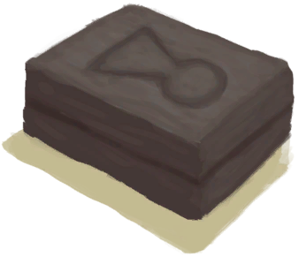Axe Mold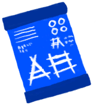</a>

<a href="Bp_MoldKnife.md" style="color:black">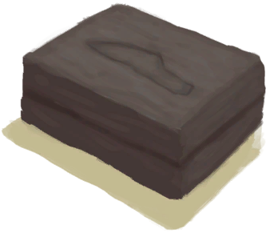Knife Mold</a>

<a href="Bp_MoldShovel.md" style="color:black">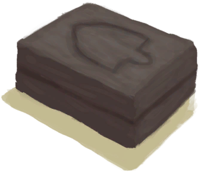Shovel Mold</a>

<a href="Bp_MoldSpear.md" style="color:black">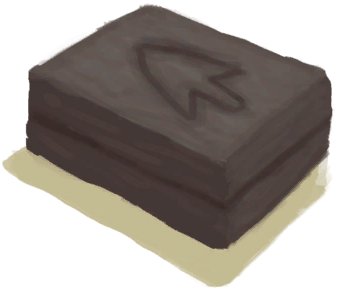Spear Mold</a>

<a href="Bp_Alembic.md" style="color:black">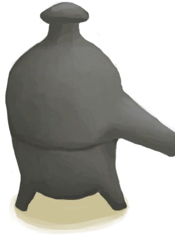Alembic</a>

<a href="Bp_ClayBowl.md" style="color:black">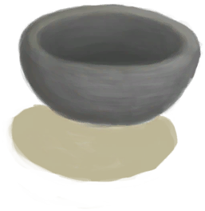Clay Bowl</a>

<a href="Bp_ClayFirePit.md" style="color:black">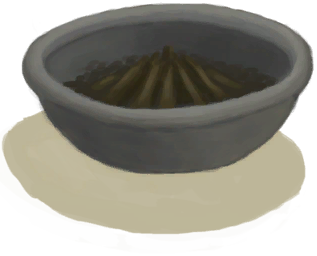Clay Fire Pit</a>

<a href="Bp_ClayJar.md" style="color:black">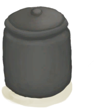Clay Jar</a>

<a href="Bp_ClayPotCooler.md" style="color:black">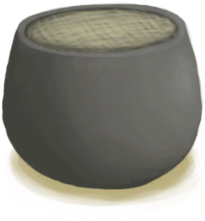Clay Pot Cooler</a>

<a href="Bp_ClayVase.md" style="color:black">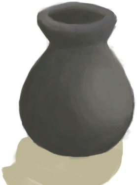Clay Vase</a>

<a href="Bp_CookingPot.md" style="color:black">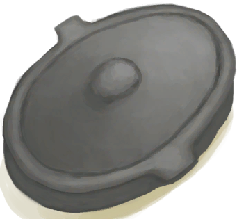Cooking Pot</a>

<a href="Bp_GlazedVase.md" style="color:black">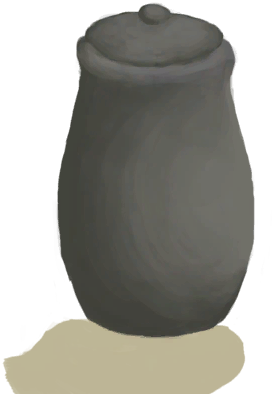Glazed Vase</a>

<a href="Bp_LeatherShoes.md" style="color:black">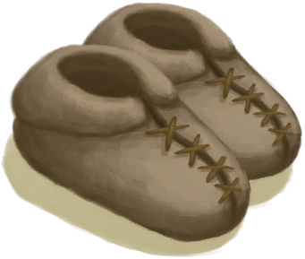Leather Shoes</a>

  
  
  

