# Filth  
> Shows how dirty you are and increases your chances of catching something.  
> "Your body filth increases whenever you perform activities that get you dirty. Some activities wil get you dirtier than others  
  

<b>Base Value: </b> 350 
  

<b>Value Range: </b> 0 ~ 500 
  

<b>Base Rate: </b> - 
  
## Statuses  

<table><tr style="height:2em;"><td style="background-color:#F0F0F0;text-align:center;width:180px;font-size:1.4em;font-weight:bold;vertical-align:middle;">
425 ～ 500

85% ～ 100%
</td><td colspan=2 style="font-size:1.1em;vertical-align:middle;background-color:#F9F9F9;">
<b>

Very Filthy</b>

&nbsp;&nbsp;I'm covered in filth...
</td></tr><tr><td colspan=2><b>Effect：</b>[

[Surface Bacteria](BacteriaSurface.md)](BacteriaSurface.md)<b>+5</b>, [

[Bacteria Fever](BacteriaFever.md)](BacteriaFever.md)addition<b>+3</b>, [

[Parasites](Parasites.md)](Parasites.md)addition<b>+4</b>, [Bacteria Cholera Package](BacteriaCholeraPackage.md)addition<b>-2～-0.5</b></td></tr><tr><td colspan=2></td></tr><tr style="height:2em;"><td style="background-color:#F0F0F0;text-align:center;width:180px;font-size:1.4em;font-weight:bold;vertical-align:middle;">
350 ～ 424

70% ～ 84%
</td><td colspan=2 style="font-size:1.1em;vertical-align:middle;background-color:#F9F9F9;">
<b>

Filthy</b>

&nbsp;&nbsp;I'm covered in filth...
</td></tr><tr><td colspan=2><b>Effect：</b>[

[Surface Bacteria](BacteriaSurface.md)](BacteriaSurface.md)<b>+4</b>, [

[Bacteria Fever](BacteriaFever.md)](BacteriaFever.md)addition<b>+2</b>, [

[Parasites](Parasites.md)](Parasites.md)addition<b>+2</b>, [Bacteria Cholera Package](BacteriaCholeraPackage.md)addition<b>-1</b></td></tr><tr><td colspan=2></td></tr><tr style="height:2em;"><td style="background-color:#F0F0F0;text-align:center;width:180px;font-size:1.4em;font-weight:bold;vertical-align:middle;">
250 ～ 349

50% ～ 69%
</td><td colspan=2 style="font-size:1.1em;vertical-align:middle;background-color:#F9F9F9;">
<b>

Very Dirty</b>

&nbsp;&nbsp;I really could use a bath
</td></tr><tr><td colspan=2><b>Effect：</b>[

[Surface Bacteria](BacteriaSurface.md)](BacteriaSurface.md)<b>+3</b>, [

[Bacteria Fever](BacteriaFever.md)](BacteriaFever.md)addition<b>+2</b>, [

[Parasites](Parasites.md)](Parasites.md)addition<b>+1</b></td></tr><tr><td colspan=2></td></tr><tr style="height:2em;"><td style="background-color:#F0F0F0;text-align:center;width:180px;font-size:1.4em;font-weight:bold;vertical-align:middle;">
101 ～ 249

20% ～ 49%
</td><td colspan=2 style="font-size:1.1em;vertical-align:middle;background-color:#F9F9F9;">
<b>

Dirty</b>

&nbsp;&nbsp;I could use a bath
</td></tr><tr><td colspan=2><b>Effect：</b>[

[Surface Bacteria](BacteriaSurface.md)](BacteriaSurface.md)<b>+2</b>, [

[Bacteria Fever](BacteriaFever.md)](BacteriaFever.md)addition<b>+1</b></td></tr><tr><td colspan=2></td></tr><tr style="height:2em;"><td style="background-color:#F0F0F0;text-align:center;width:180px;font-size:1.4em;font-weight:bold;vertical-align:middle;">
1 ～ 100

0% ～ 20%
</td><td colspan=2 style="font-size:1.1em;vertical-align:middle;background-color:#F9F9F9;">
<b>

</b>

</td></tr><tr><td colspan=2><b>Effect：</b>[

[Surface Bacteria](BacteriaSurface.md)](BacteriaSurface.md)<b>+1</b></td></tr><tr><td colspan=2></td></tr></table>
  
## Related Cards  
[Blood Loss](BloodLoss.md)  |  [Rain Exposure](RainExposure.md)  
## Change By  
<table class="table table-bordered" data-toggle="table"  ><thead style=""><tr ><th  style="text-align:left;vertical-align:top;"  >From</th><th  style="text-align:left;vertical-align:top;"  >Operation</th><th  style="text-align:left;vertical-align:top;"  data-sortable="true"  >Value</th></tr></thead><tr ><td  style="text-align:left;vertical-align:top;"  >[

[Mud Pile](MudPile.md)](MudPile.md)</td><td  style="text-align:left;vertical-align:top;"  >Apply to Body</td><td  style="text-align:left;vertical-align:top;"  >500</td></tr><tr ><td  style="text-align:left;vertical-align:top;"  >[

[Ouch!(Event)](Event_MacaqueFightBadFailure.md)](Event_MacaqueFightBadFailure.md)</td><td  style="text-align:left;vertical-align:top;"  >Continue</td><td  style="text-align:left;vertical-align:top;"  >75</td></tr><tr ><td  style="text-align:left;vertical-align:top;"  >[

[Ouch!(Event)](Event_MacaqueFightFailedRetreat.md)](Event_MacaqueFightFailedRetreat.md)</td><td  style="text-align:left;vertical-align:top;"  >Continue</td><td  style="text-align:left;vertical-align:top;"  >75</td></tr><tr ><td  style="text-align:left;vertical-align:top;"  >[

["I got it(Event)](Event_MacaqueFightMixedSuccess.md)](Event_MacaqueFightMixedSuccess.md)</td><td  style="text-align:left;vertical-align:top;"  >Continue</td><td  style="text-align:left;vertical-align:top;"  >75</td></tr><tr ><td  style="text-align:left;vertical-align:top;"  >[

[Cesspool](Cesspool.md)](Cesspool.md)</td><td  style="text-align:left;vertical-align:top;"  >Clean Up ** With：**[“Shovel”](tag_Shovel.md)</td><td  style="text-align:left;vertical-align:top;"  >50</td></tr><tr ><td  style="text-align:left;vertical-align:top;"  >[

[Wild Yam](YamPlant.md)](YamPlant.md)</td><td  style="text-align:left;vertical-align:top;"  >Dig Up Tubers</td><td  style="text-align:left;vertical-align:top;"  >40</td></tr><tr ><td  style="text-align:left;vertical-align:top;"  >[

[Stove(Off)](StoveExtinguished.md)](StoveExtinguished.md)</td><td  style="text-align:left;vertical-align:top;"  >Demolish ** With：**[“Hammer”](tag_Hammer.md)</td><td  style="text-align:left;vertical-align:top;"  >35</td></tr><tr ><td  style="text-align:left;vertical-align:top;"  >[

[Macaque Carcass](MacaqueCarcass.md)](MacaqueCarcass.md)</td><td  style="text-align:left;vertical-align:top;"  >Butcher ** With：**[Obsidian Knife](KnifeObsidian.md)</td><td  style="text-align:left;vertical-align:top;"  >35</td></tr><tr ><td  style="text-align:left;vertical-align:top;"  >[

[Macaque Carcass](MacaqueCarcass.md)](MacaqueCarcass.md)</td><td  style="text-align:left;vertical-align:top;"  >Butcher ** With：**[“Cutter”](tag_Cutter.md)</td><td  style="text-align:left;vertical-align:top;"  >35</td></tr><tr ><td  style="text-align:left;vertical-align:top;"  >[

[Water Filter](WaterFilter.md)](WaterFilter.md)</td><td  style="text-align:left;vertical-align:top;"  >Demolish ** With：**[“Hammer”](tag_Hammer.md)</td><td  style="text-align:left;vertical-align:top;"  >35</td></tr><tr ><td  style="text-align:left;vertical-align:top;"  >[

[Watering Trough](WateringTrough.md)](WateringTrough.md)</td><td  style="text-align:left;vertical-align:top;"  >Demolish ** With：**[“Hammer”](tag_Hammer.md)</td><td  style="text-align:left;vertical-align:top;"  >30</td></tr><tr ><td  style="text-align:left;vertical-align:top;"  >[

[The boar managed to hurt you!(Event)](Event_BoarWoundMajor.md)](Event_BoarWoundMajor.md)</td><td  style="text-align:left;vertical-align:top;"  >Nice</td><td  style="text-align:left;vertical-align:top;"  >30</td></tr><tr ><td  style="text-align:left;vertical-align:top;"  >[

[The boar managed to hurt you!(Event)](Event_BoarWoundMinor.md)](Event_BoarWoundMinor.md)</td><td  style="text-align:left;vertical-align:top;"  >Nice</td><td  style="text-align:left;vertical-align:top;"  >30</td></tr><tr ><td  style="text-align:left;vertical-align:top;"  >[

[The Drone managed to hurt you!(Event)](Event_DroneWoundMajor.md)](Event_DroneWoundMajor.md)</td><td  style="text-align:left;vertical-align:top;"  >Nice</td><td  style="text-align:left;vertical-align:top;"  >30</td></tr><tr ><td  style="text-align:left;vertical-align:top;"  >[

[The Drone managed to hurt you!(Event)](Event_DroneWoundMinor.md)](Event_DroneWoundMinor.md)</td><td  style="text-align:left;vertical-align:top;"  >Nice</td><td  style="text-align:left;vertical-align:top;"  >30</td></tr><tr ><td  style="text-align:left;vertical-align:top;"  >[

[Fall!(Event)](Event_FallAbrasion.md)](Event_FallAbrasion.md)</td><td  style="text-align:left;vertical-align:top;"  >Nice</td><td  style="text-align:left;vertical-align:top;"  >30</td></tr><tr ><td  style="text-align:left;vertical-align:top;"  >[

[Fall!(Event)](Event_FallBruise.md)](Event_FallBruise.md)</td><td  style="text-align:left;vertical-align:top;"  >Nice</td><td  style="text-align:left;vertical-align:top;"  >30</td></tr><tr ><td  style="text-align:left;vertical-align:top;"  >[

[Fall!(Event)](Event_FallFracture.md)](Event_FallFracture.md)</td><td  style="text-align:left;vertical-align:top;"  >Nice</td><td  style="text-align:left;vertical-align:top;"  >30</td></tr><tr ><td  style="text-align:left;vertical-align:top;"  >[

[Fall!(Event)](Event_FallLaceration.md)](Event_FallLaceration.md)(未实装)</td><td  style="text-align:left;vertical-align:top;"  >Nice</td><td  style="text-align:left;vertical-align:top;"  >30</td></tr><tr ><td  style="text-align:left;vertical-align:top;"  >[

[Fall!(Event)](Event_FallSprains.md)](Event_FallSprains.md)</td><td  style="text-align:left;vertical-align:top;"  >Nice</td><td  style="text-align:left;vertical-align:top;"  >30</td></tr><tr ><td  style="text-align:left;vertical-align:top;"  >[Fall!(Event)](Event_MountainSlip.md)(未实装)</td><td  style="text-align:left;vertical-align:top;"  >Nice</td><td  style="text-align:left;vertical-align:top;"  >30</td></tr><tr ><td  style="text-align:left;vertical-align:top;"  >[Failure!(Event)](Event_SwimmingFailed.md)(未实装)</td><td  style="text-align:left;vertical-align:top;"  >Nice</td><td  style="text-align:left;vertical-align:top;"  >30</td></tr><tr ><td  style="text-align:left;vertical-align:top;"  >[

[Vomit!(Event)](Event_Vomit.md)](Event_Vomit.md)</td><td  style="text-align:left;vertical-align:top;"  >Eughhh.....</td><td  style="text-align:left;vertical-align:top;"  >30</td></tr><tr ><td  style="text-align:left;vertical-align:top;"  >[

[Narrow Tunnel(High Chamber)](NarrowTunnelEntrance.md)](NarrowTunnelEntrance.md)</td><td  style="text-align:left;vertical-align:top;"  >Enter</td><td  style="text-align:left;vertical-align:top;"  >30</td></tr><tr ><td  style="text-align:left;vertical-align:top;"  >[

[Low Chamber](NarrowTunnelExit.md)](NarrowTunnelExit.md)</td><td  style="text-align:left;vertical-align:top;"  >Enter</td><td  style="text-align:left;vertical-align:top;"  >30</td></tr><tr ><td  style="text-align:left;vertical-align:top;"  >[

[Almond Tree Crop Plot](CropPlotAlmondTree.md)](CropPlotAlmondTree.md)</td><td  style="text-align:left;vertical-align:top;"  >Destroy</td><td  style="text-align:left;vertical-align:top;"  >25</td></tr><tr ><td  style="text-align:left;vertical-align:top;"  >[

[Aloe Vera Crop Plot](CropPlotAloeVera.md)](CropPlotAloeVera.md)</td><td  style="text-align:left;vertical-align:top;"  >Destroy</td><td  style="text-align:left;vertical-align:top;"  >25</td></tr><tr ><td  style="text-align:left;vertical-align:top;"  >[

[Banana Crop Plot](CropPlotBananaTree.md)](CropPlotBananaTree.md)</td><td  style="text-align:left;vertical-align:top;"  >Destroy</td><td  style="text-align:left;vertical-align:top;"  >25</td></tr><tr ><td  style="text-align:left;vertical-align:top;"  >[

[Chili Crop Plot](CropPlotChilies.md)](CropPlotChilies.md)</td><td  style="text-align:left;vertical-align:top;"  >Destroy</td><td  style="text-align:left;vertical-align:top;"  >25</td></tr><tr ><td  style="text-align:left;vertical-align:top;"  >[

[China Rose Crop Plot](CropPlotChinaRose.md)](CropPlotChinaRose.md)</td><td  style="text-align:left;vertical-align:top;"  >Destroy</td><td  style="text-align:left;vertical-align:top;"  >25</td></tr><tr ><td  style="text-align:left;vertical-align:top;"  >[

[Cinchona Crop Plot](CropPlotCinchonaTree.md)](CropPlotCinchonaTree.md)</td><td  style="text-align:left;vertical-align:top;"  >Destroy</td><td  style="text-align:left;vertical-align:top;"  >25</td></tr><tr ><td  style="text-align:left;vertical-align:top;"  >[

[Coffee Crop Plot](CropPlotCoffee.md)](CropPlotCoffee.md)</td><td  style="text-align:left;vertical-align:top;"  >Destroy</td><td  style="text-align:left;vertical-align:top;"  >25</td></tr><tr ><td  style="text-align:left;vertical-align:top;"  >[

[Ginger Crop Plot](CropPlotGinger.md)](CropPlotGinger.md)</td><td  style="text-align:left;vertical-align:top;"  >Destroy</td><td  style="text-align:left;vertical-align:top;"  >25</td></tr><tr ><td  style="text-align:left;vertical-align:top;"  >[

[Jasmine Crop Plot](CropPlotJasmine.md)](CropPlotJasmine.md)</td><td  style="text-align:left;vertical-align:top;"  >Destroy</td><td  style="text-align:left;vertical-align:top;"  >25</td></tr><tr ><td  style="text-align:left;vertical-align:top;"  >[

[Kava Crop Plot](CropPlotKava.md)](CropPlotKava.md)</td><td  style="text-align:left;vertical-align:top;"  >Destroy</td><td  style="text-align:left;vertical-align:top;"  >25</td></tr><tr ><td  style="text-align:left;vertical-align:top;"  >[

[Lemon Grass Crop Plot](CropPlotLemonGrass.md)](CropPlotLemonGrass.md)</td><td  style="text-align:left;vertical-align:top;"  >Destroy</td><td  style="text-align:left;vertical-align:top;"  >25</td></tr><tr ><td  style="text-align:left;vertical-align:top;"  >[

[Mango Crop Plot](CropPlotMangoTree.md)](CropPlotMangoTree.md)</td><td  style="text-align:left;vertical-align:top;"  >Destroy</td><td  style="text-align:left;vertical-align:top;"  >25</td></tr><tr ><td  style="text-align:left;vertical-align:top;"  >[

[Nipa Palm Crop Plot](CropPlotNipaPalm.md)](CropPlotNipaPalm.md)</td><td  style="text-align:left;vertical-align:top;"  >Destroy</td><td  style="text-align:left;vertical-align:top;"  >25</td></tr><tr ><td  style="text-align:left;vertical-align:top;"  >[

[Palm Bush Crop Plot](CropPlotPalmBush.md)](CropPlotPalmBush.md)</td><td  style="text-align:left;vertical-align:top;"  >Destroy</td><td  style="text-align:left;vertical-align:top;"  >25</td></tr><tr ><td  style="text-align:left;vertical-align:top;"  >[

[Palm Tree Crop Plot](CropPlotPalmTree.md)](CropPlotPalmTree.md)</td><td  style="text-align:left;vertical-align:top;"  >Destroy</td><td  style="text-align:left;vertical-align:top;"  >25</td></tr><tr ><td  style="text-align:left;vertical-align:top;"  >[

[Rice Crop Plot](CropPlotRice.md)](CropPlotRice.md)</td><td  style="text-align:left;vertical-align:top;"  >Destroy</td><td  style="text-align:left;vertical-align:top;"  >25</td></tr><tr ><td  style="text-align:left;vertical-align:top;"  >[
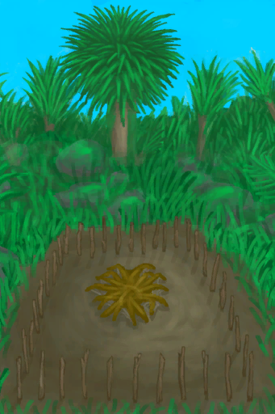
[Ruined Crop Plot](CropPlotRuined.md)](CropPlotRuined.md)</td><td  style="text-align:left;vertical-align:top;"  >Destroy</td><td  style="text-align:left;vertical-align:top;"  >25</td></tr><tr ><td  style="text-align:left;vertical-align:top;"  >[

[Sago Palm Crop Plot](CropPlotSagoPalm.md)](CropPlotSagoPalm.md)</td><td  style="text-align:left;vertical-align:top;"  >Destroy</td><td  style="text-align:left;vertical-align:top;"  >25</td></tr><tr ><td  style="text-align:left;vertical-align:top;"  >[

[Snake Grass Crop Plot](CropPlotSnakeGrass.md)](CropPlotSnakeGrass.md)</td><td  style="text-align:left;vertical-align:top;"  >Destroy</td><td  style="text-align:left;vertical-align:top;"  >25</td></tr><tr ><td  style="text-align:left;vertical-align:top;"  >[

[Spider Lily Crop Plot](CropPlotSpiderLily.md)](CropPlotSpiderLily.md)</td><td  style="text-align:left;vertical-align:top;"  >Destroy</td><td  style="text-align:left;vertical-align:top;"  >25</td></tr><tr ><td  style="text-align:left;vertical-align:top;"  >[

[Weevil Lily Crop Plot](CropPlotWeevilLily.md)](CropPlotWeevilLily.md)</td><td  style="text-align:left;vertical-align:top;"  >Destroy</td><td  style="text-align:left;vertical-align:top;"  >25</td></tr><tr ><td  style="text-align:left;vertical-align:top;"  >[

[Wild Jujube Crop Plot](CropPlotWildJujube.md)](CropPlotWildJujube.md)</td><td  style="text-align:left;vertical-align:top;"  >Destroy</td><td  style="text-align:left;vertical-align:top;"  >25</td></tr><tr ><td  style="text-align:left;vertical-align:top;"  >[

[Yam Crop Plot](CropPlotYam.md)](CropPlotYam.md)</td><td  style="text-align:left;vertical-align:top;"  >Destroy</td><td  style="text-align:left;vertical-align:top;"  >25</td></tr><tr ><td  style="text-align:left;vertical-align:top;"  >[

[Floating Debris](FloatingDebris.md)](FloatingDebris.md)</td><td  style="text-align:left;vertical-align:top;"  >Harvest</td><td  style="text-align:left;vertical-align:top;"  >25</td></tr><tr ><td  style="text-align:left;vertical-align:top;"  >[

[Hearty Feast](HeartyFeast.md)](HeartyFeast.md)</td><td  style="text-align:left;vertical-align:top;"  >Eat</td><td  style="text-align:left;vertical-align:top;"  >22</td></tr><tr ><td  style="text-align:left;vertical-align:top;"  >[

[Honey Glazed Pork](HoneyGlazedPork.md)](HoneyGlazedPork.md)</td><td  style="text-align:left;vertical-align:top;"  >Eat</td><td  style="text-align:left;vertical-align:top;"  >22</td></tr><tr ><td  style="text-align:left;vertical-align:top;"  >[

[Bee Skep](BeeSkep.md)](BeeSkep.md)</td><td  style="text-align:left;vertical-align:top;"  >Harvest</td><td  style="text-align:left;vertical-align:top;"  >20</td></tr><tr ><td  style="text-align:left;vertical-align:top;"  >[

[Swarming Bee Skep](BeeSkepSwarming.md)](BeeSkepSwarming.md)</td><td  style="text-align:left;vertical-align:top;"  >Harvest</td><td  style="text-align:left;vertical-align:top;"  >20</td></tr><tr ><td  style="text-align:left;vertical-align:top;"  >[

[Beehive](Beehive.md)](Beehive.md)</td><td  style="text-align:left;vertical-align:top;"  >Harvest</td><td  style="text-align:left;vertical-align:top;"  >20</td></tr><tr ><td  style="text-align:left;vertical-align:top;"  >[

[Trapped Macaque](CageTrapMacaque.md)](CageTrapMacaque.md)</td><td  style="text-align:left;vertical-align:top;"  >Put Down ** With：**[“Cutter”](tag_Cutter.md)</td><td  style="text-align:left;vertical-align:top;"  >20</td></tr><tr ><td  style="text-align:left;vertical-align:top;"  >[

[Sow](BoarEnclosureFemale.md)](BoarEnclosureFemale.md)</td><td  style="text-align:left;vertical-align:top;"  >Kill ** With：**[Heavy Stone](StoneHeavy.md) , [“Cutter”](tag_Cutter.md) , [“Axe”](tag_Axe.md) , [“Spear T1”](tag_Spear.md)</td><td  style="text-align:left;vertical-align:top;"  >20</td></tr><tr ><td  style="text-align:left;vertical-align:top;"  >[

[Boar](BoarEnclosureMale.md)](BoarEnclosureMale.md)</td><td  style="text-align:left;vertical-align:top;"  >Kill ** With：**[Heavy Stone](StoneHeavy.md) , [“Cutter”](tag_Cutter.md) , [“Axe”](tag_Axe.md) , [“Spear T1”](tag_Spear.md)</td><td  style="text-align:left;vertical-align:top;"  >20</td></tr><tr ><td  style="text-align:left;vertical-align:top;"  >[

[Piglet](BoarEnclosurePiglet.md)](BoarEnclosurePiglet.md)</td><td  style="text-align:left;vertical-align:top;"  >Kill ** With：**[Heavy Stone](StoneHeavy.md) , [“Cutter”](tag_Cutter.md) , [“Axe”](tag_Axe.md) , [“Spear T1”](tag_Spear.md)</td><td  style="text-align:left;vertical-align:top;"  >20</td></tr><tr ><td  style="text-align:left;vertical-align:top;"  >[

[Sow](BoarTiedFemale.md)](BoarTiedFemale.md)</td><td  style="text-align:left;vertical-align:top;"  >Kill ** With：**[Heavy Stone](StoneHeavy.md) , [“Cutter”](tag_Cutter.md) , [“Axe”](tag_Axe.md) , [“Spear T1”](tag_Spear.md)</td><td  style="text-align:left;vertical-align:top;"  >20</td></tr><tr ><td  style="text-align:left;vertical-align:top;"  >[

[Boar](BoarTiedMale.md)](BoarTiedMale.md)</td><td  style="text-align:left;vertical-align:top;"  >Kill ** With：**[Heavy Stone](StoneHeavy.md) , [“Cutter”](tag_Cutter.md) , [“Axe”](tag_Axe.md) , [“Spear T1”](tag_Spear.md)</td><td  style="text-align:left;vertical-align:top;"  >20</td></tr><tr ><td  style="text-align:left;vertical-align:top;"  >[

[Piglet](BoarTiedPiglet.md)](BoarTiedPiglet.md)</td><td  style="text-align:left;vertical-align:top;"  >Kill ** With：**[Heavy Stone](StoneHeavy.md) , [“Cutter”](tag_Cutter.md) , [“Axe”](tag_Axe.md) , [“Spear T1”](tag_Spear.md)</td><td  style="text-align:left;vertical-align:top;"  >20</td></tr><tr ><td  style="text-align:left;vertical-align:top;"  >[

[Dog Friend](DogFriend.md)](DogFriend.md)</td><td  style="text-align:left;vertical-align:top;"  >Murder! ** With：**[“Cutter”](tag_Cutter.md) , [“Spear T1”](tag_Spear.md)</td><td  style="text-align:left;vertical-align:top;"  >20</td></tr><tr ><td  style="text-align:left;vertical-align:top;"  >[

[Goat](GoatEnclosureFemale.md)](GoatEnclosureFemale.md)</td><td  style="text-align:left;vertical-align:top;"  >Kill ** With：**[Heavy Stone](StoneHeavy.md) , [“Cutter”](tag_Cutter.md) , [“Axe”](tag_Axe.md) , [“Spear T1”](tag_Spear.md)</td><td  style="text-align:left;vertical-align:top;"  >20</td></tr><tr ><td  style="text-align:left;vertical-align:top;"  >[

[Juvenile Goat](GoatEnclosureKid.md)](GoatEnclosureKid.md)</td><td  style="text-align:left;vertical-align:top;"  >Kill ** With：**[Heavy Stone](StoneHeavy.md) , [“Cutter”](tag_Cutter.md) , [“Axe”](tag_Axe.md) , [“Spear T1”](tag_Spear.md)</td><td  style="text-align:left;vertical-align:top;"  >20</td></tr><tr ><td  style="text-align:left;vertical-align:top;"  >[

[Lactating Goat](GoatEnclosureLactating.md)](GoatEnclosureLactating.md)</td><td  style="text-align:left;vertical-align:top;"  >Kill ** With：**[Heavy Stone](StoneHeavy.md) , [“Cutter”](tag_Cutter.md) , [“Axe”](tag_Axe.md) , [“Spear T1”](tag_Spear.md)</td><td  style="text-align:left;vertical-align:top;"  >20</td></tr><tr ><td  style="text-align:left;vertical-align:top;"  >[

[Male Goat](GoatEnclosureMale.md)](GoatEnclosureMale.md)</td><td  style="text-align:left;vertical-align:top;"  >Kill ** With：**[Heavy Stone](StoneHeavy.md) , [“Cutter”](tag_Cutter.md) , [“Axe”](tag_Axe.md) , [“Spear T1”](tag_Spear.md)</td><td  style="text-align:left;vertical-align:top;"  >20</td></tr><tr ><td  style="text-align:left;vertical-align:top;"  >[

[Goat](GoatTiedFemale.md)](GoatTiedFemale.md)</td><td  style="text-align:left;vertical-align:top;"  >Kill ** With：**[Heavy Stone](StoneHeavy.md) , [“Cutter”](tag_Cutter.md) , [“Axe”](tag_Axe.md) , [“Spear T1”](tag_Spear.md)</td><td  style="text-align:left;vertical-align:top;"  >20</td></tr><tr ><td  style="text-align:left;vertical-align:top;"  >[

[Lactating Goat](GoatTiedFemaleLactating.md)](GoatTiedFemaleLactating.md)</td><td  style="text-align:left;vertical-align:top;"  >Kill ** With：**[Heavy Stone](StoneHeavy.md) , [“Cutter”](tag_Cutter.md) , [“Axe”](tag_Axe.md) , [“Spear T1”](tag_Spear.md)</td><td  style="text-align:left;vertical-align:top;"  >20</td></tr><tr ><td  style="text-align:left;vertical-align:top;"  >[

[Juvenile Goat](GoatTiedKid.md)](GoatTiedKid.md)</td><td  style="text-align:left;vertical-align:top;"  >Kill ** With：**[Heavy Stone](StoneHeavy.md) , [“Cutter”](tag_Cutter.md) , [“Axe”](tag_Axe.md) , [“Spear T1”](tag_Spear.md)</td><td  style="text-align:left;vertical-align:top;"  >20</td></tr><tr ><td  style="text-align:left;vertical-align:top;"  >[

[Male Goat](GoatTiedMale.md)](GoatTiedMale.md)</td><td  style="text-align:left;vertical-align:top;"  >Kill ** With：**[Heavy Stone](StoneHeavy.md) , [“Cutter”](tag_Cutter.md) , [“Axe”](tag_Axe.md) , [“Spear T1”](tag_Spear.md)</td><td  style="text-align:left;vertical-align:top;"  >20</td></tr><tr ><td  style="text-align:left;vertical-align:top;"  >[

[Macaque Friend](MacaqueFriend.md)](MacaqueFriend.md)</td><td  style="text-align:left;vertical-align:top;"  >Murder! ** With：**[“Cutter”](tag_Cutter.md) , [“Spear T1”](tag_Spear.md)</td><td  style="text-align:left;vertical-align:top;"  >20</td></tr><tr ><td  style="text-align:left;vertical-align:top;"  >[

[Wounded Macaque](MacaqueWounded.md)](MacaqueWounded.md)</td><td  style="text-align:left;vertical-align:top;"  >Put Down ** With：**[“Cutter”](tag_Cutter.md)</td><td  style="text-align:left;vertical-align:top;"  >20</td></tr><tr ><td  style="text-align:left;vertical-align:top;"  >[

[Dead Partridge](PartridgeDead.md)](PartridgeDead.md)</td><td  style="text-align:left;vertical-align:top;"  >Cut Open ** With：**[Obsidian Knife](KnifeObsidian.md)</td><td  style="text-align:left;vertical-align:top;"  >20</td></tr><tr ><td  style="text-align:left;vertical-align:top;"  >[

[Dead Partridge](PartridgeDead.md)](PartridgeDead.md)</td><td  style="text-align:left;vertical-align:top;"  >Cut Open ** With：**[“Cutter”](tag_Cutter.md)</td><td  style="text-align:left;vertical-align:top;"  >20</td></tr><tr ><td  style="text-align:left;vertical-align:top;"  >[

[Partridge](PartridgeFemaleEnclosure.md)](PartridgeFemaleEnclosure.md)</td><td  style="text-align:left;vertical-align:top;"  >Cut Open ** With：**[“Cutter”](tag_Cutter.md)</td><td  style="text-align:left;vertical-align:top;"  >20</td></tr><tr ><td  style="text-align:left;vertical-align:top;"  >[

[Partridge](PartridgeFemaleLive.md)](PartridgeFemaleLive.md)</td><td  style="text-align:left;vertical-align:top;"  >Cut Open ** With：**[“Cutter”](tag_Cutter.md)</td><td  style="text-align:left;vertical-align:top;"  >20</td></tr><tr ><td  style="text-align:left;vertical-align:top;"  >[

[Male Partridge](PartridgeMaleEnclosure.md)](PartridgeMaleEnclosure.md)</td><td  style="text-align:left;vertical-align:top;"  >Cut Open ** With：**[“Cutter”](tag_Cutter.md)</td><td  style="text-align:left;vertical-align:top;"  >20</td></tr><tr ><td  style="text-align:left;vertical-align:top;"  >[

[Male Partridge](PartridgeMaleLive.md)](PartridgeMaleLive.md)</td><td  style="text-align:left;vertical-align:top;"  >Cut Open ** With：**[“Cutter”](tag_Cutter.md)</td><td  style="text-align:left;vertical-align:top;"  >20</td></tr><tr ><td  style="text-align:left;vertical-align:top;"  >[

[Dead Seagull](SeagullDead.md)](SeagullDead.md)</td><td  style="text-align:left;vertical-align:top;"  >Cut Open ** With：**[Obsidian Knife](KnifeObsidian.md)</td><td  style="text-align:left;vertical-align:top;"  >20</td></tr><tr ><td  style="text-align:left;vertical-align:top;"  >[

[Dead Seagull](SeagullDead.md)](SeagullDead.md)</td><td  style="text-align:left;vertical-align:top;"  >Cut Open ** With：**[“Cutter”](tag_Cutter.md)</td><td  style="text-align:left;vertical-align:top;"  >20</td></tr><tr ><td  style="text-align:left;vertical-align:top;"  >[

[Weston](Weston.md)](Weston.md)</td><td  style="text-align:left;vertical-align:top;"  >Murder! ** With：**[“Hammer”](tag_Hammer.md)</td><td  style="text-align:left;vertical-align:top;"  >20</td></tr><tr ><td  style="text-align:left;vertical-align:top;"  >[

[Dirt Pile](DirtPile.md)](DirtPile.md)</td><td  style="text-align:left;vertical-align:top;"  >Crush dirt</td><td  style="text-align:left;vertical-align:top;"  >15</td></tr><tr ><td  style="text-align:left;vertical-align:top;"  >[

[Mud Pile](MudPile.md)](MudPile.md)</td><td  style="text-align:left;vertical-align:top;"  >Make Clay</td><td  style="text-align:left;vertical-align:top;"  >15</td></tr><tr ><td  style="text-align:left;vertical-align:top;"  >[

[Mud Pile](MudPile.md)](MudPile.md)</td><td  style="text-align:left;vertical-align:top;"  >Make a Mud Brick ** With：**[“Temper”](tag_Temper.md)</td><td  style="text-align:left;vertical-align:top;"  >15</td></tr><tr ><td  style="text-align:left;vertical-align:top;"  >[

[Seat](Seat.md)](Seat.md)</td><td  style="text-align:left;vertical-align:top;"  >Take Apart ** With：**[“Axe”](tag_Axe.md)</td><td  style="text-align:left;vertical-align:top;"  >15</td></tr><tr ><td  style="text-align:left;vertical-align:top;"  >[

[Seat](SeatPlaced.md)](SeatPlaced.md)</td><td  style="text-align:left;vertical-align:top;"  >Take Apart ** With：**[“Axe”](tag_Axe.md) , [“Axe”](tag_Axe.md)</td><td  style="text-align:left;vertical-align:top;"  >15</td></tr><tr ><td  style="text-align:left;vertical-align:top;"  >[

[Slipped!(Event)](Event_SlipRocks.md)](Event_SlipRocks.md)(未实装)</td><td  style="text-align:left;vertical-align:top;"  >...</td><td  style="text-align:left;vertical-align:top;"  >15</td></tr><tr ><td  style="text-align:left;vertical-align:top;"  >[

[Fine Dirt](FineDirt.md)](FineDirt.md)</td><td  style="text-align:left;vertical-align:top;"  >Mix with Water ** With：**[“Water”](tag_WaterAny.md)</td><td  style="text-align:left;vertical-align:top;"  >15</td></tr><tr ><td  style="text-align:left;vertical-align:top;"  >[

[Drunken Crab](DrunkenCrab.md)](DrunkenCrab.md)</td><td  style="text-align:left;vertical-align:top;"  >Eat</td><td  style="text-align:left;vertical-align:top;"  >15</td></tr><tr ><td  style="text-align:left;vertical-align:top;"  >[

[Fried Puffballs](FriedPuffballs.md)](FriedPuffballs.md)</td><td  style="text-align:left;vertical-align:top;"  >Eat</td><td  style="text-align:left;vertical-align:top;"  >15</td></tr><tr ><td  style="text-align:left;vertical-align:top;"  >[
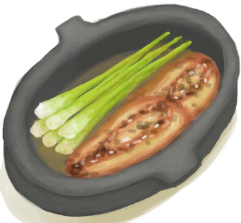
[Island Chicken](IslandChicken.md)](IslandChicken.md)</td><td  style="text-align:left;vertical-align:top;"  >Eat</td><td  style="text-align:left;vertical-align:top;"  >15</td></tr><tr ><td  style="text-align:left;vertical-align:top;"  >[

[Jungle Salad](JungleSalad.md)](JungleSalad.md)</td><td  style="text-align:left;vertical-align:top;"  >Eat</td><td  style="text-align:left;vertical-align:top;"  >15</td></tr><tr ><td  style="text-align:left;vertical-align:top;"  >[

[Boar Carcass](BoarCarcass.md)](BoarCarcass.md)</td><td  style="text-align:left;vertical-align:top;"  >Skin ** With：**[Obsidian Knife](KnifeObsidian.md)</td><td  style="text-align:left;vertical-align:top;"  >15</td></tr><tr ><td  style="text-align:left;vertical-align:top;"  >[

[Boar Carcass](BoarCarcass.md)](BoarCarcass.md)</td><td  style="text-align:left;vertical-align:top;"  >Skin ** With：**[“Cutter”](tag_Cutter.md)</td><td  style="text-align:left;vertical-align:top;"  >15</td></tr><tr ><td  style="text-align:left;vertical-align:top;"  >[

[Piglet Carcass](BoarCarcassPiglet.md)](BoarCarcassPiglet.md)</td><td  style="text-align:left;vertical-align:top;"  >Skin ** With：**[Obsidian Knife](KnifeObsidian.md)</td><td  style="text-align:left;vertical-align:top;"  >15</td></tr><tr ><td  style="text-align:left;vertical-align:top;"  >[

[Piglet Carcass](BoarCarcassPiglet.md)](BoarCarcassPiglet.md)</td><td  style="text-align:left;vertical-align:top;"  >Skin ** With：**[“Cutter”](tag_Cutter.md)</td><td  style="text-align:left;vertical-align:top;"  >15</td></tr><tr ><td  style="text-align:left;vertical-align:top;"  >[

[Skinned Boar](BoarSkinned.md)](BoarSkinned.md)</td><td  style="text-align:left;vertical-align:top;"  >Butcher ** With：**[Obsidian Knife](KnifeObsidian.md)</td><td  style="text-align:left;vertical-align:top;"  >15</td></tr><tr ><td  style="text-align:left;vertical-align:top;"  >[

[Skinned Boar](BoarSkinned.md)](BoarSkinned.md)</td><td  style="text-align:left;vertical-align:top;"  >Butcher ** With：**[“Cutter”](tag_Cutter.md)</td><td  style="text-align:left;vertical-align:top;"  >15</td></tr><tr ><td  style="text-align:left;vertical-align:top;"  >[

[Skinned Piglet](BoarSkinnedPiglet.md)](BoarSkinnedPiglet.md)</td><td  style="text-align:left;vertical-align:top;"  >Butcher ** With：**[Obsidian Knife](KnifeObsidian.md)</td><td  style="text-align:left;vertical-align:top;"  >15</td></tr><tr ><td  style="text-align:left;vertical-align:top;"  >[

[Skinned Piglet](BoarSkinnedPiglet.md)](BoarSkinnedPiglet.md)</td><td  style="text-align:left;vertical-align:top;"  >Butcher ** With：**[“Cutter”](tag_Cutter.md)</td><td  style="text-align:left;vertical-align:top;"  >15</td></tr><tr ><td  style="text-align:left;vertical-align:top;"  >[

[Goat Carcass](GoatCarcassFemale.md)](GoatCarcassFemale.md)</td><td  style="text-align:left;vertical-align:top;"  >Skin ** With：**[Obsidian Knife](KnifeObsidian.md)</td><td  style="text-align:left;vertical-align:top;"  >15</td></tr><tr ><td  style="text-align:left;vertical-align:top;"  >[

[Goat Carcass](GoatCarcassFemale.md)](GoatCarcassFemale.md)</td><td  style="text-align:left;vertical-align:top;"  >Skin ** With：**[“Cutter”](tag_Cutter.md)</td><td  style="text-align:left;vertical-align:top;"  >15</td></tr><tr ><td  style="text-align:left;vertical-align:top;"  >[

[Juvenile Goat Carcass](GoatCarcassKid.md)](GoatCarcassKid.md)</td><td  style="text-align:left;vertical-align:top;"  >Skin ** With：**[Obsidian Knife](KnifeObsidian.md)</td><td  style="text-align:left;vertical-align:top;"  >15</td></tr><tr ><td  style="text-align:left;vertical-align:top;"  >[

[Juvenile Goat Carcass](GoatCarcassKid.md)](GoatCarcassKid.md)</td><td  style="text-align:left;vertical-align:top;"  >Skin ** With：**[“Cutter”](tag_Cutter.md)</td><td  style="text-align:left;vertical-align:top;"  >15</td></tr><tr ><td  style="text-align:left;vertical-align:top;"  >[

[Goat Carcass](GoatCarcassMale.md)](GoatCarcassMale.md)</td><td  style="text-align:left;vertical-align:top;"  >Skin ** With：**[Obsidian Knife](KnifeObsidian.md)</td><td  style="text-align:left;vertical-align:top;"  >15</td></tr><tr ><td  style="text-align:left;vertical-align:top;"  >[

[Goat Carcass](GoatCarcassMale.md)](GoatCarcassMale.md)</td><td  style="text-align:left;vertical-align:top;"  >Skin ** With：**[“Cutter”](tag_Cutter.md)</td><td  style="text-align:left;vertical-align:top;"  >15</td></tr><tr ><td  style="text-align:left;vertical-align:top;"  >[

[Skinned Goat](GoatSkinned.md)](GoatSkinned.md)</td><td  style="text-align:left;vertical-align:top;"  >Butcher ** With：**[Obsidian Knife](KnifeObsidian.md)</td><td  style="text-align:left;vertical-align:top;"  >15</td></tr><tr ><td  style="text-align:left;vertical-align:top;"  >[

[Skinned Goat](GoatSkinned.md)](GoatSkinned.md)</td><td  style="text-align:left;vertical-align:top;"  >Butcher ** With：**[“Cutter”](tag_Cutter.md)</td><td  style="text-align:left;vertical-align:top;"  >15</td></tr><tr ><td  style="text-align:left;vertical-align:top;"  >[

[Skinned Kid](GoatSkinnedKid.md)](GoatSkinnedKid.md)</td><td  style="text-align:left;vertical-align:top;"  >Butcher ** With：**[Obsidian Knife](KnifeObsidian.md)</td><td  style="text-align:left;vertical-align:top;"  >15</td></tr><tr ><td  style="text-align:left;vertical-align:top;"  >[

[Skinned Kid](GoatSkinnedKid.md)](GoatSkinnedKid.md)</td><td  style="text-align:left;vertical-align:top;"  >Butcher ** With：**[“Cutter”](tag_Cutter.md)</td><td  style="text-align:left;vertical-align:top;"  >15</td></tr><tr ><td  style="text-align:left;vertical-align:top;"  >[

[Lizard Carcass](MonitorCarcass.md)](MonitorCarcass.md)</td><td  style="text-align:left;vertical-align:top;"  >Skin ** With：**[Obsidian Knife](KnifeObsidian.md)</td><td  style="text-align:left;vertical-align:top;"  >15</td></tr><tr ><td  style="text-align:left;vertical-align:top;"  >[

[Lizard Carcass](MonitorCarcass.md)](MonitorCarcass.md)</td><td  style="text-align:left;vertical-align:top;"  >Skin ** With：**[“Cutter”](tag_Cutter.md)</td><td  style="text-align:left;vertical-align:top;"  >15</td></tr><tr ><td  style="text-align:left;vertical-align:top;"  >[

[Skinned Lizard](MonitorSkinned.md)](MonitorSkinned.md)</td><td  style="text-align:left;vertical-align:top;"  >Butcher ** With：**[Obsidian Knife](KnifeObsidian.md)</td><td  style="text-align:left;vertical-align:top;"  >15</td></tr><tr ><td  style="text-align:left;vertical-align:top;"  >[

[Skinned Lizard](MonitorSkinned.md)](MonitorSkinned.md)</td><td  style="text-align:left;vertical-align:top;"  >Butcher ** With：**[“Cutter”](tag_Cutter.md)</td><td  style="text-align:left;vertical-align:top;"  >15</td></tr><tr ><td  style="text-align:left;vertical-align:top;"  >[

[Wild Yam](YamPlant.md)](YamPlant.md)</td><td  style="text-align:left;vertical-align:top;"  >Dig Up Tubers ** With：**[“Shovel”](tag_Shovel.md)</td><td  style="text-align:left;vertical-align:top;"  >15</td></tr><tr ><td  style="text-align:left;vertical-align:top;"  >[

[Empty Crop Plot(Empty)](CropPlotEmpty.md)](CropPlotEmpty.md)</td><td  style="text-align:left;vertical-align:top;"  >Plant Cinchona ** With：**[Cinchona Bark](BarkCinchona.md)</td><td  style="text-align:left;vertical-align:top;"  >10</td></tr><tr ><td  style="text-align:left;vertical-align:top;"  >[

[Empty Crop Plot(Empty)](CropPlotEmpty.md)](CropPlotEmpty.md)</td><td  style="text-align:left;vertical-align:top;"  >Plant WIld Jujube ** With：**[Jujube Fruits](JujubeFruits.md)</td><td  style="text-align:left;vertical-align:top;"  >10</td></tr><tr ><td  style="text-align:left;vertical-align:top;"  >[

[Empty Crop Plot(Empty)](CropPlotEmpty.md)](CropPlotEmpty.md)</td><td  style="text-align:left;vertical-align:top;"  >Plant Rice ** With：**[Rice Grain](RiceGrains.md)</td><td  style="text-align:left;vertical-align:top;"  >10</td></tr><tr ><td  style="text-align:left;vertical-align:top;"  >[

[Empty Crop Plot(Empty)](CropPlotEmpty.md)](CropPlotEmpty.md)</td><td  style="text-align:left;vertical-align:top;"  >Plant Coffee ** With：**[Coffee Beans](CoffeeBeans.md)</td><td  style="text-align:left;vertical-align:top;"  >10</td></tr><tr ><td  style="text-align:left;vertical-align:top;"  >[

[Empty Crop Plot(Empty)](CropPlotEmpty.md)](CropPlotEmpty.md)</td><td  style="text-align:left;vertical-align:top;"  >Plant Lemongrass ** With：**[Lemongrass](LemongrassStalks.md)</td><td  style="text-align:left;vertical-align:top;"  >10</td></tr><tr ><td  style="text-align:left;vertical-align:top;"  >[

[Empty Crop Plot(Empty)](CropPlotEmpty.md)](CropPlotEmpty.md)</td><td  style="text-align:left;vertical-align:top;"  >Plant Snake Grass ** With：**[Snakegrass Seeds](SnakegrassSeeds.md)</td><td  style="text-align:left;vertical-align:top;"  >10</td></tr><tr ><td  style="text-align:left;vertical-align:top;"  >[

[Empty Crop Plot(Empty)](CropPlotEmpty.md)](CropPlotEmpty.md)</td><td  style="text-align:left;vertical-align:top;"  >Plant Aloe Vera ** With：**[Aloe Vera Leaf](AloeVeraLeaf.md)</td><td  style="text-align:left;vertical-align:top;"  >10</td></tr><tr ><td  style="text-align:left;vertical-align:top;"  >[

[Empty Crop Plot(Empty)](CropPlotEmpty.md)](CropPlotEmpty.md)</td><td  style="text-align:left;vertical-align:top;"  >Plant Kava ** With：**[Kava Root](KavaRoot.md)</td><td  style="text-align:left;vertical-align:top;"  >10</td></tr><tr ><td  style="text-align:left;vertical-align:top;"  >[

[Empty Crop Plot(Empty)](CropPlotEmpty.md)](CropPlotEmpty.md)</td><td  style="text-align:left;vertical-align:top;"  >Plant Spider Lily ** With：**[Spider Lily Leaves](SpiderLilyLeaves.md)</td><td  style="text-align:left;vertical-align:top;"  >10</td></tr><tr ><td  style="text-align:left;vertical-align:top;"  >[

[Empty Crop Plot(Empty)](CropPlotEmpty.md)](CropPlotEmpty.md)</td><td  style="text-align:left;vertical-align:top;"  >Plant Ginger ** With：**[Ginger](Ginger.md)</td><td  style="text-align:left;vertical-align:top;"  >10</td></tr><tr ><td  style="text-align:left;vertical-align:top;"  >[

[Empty Crop Plot(Empty)](CropPlotEmpty.md)](CropPlotEmpty.md)</td><td  style="text-align:left;vertical-align:top;"  >Plant Yam ** With：**[Yam](Yam.md)</td><td  style="text-align:left;vertical-align:top;"  >10</td></tr><tr ><td  style="text-align:left;vertical-align:top;"  >[

[Empty Crop Plot(Empty)](CropPlotEmpty.md)](CropPlotEmpty.md)</td><td  style="text-align:left;vertical-align:top;"  >Plant Weevil Lily Plant ** With：**[Weevil Lily Leaves](WeevilLilyLeaves.md)</td><td  style="text-align:left;vertical-align:top;"  >10</td></tr><tr ><td  style="text-align:left;vertical-align:top;"  >[

[Empty Crop Plot(Empty)](CropPlotEmpty.md)](CropPlotEmpty.md)</td><td  style="text-align:left;vertical-align:top;"  >Plant Chilies ** With：**[Chillies](Chilies.md)</td><td  style="text-align:left;vertical-align:top;"  >10</td></tr><tr ><td  style="text-align:left;vertical-align:top;"  >[

[Empty Crop Plot(Empty)](CropPlotEmpty.md)](CropPlotEmpty.md)</td><td  style="text-align:left;vertical-align:top;"  >Plant Jasmine ** With：**[Jasmine Flowers](JasmineFlowers.md)</td><td  style="text-align:left;vertical-align:top;"  >10</td></tr><tr ><td  style="text-align:left;vertical-align:top;"  >[

[Empty Crop Plot(Empty)](CropPlotEmpty.md)](CropPlotEmpty.md)</td><td  style="text-align:left;vertical-align:top;"  >Plant China Rose ** With：**[China Rose](ChinaRoseFlowers.md)</td><td  style="text-align:left;vertical-align:top;"  >10</td></tr><tr ><td  style="text-align:left;vertical-align:top;"  >[

[Empty Crop Plot(Empty)](CropPlotEmpty.md)](CropPlotEmpty.md)</td><td  style="text-align:left;vertical-align:top;"  >Plant Tropical Almonds ** With：**[Tropical Almonds](TropicalAlmonds.md)</td><td  style="text-align:left;vertical-align:top;"  >10</td></tr><tr ><td  style="text-align:left;vertical-align:top;"  >[

[Empty Crop Plot(Empty)](CropPlotEmpty.md)](CropPlotEmpty.md)</td><td  style="text-align:left;vertical-align:top;"  >Plant Banana Tree ** With：**[Banana](Banana.md)</td><td  style="text-align:left;vertical-align:top;"  >10</td></tr><tr ><td  style="text-align:left;vertical-align:top;"  >[

[Empty Crop Plot(Empty)](CropPlotEmpty.md)](CropPlotEmpty.md)</td><td  style="text-align:left;vertical-align:top;"  >Plant Nipa Palm ** With：**[Nipa Seeds](NipaSeeds.md)</td><td  style="text-align:left;vertical-align:top;"  >10</td></tr><tr ><td  style="text-align:left;vertical-align:top;"  >[

[Empty Crop Plot(Empty)](CropPlotEmpty.md)](CropPlotEmpty.md)</td><td  style="text-align:left;vertical-align:top;"  >Plant Sago Palm ** With：**[Sago Seeds](SagoSeeds.md)</td><td  style="text-align:left;vertical-align:top;"  >10</td></tr><tr ><td  style="text-align:left;vertical-align:top;"  >[

[Empty Crop Plot(Empty)](CropPlotEmpty.md)](CropPlotEmpty.md)</td><td  style="text-align:left;vertical-align:top;"  >Plant Palm Tree ** With：**[Coconut](Coconut.md) , [Husked Coconut](CoconutHusked.md)</td><td  style="text-align:left;vertical-align:top;"  >10</td></tr><tr ><td  style="text-align:left;vertical-align:top;"  >[

[Empty Crop Plot(Empty)](CropPlotEmpty.md)](CropPlotEmpty.md)</td><td  style="text-align:left;vertical-align:top;"  >Plant Mango Tree ** With：**[Mango](Mango.md)</td><td  style="text-align:left;vertical-align:top;"  >10</td></tr><tr ><td  style="text-align:left;vertical-align:top;"  >[

[Empty Crop Plot(Empty)](CropPlotEmpty.md)](CropPlotEmpty.md)</td><td  style="text-align:left;vertical-align:top;"  >Plant Palm Bush ** With：**[Palm Bush Seeds](PalmBushSeeds.md)</td><td  style="text-align:left;vertical-align:top;"  >10</td></tr><tr ><td  style="text-align:left;vertical-align:top;"  >[

[Empty Mushroom Bed(Empty)](MushroomBedEmpty.md)](MushroomBedEmpty.md)</td><td  style="text-align:left;vertical-align:top;"  >Plant Puffballs ** With：**[Puffballs](Puffballs.md)</td><td  style="text-align:left;vertical-align:top;"  >10</td></tr><tr ><td  style="text-align:left;vertical-align:top;"  >[

[Empty Mushroom Bed(Empty)](MushroomBedEmpty.md)](MushroomBedEmpty.md)</td><td  style="text-align:left;vertical-align:top;"  >Plant Magic Mushrooms ** With：**[Magic Mushrooms](MagicMushrooms.md)</td><td  style="text-align:left;vertical-align:top;"  >10</td></tr><tr ><td  style="text-align:left;vertical-align:top;"  >[

[Empty Mushroom Bed(Empty)](MushroomBedEmpty.md)](MushroomBedEmpty.md)</td><td  style="text-align:left;vertical-align:top;"  >Plant Assorted Mushrooms ** With：**[Assorted Mushrooms](AssortedMushrooms.md)</td><td  style="text-align:left;vertical-align:top;"  >10</td></tr><tr ><td  style="text-align:left;vertical-align:top;"  >[

[Dirt Pile](DirtPile.md)](DirtPile.md)</td><td  style="text-align:left;vertical-align:top;"  >Make Mud</td><td  style="text-align:left;vertical-align:top;"  >10</td></tr><tr ><td  style="text-align:left;vertical-align:top;"  >[

[Dirt Pile](DirtPile.md)](DirtPile.md)</td><td  style="text-align:left;vertical-align:top;"  >Make Mud ** With：**[“Water”](tag_WaterAny.md)</td><td  style="text-align:left;vertical-align:top;"  >10</td></tr><tr ><td  style="text-align:left;vertical-align:top;"  >[

[Dirt Pile](DirtPile.md)](DirtPile.md)</td><td  style="text-align:left;vertical-align:top;"  >Crush dirt ** With：**[“Hammer”](tag_Hammer.md)</td><td  style="text-align:left;vertical-align:top;"  >10</td></tr><tr ><td  style="text-align:left;vertical-align:top;"  >[

[Mud Pile](MudPile.md)](MudPile.md)</td><td  style="text-align:left;vertical-align:top;"  >Make Clay ** With：**[“Hammer”](tag_Hammer.md)</td><td  style="text-align:left;vertical-align:top;"  >10</td></tr><tr ><td  style="text-align:left;vertical-align:top;"  >[

[It Escaped!(Event)](Event_MacaqueFightFailure.md)](Event_MacaqueFightFailure.md)</td><td  style="text-align:left;vertical-align:top;"  >Continue</td><td  style="text-align:left;vertical-align:top;"  >10</td></tr><tr ><td  style="text-align:left;vertical-align:top;"  >[

[It Escaped!(Event)](Event_MacaqueUndeadFightFailure.md)](Event_MacaqueUndeadFightFailure.md)(未实装)</td><td  style="text-align:left;vertical-align:top;"  >Continue</td><td  style="text-align:left;vertical-align:top;"  >10</td></tr><tr ><td  style="text-align:left;vertical-align:top;"  >[

[Bonefish](Bonefish.md)](Bonefish.md)</td><td  style="text-align:left;vertical-align:top;"  >Cut Open ** With：**[“Cutter”](tag_Cutter.md)</td><td  style="text-align:left;vertical-align:top;"  >10</td></tr><tr ><td  style="text-align:left;vertical-align:top;"  >[

[Egg Fried Rice](EggFriedRice.md)](EggFriedRice.md)</td><td  style="text-align:left;vertical-align:top;"  >Eat</td><td  style="text-align:left;vertical-align:top;"  >10</td></tr><tr ><td  style="text-align:left;vertical-align:top;"  >[

[Lizard Fry](LizardFry.md)](LizardFry.md)</td><td  style="text-align:left;vertical-align:top;"  >Eat</td><td  style="text-align:left;vertical-align:top;"  >10</td></tr><tr ><td  style="text-align:left;vertical-align:top;"  >[

[Seafood Cup](SeafoodCup.md)](SeafoodCup.md)</td><td  style="text-align:left;vertical-align:top;"  >Eat</td><td  style="text-align:left;vertical-align:top;"  >10</td></tr><tr ><td  style="text-align:left;vertical-align:top;"  >[

[Yam Curry](YamCurry.md)](YamCurry.md)</td><td  style="text-align:left;vertical-align:top;"  >Eat</td><td  style="text-align:left;vertical-align:top;"  >10</td></tr><tr ><td  style="text-align:left;vertical-align:top;"  >[

[King Threadfin](KingThreadfin.md)](KingThreadfin.md)</td><td  style="text-align:left;vertical-align:top;"  >Cut Meat ** With：**[“Cutter”](tag_Cutter.md)</td><td  style="text-align:left;vertical-align:top;"  >10</td></tr><tr ><td  style="text-align:left;vertical-align:top;"  >[

[Sea Hound Carcass](SeahoundCarcass.md)](SeahoundCarcass.md)</td><td  style="text-align:left;vertical-align:top;"  >Cut Meat ** With：**[Obsidian Knife](KnifeObsidian.md)</td><td  style="text-align:left;vertical-align:top;"  >10</td></tr><tr ><td  style="text-align:left;vertical-align:top;"  >[

[Sea Hound Carcass](SeahoundCarcass.md)](SeahoundCarcass.md)</td><td  style="text-align:left;vertical-align:top;"  >Cut Meat ** With：**[“Cutter”](tag_Cutter.md)</td><td  style="text-align:left;vertical-align:top;"  >10</td></tr><tr ><td  style="text-align:left;vertical-align:top;"  >[

[Shark Carcass](SharkCarcass.md)](SharkCarcass.md)</td><td  style="text-align:left;vertical-align:top;"  >Cut Meat ** With：**[Obsidian Knife](KnifeObsidian.md)</td><td  style="text-align:left;vertical-align:top;"  >10</td></tr><tr ><td  style="text-align:left;vertical-align:top;"  >[

[Shark Carcass](SharkCarcass.md)](SharkCarcass.md)</td><td  style="text-align:left;vertical-align:top;"  >Cut Meat ** With：**[“Cutter”](tag_Cutter.md)</td><td  style="text-align:left;vertical-align:top;"  >10</td></tr><tr ><td  style="text-align:left;vertical-align:top;"  >[

[Gastric Pellet](GastricPellet.md)](GastricPellet.md)</td><td  style="text-align:left;vertical-align:top;"  >Harvest</td><td  style="text-align:left;vertical-align:top;"  >10 ~ 25</td></tr><tr ><td  style="text-align:left;vertical-align:top;"  >[

[Mud Deposit](MudDeposit.md)](MudDeposit.md)</td><td  style="text-align:left;vertical-align:top;"  >Dig up Mud</td><td  style="text-align:left;vertical-align:top;"  >10</td></tr><tr ><td  style="text-align:left;vertical-align:top;"  >[

[Dry Puddle(Wetlands)](Puddle.md)](Puddle.md)</td><td  style="text-align:left;vertical-align:top;"  >Dig up Mud</td><td  style="text-align:left;vertical-align:top;"  >10</td></tr><tr ><td  style="text-align:left;vertical-align:top;"  >[

[Dry Puddle(Wetlands)](Puddle.md)](Puddle.md)</td><td  style="text-align:left;vertical-align:top;"  >Dig up Dirt</td><td  style="text-align:left;vertical-align:top;"  >10</td></tr><tr ><td  style="text-align:left;vertical-align:top;"  >[

[Coconut Meat](CoconutMeat.md)](CoconutMeat.md)</td><td  style="text-align:left;vertical-align:top;"  >Eat</td><td  style="text-align:left;vertical-align:top;"  >6</td></tr><tr ><td  style="text-align:left;vertical-align:top;"  >[

[Egg](Egg.md)](Egg.md)</td><td  style="text-align:left;vertical-align:top;"  >Eat</td><td  style="text-align:left;vertical-align:top;"  >6</td></tr><tr ><td  style="text-align:left;vertical-align:top;"  >[

[Boiled Egg](EggBoiled.md)](EggBoiled.md)(未实装)</td><td  style="text-align:left;vertical-align:top;"  >Eat</td><td  style="text-align:left;vertical-align:top;"  >6</td></tr><tr ><td  style="text-align:left;vertical-align:top;"  >[
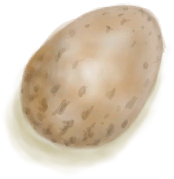
[Roasted Egg](EggCooked.md)](EggCooked.md)</td><td  style="text-align:left;vertical-align:top;"  >Eat</td><td  style="text-align:left;vertical-align:top;"  >6</td></tr><tr ><td  style="text-align:left;vertical-align:top;"  >[

[Fertilized Egg](EggPartridgeFertilized.md)](EggPartridgeFertilized.md)</td><td  style="text-align:left;vertical-align:top;"  >Eat</td><td  style="text-align:left;vertical-align:top;"  >6</td></tr><tr ><td  style="text-align:left;vertical-align:top;"  >[

[Nipa Seeds](NipaSeeds.md)](NipaSeeds.md)</td><td  style="text-align:left;vertical-align:top;"  >Eat</td><td  style="text-align:left;vertical-align:top;"  >6</td></tr><tr ><td  style="text-align:left;vertical-align:top;"  >[

[Shaft](ShaftCrystalChamberToFloodedChamber.md)](ShaftCrystalChamberToFloodedChamber.md)</td><td  style="text-align:left;vertical-align:top;"  >Climb Down</td><td  style="text-align:left;vertical-align:top;"  >6</td></tr><tr ><td  style="text-align:left;vertical-align:top;"  >[

[Shaft](ShaftFloodedChamberToCrystalChamber.md)](ShaftFloodedChamberToCrystalChamber.md)</td><td  style="text-align:left;vertical-align:top;"  >Climb Up</td><td  style="text-align:left;vertical-align:top;"  >6</td></tr><tr ><td  style="text-align:left;vertical-align:top;"  >[

[Shaft](ShaftFloodedChamberToCrystalChamber.md)](ShaftFloodedChamberToCrystalChamber.md)</td><td  style="text-align:left;vertical-align:top;"  >Train Climbing</td><td  style="text-align:left;vertical-align:top;"  >6</td></tr><tr ><td  style="text-align:left;vertical-align:top;"  >[

[Shaft(High Chamber)](ShaftHighChamberToMidChamber.md)](ShaftHighChamberToMidChamber.md)</td><td  style="text-align:left;vertical-align:top;"  >Climb Down</td><td  style="text-align:left;vertical-align:top;"  >6</td></tr><tr ><td  style="text-align:left;vertical-align:top;"  >[

[Shaft](ShaftLowChamberToMidChamber.md)](ShaftLowChamberToMidChamber.md)</td><td  style="text-align:left;vertical-align:top;"  >Climb Up</td><td  style="text-align:left;vertical-align:top;"  >6</td></tr><tr ><td  style="text-align:left;vertical-align:top;"  >[

[Shaft](ShaftLowChamberToMidChamber.md)](ShaftLowChamberToMidChamber.md)</td><td  style="text-align:left;vertical-align:top;"  >Train Climbing</td><td  style="text-align:left;vertical-align:top;"  >6</td></tr><tr ><td  style="text-align:left;vertical-align:top;"  >[

[Shaft](ShaftMidChamberToHighChamber.md)](ShaftMidChamberToHighChamber.md)</td><td  style="text-align:left;vertical-align:top;"  >Climb Up</td><td  style="text-align:left;vertical-align:top;"  >6</td></tr><tr ><td  style="text-align:left;vertical-align:top;"  >[

[Shaft(High Chamber)](ShaftMidChamberToLowChamber.md)](ShaftMidChamberToLowChamber.md)</td><td  style="text-align:left;vertical-align:top;"  >Climb Down</td><td  style="text-align:left;vertical-align:top;"  >6</td></tr><tr ><td  style="text-align:left;vertical-align:top;"  >[
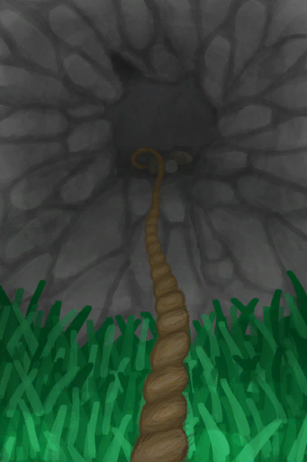
[Hole](HighlandHoleEntrance.md)](HighlandHoleEntrance.md)</td><td  style="text-align:left;vertical-align:top;"  >Climb down</td><td  style="text-align:left;vertical-align:top;"  >6</td></tr><tr ><td  style="text-align:left;vertical-align:top;"  >[

[Exit](HighlandHoleExit.md)](HighlandHoleExit.md)</td><td  style="text-align:left;vertical-align:top;"  >Climb Up</td><td  style="text-align:left;vertical-align:top;"  >6</td></tr><tr ><td  style="text-align:left;vertical-align:top;"  >[

[To Jungle Highlands(Secret Cove)](Path_CoveToJungleHighlands.md)](Path_CoveToJungleHighlands.md)</td><td  style="text-align:left;vertical-align:top;"  >Climb Up</td><td  style="text-align:left;vertical-align:top;"  >6</td></tr><tr ><td  style="text-align:left;vertical-align:top;"  >[

[To Jungle Highlands(Secret Cove)](Path_CoveToJungleHighlands.md)](Path_CoveToJungleHighlands.md)</td><td  style="text-align:left;vertical-align:top;"  >Train Climbing</td><td  style="text-align:left;vertical-align:top;"  >6</td></tr><tr ><td  style="text-align:left;vertical-align:top;"  >[

[To Secret Cove(Jungle Highlands)](Path_JungleHighlandsToCove.md)](Path_JungleHighlandsToCove.md)</td><td  style="text-align:left;vertical-align:top;"  >Climb Down</td><td  style="text-align:left;vertical-align:top;"  >6</td></tr><tr ><td  style="text-align:left;vertical-align:top;"  >[

[To Valley Cliffs](Path_JungleHighlandsToValley.md)](Path_JungleHighlandsToValley.md)(未实装)</td><td  style="text-align:left;vertical-align:top;"  >Climb Down</td><td  style="text-align:left;vertical-align:top;"  >6</td></tr><tr ><td  style="text-align:left;vertical-align:top;"  >[

[To Wetlands Cliff](Path_JungleHighlandsToWetlands.md)](Path_JungleHighlandsToWetlands.md)</td><td  style="text-align:left;vertical-align:top;"  >Climb</td><td  style="text-align:left;vertical-align:top;"  >6</td></tr><tr ><td  style="text-align:left;vertical-align:top;"  >[

[To Jungle Highlands](Path_ValleyToJungleHighlands.md)](Path_ValleyToJungleHighlands.md)(未实装)</td><td  style="text-align:left;vertical-align:top;"  >Climb Up</td><td  style="text-align:left;vertical-align:top;"  >6</td></tr><tr ><td  style="text-align:left;vertical-align:top;"  >[

[To Jungle Highlands](Path_ValleyToJungleHighlands.md)](Path_ValleyToJungleHighlands.md)(未实装)</td><td  style="text-align:left;vertical-align:top;"  >Train Climbing</td><td  style="text-align:left;vertical-align:top;"  >6</td></tr><tr ><td  style="text-align:left;vertical-align:top;"  >[

[To Jungle Highlands(Wetlands)](Path_WetlandsToJungleHighlands.md)](Path_WetlandsToJungleHighlands.md)</td><td  style="text-align:left;vertical-align:top;"  >Climb Up</td><td  style="text-align:left;vertical-align:top;"  >6</td></tr><tr ><td  style="text-align:left;vertical-align:top;"  >[

[To Jungle Highlands(Wetlands)](Path_WetlandsToJungleHighlands.md)](Path_WetlandsToJungleHighlands.md)</td><td  style="text-align:left;vertical-align:top;"  >Train Climbing</td><td  style="text-align:left;vertical-align:top;"  >6</td></tr><tr ><td  style="text-align:left;vertical-align:top;"  >[

[Cleared Palm Tree](PalmTreeCleared.md)](PalmTreeCleared.md)</td><td  style="text-align:left;vertical-align:top;"  >Train Climbing</td><td  style="text-align:left;vertical-align:top;"  >6</td></tr><tr ><td  style="text-align:left;vertical-align:top;"  >[

[Palm Tree](PalmTreeNew.md)](PalmTreeNew.md)</td><td  style="text-align:left;vertical-align:top;"  >Climb</td><td  style="text-align:left;vertical-align:top;"  >6</td></tr><tr ><td  style="text-align:left;vertical-align:top;"  >[

[Palm Tree](PalmTreeNew.md)](PalmTreeNew.md)</td><td  style="text-align:left;vertical-align:top;"  >Train Climbing</td><td  style="text-align:left;vertical-align:top;"  >6</td></tr><tr ><td  style="text-align:left;vertical-align:top;"  >[

[Palm Tree](PalmTreeNewMultiEventOld.md)](PalmTreeNewMultiEventOld.md)</td><td  style="text-align:left;vertical-align:top;"  >Climb</td><td  style="text-align:left;vertical-align:top;"  >6</td></tr><tr ><td  style="text-align:left;vertical-align:top;"  >[

[Palm Tree](PalmTreeNewMultiEventOld.md)](PalmTreeNewMultiEventOld.md)</td><td  style="text-align:left;vertical-align:top;"  >Train Climbing</td><td  style="text-align:left;vertical-align:top;"  >6</td></tr><tr ><td  style="text-align:left;vertical-align:top;"  >[

[Palm Tree](PalmTreeOld.md)](PalmTreeOld.md)(未实装)</td><td  style="text-align:left;vertical-align:top;"  >Climb</td><td  style="text-align:left;vertical-align:top;"  >6</td></tr><tr ><td  style="text-align:left;vertical-align:top;"  >[

[Palm Tree](PalmTreeOld.md)](PalmTreeOld.md)(未实装)</td><td  style="text-align:left;vertical-align:top;"  >Train Climbing</td><td  style="text-align:left;vertical-align:top;"  >6</td></tr><tr ><td  style="text-align:left;vertical-align:top;"  >[

[Sap Station](PalmTreeSapStation.md)](PalmTreeSapStation.md)(未实装)</td><td  style="text-align:left;vertical-align:top;"  >Climb</td><td  style="text-align:left;vertical-align:top;"  >6</td></tr><tr ><td  style="text-align:left;vertical-align:top;"  >[

[Sap Station](PalmTreeSapStation.md)](PalmTreeSapStation.md)(未实装)</td><td  style="text-align:left;vertical-align:top;"  >Train Climbing</td><td  style="text-align:left;vertical-align:top;"  >6</td></tr><tr ><td  style="text-align:left;vertical-align:top;"  >[

[Empty Sap Station(Empty)](PalmTreeSapStationEmpty.md)](PalmTreeSapStationEmpty.md)(未实装)</td><td  style="text-align:left;vertical-align:top;"  >Climb</td><td  style="text-align:left;vertical-align:top;"  >6</td></tr><tr ><td  style="text-align:left;vertical-align:top;"  >[

[Empty Sap Station(Empty)](PalmTreeSapStationEmpty.md)](PalmTreeSapStationEmpty.md)(未实装)</td><td  style="text-align:left;vertical-align:top;"  >Train Climbing</td><td  style="text-align:left;vertical-align:top;"  >6</td></tr><tr ><td  style="text-align:left;vertical-align:top;"  >[

[Palm Tree](PalmTree_IH.md)](PalmTree_IH.md)(未实装)</td><td  style="text-align:left;vertical-align:top;"  >Climb</td><td  style="text-align:left;vertical-align:top;"  >6</td></tr><tr ><td  style="text-align:left;vertical-align:top;"  >[

[Palm Tree](PalmTree_Unique.md)](PalmTree_Unique.md)(未实装)</td><td  style="text-align:left;vertical-align:top;"  >Climb fo Coconuts</td><td  style="text-align:left;vertical-align:top;"  >6</td></tr><tr ><td  style="text-align:left;vertical-align:top;"  >[

[Palm Tree](PalmTree_Unique.md)](PalmTree_Unique.md)(未实装)</td><td  style="text-align:left;vertical-align:top;"  >Climb for Coconuts</td><td  style="text-align:left;vertical-align:top;"  >6</td></tr><tr ><td  style="text-align:left;vertical-align:top;"  >[
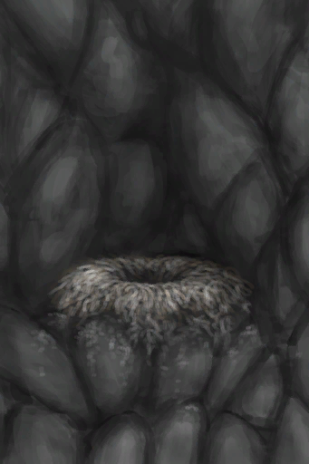
[Seagull Nest](SeagullNest.md)](SeagullNest.md)</td><td  style="text-align:left;vertical-align:top;"  >Climb</td><td  style="text-align:left;vertical-align:top;"  >6</td></tr><tr ><td  style="text-align:left;vertical-align:top;"  >[

[Alien Nodule](AlienNodule.md)](AlienNodule.md)</td><td  style="text-align:left;vertical-align:top;"  >Eat</td><td  style="text-align:left;vertical-align:top;"  >5</td></tr><tr ><td  style="text-align:left;vertical-align:top;"  >[

[Bird Meat](BirdMeat.md)](BirdMeat.md)</td><td  style="text-align:left;vertical-align:top;"  >Eat</td><td  style="text-align:left;vertical-align:top;"  >5</td></tr><tr ><td  style="text-align:left;vertical-align:top;"  >[

[Cooked Bird Meat](BirdMeatCooked.md)](BirdMeatCooked.md)</td><td  style="text-align:left;vertical-align:top;"  >Eat</td><td  style="text-align:left;vertical-align:top;"  >5</td></tr><tr ><td  style="text-align:left;vertical-align:top;"  >[

[Smoked Bird Meat](BirdMeatSmoked.md)](BirdMeatSmoked.md)</td><td  style="text-align:left;vertical-align:top;"  >Eat</td><td  style="text-align:left;vertical-align:top;"  >5</td></tr><tr ><td  style="text-align:left;vertical-align:top;"  >[

[Boar Meat](BoarMeat.md)](BoarMeat.md)</td><td  style="text-align:left;vertical-align:top;"  >Eat</td><td  style="text-align:left;vertical-align:top;"  >5</td></tr><tr ><td  style="text-align:left;vertical-align:top;"  >[

[Cooked Boar Meat](BoarMeatCooked.md)](BoarMeatCooked.md)</td><td  style="text-align:left;vertical-align:top;"  >Eat</td><td  style="text-align:left;vertical-align:top;"  >5</td></tr><tr ><td  style="text-align:left;vertical-align:top;"  >[

[Dried Boar Meat](BoarMeatDried.md)](BoarMeatDried.md)</td><td  style="text-align:left;vertical-align:top;"  >Eat</td><td  style="text-align:left;vertical-align:top;"  >5</td></tr><tr ><td  style="text-align:left;vertical-align:top;"  >[

[Cured Boar Meat](BoarMeatSalted.md)](BoarMeatSalted.md)</td><td  style="text-align:left;vertical-align:top;"  >Eat</td><td  style="text-align:left;vertical-align:top;"  >5</td></tr><tr ><td  style="text-align:left;vertical-align:top;"  >[

[Drying Boar Meat](BoarMeatSaltedDrying.md)](BoarMeatSaltedDrying.md)</td><td  style="text-align:left;vertical-align:top;"  >Eat</td><td  style="text-align:left;vertical-align:top;"  >5</td></tr><tr ><td  style="text-align:left;vertical-align:top;"  >[

[Smoked Boar Meat](BoarMeatSmoked.md)](BoarMeatSmoked.md)</td><td  style="text-align:left;vertical-align:top;"  >Eat</td><td  style="text-align:left;vertical-align:top;"  >5</td></tr><tr ><td  style="text-align:left;vertical-align:top;"  >[

[Cooked Bonefish](BonefishCooked.md)](BonefishCooked.md)</td><td  style="text-align:left;vertical-align:top;"  >Eat Fish</td><td  style="text-align:left;vertical-align:top;"  >5</td></tr><tr ><td  style="text-align:left;vertical-align:top;"  >[

[Bonefish Meat](BonefishMeat.md)](BonefishMeat.md)</td><td  style="text-align:left;vertical-align:top;"  >Eat Fish</td><td  style="text-align:left;vertical-align:top;"  >5</td></tr><tr ><td  style="text-align:left;vertical-align:top;"  >[

[Smoked Bonefish](BonefishSmoked.md)](BonefishSmoked.md)</td><td  style="text-align:left;vertical-align:top;"  >Eat Fish</td><td  style="text-align:left;vertical-align:top;"  >5</td></tr><tr ><td  style="text-align:left;vertical-align:top;"  >[

[Candied Ginger](CandiedGinger.md)](CandiedGinger.md)</td><td  style="text-align:left;vertical-align:top;"  >Eat</td><td  style="text-align:left;vertical-align:top;"  >5</td></tr><tr ><td  style="text-align:left;vertical-align:top;"  >[

[Chicken Sandwich](ChickenSandwich.md)](ChickenSandwich.md)</td><td  style="text-align:left;vertical-align:top;"  >Eat</td><td  style="text-align:left;vertical-align:top;"  >5</td></tr><tr ><td  style="text-align:left;vertical-align:top;"  >[

[Chocolate](Chocolate.md)](Chocolate.md)</td><td  style="text-align:left;vertical-align:top;"  >Eat</td><td  style="text-align:left;vertical-align:top;"  >5</td></tr><tr ><td  style="text-align:left;vertical-align:top;"  >[

[Coconut Fish](CoconutFish.md)](CoconutFish.md)</td><td  style="text-align:left;vertical-align:top;"  >Eat</td><td  style="text-align:left;vertical-align:top;"  >5</td></tr><tr ><td  style="text-align:left;vertical-align:top;"  >[

[Fish N' Chips](FishNChips.md)](FishNChips.md)</td><td  style="text-align:left;vertical-align:top;"  >Eat</td><td  style="text-align:left;vertical-align:top;"  >5</td></tr><tr ><td  style="text-align:left;vertical-align:top;"  >[

[Fish Omelette](FishOmelette.md)](FishOmelette.md)</td><td  style="text-align:left;vertical-align:top;"  >Eat</td><td  style="text-align:left;vertical-align:top;"  >5</td></tr><tr ><td  style="text-align:left;vertical-align:top;"  >[

[Goat Stew](GoatStew.md)](GoatStew.md)</td><td  style="text-align:left;vertical-align:top;"  >Eat</td><td  style="text-align:left;vertical-align:top;"  >5</td></tr><tr ><td  style="text-align:left;vertical-align:top;"  >[

[Macaque Skewers](MacaqueSkewers.md)](MacaqueSkewers.md)</td><td  style="text-align:left;vertical-align:top;"  >Eat</td><td  style="text-align:left;vertical-align:top;"  >5</td></tr><tr ><td  style="text-align:left;vertical-align:top;"  >[
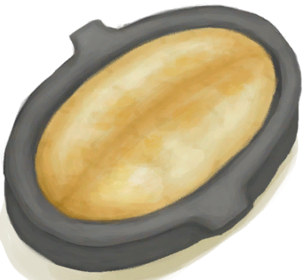
[Sago Cake](SagoCake.md)](SagoCake.md)</td><td  style="text-align:left;vertical-align:top;"  >Eat</td><td  style="text-align:left;vertical-align:top;"  >5</td></tr><tr ><td  style="text-align:left;vertical-align:top;"  >[

[Dried Fish](FishDried.md)](FishDried.md)</td><td  style="text-align:left;vertical-align:top;"  >Eat Fish</td><td  style="text-align:left;vertical-align:top;"  >5</td></tr><tr ><td  style="text-align:left;vertical-align:top;"  >[

[Salted Fish](FishSalted.md)](FishSalted.md)</td><td  style="text-align:left;vertical-align:top;"  >Eat Fish</td><td  style="text-align:left;vertical-align:top;"  >5</td></tr><tr ><td  style="text-align:left;vertical-align:top;"  >[

[Drying Salted Fish](FishSaltedDrying.md)](FishSaltedDrying.md)</td><td  style="text-align:left;vertical-align:top;"  >Eat Fish</td><td  style="text-align:left;vertical-align:top;"  >5</td></tr><tr ><td  style="text-align:left;vertical-align:top;"  >[

[Fish Scraps](FishScraps.md)](FishScraps.md)</td><td  style="text-align:left;vertical-align:top;"  >Eat Scraps</td><td  style="text-align:left;vertical-align:top;"  >5</td></tr><tr ><td  style="text-align:left;vertical-align:top;"  >[

[Fish Slices](FishSlices.md)](FishSlices.md)</td><td  style="text-align:left;vertical-align:top;"  >Eat Slices</td><td  style="text-align:left;vertical-align:top;"  >5</td></tr><tr ><td  style="text-align:left;vertical-align:top;"  >[

[Cooked Fish Slices](FishSlicesCooked.md)](FishSlicesCooked.md)</td><td  style="text-align:left;vertical-align:top;"  >Eat Slices</td><td  style="text-align:left;vertical-align:top;"  >5</td></tr><tr ><td  style="text-align:left;vertical-align:top;"  >[

[Fish Taco](FishTaco.md)](FishTaco.md)</td><td  style="text-align:left;vertical-align:top;"  >Eat</td><td  style="text-align:left;vertical-align:top;"  >5</td></tr><tr ><td  style="text-align:left;vertical-align:top;"  >[

[Fried Banana](FriedBanana.md)](FriedBanana.md)</td><td  style="text-align:left;vertical-align:top;"  >Eat</td><td  style="text-align:left;vertical-align:top;"  >5</td></tr><tr ><td  style="text-align:left;vertical-align:top;"  >[

[Goat Meat](GoatMeat.md)](GoatMeat.md)</td><td  style="text-align:left;vertical-align:top;"  >Eat</td><td  style="text-align:left;vertical-align:top;"  >5</td></tr><tr ><td  style="text-align:left;vertical-align:top;"  >[

[Cooked Goat Meat](GoatMeatCooked.md)](GoatMeatCooked.md)</td><td  style="text-align:left;vertical-align:top;"  >Eat</td><td  style="text-align:left;vertical-align:top;"  >5</td></tr><tr ><td  style="text-align:left;vertical-align:top;"  >[

[Dried Goat Meat](GoatMeatDried.md)](GoatMeatDried.md)</td><td  style="text-align:left;vertical-align:top;"  >Eat</td><td  style="text-align:left;vertical-align:top;"  >5</td></tr><tr ><td  style="text-align:left;vertical-align:top;"  >[

[Cured Goat Meat](GoatMeatSalted.md)](GoatMeatSalted.md)</td><td  style="text-align:left;vertical-align:top;"  >Eat</td><td  style="text-align:left;vertical-align:top;"  >5</td></tr><tr ><td  style="text-align:left;vertical-align:top;"  >[

[Drying Goat Meat](GoatMeatSaltedDrying.md)](GoatMeatSaltedDrying.md)</td><td  style="text-align:left;vertical-align:top;"  >Eat</td><td  style="text-align:left;vertical-align:top;"  >5</td></tr><tr ><td  style="text-align:left;vertical-align:top;"  >[

[Smoked Goat Meat](GoatMeatSmoked.md)](GoatMeatSmoked.md)</td><td  style="text-align:left;vertical-align:top;"  >Eat</td><td  style="text-align:left;vertical-align:top;"  >5</td></tr><tr ><td  style="text-align:left;vertical-align:top;"  >[

[Goatfish](Goatfish.md)](Goatfish.md)</td><td  style="text-align:left;vertical-align:top;"  >Eat Fish</td><td  style="text-align:left;vertical-align:top;"  >5</td></tr><tr ><td  style="text-align:left;vertical-align:top;"  >[

[Cooked Goatfish](GoatfishCooked.md)](GoatfishCooked.md)</td><td  style="text-align:left;vertical-align:top;"  >Eat Fish</td><td  style="text-align:left;vertical-align:top;"  >5</td></tr><tr ><td  style="text-align:left;vertical-align:top;"  >[

[Smoked Goatfish](GoatfishSmoked.md)](GoatfishSmoked.md)</td><td  style="text-align:left;vertical-align:top;"  >Eat Fish</td><td  style="text-align:left;vertical-align:top;"  >5</td></tr><tr ><td  style="text-align:left;vertical-align:top;"  >[

[Grouper Meat](GrouperMeat.md)](GrouperMeat.md)(未实装)</td><td  style="text-align:left;vertical-align:top;"  >Eat Grouper meat</td><td  style="text-align:left;vertical-align:top;"  >5</td></tr><tr ><td  style="text-align:left;vertical-align:top;"  >[

[Cooked Grouper](GrouperMeatCooked.md)](GrouperMeatCooked.md)</td><td  style="text-align:left;vertical-align:top;"  >Eat Cooked Goatfish</td><td  style="text-align:left;vertical-align:top;"  >5</td></tr><tr ><td  style="text-align:left;vertical-align:top;"  >[

[Smoked Grouper](GrouperMeatSmoked.md)](GrouperMeatSmoked.md)</td><td  style="text-align:left;vertical-align:top;"  >Eat Smoked Goatfish</td><td  style="text-align:left;vertical-align:top;"  >5</td></tr><tr ><td  style="text-align:left;vertical-align:top;"  >[

[Herring](Herring.md)](Herring.md)</td><td  style="text-align:left;vertical-align:top;"  >Eat Fish</td><td  style="text-align:left;vertical-align:top;"  >5</td></tr><tr ><td  style="text-align:left;vertical-align:top;"  >[

[Cooked Herring](HerringCooked.md)](HerringCooked.md)</td><td  style="text-align:left;vertical-align:top;"  >Eat Fish</td><td  style="text-align:left;vertical-align:top;"  >5</td></tr><tr ><td  style="text-align:left;vertical-align:top;"  >[

[Smoked Herring](HerringSmoked.md)](HerringSmoked.md)(未实装)</td><td  style="text-align:left;vertical-align:top;"  >Eat Fish</td><td  style="text-align:left;vertical-align:top;"  >5</td></tr><tr ><td  style="text-align:left;vertical-align:top;"  >[

[Honey Candy](HoneyCandy.md)](HoneyCandy.md)</td><td  style="text-align:left;vertical-align:top;"  >Eat</td><td  style="text-align:left;vertical-align:top;"  >5</td></tr><tr ><td  style="text-align:left;vertical-align:top;"  >[

[Lactating Goat](GoatEnclosureLactating.md)](GoatEnclosureLactating.md)</td><td  style="text-align:left;vertical-align:top;"  >Milk ** With：**[“Water Container”](tag_WaterContainer.md)</td><td  style="text-align:left;vertical-align:top;"  >5</td></tr><tr ><td  style="text-align:left;vertical-align:top;"  >[

[Macaque Meat](MacaqueMeat.md)](MacaqueMeat.md)</td><td  style="text-align:left;vertical-align:top;"  >Eat</td><td  style="text-align:left;vertical-align:top;"  >5</td></tr><tr ><td  style="text-align:left;vertical-align:top;"  >[

[Cooked Macaque Meat](MacaqueMeatCooked.md)](MacaqueMeatCooked.md)</td><td  style="text-align:left;vertical-align:top;"  >Eat</td><td  style="text-align:left;vertical-align:top;"  >5</td></tr><tr ><td  style="text-align:left;vertical-align:top;"  >[

[Dried Macaque Meat](MacaqueMeatDried.md)](MacaqueMeatDried.md)</td><td  style="text-align:left;vertical-align:top;"  >Eat</td><td  style="text-align:left;vertical-align:top;"  >5</td></tr><tr ><td  style="text-align:left;vertical-align:top;"  >[

[Cured Macaque Meat](MacaqueMeatSalted.md)](MacaqueMeatSalted.md)</td><td  style="text-align:left;vertical-align:top;"  >Eat</td><td  style="text-align:left;vertical-align:top;"  >5</td></tr><tr ><td  style="text-align:left;vertical-align:top;"  >[

[Drying Macaque Meat](MacaqueMeatSaltedDrying.md)](MacaqueMeatSaltedDrying.md)</td><td  style="text-align:left;vertical-align:top;"  >Eat</td><td  style="text-align:left;vertical-align:top;"  >5</td></tr><tr ><td  style="text-align:left;vertical-align:top;"  >[

[Smoked Macaque Meat](MacaqueMeatSmoked.md)](MacaqueMeatSmoked.md)</td><td  style="text-align:left;vertical-align:top;"  >Eat</td><td  style="text-align:left;vertical-align:top;"  >5</td></tr><tr ><td  style="text-align:left;vertical-align:top;"  >[

[Cured Meat](MeatSaltedDried.md)](MeatSaltedDried.md)</td><td  style="text-align:left;vertical-align:top;"  >Eat</td><td  style="text-align:left;vertical-align:top;"  >5</td></tr><tr ><td  style="text-align:left;vertical-align:top;"  >[

[Drying Meat](MeatSaltedDrying.md)](MeatSaltedDrying.md)</td><td  style="text-align:left;vertical-align:top;"  >Eat</td><td  style="text-align:left;vertical-align:top;"  >5</td></tr><tr ><td  style="text-align:left;vertical-align:top;"  >[

[Lizard Meat](MonitorMeat.md)](MonitorMeat.md)</td><td  style="text-align:left;vertical-align:top;"  >Eat</td><td  style="text-align:left;vertical-align:top;"  >5</td></tr><tr ><td  style="text-align:left;vertical-align:top;"  >[

[Cooked Lizard Meat](MonitorMeatCooked.md)](MonitorMeatCooked.md)</td><td  style="text-align:left;vertical-align:top;"  >Eat</td><td  style="text-align:left;vertical-align:top;"  >5</td></tr><tr ><td  style="text-align:left;vertical-align:top;"  >[

[Dried Lizard Meat](MonitorMeatDried.md)](MonitorMeatDried.md)(未实装)</td><td  style="text-align:left;vertical-align:top;"  >Eat</td><td  style="text-align:left;vertical-align:top;"  >5</td></tr><tr ><td  style="text-align:left;vertical-align:top;"  >[

[Cured Lizard Meat](MonitorMeatSalted.md)](MonitorMeatSalted.md)(未实装)</td><td  style="text-align:left;vertical-align:top;"  >Eat</td><td  style="text-align:left;vertical-align:top;"  >5</td></tr><tr ><td  style="text-align:left;vertical-align:top;"  >[

[Drying Lizard Meat](MonitorMeatSaltedDrying.md)](MonitorMeatSaltedDrying.md)(未实装)</td><td  style="text-align:left;vertical-align:top;"  >Eat</td><td  style="text-align:left;vertical-align:top;"  >5</td></tr><tr ><td  style="text-align:left;vertical-align:top;"  >[

[Smoked Lizard Meat](MonitorMeatSmoked.md)](MonitorMeatSmoked.md)</td><td  style="text-align:left;vertical-align:top;"  >Eat</td><td  style="text-align:left;vertical-align:top;"  >5</td></tr><tr ><td  style="text-align:left;vertical-align:top;"  >[

[Parrot Fish](ParrotFish.md)](ParrotFish.md)</td><td  style="text-align:left;vertical-align:top;"  >Eat Fish</td><td  style="text-align:left;vertical-align:top;"  >5</td></tr><tr ><td  style="text-align:left;vertical-align:top;"  >[

[Cooked Parrot Fish](ParrotFishCooked.md)](ParrotFishCooked.md)</td><td  style="text-align:left;vertical-align:top;"  >Eat Fish</td><td  style="text-align:left;vertical-align:top;"  >5</td></tr><tr ><td  style="text-align:left;vertical-align:top;"  >[

[Smoked Parrot Fish](ParrotFishSmoked.md)](ParrotFishSmoked.md)</td><td  style="text-align:left;vertical-align:top;"  >Eat Fish</td><td  style="text-align:left;vertical-align:top;"  >5</td></tr><tr ><td  style="text-align:left;vertical-align:top;"  >[

[Protein Bar](ProteinBar.md)](ProteinBar.md)</td><td  style="text-align:left;vertical-align:top;"  >Eat</td><td  style="text-align:left;vertical-align:top;"  >5</td></tr><tr ><td  style="text-align:left;vertical-align:top;"  >[

[Rice](RiceCooked.md)](RiceCooked.md)</td><td  style="text-align:left;vertical-align:top;"  >Eat</td><td  style="text-align:left;vertical-align:top;"  >5</td></tr><tr ><td  style="text-align:left;vertical-align:top;"  >[

[Rotten Remains](RottenRemains.md)](RottenRemains.md)</td><td  style="text-align:left;vertical-align:top;"  >Eat</td><td  style="text-align:left;vertical-align:top;"  >5</td></tr><tr ><td  style="text-align:left;vertical-align:top;"  >[

[Cooked Seahound](SeahoundCooked.md)](SeahoundCooked.md)</td><td  style="text-align:left;vertical-align:top;"  >Eat</td><td  style="text-align:left;vertical-align:top;"  >5</td></tr><tr ><td  style="text-align:left;vertical-align:top;"  >[
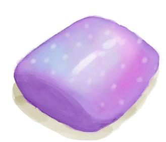
[Seahound Meat](Seahoundmeat.md)](Seahoundmeat.md)</td><td  style="text-align:left;vertical-align:top;"  >Eat</td><td  style="text-align:left;vertical-align:top;"  >5</td></tr><tr ><td  style="text-align:left;vertical-align:top;"  >[

[Cooked Shark](SharkCooked.md)](SharkCooked.md)</td><td  style="text-align:left;vertical-align:top;"  >Eat</td><td  style="text-align:left;vertical-align:top;"  >5</td></tr><tr ><td  style="text-align:left;vertical-align:top;"  >[

[Shark Meat](SharkMeat.md)](SharkMeat.md)</td><td  style="text-align:left;vertical-align:top;"  >Eat</td><td  style="text-align:left;vertical-align:top;"  >5</td></tr><tr ><td  style="text-align:left;vertical-align:top;"  >[

[Smoked Shark](SharkSmoked.md)](SharkSmoked.md)</td><td  style="text-align:left;vertical-align:top;"  >Eat</td><td  style="text-align:left;vertical-align:top;"  >5</td></tr><tr ><td  style="text-align:left;vertical-align:top;"  >[

[Cooked Snake Meat](SnakeCooked.md)](SnakeCooked.md)</td><td  style="text-align:left;vertical-align:top;"  >Eat</td><td  style="text-align:left;vertical-align:top;"  >5</td></tr><tr ><td  style="text-align:left;vertical-align:top;"  >[

[Skinned Snake](SnakeSkinned.md)](SnakeSkinned.md)</td><td  style="text-align:left;vertical-align:top;"  >Eat</td><td  style="text-align:left;vertical-align:top;"  >5</td></tr><tr ><td  style="text-align:left;vertical-align:top;"  >[

[Sushi](Sushi.md)](Sushi.md)</td><td  style="text-align:left;vertical-align:top;"  >Eat</td><td  style="text-align:left;vertical-align:top;"  >5</td></tr><tr ><td  style="text-align:left;vertical-align:top;"  >[

[Cooked Threadfin](ThreadfinCooked.md)](ThreadfinCooked.md)</td><td  style="text-align:left;vertical-align:top;"  >Eat</td><td  style="text-align:left;vertical-align:top;"  >5</td></tr><tr ><td  style="text-align:left;vertical-align:top;"  >[

[Threadfin Meat](ThreadfinMeat.md)](ThreadfinMeat.md)</td><td  style="text-align:left;vertical-align:top;"  >Eat</td><td  style="text-align:left;vertical-align:top;"  >5</td></tr><tr ><td  style="text-align:left;vertical-align:top;"  >[

[Smoked Threadfin](ThreadfinSmoked.md)](ThreadfinSmoked.md)</td><td  style="text-align:left;vertical-align:top;"  >Eat</td><td  style="text-align:left;vertical-align:top;"  >5</td></tr><tr ><td  style="text-align:left;vertical-align:top;"  >[

[Yam Jam](YamJam.md)](YamJam.md)</td><td  style="text-align:left;vertical-align:top;"  >Eat</td><td  style="text-align:left;vertical-align:top;"  >5</td></tr><tr ><td  style="text-align:left;vertical-align:top;"  >[

[Dead Bat](Bat.md)](Bat.md)</td><td  style="text-align:left;vertical-align:top;"  >Eat</td><td  style="text-align:left;vertical-align:top;"  >4</td></tr><tr ><td  style="text-align:left;vertical-align:top;"  >[

[Roasted Bat](BatCooked.md)](BatCooked.md)</td><td  style="text-align:left;vertical-align:top;"  >Eat</td><td  style="text-align:left;vertical-align:top;"  >4</td></tr><tr ><td  style="text-align:left;vertical-align:top;"  >[

[Roasted Coconut Meat](CoconutMeatCooked.md)](CoconutMeatCooked.md)</td><td  style="text-align:left;vertical-align:top;"  >Eat</td><td  style="text-align:left;vertical-align:top;"  >4</td></tr><tr ><td  style="text-align:left;vertical-align:top;"  >[

[Crab](Crab.md)](Crab.md)</td><td  style="text-align:left;vertical-align:top;"  >Eat Crab</td><td  style="text-align:left;vertical-align:top;"  >4</td></tr><tr ><td  style="text-align:left;vertical-align:top;"  >[

[Cooked Crab](CrabCooked.md)](CrabCooked.md)</td><td  style="text-align:left;vertical-align:top;"  >Eat Crab</td><td  style="text-align:left;vertical-align:top;"  >4</td></tr><tr ><td  style="text-align:left;vertical-align:top;"  >[

[Cooked Fish Scraps](FishScrapsCooked.md)](FishScrapsCooked.md)</td><td  style="text-align:left;vertical-align:top;"  >Eat Scraps</td><td  style="text-align:left;vertical-align:top;"  >4</td></tr><tr ><td  style="text-align:left;vertical-align:top;"  >[
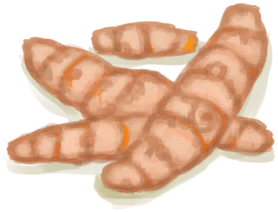
[Ginger](Ginger.md)](Ginger.md)</td><td  style="text-align:left;vertical-align:top;"  >Grind Root ** With：**[“Hammer”](tag_Hammer.md)</td><td  style="text-align:left;vertical-align:top;"  >4</td></tr><tr ><td  style="text-align:left;vertical-align:top;"  >[

[Dried Ginger](GingerDried.md)](GingerDried.md)</td><td  style="text-align:left;vertical-align:top;"  >Grind Root ** With：**[“Hammer”](tag_Hammer.md)</td><td  style="text-align:left;vertical-align:top;"  >4</td></tr><tr ><td  style="text-align:left;vertical-align:top;"  >[

[Ground Ginger](GingerGround.md)](GingerGround.md)</td><td  style="text-align:left;vertical-align:top;"  >Eat</td><td  style="text-align:left;vertical-align:top;"  >4</td></tr><tr ><td  style="text-align:left;vertical-align:top;"  >[

[Jasmine Flowers](JasmineFlowers.md)](JasmineFlowers.md)</td><td  style="text-align:left;vertical-align:top;"  >Grind ** With：**[“Hammer”](tag_Hammer.md)</td><td  style="text-align:left;vertical-align:top;"  >4</td></tr><tr ><td  style="text-align:left;vertical-align:top;"  >[

[Kava Root](KavaRoot.md)](KavaRoot.md)</td><td  style="text-align:left;vertical-align:top;"  >Grind Root ** With：**[“Hammer”](tag_Hammer.md)</td><td  style="text-align:left;vertical-align:top;"  >4</td></tr><tr ><td  style="text-align:left;vertical-align:top;"  >[

[Dried Kava Root](KavaRootDried.md)](KavaRootDried.md)</td><td  style="text-align:left;vertical-align:top;"  >Grind Root ** With：**[“Hammer”](tag_Hammer.md)</td><td  style="text-align:left;vertical-align:top;"  >4</td></tr><tr ><td  style="text-align:left;vertical-align:top;"  >[

[Ground Kava Root](KavaRootGround.md)](KavaRootGround.md)</td><td  style="text-align:left;vertical-align:top;"  >Eat Ground Root</td><td  style="text-align:left;vertical-align:top;"  >4</td></tr><tr ><td  style="text-align:left;vertical-align:top;"  >[

[Ground Lemongrass](LemonGrassGround.md)](LemonGrassGround.md)</td><td  style="text-align:left;vertical-align:top;"  >Eat</td><td  style="text-align:left;vertical-align:top;"  >4</td></tr><tr ><td  style="text-align:left;vertical-align:top;"  >[

[Lemongrass](LemongrassStalks.md)](LemongrassStalks.md)</td><td  style="text-align:left;vertical-align:top;"  >Grind ** With：**[“Hammer”](tag_Hammer.md)</td><td  style="text-align:left;vertical-align:top;"  >4</td></tr><tr ><td  style="text-align:left;vertical-align:top;"  >[

[Lizard](Lizard.md)](Lizard.md)</td><td  style="text-align:left;vertical-align:top;"  >Eat</td><td  style="text-align:left;vertical-align:top;"  >4</td></tr><tr ><td  style="text-align:left;vertical-align:top;"  >[

[Roasted Lizard](LizardCooked.md)](LizardCooked.md)</td><td  style="text-align:left;vertical-align:top;"  >Eat</td><td  style="text-align:left;vertical-align:top;"  >4</td></tr><tr ><td  style="text-align:left;vertical-align:top;"  >[

[Dead Mouse](Mouse.md)](Mouse.md)</td><td  style="text-align:left;vertical-align:top;"  >Eat</td><td  style="text-align:left;vertical-align:top;"  >4</td></tr><tr ><td  style="text-align:left;vertical-align:top;"  >[

[Roasted Mouse](MouseCooked.md)](MouseCooked.md)</td><td  style="text-align:left;vertical-align:top;"  >Eat</td><td  style="text-align:left;vertical-align:top;"  >4</td></tr><tr ><td  style="text-align:left;vertical-align:top;"  >[

[Skinned Mouse](MouseSkinned.md)](MouseSkinned.md)(未实装)</td><td  style="text-align:left;vertical-align:top;"  >Eat</td><td  style="text-align:left;vertical-align:top;"  >4</td></tr><tr ><td  style="text-align:left;vertical-align:top;"  >[

[Mudskipper](Mudskipper.md)](Mudskipper.md)</td><td  style="text-align:left;vertical-align:top;"  >Eat</td><td  style="text-align:left;vertical-align:top;"  >4</td></tr><tr ><td  style="text-align:left;vertical-align:top;"  >[

[Roasted Mudskipper](MudskipperCooked.md)](MudskipperCooked.md)</td><td  style="text-align:left;vertical-align:top;"  >Eat</td><td  style="text-align:left;vertical-align:top;"  >4</td></tr><tr ><td  style="text-align:left;vertical-align:top;"  >[
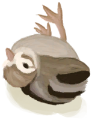
[Dead Chick](PartridgeChickDead.md)](PartridgeChickDead.md)</td><td  style="text-align:left;vertical-align:top;"  >Eat</td><td  style="text-align:left;vertical-align:top;"  >4</td></tr><tr ><td  style="text-align:left;vertical-align:top;"  >[

[Snake Grass](SnakeGrass.md)](SnakeGrass.md)</td><td  style="text-align:left;vertical-align:top;"  >Grind ** With：**[“Hammer”](tag_Hammer.md)</td><td  style="text-align:left;vertical-align:top;"  >4</td></tr><tr ><td  style="text-align:left;vertical-align:top;"  >[

[Ground Snake Grass](SnakeGrassGround.md)](SnakeGrassGround.md)</td><td  style="text-align:left;vertical-align:top;"  >Eat</td><td  style="text-align:left;vertical-align:top;"  >4</td></tr><tr ><td  style="text-align:left;vertical-align:top;"  >[

[Ground Spider Lily](SpiderLilyGround.md)](SpiderLilyGround.md)</td><td  style="text-align:left;vertical-align:top;"  >Eat</td><td  style="text-align:left;vertical-align:top;"  >4</td></tr><tr ><td  style="text-align:left;vertical-align:top;"  >[

[Spider Lily Leaves](SpiderLilyLeaves.md)](SpiderLilyLeaves.md)</td><td  style="text-align:left;vertical-align:top;"  >Grind Leaves ** With：**[“Hammer”](tag_Hammer.md)</td><td  style="text-align:left;vertical-align:top;"  >4</td></tr><tr ><td  style="text-align:left;vertical-align:top;"  >[

[Dried Spider Lily Leaves](SpiderLilyLeavesDried.md)](SpiderLilyLeavesDried.md)</td><td  style="text-align:left;vertical-align:top;"  >Grind Leaves ** With：**[“Hammer”](tag_Hammer.md)</td><td  style="text-align:left;vertical-align:top;"  >4</td></tr><tr ><td  style="text-align:left;vertical-align:top;"  >[

[Butter](Butter.md)](Butter.md)</td><td  style="text-align:left;vertical-align:top;"  >Eat</td><td  style="text-align:left;vertical-align:top;"  >3</td></tr><tr ><td  style="text-align:left;vertical-align:top;"  >[
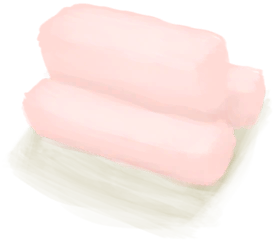
[Fat](Fat.md)](Fat.md)</td><td  style="text-align:left;vertical-align:top;"  >Eat</td><td  style="text-align:left;vertical-align:top;"  >3</td></tr><tr ><td  style="text-align:left;vertical-align:top;"  >[

[Jujube Fruits](JujubeFruits.md)](JujubeFruits.md)</td><td  style="text-align:left;vertical-align:top;"  >Eat</td><td  style="text-align:left;vertical-align:top;"  >3</td></tr><tr ><td  style="text-align:left;vertical-align:top;"  >[

[Mango](Mango.md)](Mango.md)</td><td  style="text-align:left;vertical-align:top;"  >Eat</td><td  style="text-align:left;vertical-align:top;"  >3</td></tr><tr ><td  style="text-align:left;vertical-align:top;"  >[

[Sago Flatbread](SagoFlatbread.md)](SagoFlatbread.md)</td><td  style="text-align:left;vertical-align:top;"  >Eat</td><td  style="text-align:left;vertical-align:top;"  >3</td></tr><tr ><td  style="text-align:left;vertical-align:top;"  >[

[Sago Flatbread with Honey](SagoFlatbreadHoney.md)](SagoFlatbreadHoney.md)</td><td  style="text-align:left;vertical-align:top;"  >Eat</td><td  style="text-align:left;vertical-align:top;"  >3</td></tr><tr ><td  style="text-align:left;vertical-align:top;"  >[

[Sago Flatbread with Jam](SagoFlatbreadJam.md)](SagoFlatbreadJam.md)</td><td  style="text-align:left;vertical-align:top;"  >Eat</td><td  style="text-align:left;vertical-align:top;"  >3</td></tr><tr ><td  style="text-align:left;vertical-align:top;"  >[

[Sago Slime](SagoSlime.md)](SagoSlime.md)</td><td  style="text-align:left;vertical-align:top;"  >Eat</td><td  style="text-align:left;vertical-align:top;"  >3</td></tr><tr ><td  style="text-align:left;vertical-align:top;"  >[

[Honeycomb](BeeHoneycomb.md)](BeeHoneycomb.md)</td><td  style="text-align:left;vertical-align:top;"  >Eat</td><td  style="text-align:left;vertical-align:top;"  >2</td></tr><tr ><td  style="text-align:left;vertical-align:top;"  >[

[Conch Meat](ConchMeat.md)](ConchMeat.md)</td><td  style="text-align:left;vertical-align:top;"  >Eat</td><td  style="text-align:left;vertical-align:top;"  >2 ~ 35</td></tr><tr ><td  style="text-align:left;vertical-align:top;"  >[

[Cooked Conch Meat](ConchMeatCooked.md)](ConchMeatCooked.md)</td><td  style="text-align:left;vertical-align:top;"  >Eat</td><td  style="text-align:left;vertical-align:top;"  >2</td></tr><tr ><td  style="text-align:left;vertical-align:top;"  >[

[Soft Conch Meat](ConchMeatSoft.md)](ConchMeatSoft.md)</td><td  style="text-align:left;vertical-align:top;"  >Eat</td><td  style="text-align:left;vertical-align:top;"  >2</td></tr><tr ><td  style="text-align:left;vertical-align:top;"  >[

[Cooked Soft Conch Meat](ConchMeatSoftCooked.md)](ConchMeatSoftCooked.md)</td><td  style="text-align:left;vertical-align:top;"  >Eat</td><td  style="text-align:left;vertical-align:top;"  >2</td></tr><tr ><td  style="text-align:left;vertical-align:top;"  >[

[Bone Broth](BoneBroth.md)](BoneBroth.md)</td><td  style="text-align:left;vertical-align:top;"  >Drink</td><td  style="text-align:left;vertical-align:top;"  >2</td></tr><tr ><td  style="text-align:left;vertical-align:top;"  >[

[Ginger](Ginger.md)](Ginger.md)</td><td  style="text-align:left;vertical-align:top;"  >Eat</td><td  style="text-align:left;vertical-align:top;"  >2</td></tr><tr ><td  style="text-align:left;vertical-align:top;"  >[

[Dried Ginger](GingerDried.md)](GingerDried.md)</td><td  style="text-align:left;vertical-align:top;"  >Eat</td><td  style="text-align:left;vertical-align:top;"  >2</td></tr><tr ><td  style="text-align:left;vertical-align:top;"  >[

[Kava Root](KavaRoot.md)](KavaRoot.md)</td><td  style="text-align:left;vertical-align:top;"  >Eat Root</td><td  style="text-align:left;vertical-align:top;"  >2</td></tr><tr ><td  style="text-align:left;vertical-align:top;"  >[
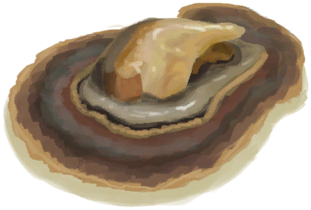
[Oyster Meat](OysterMeat.md)](OysterMeat.md)</td><td  style="text-align:left;vertical-align:top;"  >Eat</td><td  style="text-align:left;vertical-align:top;"  >2</td></tr><tr ><td  style="text-align:left;vertical-align:top;"  >[

[Butter Baked Oyster](OysterMeatBaked.md)](OysterMeatBaked.md)</td><td  style="text-align:left;vertical-align:top;"  >Eat</td><td  style="text-align:left;vertical-align:top;"  >2</td></tr><tr ><td  style="text-align:left;vertical-align:top;"  >[

[Cooked Oyster](OysterMeatCooked.md)](OysterMeatCooked.md)</td><td  style="text-align:left;vertical-align:top;"  >Eat</td><td  style="text-align:left;vertical-align:top;"  >2</td></tr><tr ><td  style="text-align:left;vertical-align:top;"  >[

[Prawns](Prawns.md)](Prawns.md)</td><td  style="text-align:left;vertical-align:top;"  >Eat</td><td  style="text-align:left;vertical-align:top;"  >2</td></tr><tr ><td  style="text-align:left;vertical-align:top;"  >[

[Roasted Prawns](PrawnsCooked.md)](PrawnsCooked.md)</td><td  style="text-align:left;vertical-align:top;"  >Eat</td><td  style="text-align:left;vertical-align:top;"  >2</td></tr><tr ><td  style="text-align:left;vertical-align:top;"  >[

[Sago Flour](SagoFlour.md)](SagoFlour.md)</td><td  style="text-align:left;vertical-align:top;"  >Eat</td><td  style="text-align:left;vertical-align:top;"  >2</td></tr><tr ><td  style="text-align:left;vertical-align:top;"  >[

[Sago Pulp](SagoPulp.md)](SagoPulp.md)</td><td  style="text-align:left;vertical-align:top;"  >Eat</td><td  style="text-align:left;vertical-align:top;"  >2</td></tr><tr ><td  style="text-align:left;vertical-align:top;"  >[

[Sago Sawdust](SagoSawdust.md)](SagoSawdust.md)</td><td  style="text-align:left;vertical-align:top;"  >Eat</td><td  style="text-align:left;vertical-align:top;"  >2</td></tr><tr ><td  style="text-align:left;vertical-align:top;"  >[

[Sugar](Sugar.md)](Sugar.md)</td><td  style="text-align:left;vertical-align:top;"  >Eat</td><td  style="text-align:left;vertical-align:top;"  >2</td></tr><tr ><td  style="text-align:left;vertical-align:top;"  >[

[Urchin Meat](UrchinMeat.md)](UrchinMeat.md)</td><td  style="text-align:left;vertical-align:top;"  >Eat</td><td  style="text-align:left;vertical-align:top;"  >2 ~ 35</td></tr><tr ><td  style="text-align:left;vertical-align:top;"  >[

[Cooked Urchin](UrchinMeatCooked.md)](UrchinMeatCooked.md)</td><td  style="text-align:left;vertical-align:top;"  >Eat</td><td  style="text-align:left;vertical-align:top;"  >2</td></tr><tr ><td  style="text-align:left;vertical-align:top;"  >[

[Boiled Yam](YamBoiled.md)](YamBoiled.md)</td><td  style="text-align:left;vertical-align:top;"  >Eat</td><td  style="text-align:left;vertical-align:top;"  >2</td></tr><tr ><td  style="text-align:left;vertical-align:top;"  >[

[Cut Yam](YamCut.md)](YamCut.md)</td><td  style="text-align:left;vertical-align:top;"  >Eat</td><td  style="text-align:left;vertical-align:top;"  >2</td></tr><tr ><td  style="text-align:left;vertical-align:top;"  >[

[Soaked Sago](LQ_SoakedSago.md)](LQ_SoakedSago.md)</td><td  style="text-align:left;vertical-align:top;"  >Eat</td><td  style="text-align:left;vertical-align:top;"  >2</td></tr><tr ><td  style="text-align:left;vertical-align:top;"  >[

[Soaked Yam](LQ_SoakedYam.md)](LQ_SoakedYam.md)</td><td  style="text-align:left;vertical-align:top;"  >Eat</td><td  style="text-align:left;vertical-align:top;"  >2</td></tr><tr ><td  style="text-align:left;vertical-align:top;"  >[

[Toxic Water](LQ_WaterToxic.md)](LQ_WaterToxic.md)</td><td  style="text-align:left;vertical-align:top;"  >Drink</td><td  style="text-align:left;vertical-align:top;"  >2</td></tr><tr ><td  style="text-align:left;vertical-align:top;"  >[

[Crystal Chamber(High Chamber)](CrystalChamber.md)](CrystalChamber.md)</td><td  style="text-align:left;vertical-align:top;"  >Explore</td><td  style="text-align:left;vertical-align:top;"  >2</td></tr><tr ><td  style="text-align:left;vertical-align:top;"  >[

[Damp Chamber](DampChamber.md)](DampChamber.md)</td><td  style="text-align:left;vertical-align:top;"  >Explore</td><td  style="text-align:left;vertical-align:top;"  >2</td></tr><tr ><td  style="text-align:left;vertical-align:top;"  >[

[Flooded Chamber](FloodedChamber.md)](FloodedChamber.md)</td><td  style="text-align:left;vertical-align:top;"  >Explore</td><td  style="text-align:left;vertical-align:top;"  >2</td></tr><tr ><td  style="text-align:left;vertical-align:top;"  >[

[High Chamber](HighChamber.md)](HighChamber.md)</td><td  style="text-align:left;vertical-align:top;"  >Explore</td><td  style="text-align:left;vertical-align:top;"  >2</td></tr><tr ><td  style="text-align:left;vertical-align:top;"  >[

[Low Chamber(High Chamber)](LowChamber.md)](LowChamber.md)</td><td  style="text-align:left;vertical-align:top;"  >Explore</td><td  style="text-align:left;vertical-align:top;"  >2</td></tr><tr ><td  style="text-align:left;vertical-align:top;"  >[

[Medium Chamber(High Chamber)](MidChamber.md)](MidChamber.md)</td><td  style="text-align:left;vertical-align:top;"  >Explore</td><td  style="text-align:left;vertical-align:top;"  >2</td></tr><tr ><td  style="text-align:left;vertical-align:top;"  >[

[Narrow Tunnel(High Chamber)](NarrowTunnel.md)](NarrowTunnel.md)</td><td  style="text-align:left;vertical-align:top;"  >Explore</td><td  style="text-align:left;vertical-align:top;"  >2</td></tr><tr ><td  style="text-align:left;vertical-align:top;"  >[

[Dark Cave](DarkCave.md)](DarkCave.md)</td><td  style="text-align:left;vertical-align:top;"  >Explore</td><td  style="text-align:left;vertical-align:top;"  >2</td></tr><tr ><td  style="text-align:left;vertical-align:top;"  >[

[Banana](Banana.md)](Banana.md)</td><td  style="text-align:left;vertical-align:top;"  >Eat</td><td  style="text-align:left;vertical-align:top;"  >1</td></tr><tr ><td  style="text-align:left;vertical-align:top;"  >[

[Bugs](Bugs.md)](Bugs.md)</td><td  style="text-align:left;vertical-align:top;"  >Eat</td><td  style="text-align:left;vertical-align:top;"  >1</td></tr><tr ><td  style="text-align:left;vertical-align:top;"  >[

[Chillies](Chilies.md)](Chilies.md)</td><td  style="text-align:left;vertical-align:top;"  >Eat</td><td  style="text-align:left;vertical-align:top;"  >1</td></tr><tr ><td  style="text-align:left;vertical-align:top;"  >[

[Dried Chilies](ChiliesDried.md)](ChiliesDried.md)</td><td  style="text-align:left;vertical-align:top;"  >Eat</td><td  style="text-align:left;vertical-align:top;"  >1</td></tr><tr ><td  style="text-align:left;vertical-align:top;"  >[

[China Rose](ChinaRoseFlowers.md)](ChinaRoseFlowers.md)</td><td  style="text-align:left;vertical-align:top;"  >Eat</td><td  style="text-align:left;vertical-align:top;"  >1</td></tr><tr ><td  style="text-align:left;vertical-align:top;"  >[

[Coffee Berries](CoffeeBerries.md)](CoffeeBerries.md)</td><td  style="text-align:left;vertical-align:top;"  >Eat</td><td  style="text-align:left;vertical-align:top;"  >1</td></tr><tr ><td  style="text-align:left;vertical-align:top;"  >[

[Coffee Berry Pulp](CoffeeBerryPulp.md)](CoffeeBerryPulp.md)</td><td  style="text-align:left;vertical-align:top;"  >Eat</td><td  style="text-align:left;vertical-align:top;"  >1</td></tr><tr ><td  style="text-align:left;vertical-align:top;"  >[

[Food Ration](FoodRation.md)](FoodRation.md)</td><td  style="text-align:left;vertical-align:top;"  >Eat</td><td  style="text-align:left;vertical-align:top;"  >1</td></tr><tr ><td  style="text-align:left;vertical-align:top;"  >[

[Jasmine Flowers](JasmineFlowers.md)](JasmineFlowers.md)</td><td  style="text-align:left;vertical-align:top;"  >Eat</td><td  style="text-align:left;vertical-align:top;"  >1</td></tr><tr ><td  style="text-align:left;vertical-align:top;"  >[

[Ground Jasmine Flowers](JasmineFlowersGround.md)](JasmineFlowersGround.md)</td><td  style="text-align:left;vertical-align:top;"  >Eat</td><td  style="text-align:left;vertical-align:top;"  >1</td></tr><tr ><td  style="text-align:left;vertical-align:top;"  >[

[Dried Kava Root](KavaRootDried.md)](KavaRootDried.md)</td><td  style="text-align:left;vertical-align:top;"  >Eat Root</td><td  style="text-align:left;vertical-align:top;"  >1</td></tr><tr ><td  style="text-align:left;vertical-align:top;"  >[

[Spider Lily Leaves](SpiderLilyLeaves.md)](SpiderLilyLeaves.md)</td><td  style="text-align:left;vertical-align:top;"  >Eat</td><td  style="text-align:left;vertical-align:top;"  >1</td></tr><tr ><td  style="text-align:left;vertical-align:top;"  >[

[Dried Spider Lily Leaves](SpiderLilyLeavesDried.md)](SpiderLilyLeavesDried.md)</td><td  style="text-align:left;vertical-align:top;"  >Eat</td><td  style="text-align:left;vertical-align:top;"  >1</td></tr><tr ><td  style="text-align:left;vertical-align:top;"  >[

[Acid Lake(Volcano)](AcidLake.md)](AcidLake.md)</td><td  style="text-align:left;vertical-align:top;"  >Explore</td><td  style="text-align:left;vertical-align:top;"  >1</td></tr><tr ><td  style="text-align:left;vertical-align:top;"  >[

[Deep Jungle(Jungle)](DeepJungle.md)](DeepJungle.md)</td><td  style="text-align:left;vertical-align:top;"  >Explore</td><td  style="text-align:left;vertical-align:top;"  >1</td></tr><tr ><td  style="text-align:left;vertical-align:top;"  >[

[Eastern Grasslands](GrasslandsE.md)](GrasslandsE.md)</td><td  style="text-align:left;vertical-align:top;"  >Explore</td><td  style="text-align:left;vertical-align:top;"  >1</td></tr><tr ><td  style="text-align:left;vertical-align:top;"  >[

[Western Grasslands](GrasslandsW.md)](GrasslandsW.md)</td><td  style="text-align:left;vertical-align:top;"  >Explore</td><td  style="text-align:left;vertical-align:top;"  >1</td></tr><tr ><td  style="text-align:left;vertical-align:top;"  >[

[Eastern Highlands](HighlandsEastern.md)](HighlandsEastern.md)</td><td  style="text-align:left;vertical-align:top;"  >Explore</td><td  style="text-align:left;vertical-align:top;"  >1</td></tr><tr ><td  style="text-align:left;vertical-align:top;"  >[

[Western Highlands](HighlandsWestern.md)](HighlandsWestern.md)</td><td  style="text-align:left;vertical-align:top;"  >Explore</td><td  style="text-align:left;vertical-align:top;"  >1</td></tr><tr ><td  style="text-align:left;vertical-align:top;"  >[

[Jungle](Jungle.md)](Jungle.md)</td><td  style="text-align:left;vertical-align:top;"  >Explore</td><td  style="text-align:left;vertical-align:top;"  >1</td></tr><tr ><td  style="text-align:left;vertical-align:top;"  >[

[Jungle Highlands](JungleHighlands.md)](JungleHighlands.md)</td><td  style="text-align:left;vertical-align:top;"  >Explore</td><td  style="text-align:left;vertical-align:top;"  >1</td></tr><tr ><td  style="text-align:left;vertical-align:top;"  >[

[Secret Valley](SecretValley.md)](SecretValley.md)</td><td  style="text-align:left;vertical-align:top;"  >Explore</td><td  style="text-align:left;vertical-align:top;"  >1</td></tr><tr ><td  style="text-align:left;vertical-align:top;"  >[

[Volcano](Volcano.md)](Volcano.md)</td><td  style="text-align:left;vertical-align:top;"  >Explore</td><td  style="text-align:left;vertical-align:top;"  >1</td></tr><tr ><td  style="text-align:left;vertical-align:top;"  >[

[Wetland Jungle(Wetlands)](Wetlands.md)](Wetlands.md)</td><td  style="text-align:left;vertical-align:top;"  >Explore</td><td  style="text-align:left;vertical-align:top;"  >1</td></tr><tr ><td  style="text-align:left;vertical-align:top;"  >[

[Seawater(Flooded Chamber)](Sea_Cave.md)](Sea_Cave.md)</td><td  style="text-align:left;vertical-align:top;"  >Dive</td><td  style="text-align:left;vertical-align:top;"  >-75</td></tr><tr ><td  style="text-align:left;vertical-align:top;"  >[

[Sea(Atoll)](Sea_Atoll.md)](Sea_Atoll.md)</td><td  style="text-align:left;vertical-align:top;"  >Dive</td><td  style="text-align:left;vertical-align:top;"  >-75</td></tr><tr ><td  style="text-align:left;vertical-align:top;"  >[

[Sea(Bay)](Sea_Bay.md)](Sea_Bay.md)</td><td  style="text-align:left;vertical-align:top;"  >Dive</td><td  style="text-align:left;vertical-align:top;"  >-75</td></tr><tr ><td  style="text-align:left;vertical-align:top;"  >[

[Sea(Beach)](Sea_Beach.md)](Sea_Beach.md)</td><td  style="text-align:left;vertical-align:top;"  >Dive</td><td  style="text-align:left;vertical-align:top;"  >-75</td></tr><tr ><td  style="text-align:left;vertical-align:top;"  >[

[Sea(Secret Cove)](Sea_Cove.md)](Sea_Cove.md)</td><td  style="text-align:left;vertical-align:top;"  >Dive</td><td  style="text-align:left;vertical-align:top;"  >-75</td></tr><tr ><td  style="text-align:left;vertical-align:top;"  >[

[Sea(Desolate Beach)](Sea_DesolateBeach.md)](Sea_DesolateBeach.md)</td><td  style="text-align:left;vertical-align:top;"  >Dive</td><td  style="text-align:left;vertical-align:top;"  >-75</td></tr><tr ><td  style="text-align:left;vertical-align:top;"  >[

[Sea(Mangrove Forest)](Sea_Mangroves.md)](Sea_Mangroves.md)</td><td  style="text-align:left;vertical-align:top;"  >Dive</td><td  style="text-align:left;vertical-align:top;"  >-75</td></tr><tr ><td  style="text-align:left;vertical-align:top;"  >[

[Sea](Sea_Raft.md)](Sea_Raft.md)</td><td  style="text-align:left;vertical-align:top;"  >Dive</td><td  style="text-align:left;vertical-align:top;"  >-75</td></tr><tr ><td  style="text-align:left;vertical-align:top;"  >[

[Sea(Bird Rock)](Sea_Rocks.md)](Sea_Rocks.md)</td><td  style="text-align:left;vertical-align:top;"  >Dive</td><td  style="text-align:left;vertical-align:top;"  >-75</td></tr><tr ><td  style="text-align:left;vertical-align:top;"  >[

[Shipwreck(Bird Rock)](Shipwreck.md)](Shipwreck.md)</td><td  style="text-align:left;vertical-align:top;"  >Explore the shipwreck</td><td  style="text-align:left;vertical-align:top;"  >-75</td></tr><tr ><td  style="text-align:left;vertical-align:top;"  >[

[Tide Pool(Rocks)](TidePool.md)](TidePool.md)</td><td  style="text-align:left;vertical-align:top;"  >Wash yourself</td><td  style="text-align:left;vertical-align:top;"  >-150</td></tr><tr ><td  style="text-align:left;vertical-align:top;"  >[

[Flooded Tide Pool(Rocks)](TidePoolFlooded.md)](TidePoolFlooded.md)</td><td  style="text-align:left;vertical-align:top;"  >Wash yourself</td><td  style="text-align:left;vertical-align:top;"  >-150</td></tr><tr ><td  style="text-align:left;vertical-align:top;"  >[

[Water](LQ_Water.md)](LQ_Water.md)</td><td  style="text-align:left;vertical-align:top;"  >Wash Yourself</td><td  style="text-align:left;vertical-align:top;"  >-150</td></tr><tr ><td  style="text-align:left;vertical-align:top;"  >[

[Salt Water](LQ_WaterSalt.md)](LQ_WaterSalt.md)</td><td  style="text-align:left;vertical-align:top;"  >Wash Yourself</td><td  style="text-align:left;vertical-align:top;"  >-150</td></tr><tr ><td  style="text-align:left;vertical-align:top;"  >[

[Toxic Water](LQ_WaterToxic.md)](LQ_WaterToxic.md)</td><td  style="text-align:left;vertical-align:top;"  >Wash Yourself</td><td  style="text-align:left;vertical-align:top;"  >-150</td></tr><tr ><td  style="text-align:left;vertical-align:top;"  >[

[Unsafe Water](LQ_WaterUnsafe.md)](LQ_WaterUnsafe.md)</td><td  style="text-align:left;vertical-align:top;"  >Wash Yourself</td><td  style="text-align:left;vertical-align:top;"  >-150</td></tr><tr ><td  style="text-align:left;vertical-align:top;"  >[

[Seawater(Flooded Chamber)](Sea_Cave.md)](Sea_Cave.md)</td><td  style="text-align:left;vertical-align:top;"  >Wash yourself</td><td  style="text-align:left;vertical-align:top;"  >-150</td></tr><tr ><td  style="text-align:left;vertical-align:top;"  >[

[Sea(Atoll)](Sea_Atoll.md)](Sea_Atoll.md)</td><td  style="text-align:left;vertical-align:top;"  >Wash yourself</td><td  style="text-align:left;vertical-align:top;"  >-150</td></tr><tr ><td  style="text-align:left;vertical-align:top;"  >[

[Sea(Bay)](Sea_Bay.md)](Sea_Bay.md)</td><td  style="text-align:left;vertical-align:top;"  >Wash yourself</td><td  style="text-align:left;vertical-align:top;"  >-150</td></tr><tr ><td  style="text-align:left;vertical-align:top;"  >[

[Sea(Beach)](Sea_Beach.md)](Sea_Beach.md)</td><td  style="text-align:left;vertical-align:top;"  >Wash yourself</td><td  style="text-align:left;vertical-align:top;"  >-150</td></tr><tr ><td  style="text-align:left;vertical-align:top;"  >[

[Sea(Secret Cove)](Sea_Cove.md)](Sea_Cove.md)</td><td  style="text-align:left;vertical-align:top;"  >Wash yourself</td><td  style="text-align:left;vertical-align:top;"  >-150</td></tr><tr ><td  style="text-align:left;vertical-align:top;"  >[

[Sea(Desolate Beach)](Sea_DesolateBeach.md)](Sea_DesolateBeach.md)</td><td  style="text-align:left;vertical-align:top;"  >Wash yourself</td><td  style="text-align:left;vertical-align:top;"  >-150</td></tr><tr ><td  style="text-align:left;vertical-align:top;"  >[

[Sea(Mangrove Forest)](Sea_Mangroves.md)](Sea_Mangroves.md)</td><td  style="text-align:left;vertical-align:top;"  >Wash yourself</td><td  style="text-align:left;vertical-align:top;"  >-150</td></tr><tr ><td  style="text-align:left;vertical-align:top;"  >[

[Sea](Sea_Raft.md)](Sea_Raft.md)</td><td  style="text-align:left;vertical-align:top;"  >Wash yourself</td><td  style="text-align:left;vertical-align:top;"  >-150</td></tr><tr ><td  style="text-align:left;vertical-align:top;"  >[

[Sea(Bird Rock)](Sea_Rocks.md)](Sea_Rocks.md)</td><td  style="text-align:left;vertical-align:top;"  >Wash yourself</td><td  style="text-align:left;vertical-align:top;"  >-150</td></tr><tr ><td  style="text-align:left;vertical-align:top;"  >[

[Wet Soap](SoapWet.md)](SoapWet.md)</td><td  style="text-align:left;vertical-align:top;"  >Wash yourself</td><td  style="text-align:left;vertical-align:top;"  >-300</td></tr><tr ><td  style="text-align:left;vertical-align:top;"  >[

[Shower](Shower.md)](Shower.md)</td><td  style="text-align:left;vertical-align:top;"  >Take a Shower</td><td  style="text-align:left;vertical-align:top;"  >-500</td></tr></tbody></table>  
  

