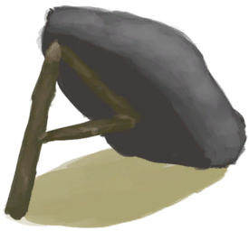

# Fish Trap  
> I should check it for fish later.  
  
<table class="table table-bordered" data-toggle="table"  data-show-header="false"><thead style="display:none"><tr ><th  style="width:50%;text-align:left;vertical-align:top;"  >title</th><th  style="width:50%;text-align:left;vertical-align:top;"  ></th></tr></thead><tr ><td  style="width:50%;text-align:left;vertical-align:top;"  >** Cannot Be Trashed **  ** DoseNotPile **  **Slots：**1  **过滤器：**[“Cookable”](tag_Cookable.md)</td><td  style="width:50%;text-align:left;vertical-align:top;"  >

<a href="FishTrapDeployed.md" style="color:black">Fish Trap</a>

An ingenious basket-like trap that allows you to catch <b>Fish and shellfish</b> for little effort.  This trap does does not require <b>Bait</b> and must be deployed in coastal areas. <b>Storms</b> can destroy them so make sure to pick them up during the <b>Wet Season</b>.</td></tr></tbody></table>  
  
## Got From  

Deploy

[Fish Trap](FishTrap.md)

** With：**[Fish Trap](FishTrap.md)Deploy

[Sea(Atoll)](Sea_Atoll.md)

** With：**[Fish Trap](FishTrap.md)Deploy

[Sea(Bay)](Sea_Bay.md)

** With：**[Fish Trap](FishTrap.md)Deploy

[Sea(Beach)](Sea_Beach.md)

** With：**[Fish Trap](FishTrap.md)Deploy

[Sea(Secret Cove)](Sea_Cove.md)

  
  
## Action  

<table><tr><td rowspan="2" style="width:200px;text-align:center;font-size:1.3em;font-weight:bold">

Pick up Trap

15m

</td><td>[“LegAction(Group)”](LegAction.md)</td></tr><tr><td><b>Self：</b>→ [

[Fish Trap](FishTrap.md)](FishTrap.md)</td></tr><tr><td colspan="2"><b>Require：</b>[

[Light](Light.md)](Light.md): <b>10-100</b></td></tr></table>
  
  
  
## Transform  

<table style="margin-bottom:0px;"><tr><td  colspan=2 style="font-size:1em;font-weight:bold;background-color:#FEFEFE">Catch Prey</td><td style="text-align:right; background-color:#FEFEFE">[

[Trapping(Skill)](Skill_Trapping.md)](Skill_Trapping.md)<b>+0.5</b></td></tr><tr style="background-color:#FFFFFF"><td style="width:30%;font-size:1em;text-align:right;vertical-align:middle;"></td><td style="text-align:center;width:20%;vertical-align:middle;">
1d1h ～ 3d3h

Catch Prey
</td><td style="text-align:left;vertical-align:middle;"></td></tr><tr><td colspan="3">

<table style="margin-bottom:3px;"><tr><td rowspan=2 style="text-align:center" width="80px">
Base Weight

25
</td><td style="font-size:0.6em;line-height:0.6em;font-weight:bold">Fail</td></tr><tr><td></td></tr><tr><td colspan=2><li>[

[Trapping(Skill)](Skill_Trapping.md)](Skill_Trapping.md) in <b>0～150</b>, weight<b>+0～-20</b></li></td></tr></table>

<table style="margin-bottom:3px;"><tr><td rowspan=2 style="text-align:center" width="80px">
Base Weight

0
</td><td style="font-size:0.6em;line-height:0.6em;font-weight:bold">Parrotfish</td></tr><tr><td>[

[Parrot Fish](ParrotFish.md)](ParrotFish.md)(<b>+1</b>)</td></tr><tr><td colspan=2><li>In [

[Beach(Environment)](Env_Beach.md)](Env_Beach.md)Weight<b>+8</b>,</li><li>In [

[Secret Cove(Environment)](Env_Cove.md)](Env_Cove.md)Weight<b>+8</b>,</li><li>In [

[Bay(Environment)](Env_Bay.md)](Env_Bay.md)Weight<b>+8</b>,</li><li>In [

[Rocks(Environment)](Env_Rocks.md)](Env_Rocks.md)Weight<b>+6</b>,</li><li>In [

[Desolate Beach(Environment)](Env_DesolateBeach.md)](Env_DesolateBeach.md)Weight<b>+6</b>,</li><li>In [

[Mangrove Forest(Environment)](Env_Mangroves.md)](Env_Mangroves.md)Weight<b>+4</b>,</li></td></tr></table>

<table style="margin-bottom:3px;"><tr><td rowspan=2 style="text-align:center" width="80px">
Base Weight

0
</td><td style="font-size:0.6em;line-height:0.6em;font-weight:bold">Goatfish</td></tr><tr><td>[

[Goatfish](Goatfish.md)](Goatfish.md)(<b>+1</b>)</td></tr><tr><td colspan=2><li>In [

[Beach(Environment)](Env_Beach.md)](Env_Beach.md)Weight<b>+8</b>,</li><li>In [

[Secret Cove(Environment)](Env_Cove.md)](Env_Cove.md)Weight<b>+8</b>,</li><li>In [

[Bay(Environment)](Env_Bay.md)](Env_Bay.md)Weight<b>+8</b>,</li><li>In [

[Rocks(Environment)](Env_Rocks.md)](Env_Rocks.md)Weight<b>+8</b>,</li><li>In [

[Desolate Beach(Environment)](Env_DesolateBeach.md)](Env_DesolateBeach.md)Weight<b>+8</b>,</li><li>In [

[Bird Rock(Environment)](Env_BirdRock.md)](Env_BirdRock.md)Weight<b>+8</b>,</li><li>In [

[Mangrove Forest(Environment)](Env_Mangroves.md)](Env_Mangroves.md)Weight<b>+8</b>,</li></td></tr></table>

<table style="margin-bottom:3px;"><tr><td rowspan=2 style="text-align:center" width="80px">
Base Weight

0
</td><td style="font-size:0.6em;line-height:0.6em;font-weight:bold">Mudskipper</td></tr><tr><td>[

[Mudskipper](Mudskipper.md)](Mudskipper.md)(<b>+1</b>)</td></tr><tr><td colspan=2><li>In [

[Mangrove Forest(Environment)](Env_Mangroves.md)](Env_Mangroves.md)Weight<b>+8</b>,</li></td></tr></table>

<table style="margin-bottom:3px;"><tr><td rowspan=2 style="text-align:center" width="80px">
Base Weight

0
</td><td style="font-size:0.6em;line-height:0.6em;font-weight:bold">Crab</td></tr><tr><td>[

[Crab](Crab.md)](Crab.md)(<b>+1</b>)[Population Crab](Pop_Crab.md)<b>-1000</b></td></tr><tr><td colspan=2><li>In [

[Beach(Environment)](Env_Beach.md)](Env_Beach.md),[Population Crab](Pop_Crab.md) in <b>1000～60000</b>, weight<b>+1～+10</b></li><li>In [

[Secret Cove(Environment)](Env_Cove.md)](Env_Cove.md),[Population Crab](Pop_Crab.md) in <b>1000～60000</b>, weight<b>+1～+10</b></li><li>In [

[Bay(Environment)](Env_Bay.md)](Env_Bay.md),[Population Crab](Pop_Crab.md) in <b>1000～60000</b>, weight<b>+1～+10</b></li><li>In [

[Bird Rock(Environment)](Env_BirdRock.md)](Env_BirdRock.md)Weight<b>+10</b>,[Population Crab](Pop_Crab.md) in <b>1000～60000</b>, weight<b>+1～+10</b></li><li>In [

[Rocks(Environment)](Env_Rocks.md)](Env_Rocks.md)Weight<b>+4</b>,[Population Crab](Pop_Crab.md) in <b>1000～60000</b>, weight<b>+1～+16</b></li><li>In [

[Desolate Beach(Environment)](Env_DesolateBeach.md)](Env_DesolateBeach.md)Weight<b>+4</b>,[Population Crab](Pop_Crab.md) in <b>1000～60000</b>, weight<b>+1～+16</b></li><li>In [

[Mangrove Forest(Environment)](Env_Mangroves.md)](Env_Mangroves.md)Weight<b>+4</b>,[Population Crab](Pop_Crab.md) in <b>1000～60000</b>, weight<b>+1～+20</b></li></td></tr></table>

<table style="margin-bottom:3px;"><tr><td rowspan=2 style="text-align:center" width="80px">
Base Weight

0
</td><td style="font-size:0.6em;line-height:0.6em;font-weight:bold">Prawns</td></tr><tr><td>[

[Prawns](Prawns.md)](Prawns.md)(<b>+3</b>)[Population Prawn](Pop_Prawn.md)<b>-1000</b></td></tr><tr><td colspan=2><li>In [

[Beach(Environment)](Env_Beach.md)](Env_Beach.md),[Population Prawn](Pop_Prawn.md) in <b>1000～60000</b>, weight<b>+1～+10</b></li><li>In [

[Secret Cove(Environment)](Env_Cove.md)](Env_Cove.md),[Population Prawn](Pop_Prawn.md) in <b>1000～60000</b>, weight<b>+1～+10</b></li><li>In [

[Bay(Environment)](Env_Bay.md)](Env_Bay.md),[Population Prawn](Pop_Prawn.md) in <b>1000～60000</b>, weight<b>+1～+10</b></li><li>In [

[Bird Rock(Environment)](Env_BirdRock.md)](Env_BirdRock.md)Weight<b>+10</b>,[Population Prawn](Pop_Prawn.md) in <b>1000～60000</b>, weight<b>+1～+10</b></li><li>In [

[Rocks(Environment)](Env_Rocks.md)](Env_Rocks.md)Weight<b>+4</b>,[Population Prawn](Pop_Prawn.md) in <b>1000～60000</b>, weight<b>+1～+14</b></li><li>In [

[Desolate Beach(Environment)](Env_DesolateBeach.md)](Env_DesolateBeach.md)Weight<b>+4</b>,[Population Prawn](Pop_Prawn.md) in <b>1000～60000</b>, weight<b>+1～+14</b></li><li>In [

[Mangrove Forest(Environment)](Env_Mangroves.md)](Env_Mangroves.md)Weight<b>+4</b>,[Population Prawn](Pop_Prawn.md) in <b>1000～60000</b>, weight<b>+1～+20</b></li></td></tr></table>
<button class="btn btn-secondary btn-sm" style="" data-toggle="modal" onclick="setCollectionDataBase64('eyJ0aXRsZSI6IlNpbXVsYXRvcjogQ2F0Y2ggUHJleSAoRmlzaCBUcmFwKSIsImNvbGxlY3Rpb25zIjpbeyJkcm9wIjoiLSIsImJhc2UiOjI1LCJjb25kaXRpb24iOlt7ImtleSI6IlNraWxsX1RyYXBwaW5nIiwidGl0bGUiOiJUcmFwcGluZyhTa2lsbCkiLCJ0eXBlIjoicmFuZ2UiLCJtYXgiOlswLDE1MF0sInJhbmdlIjpbMCwxNTBdLCJ3ZWlnaHQiOlswLC0yMF0sImRlZmF1bHRWYWx1ZSI6MCwid2hlbk91dE9mUmFuZ2UiOjB9XX0seyJkcm9wIjoiPGRpdiBzdHlsZT1cIndpZHRoOjI1cHg7ZGlzcGxheTppbmxpbmUtYmxvY2s7dGV4dC1hbGlnbjpjZW50ZXJcIj48aW1nIGRlY29kaW5nPVwiYXN5bmNcIiBzcmM9XCJTcHJpdGUvUGFycm90RmlzaC5wbmdcIiBocmVmPVwiYS5tZFwiIHN0eWxlPVwibWF4LXdpZHRoOjI1cHg7bWF4LWhlaWdodDoyNXB4O1wiPjwvZGl2PlBhcnJvdCBGaXNoIiwiYmFzZSI6MCwiY29uZGl0aW9uIjpbeyJrZXkiOiJFbnZfQmVhY2giLCJ0aXRsZSI6IkluIDxkaXYgc3R5bGU9XCJ3aWR0aDoyMHB4O2Rpc3BsYXk6aW5saW5lLWJsb2NrO3RleHQtYWxpZ246Y2VudGVyXCI+PGltZyBkZWNvZGluZz1cImFzeW5jXCIgc3JjPVwiU3ByaXRlL0JpZ0lzbGFuZC5wbmdcIiBocmVmPVwiYS5tZFwiIHN0eWxlPVwibWF4LXdpZHRoOjIwcHg7bWF4LWhlaWdodDoyMHB4O1wiPjwvZGl2PkJlYWNoKEVudmlyb25tZW50KSIsInR5cGUiOiJ0b2dnbGUiLCJyYW5nZSI6WzAsMV0sIm1heCI6WzAsMV0sIndlaWdodCI6WzAsOF0sImRlZmF1bHRWYWx1ZSI6MCwid2hlbk91dE9mUmFuZ2UiOjAsIm1heFN0YWNrR3JvdXAiOiIifSx7ImtleSI6IkVudl9Db3ZlIiwidGl0bGUiOiJJbiA8ZGl2IHN0eWxlPVwid2lkdGg6MjBweDtkaXNwbGF5OmlubGluZS1ibG9jazt0ZXh0LWFsaWduOmNlbnRlclwiPjxpbWcgZGVjb2Rpbmc9XCJhc3luY1wiIHNyYz1cIlNwcml0ZS9CaWdJc2xhbmQucG5nXCIgaHJlZj1cImEubWRcIiBzdHlsZT1cIm1heC13aWR0aDoyMHB4O21heC1oZWlnaHQ6MjBweDtcIj48L2Rpdj5TZWNyZXQgQ292ZShFbnZpcm9ubWVudCkiLCJ0eXBlIjoidG9nZ2xlIiwicmFuZ2UiOlswLDFdLCJtYXgiOlswLDFdLCJ3ZWlnaHQiOlswLDhdLCJkZWZhdWx0VmFsdWUiOjAsIndoZW5PdXRPZlJhbmdlIjowLCJtYXhTdGFja0dyb3VwIjoiIn0seyJrZXkiOiJFbnZfQmF5IiwidGl0bGUiOiJJbiA8ZGl2IHN0eWxlPVwid2lkdGg6MjBweDtkaXNwbGF5OmlubGluZS1ibG9jazt0ZXh0LWFsaWduOmNlbnRlclwiPjxpbWcgZGVjb2Rpbmc9XCJhc3luY1wiIHNyYz1cIlNwcml0ZS9CYXkucG5nXCIgaHJlZj1cImEubWRcIiBzdHlsZT1cIm1heC13aWR0aDoyMHB4O21heC1oZWlnaHQ6MjBweDtcIj48L2Rpdj5CYXkoRW52aXJvbm1lbnQpIiwidHlwZSI6InRvZ2dsZSIsInJhbmdlIjpbMCwxXSwibWF4IjpbMCwxXSwid2VpZ2h0IjpbMCw4XSwiZGVmYXVsdFZhbHVlIjowLCJ3aGVuT3V0T2ZSYW5nZSI6MCwibWF4U3RhY2tHcm91cCI6IiJ9LHsia2V5IjoiRW52X1JvY2tzIiwidGl0bGUiOiJJbiA8ZGl2IHN0eWxlPVwid2lkdGg6MjBweDtkaXNwbGF5OmlubGluZS1ibG9jazt0ZXh0LWFsaWduOmNlbnRlclwiPjxpbWcgZGVjb2Rpbmc9XCJhc3luY1wiIHNyYz1cIlNwcml0ZS9Sb2NreVBhdGgucG5nXCIgaHJlZj1cImEubWRcIiBzdHlsZT1cIm1heC13aWR0aDoyMHB4O21heC1oZWlnaHQ6MjBweDtcIj48L2Rpdj5Sb2NrcyhFbnZpcm9ubWVudCkiLCJ0eXBlIjoidG9nZ2xlIiwicmFuZ2UiOlswLDFdLCJtYXgiOlswLDFdLCJ3ZWlnaHQiOlswLDZdLCJkZWZhdWx0VmFsdWUiOjAsIndoZW5PdXRPZlJhbmdlIjowLCJtYXhTdGFja0dyb3VwIjoiIn0seyJrZXkiOiJFbnZfRGVzb2xhdGVCZWFjaCIsInRpdGxlIjoiSW4gPGRpdiBzdHlsZT1cIndpZHRoOjIwcHg7ZGlzcGxheTppbmxpbmUtYmxvY2s7dGV4dC1hbGlnbjpjZW50ZXJcIj48aW1nIGRlY29kaW5nPVwiYXN5bmNcIiBzcmM9XCJTcHJpdGUvRGVzb2xhdGVCZWFjaC5wbmdcIiBocmVmPVwiYS5tZFwiIHN0eWxlPVwibWF4LXdpZHRoOjIwcHg7bWF4LWhlaWdodDoyMHB4O1wiPjwvZGl2PkRlc29sYXRlIEJlYWNoKEVudmlyb25tZW50KSIsInR5cGUiOiJ0b2dnbGUiLCJyYW5nZSI6WzAsMV0sIm1heCI6WzAsMV0sIndlaWdodCI6WzAsNl0sImRlZmF1bHRWYWx1ZSI6MCwid2hlbk91dE9mUmFuZ2UiOjAsIm1heFN0YWNrR3JvdXAiOiIifSx7ImtleSI6IkVudl9NYW5ncm92ZXMiLCJ0aXRsZSI6IkluIDxkaXYgc3R5bGU9XCJ3aWR0aDoyMHB4O2Rpc3BsYXk6aW5saW5lLWJsb2NrO3RleHQtYWxpZ246Y2VudGVyXCI+PGltZyBkZWNvZGluZz1cImFzeW5jXCIgc3JjPVwiU3ByaXRlL01hbmdyb3Zlcy5wbmdcIiBocmVmPVwiYS5tZFwiIHN0eWxlPVwibWF4LXdpZHRoOjIwcHg7bWF4LWhlaWdodDoyMHB4O1wiPjwvZGl2Pk1hbmdyb3ZlIEZvcmVzdChFbnZpcm9ubWVudCkiLCJ0eXBlIjoidG9nZ2xlIiwicmFuZ2UiOlswLDFdLCJtYXgiOlswLDFdLCJ3ZWlnaHQiOlswLDRdLCJkZWZhdWx0VmFsdWUiOjAsIndoZW5PdXRPZlJhbmdlIjowLCJtYXhTdGFja0dyb3VwIjoiIn1dfSx7ImRyb3AiOiI8ZGl2IHN0eWxlPVwid2lkdGg6MjVweDtkaXNwbGF5OmlubGluZS1ibG9jazt0ZXh0LWFsaWduOmNlbnRlclwiPjxpbWcgZGVjb2Rpbmc9XCJhc3luY1wiIHNyYz1cIlNwcml0ZS9Hb2F0ZmlzaC5wbmdcIiBocmVmPVwiYS5tZFwiIHN0eWxlPVwibWF4LXdpZHRoOjI1cHg7bWF4LWhlaWdodDoyNXB4O1wiPjwvZGl2PkdvYXRmaXNoIiwiYmFzZSI6MCwiY29uZGl0aW9uIjpbeyJrZXkiOiJFbnZfQmVhY2giLCJ0aXRsZSI6IkluIDxkaXYgc3R5bGU9XCJ3aWR0aDoyMHB4O2Rpc3BsYXk6aW5saW5lLWJsb2NrO3RleHQtYWxpZ246Y2VudGVyXCI+PGltZyBkZWNvZGluZz1cImFzeW5jXCIgc3JjPVwiU3ByaXRlL0JpZ0lzbGFuZC5wbmdcIiBocmVmPVwiYS5tZFwiIHN0eWxlPVwibWF4LXdpZHRoOjIwcHg7bWF4LWhlaWdodDoyMHB4O1wiPjwvZGl2PkJlYWNoKEVudmlyb25tZW50KSIsInR5cGUiOiJ0b2dnbGUiLCJyYW5nZSI6WzAsMV0sIm1heCI6WzAsMV0sIndlaWdodCI6WzAsOF0sImRlZmF1bHRWYWx1ZSI6MCwid2hlbk91dE9mUmFuZ2UiOjAsIm1heFN0YWNrR3JvdXAiOiIifSx7ImtleSI6IkVudl9Db3ZlIiwidGl0bGUiOiJJbiA8ZGl2IHN0eWxlPVwid2lkdGg6MjBweDtkaXNwbGF5OmlubGluZS1ibG9jazt0ZXh0LWFsaWduOmNlbnRlclwiPjxpbWcgZGVjb2Rpbmc9XCJhc3luY1wiIHNyYz1cIlNwcml0ZS9CaWdJc2xhbmQucG5nXCIgaHJlZj1cImEubWRcIiBzdHlsZT1cIm1heC13aWR0aDoyMHB4O21heC1oZWlnaHQ6MjBweDtcIj48L2Rpdj5TZWNyZXQgQ292ZShFbnZpcm9ubWVudCkiLCJ0eXBlIjoidG9nZ2xlIiwicmFuZ2UiOlswLDFdLCJtYXgiOlswLDFdLCJ3ZWlnaHQiOlswLDhdLCJkZWZhdWx0VmFsdWUiOjAsIndoZW5PdXRPZlJhbmdlIjowLCJtYXhTdGFja0dyb3VwIjoiIn0seyJrZXkiOiJFbnZfQmF5IiwidGl0bGUiOiJJbiA8ZGl2IHN0eWxlPVwid2lkdGg6MjBweDtkaXNwbGF5OmlubGluZS1ibG9jazt0ZXh0LWFsaWduOmNlbnRlclwiPjxpbWcgZGVjb2Rpbmc9XCJhc3luY1wiIHNyYz1cIlNwcml0ZS9CYXkucG5nXCIgaHJlZj1cImEubWRcIiBzdHlsZT1cIm1heC13aWR0aDoyMHB4O21heC1oZWlnaHQ6MjBweDtcIj48L2Rpdj5CYXkoRW52aXJvbm1lbnQpIiwidHlwZSI6InRvZ2dsZSIsInJhbmdlIjpbMCwxXSwibWF4IjpbMCwxXSwid2VpZ2h0IjpbMCw4XSwiZGVmYXVsdFZhbHVlIjowLCJ3aGVuT3V0T2ZSYW5nZSI6MCwibWF4U3RhY2tHcm91cCI6IiJ9LHsia2V5IjoiRW52X1JvY2tzIiwidGl0bGUiOiJJbiA8ZGl2IHN0eWxlPVwid2lkdGg6MjBweDtkaXNwbGF5OmlubGluZS1ibG9jazt0ZXh0LWFsaWduOmNlbnRlclwiPjxpbWcgZGVjb2Rpbmc9XCJhc3luY1wiIHNyYz1cIlNwcml0ZS9Sb2NreVBhdGgucG5nXCIgaHJlZj1cImEubWRcIiBzdHlsZT1cIm1heC13aWR0aDoyMHB4O21heC1oZWlnaHQ6MjBweDtcIj48L2Rpdj5Sb2NrcyhFbnZpcm9ubWVudCkiLCJ0eXBlIjoidG9nZ2xlIiwicmFuZ2UiOlswLDFdLCJtYXgiOlswLDFdLCJ3ZWlnaHQiOlswLDhdLCJkZWZhdWx0VmFsdWUiOjAsIndoZW5PdXRPZlJhbmdlIjowLCJtYXhTdGFja0dyb3VwIjoiIn0seyJrZXkiOiJFbnZfRGVzb2xhdGVCZWFjaCIsInRpdGxlIjoiSW4gPGRpdiBzdHlsZT1cIndpZHRoOjIwcHg7ZGlzcGxheTppbmxpbmUtYmxvY2s7dGV4dC1hbGlnbjpjZW50ZXJcIj48aW1nIGRlY29kaW5nPVwiYXN5bmNcIiBzcmM9XCJTcHJpdGUvRGVzb2xhdGVCZWFjaC5wbmdcIiBocmVmPVwiYS5tZFwiIHN0eWxlPVwibWF4LXdpZHRoOjIwcHg7bWF4LWhlaWdodDoyMHB4O1wiPjwvZGl2PkRlc29sYXRlIEJlYWNoKEVudmlyb25tZW50KSIsInR5cGUiOiJ0b2dnbGUiLCJyYW5nZSI6WzAsMV0sIm1heCI6WzAsMV0sIndlaWdodCI6WzAsOF0sImRlZmF1bHRWYWx1ZSI6MCwid2hlbk91dE9mUmFuZ2UiOjAsIm1heFN0YWNrR3JvdXAiOiIifSx7ImtleSI6IkVudl9CaXJkUm9jayIsInRpdGxlIjoiSW4gPGRpdiBzdHlsZT1cIndpZHRoOjIwcHg7ZGlzcGxheTppbmxpbmUtYmxvY2s7dGV4dC1hbGlnbjpjZW50ZXJcIj48aW1nIGRlY29kaW5nPVwiYXN5bmNcIiBzcmM9XCJTcHJpdGUvUG9pbnR5Um9jay5wbmdcIiBocmVmPVwiYS5tZFwiIHN0eWxlPVwibWF4LXdpZHRoOjIwcHg7bWF4LWhlaWdodDoyMHB4O1wiPjwvZGl2PkJpcmQgUm9jayhFbnZpcm9ubWVudCkiLCJ0eXBlIjoidG9nZ2xlIiwicmFuZ2UiOlswLDFdLCJtYXgiOlswLDFdLCJ3ZWlnaHQiOlswLDhdLCJkZWZhdWx0VmFsdWUiOjAsIndoZW5PdXRPZlJhbmdlIjowLCJtYXhTdGFja0dyb3VwIjoiIn0seyJrZXkiOiJFbnZfTWFuZ3JvdmVzIiwidGl0bGUiOiJJbiA8ZGl2IHN0eWxlPVwid2lkdGg6MjBweDtkaXNwbGF5OmlubGluZS1ibG9jazt0ZXh0LWFsaWduOmNlbnRlclwiPjxpbWcgZGVjb2Rpbmc9XCJhc3luY1wiIHNyYz1cIlNwcml0ZS9NYW5ncm92ZXMucG5nXCIgaHJlZj1cImEubWRcIiBzdHlsZT1cIm1heC13aWR0aDoyMHB4O21heC1oZWlnaHQ6MjBweDtcIj48L2Rpdj5NYW5ncm92ZSBGb3Jlc3QoRW52aXJvbm1lbnQpIiwidHlwZSI6InRvZ2dsZSIsInJhbmdlIjpbMCwxXSwibWF4IjpbMCwxXSwid2VpZ2h0IjpbMCw4XSwiZGVmYXVsdFZhbHVlIjowLCJ3aGVuT3V0T2ZSYW5nZSI6MCwibWF4U3RhY2tHcm91cCI6IiJ9XX0seyJkcm9wIjoiPGRpdiBzdHlsZT1cIndpZHRoOjI1cHg7ZGlzcGxheTppbmxpbmUtYmxvY2s7dGV4dC1hbGlnbjpjZW50ZXJcIj48aW1nIGRlY29kaW5nPVwiYXN5bmNcIiBzcmM9XCJTcHJpdGUvTXVkc2tpcHBlci5wbmdcIiBocmVmPVwiYS5tZFwiIHN0eWxlPVwibWF4LXdpZHRoOjI1cHg7bWF4LWhlaWdodDoyNXB4O1wiPjwvZGl2Pk11ZHNraXBwZXIiLCJiYXNlIjowLCJjb25kaXRpb24iOlt7ImtleSI6IkVudl9NYW5ncm92ZXMiLCJ0aXRsZSI6IkluIDxkaXYgc3R5bGU9XCJ3aWR0aDoyMHB4O2Rpc3BsYXk6aW5saW5lLWJsb2NrO3RleHQtYWxpZ246Y2VudGVyXCI+PGltZyBkZWNvZGluZz1cImFzeW5jXCIgc3JjPVwiU3ByaXRlL01hbmdyb3Zlcy5wbmdcIiBocmVmPVwiYS5tZFwiIHN0eWxlPVwibWF4LXdpZHRoOjIwcHg7bWF4LWhlaWdodDoyMHB4O1wiPjwvZGl2Pk1hbmdyb3ZlIEZvcmVzdChFbnZpcm9ubWVudCkiLCJ0eXBlIjoidG9nZ2xlIiwicmFuZ2UiOlswLDFdLCJtYXgiOlswLDFdLCJ3ZWlnaHQiOlswLDhdLCJkZWZhdWx0VmFsdWUiOjAsIndoZW5PdXRPZlJhbmdlIjowLCJtYXhTdGFja0dyb3VwIjoiIn1dfSx7ImRyb3AiOiI8ZGl2IHN0eWxlPVwid2lkdGg6MjVweDtkaXNwbGF5OmlubGluZS1ibG9jazt0ZXh0LWFsaWduOmNlbnRlclwiPjxpbWcgZGVjb2Rpbmc9XCJhc3luY1wiIHNyYz1cIlNwcml0ZS9DcmFiLnBuZ1wiIGhyZWY9XCJhLm1kXCIgc3R5bGU9XCJtYXgtd2lkdGg6MjVweDttYXgtaGVpZ2h0OjI1cHg7XCI+PC9kaXY+Q3JhYiIsImJhc2UiOjAsImNvbmRpdGlvbiI6W3sia2V5IjoiRW52X0JlYWNoIiwidGl0bGUiOiJJbiA8ZGl2IHN0eWxlPVwid2lkdGg6MjBweDtkaXNwbGF5OmlubGluZS1ibG9jazt0ZXh0LWFsaWduOmNlbnRlclwiPjxpbWcgZGVjb2Rpbmc9XCJhc3luY1wiIHNyYz1cIlNwcml0ZS9CaWdJc2xhbmQucG5nXCIgaHJlZj1cImEubWRcIiBzdHlsZT1cIm1heC13aWR0aDoyMHB4O21heC1oZWlnaHQ6MjBweDtcIj48L2Rpdj5CZWFjaChFbnZpcm9ubWVudCkiLCJ0eXBlIjoidG9nZ2xlIiwicmFuZ2UiOlswLDFdLCJtYXgiOlswLDFdLCJ3ZWlnaHQiOlswLDBdLCJkZWZhdWx0VmFsdWUiOjAsIndoZW5PdXRPZlJhbmdlIjowLCJtYXhTdGFja0dyb3VwIjoiIn0seyJrZXkiOiJQb3BfQ3JhYiIsInRpdGxlIjoiUG9wdWxhdGlvbiBDcmFiIiwidHlwZSI6InJhbmdlIiwibWF4IjpbMCw2MDAwMF0sInJhbmdlIjpbMTAwMCw2MDAwMF0sIndlaWdodCI6WzEsMTBdLCJkZWZhdWx0VmFsdWUiOjYwMDAwLCJ3aGVuT3V0T2ZSYW5nZSI6MCwicHJlZCI6IkVudl9CZWFjaCJ9LHsia2V5IjoiRW52X0NvdmUiLCJ0aXRsZSI6IkluIDxkaXYgc3R5bGU9XCJ3aWR0aDoyMHB4O2Rpc3BsYXk6aW5saW5lLWJsb2NrO3RleHQtYWxpZ246Y2VudGVyXCI+PGltZyBkZWNvZGluZz1cImFzeW5jXCIgc3JjPVwiU3ByaXRlL0JpZ0lzbGFuZC5wbmdcIiBocmVmPVwiYS5tZFwiIHN0eWxlPVwibWF4LXdpZHRoOjIwcHg7bWF4LWhlaWdodDoyMHB4O1wiPjwvZGl2PlNlY3JldCBDb3ZlKEVudmlyb25tZW50KSIsInR5cGUiOiJ0b2dnbGUiLCJyYW5nZSI6WzAsMV0sIm1heCI6WzAsMV0sIndlaWdodCI6WzAsMF0sImRlZmF1bHRWYWx1ZSI6MCwid2hlbk91dE9mUmFuZ2UiOjAsIm1heFN0YWNrR3JvdXAiOiIifSx7ImtleSI6IlBvcF9DcmFiIiwidGl0bGUiOiJQb3B1bGF0aW9uIENyYWIiLCJ0eXBlIjoicmFuZ2UiLCJtYXgiOlswLDYwMDAwXSwicmFuZ2UiOlsxMDAwLDYwMDAwXSwid2VpZ2h0IjpbMSwxMF0sImRlZmF1bHRWYWx1ZSI6NjAwMDAsIndoZW5PdXRPZlJhbmdlIjowLCJwcmVkIjoiRW52X0NvdmUifSx7ImtleSI6IkVudl9CYXkiLCJ0aXRsZSI6IkluIDxkaXYgc3R5bGU9XCJ3aWR0aDoyMHB4O2Rpc3BsYXk6aW5saW5lLWJsb2NrO3RleHQtYWxpZ246Y2VudGVyXCI+PGltZyBkZWNvZGluZz1cImFzeW5jXCIgc3JjPVwiU3ByaXRlL0JheS5wbmdcIiBocmVmPVwiYS5tZFwiIHN0eWxlPVwibWF4LXdpZHRoOjIwcHg7bWF4LWhlaWdodDoyMHB4O1wiPjwvZGl2PkJheShFbnZpcm9ubWVudCkiLCJ0eXBlIjoidG9nZ2xlIiwicmFuZ2UiOlswLDFdLCJtYXgiOlswLDFdLCJ3ZWlnaHQiOlswLDBdLCJkZWZhdWx0VmFsdWUiOjAsIndoZW5PdXRPZlJhbmdlIjowLCJtYXhTdGFja0dyb3VwIjoiIn0seyJrZXkiOiJQb3BfQ3JhYiIsInRpdGxlIjoiUG9wdWxhdGlvbiBDcmFiIiwidHlwZSI6InJhbmdlIiwibWF4IjpbMCw2MDAwMF0sInJhbmdlIjpbMTAwMCw2MDAwMF0sIndlaWdodCI6WzEsMTBdLCJkZWZhdWx0VmFsdWUiOjYwMDAwLCJ3aGVuT3V0T2ZSYW5nZSI6MCwicHJlZCI6IkVudl9CYXkifSx7ImtleSI6IkVudl9CaXJkUm9jayIsInRpdGxlIjoiSW4gPGRpdiBzdHlsZT1cIndpZHRoOjIwcHg7ZGlzcGxheTppbmxpbmUtYmxvY2s7dGV4dC1hbGlnbjpjZW50ZXJcIj48aW1nIGRlY29kaW5nPVwiYXN5bmNcIiBzcmM9XCJTcHJpdGUvUG9pbnR5Um9jay5wbmdcIiBocmVmPVwiYS5tZFwiIHN0eWxlPVwibWF4LXdpZHRoOjIwcHg7bWF4LWhlaWdodDoyMHB4O1wiPjwvZGl2PkJpcmQgUm9jayhFbnZpcm9ubWVudCkiLCJ0eXBlIjoidG9nZ2xlIiwicmFuZ2UiOlswLDFdLCJtYXgiOlswLDFdLCJ3ZWlnaHQiOlswLDEwXSwiZGVmYXVsdFZhbHVlIjowLCJ3aGVuT3V0T2ZSYW5nZSI6MCwibWF4U3RhY2tHcm91cCI6IiJ9LHsia2V5IjoiUG9wX0NyYWIiLCJ0aXRsZSI6IlBvcHVsYXRpb24gQ3JhYiIsInR5cGUiOiJyYW5nZSIsIm1heCI6WzAsNjAwMDBdLCJyYW5nZSI6WzEwMDAsNjAwMDBdLCJ3ZWlnaHQiOlsxLDEwXSwiZGVmYXVsdFZhbHVlIjo2MDAwMCwid2hlbk91dE9mUmFuZ2UiOjAsInByZWQiOiJFbnZfQmlyZFJvY2sifSx7ImtleSI6IkVudl9Sb2NrcyIsInRpdGxlIjoiSW4gPGRpdiBzdHlsZT1cIndpZHRoOjIwcHg7ZGlzcGxheTppbmxpbmUtYmxvY2s7dGV4dC1hbGlnbjpjZW50ZXJcIj48aW1nIGRlY29kaW5nPVwiYXN5bmNcIiBzcmM9XCJTcHJpdGUvUm9ja3lQYXRoLnBuZ1wiIGhyZWY9XCJhLm1kXCIgc3R5bGU9XCJtYXgtd2lkdGg6MjBweDttYXgtaGVpZ2h0OjIwcHg7XCI+PC9kaXY+Um9ja3MoRW52aXJvbm1lbnQpIiwidHlwZSI6InRvZ2dsZSIsInJhbmdlIjpbMCwxXSwibWF4IjpbMCwxXSwid2VpZ2h0IjpbMCw0XSwiZGVmYXVsdFZhbHVlIjowLCJ3aGVuT3V0T2ZSYW5nZSI6MCwibWF4U3RhY2tHcm91cCI6IiJ9LHsia2V5IjoiUG9wX0NyYWIiLCJ0aXRsZSI6IlBvcHVsYXRpb24gQ3JhYiIsInR5cGUiOiJyYW5nZSIsIm1heCI6WzAsNjAwMDBdLCJyYW5nZSI6WzEwMDAsNjAwMDBdLCJ3ZWlnaHQiOlsxLDE2XSwiZGVmYXVsdFZhbHVlIjo2MDAwMCwid2hlbk91dE9mUmFuZ2UiOjAsInByZWQiOiJFbnZfUm9ja3MifSx7ImtleSI6IkVudl9EZXNvbGF0ZUJlYWNoIiwidGl0bGUiOiJJbiA8ZGl2IHN0eWxlPVwid2lkdGg6MjBweDtkaXNwbGF5OmlubGluZS1ibG9jazt0ZXh0LWFsaWduOmNlbnRlclwiPjxpbWcgZGVjb2Rpbmc9XCJhc3luY1wiIHNyYz1cIlNwcml0ZS9EZXNvbGF0ZUJlYWNoLnBuZ1wiIGhyZWY9XCJhLm1kXCIgc3R5bGU9XCJtYXgtd2lkdGg6MjBweDttYXgtaGVpZ2h0OjIwcHg7XCI+PC9kaXY+RGVzb2xhdGUgQmVhY2goRW52aXJvbm1lbnQpIiwidHlwZSI6InRvZ2dsZSIsInJhbmdlIjpbMCwxXSwibWF4IjpbMCwxXSwid2VpZ2h0IjpbMCw0XSwiZGVmYXVsdFZhbHVlIjowLCJ3aGVuT3V0T2ZSYW5nZSI6MCwibWF4U3RhY2tHcm91cCI6IiJ9LHsia2V5IjoiUG9wX0NyYWIiLCJ0aXRsZSI6IlBvcHVsYXRpb24gQ3JhYiIsInR5cGUiOiJyYW5nZSIsIm1heCI6WzAsNjAwMDBdLCJyYW5nZSI6WzEwMDAsNjAwMDBdLCJ3ZWlnaHQiOlsxLDE2XSwiZGVmYXVsdFZhbHVlIjo2MDAwMCwid2hlbk91dE9mUmFuZ2UiOjAsInByZWQiOiJFbnZfRGVzb2xhdGVCZWFjaCJ9LHsia2V5IjoiRW52X01hbmdyb3ZlcyIsInRpdGxlIjoiSW4gPGRpdiBzdHlsZT1cIndpZHRoOjIwcHg7ZGlzcGxheTppbmxpbmUtYmxvY2s7dGV4dC1hbGlnbjpjZW50ZXJcIj48aW1nIGRlY29kaW5nPVwiYXN5bmNcIiBzcmM9XCJTcHJpdGUvTWFuZ3JvdmVzLnBuZ1wiIGhyZWY9XCJhLm1kXCIgc3R5bGU9XCJtYXgtd2lkdGg6MjBweDttYXgtaGVpZ2h0OjIwcHg7XCI+PC9kaXY+TWFuZ3JvdmUgRm9yZXN0KEVudmlyb25tZW50KSIsInR5cGUiOiJ0b2dnbGUiLCJyYW5nZSI6WzAsMV0sIm1heCI6WzAsMV0sIndlaWdodCI6WzAsNF0sImRlZmF1bHRWYWx1ZSI6MCwid2hlbk91dE9mUmFuZ2UiOjAsIm1heFN0YWNrR3JvdXAiOiIifSx7ImtleSI6IlBvcF9DcmFiIiwidGl0bGUiOiJQb3B1bGF0aW9uIENyYWIiLCJ0eXBlIjoicmFuZ2UiLCJtYXgiOlswLDYwMDAwXSwicmFuZ2UiOlsxMDAwLDYwMDAwXSwid2VpZ2h0IjpbMSwyMF0sImRlZmF1bHRWYWx1ZSI6NjAwMDAsIndoZW5PdXRPZlJhbmdlIjowLCJwcmVkIjoiRW52X01hbmdyb3ZlcyJ9XX0seyJkcm9wIjoiPGRpdiBzdHlsZT1cIndpZHRoOjI1cHg7ZGlzcGxheTppbmxpbmUtYmxvY2s7dGV4dC1hbGlnbjpjZW50ZXJcIj48aW1nIGRlY29kaW5nPVwiYXN5bmNcIiBzcmM9XCJTcHJpdGUvUHJhd25zLnBuZ1wiIGhyZWY9XCJhLm1kXCIgc3R5bGU9XCJtYXgtd2lkdGg6MjVweDttYXgtaGVpZ2h0OjI1cHg7XCI+PC9kaXY+UHJhd25zIiwiYmFzZSI6MCwiY29uZGl0aW9uIjpbeyJrZXkiOiJFbnZfQmVhY2giLCJ0aXRsZSI6IkluIDxkaXYgc3R5bGU9XCJ3aWR0aDoyMHB4O2Rpc3BsYXk6aW5saW5lLWJsb2NrO3RleHQtYWxpZ246Y2VudGVyXCI+PGltZyBkZWNvZGluZz1cImFzeW5jXCIgc3JjPVwiU3ByaXRlL0JpZ0lzbGFuZC5wbmdcIiBocmVmPVwiYS5tZFwiIHN0eWxlPVwibWF4LXdpZHRoOjIwcHg7bWF4LWhlaWdodDoyMHB4O1wiPjwvZGl2PkJlYWNoKEVudmlyb25tZW50KSIsInR5cGUiOiJ0b2dnbGUiLCJyYW5nZSI6WzAsMV0sIm1heCI6WzAsMV0sIndlaWdodCI6WzAsMF0sImRlZmF1bHRWYWx1ZSI6MCwid2hlbk91dE9mUmFuZ2UiOjAsIm1heFN0YWNrR3JvdXAiOiIifSx7ImtleSI6IlBvcF9QcmF3biIsInRpdGxlIjoiUG9wdWxhdGlvbiBQcmF3biIsInR5cGUiOiJyYW5nZSIsIm1heCI6WzAsNjAwMDBdLCJyYW5nZSI6WzEwMDAsNjAwMDBdLCJ3ZWlnaHQiOlsxLDEwXSwiZGVmYXVsdFZhbHVlIjo2MDAwMCwid2hlbk91dE9mUmFuZ2UiOjAsInByZWQiOiJFbnZfQmVhY2gifSx7ImtleSI6IkVudl9Db3ZlIiwidGl0bGUiOiJJbiA8ZGl2IHN0eWxlPVwid2lkdGg6MjBweDtkaXNwbGF5OmlubGluZS1ibG9jazt0ZXh0LWFsaWduOmNlbnRlclwiPjxpbWcgZGVjb2Rpbmc9XCJhc3luY1wiIHNyYz1cIlNwcml0ZS9CaWdJc2xhbmQucG5nXCIgaHJlZj1cImEubWRcIiBzdHlsZT1cIm1heC13aWR0aDoyMHB4O21heC1oZWlnaHQ6MjBweDtcIj48L2Rpdj5TZWNyZXQgQ292ZShFbnZpcm9ubWVudCkiLCJ0eXBlIjoidG9nZ2xlIiwicmFuZ2UiOlswLDFdLCJtYXgiOlswLDFdLCJ3ZWlnaHQiOlswLDBdLCJkZWZhdWx0VmFsdWUiOjAsIndoZW5PdXRPZlJhbmdlIjowLCJtYXhTdGFja0dyb3VwIjoiIn0seyJrZXkiOiJQb3BfUHJhd24iLCJ0aXRsZSI6IlBvcHVsYXRpb24gUHJhd24iLCJ0eXBlIjoicmFuZ2UiLCJtYXgiOlswLDYwMDAwXSwicmFuZ2UiOlsxMDAwLDYwMDAwXSwid2VpZ2h0IjpbMSwxMF0sImRlZmF1bHRWYWx1ZSI6NjAwMDAsIndoZW5PdXRPZlJhbmdlIjowLCJwcmVkIjoiRW52X0NvdmUifSx7ImtleSI6IkVudl9CYXkiLCJ0aXRsZSI6IkluIDxkaXYgc3R5bGU9XCJ3aWR0aDoyMHB4O2Rpc3BsYXk6aW5saW5lLWJsb2NrO3RleHQtYWxpZ246Y2VudGVyXCI+PGltZyBkZWNvZGluZz1cImFzeW5jXCIgc3JjPVwiU3ByaXRlL0JheS5wbmdcIiBocmVmPVwiYS5tZFwiIHN0eWxlPVwibWF4LXdpZHRoOjIwcHg7bWF4LWhlaWdodDoyMHB4O1wiPjwvZGl2PkJheShFbnZpcm9ubWVudCkiLCJ0eXBlIjoidG9nZ2xlIiwicmFuZ2UiOlswLDFdLCJtYXgiOlswLDFdLCJ3ZWlnaHQiOlswLDBdLCJkZWZhdWx0VmFsdWUiOjAsIndoZW5PdXRPZlJhbmdlIjowLCJtYXhTdGFja0dyb3VwIjoiIn0seyJrZXkiOiJQb3BfUHJhd24iLCJ0aXRsZSI6IlBvcHVsYXRpb24gUHJhd24iLCJ0eXBlIjoicmFuZ2UiLCJtYXgiOlswLDYwMDAwXSwicmFuZ2UiOlsxMDAwLDYwMDAwXSwid2VpZ2h0IjpbMSwxMF0sImRlZmF1bHRWYWx1ZSI6NjAwMDAsIndoZW5PdXRPZlJhbmdlIjowLCJwcmVkIjoiRW52X0JheSJ9LHsia2V5IjoiRW52X0JpcmRSb2NrIiwidGl0bGUiOiJJbiA8ZGl2IHN0eWxlPVwid2lkdGg6MjBweDtkaXNwbGF5OmlubGluZS1ibG9jazt0ZXh0LWFsaWduOmNlbnRlclwiPjxpbWcgZGVjb2Rpbmc9XCJhc3luY1wiIHNyYz1cIlNwcml0ZS9Qb2ludHlSb2NrLnBuZ1wiIGhyZWY9XCJhLm1kXCIgc3R5bGU9XCJtYXgtd2lkdGg6MjBweDttYXgtaGVpZ2h0OjIwcHg7XCI+PC9kaXY+QmlyZCBSb2NrKEVudmlyb25tZW50KSIsInR5cGUiOiJ0b2dnbGUiLCJyYW5nZSI6WzAsMV0sIm1heCI6WzAsMV0sIndlaWdodCI6WzAsMTBdLCJkZWZhdWx0VmFsdWUiOjAsIndoZW5PdXRPZlJhbmdlIjowLCJtYXhTdGFja0dyb3VwIjoiIn0seyJrZXkiOiJQb3BfUHJhd24iLCJ0aXRsZSI6IlBvcHVsYXRpb24gUHJhd24iLCJ0eXBlIjoicmFuZ2UiLCJtYXgiOlswLDYwMDAwXSwicmFuZ2UiOlsxMDAwLDYwMDAwXSwid2VpZ2h0IjpbMSwxMF0sImRlZmF1bHRWYWx1ZSI6NjAwMDAsIndoZW5PdXRPZlJhbmdlIjowLCJwcmVkIjoiRW52X0JpcmRSb2NrIn0seyJrZXkiOiJFbnZfUm9ja3MiLCJ0aXRsZSI6IkluIDxkaXYgc3R5bGU9XCJ3aWR0aDoyMHB4O2Rpc3BsYXk6aW5saW5lLWJsb2NrO3RleHQtYWxpZ246Y2VudGVyXCI+PGltZyBkZWNvZGluZz1cImFzeW5jXCIgc3JjPVwiU3ByaXRlL1JvY2t5UGF0aC5wbmdcIiBocmVmPVwiYS5tZFwiIHN0eWxlPVwibWF4LXdpZHRoOjIwcHg7bWF4LWhlaWdodDoyMHB4O1wiPjwvZGl2PlJvY2tzKEVudmlyb25tZW50KSIsInR5cGUiOiJ0b2dnbGUiLCJyYW5nZSI6WzAsMV0sIm1heCI6WzAsMV0sIndlaWdodCI6WzAsNF0sImRlZmF1bHRWYWx1ZSI6MCwid2hlbk91dE9mUmFuZ2UiOjAsIm1heFN0YWNrR3JvdXAiOiIifSx7ImtleSI6IlBvcF9QcmF3biIsInRpdGxlIjoiUG9wdWxhdGlvbiBQcmF3biIsInR5cGUiOiJyYW5nZSIsIm1heCI6WzAsNjAwMDBdLCJyYW5nZSI6WzEwMDAsNjAwMDBdLCJ3ZWlnaHQiOlsxLDE0XSwiZGVmYXVsdFZhbHVlIjo2MDAwMCwid2hlbk91dE9mUmFuZ2UiOjAsInByZWQiOiJFbnZfUm9ja3MifSx7ImtleSI6IkVudl9EZXNvbGF0ZUJlYWNoIiwidGl0bGUiOiJJbiA8ZGl2IHN0eWxlPVwid2lkdGg6MjBweDtkaXNwbGF5OmlubGluZS1ibG9jazt0ZXh0LWFsaWduOmNlbnRlclwiPjxpbWcgZGVjb2Rpbmc9XCJhc3luY1wiIHNyYz1cIlNwcml0ZS9EZXNvbGF0ZUJlYWNoLnBuZ1wiIGhyZWY9XCJhLm1kXCIgc3R5bGU9XCJtYXgtd2lkdGg6MjBweDttYXgtaGVpZ2h0OjIwcHg7XCI+PC9kaXY+RGVzb2xhdGUgQmVhY2goRW52aXJvbm1lbnQpIiwidHlwZSI6InRvZ2dsZSIsInJhbmdlIjpbMCwxXSwibWF4IjpbMCwxXSwid2VpZ2h0IjpbMCw0XSwiZGVmYXVsdFZhbHVlIjowLCJ3aGVuT3V0T2ZSYW5nZSI6MCwibWF4U3RhY2tHcm91cCI6IiJ9LHsia2V5IjoiUG9wX1ByYXduIiwidGl0bGUiOiJQb3B1bGF0aW9uIFByYXduIiwidHlwZSI6InJhbmdlIiwibWF4IjpbMCw2MDAwMF0sInJhbmdlIjpbMTAwMCw2MDAwMF0sIndlaWdodCI6WzEsMTRdLCJkZWZhdWx0VmFsdWUiOjYwMDAwLCJ3aGVuT3V0T2ZSYW5nZSI6MCwicHJlZCI6IkVudl9EZXNvbGF0ZUJlYWNoIn0seyJrZXkiOiJFbnZfTWFuZ3JvdmVzIiwidGl0bGUiOiJJbiA8ZGl2IHN0eWxlPVwid2lkdGg6MjBweDtkaXNwbGF5OmlubGluZS1ibG9jazt0ZXh0LWFsaWduOmNlbnRlclwiPjxpbWcgZGVjb2Rpbmc9XCJhc3luY1wiIHNyYz1cIlNwcml0ZS9NYW5ncm92ZXMucG5nXCIgaHJlZj1cImEubWRcIiBzdHlsZT1cIm1heC13aWR0aDoyMHB4O21heC1oZWlnaHQ6MjBweDtcIj48L2Rpdj5NYW5ncm92ZSBGb3Jlc3QoRW52aXJvbm1lbnQpIiwidHlwZSI6InRvZ2dsZSIsInJhbmdlIjpbMCwxXSwibWF4IjpbMCwxXSwid2VpZ2h0IjpbMCw0XSwiZGVmYXVsdFZhbHVlIjowLCJ3aGVuT3V0T2ZSYW5nZSI6MCwibWF4U3RhY2tHcm91cCI6IiJ9LHsia2V5IjoiUG9wX1ByYXduIiwidGl0bGUiOiJQb3B1bGF0aW9uIFByYXduIiwidHlwZSI6InJhbmdlIiwibWF4IjpbMCw2MDAwMF0sInJhbmdlIjpbMTAwMCw2MDAwMF0sIndlaWdodCI6WzEsMjBdLCJkZWZhdWx0VmFsdWUiOjYwMDAwLCJ3aGVuT3V0T2ZSYW5nZSI6MCwicHJlZCI6IkVudl9NYW5ncm92ZXMifV19XX0=')" data-target="#modelCollectionSimulator">Simulator</button>
</td></tr></table>
  

