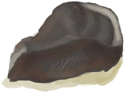
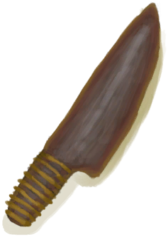

# Flint  
> I could make a sharp knife out of this. Can practice knapping by striking it with a stone.  
  
<table class="table table-bordered" data-toggle="table"  data-show-header="false"><thead style="display:none"><tr ><th  style="width:50%;text-align:left;vertical-align:top;"  >title</th><th  style="width:50%;text-align:left;vertical-align:top;"  ></th></tr></thead><tr ><td  style="width:50%;text-align:left;vertical-align:top;"  >**Weight：**100  **Tag：**	[“Hammer”](tag_Hammer.md), [“Heavy”](tag_Heavy.md), [“Pretty”](tag_Pretty.md)</td><td  style="width:50%;text-align:left;vertical-align:top;"  >

<a href="Flint.md" style="color:black">Flint</a>

"Flint is a hard sedimentary rock made of microscopic quartz crystals that can be found in the <b>Rocky Areas</b> of the island. Its ability to break into sharp pieces makes it ideal for crafting tools like knives and spears.   Flint tools require the <b>Knapping</b> skill to craft and provide a more accessible alternative for making sharp tools than <b>Copper</b>.  <b>Flint Knives</b> are sharp enough to work wood</td></tr></tbody></table>  
  
## Got From  

** With：**[Stone](Stone.md)Split

[Flint Slab](FlintSlab.md)

Transform

[Flint Axe](AxeFlint.md)

Explore

[Flooded Chamber](FloodedChamber.md)

Explore

[High Chamber](HighChamber.md)

Explore

[Low Chamber(High Chamber)](LowChamber.md)

Explore

[Medium Chamber(High Chamber)](MidChamber.md)

Explore

[Desolate Beach](DesolateBeach.md)

Explore

[Eastern Highlands](HighlandsEastern.md)

Explore

[Western Highlands](HighlandsWestern.md)

Explore

[Jungle Highlands](JungleHighlands.md)

Explore

[Rocks](Rocks.md)

Dive

[Sea(Desolate Beach)](Sea_DesolateBeach.md)

  
  
## Action  

<table><tr><td rowspan="2" style="width:200px;text-align:center;font-size:1.3em;font-weight:bold">

Practice Rock Throwing

1h

</td><td>[“HandAction(Group)”](HandAction.md)</td></tr><tr><td></td></tr><tr><td colspan="2"><b>Require：</b>[Hand Modifier](ModifierHand.md): <b>0-2</b></td></tr><tr><td colspan="2"><b>StatChange：</b>[

[Rock Throwing(Skill)](Skill_RockThrowing.md)](Skill_RockThrowing.md)<b>+1</b>, [

[Morale](Morale.md)](Morale.md)<b>+0.25</b></td></tr></table>
  
  
  
## Drag With  

<table style="margin-bottom:0px;"><tr><td style="width:40%;text-align:left; background-color:#FEFEFE"><b>With：</b>[

[Stone](Stone.md)](Stone.md)</td><td style="width:40%;font-size:1em;font-weight:bold;background-color:#FEFEFE">Practice Knapping (1h) [“HandAction(Group)”](HandAction.md), [“CraftAction(Group)”](CraftAction.md)</td></tr><tr><td colspan="2"><b>Require：</b>[

[Light](Light.md)](Light.md): <b>10-100</b></td></tr><tr style="background-color:#FFFFFF"><td style=""><b>Receiving：</b></td><td style=""><b>Self：</b>→Dismiss</td></tr><tr><td colspan="2"><b>StatChange：</b>[

[Hand Damage](HandDamage.md)](HandDamage.md)<b>+20</b>, [

[Knapping(Skill)](Skill_Knapping.md)](Skill_Knapping.md)<b>+2</b></td></tr></table>
  
  
## Drag To  

[Copper Vein(High Chamber)](CopperVein.md)

[Dirt Pile](DirtPile.md)

[Stove(Off)](StoveExtinguished.md)

[Mud Pile](MudPile.md)

[Watering Trough](WateringTrough.md)

[Bone Splinters](BoneSplinters.md)

[Bones](Bones.md)

[Charcoal](Charcoal.md)

[Coconut](Coconut.md)

[Husked Coconut](CoconutHusked.md)

[Perforated Coconut](CoconutPerforated.md)

[Rotten Coconut](CoconutRotten.md)

[Conch](Conch.md)

[Copper Decoration](CopperDecoration_Mold.md)

[Feathers](Feathers.md)

[Dried Chilies](ChiliesDried.md)

[Conch Meat](ConchMeat.md)

[Ginger](Ginger.md)

[Dried Ginger](GingerDried.md)

[Jasmine Flowers](JasmineFlowers.md)

[Kava Root](KavaRoot.md)

[Dried Kava Root](KavaRootDried.md)

[Lemongrass](LemongrassStalks.md)

[Snake Grass](SnakeGrass.md)

[Spider Lily Leaves](SpiderLilyLeaves.md)

[Dried Spider Lily Leaves](SpiderLilyLeavesDried.md)

[Geode](Geode.md)

[Giant Conch](GiantConch.md)

[Burnt Mortar](MortarBurnt.md)

[Mud Brick](MudBrick.md)

[Niter Crystals](NiterCrystals.md)

[Oyster](Oyster.md)

[Burnt Stone](StoneBurnt.md)

[Burnt Heavy Stone](StoneHeavyBurnt.md)

[Tropical Almonds](TropicalAlmonds.md)

[Urchin](Urchin.md)

[Brimstone Vent(Volcano)](VentBrimstone.md)

[Weston](Weston.md)

[Narrow Passage(High Chamber)](CrystalChamberEntranceClosed.md)

[Narrow Passage(Damp Chamber)](DarkCaveCaveEntranceClosed.md)

[Narrow Passage(High Chamber)](DarkChamberCaveEntranceClosed.md)

[Narrow Passage(High Chamber)](FloodedChamberEntranceClosed.md)

[Narrow Passage(Tunnel)](HighChamberEntranceClosed.md)

[Water Filter](WaterFilter.md)

  
  
## Use In BluePrint  

<a href="Bp_FlintKnife.md" style="color:black">Flint Knife</a>

<a href="Bp_FlintSpear.md" style="color:black">Flint Spear</a>

  
  
  

