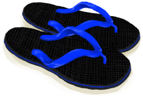

# Flipflops  
> "Flip flop! Not very comfortable after long periods of time  
  
<table class="table table-bordered" data-toggle="table"  data-show-header="false"><thead style="display:none"><tr ><th  style="width:50%;text-align:left;vertical-align:top;"  >title</th><th  style="width:50%;text-align:left;vertical-align:top;"  ></th></tr></thead><tr ><td  style="width:50%;text-align:left;vertical-align:top;"  >**Weight：**150  **装备时减重：**-150  **Tag：**	[“Left Foot (Outer)”](tag_OuterFeet.md)  **Equipped Cards：**[“Shoes”](eTag_Shoes.md)  **Usage：**2000  ** Effect: ** [

[Temperature](TemperaturePerceived.md)](TemperaturePerceived.md) [

[Foot Damage](FootDamage.md)](FootDamage.md)addition<b>-1.5</b> [

[Foot Protection](FootProtection.md)](FootProtection.md)<b>+4</b> [

[Mental Structure](Structure.md)](Structure.md)addition<b>+0.1</b></td><td  style="width:50%;text-align:left;vertical-align:top;"  >

<a href="Flipflops.md" style="color:black">Flipflops</a>

</td></tr></tbody></table>  
  
## Got From  

Perk Effect

[Tourist](Pk_2_Tourist.md)

  
  
## Durability   

<table style="margin-bottom:0px;"><tr><td style="width:30%;text-align:left; background-color:#FEFEFE;font-size:1.3em;font-weight:bold;">Usage</td><td style="font-size:1em;background-color:#FEFEFE">Starting：2000 , Max：2000 -</td></tr><tr style="background-color:#FFFFFF"><td colspan=2>** On Zero： ** Self: →Dismiss</td></tr></table>
  

