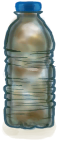

# Floating Debris  
> I could probably find something useful in there.  
  
<table class="table table-bordered" data-toggle="table"  data-show-header="false"><thead style="display:none"><tr ><th  style="width:50%;text-align:left;vertical-align:top;"  >title</th><th  style="width:50%;text-align:left;vertical-align:top;"  ></th></tr></thead><tr ><td  style="width:50%;text-align:left;vertical-align:top;"  >** Effect: ** [

[Discomfort](Discomfort.md)](Discomfort.md)<b>+250</b></td><td  style="width:50%;text-align:left;vertical-align:top;"  >

<a href="FloatingDebris.md" style="color:black">Floating Debris</a>

</td></tr></tbody></table>  
  
## Got From  

Continue

[Floating Debris!(Event)](Event_Raft_FloatingDebris.md)

  
  
## Action  

<table><tr><td rowspan="2" style="width:200px;text-align:center;font-size:1.3em;font-weight:bold">

Harvest

30m

</td><td></td></tr><tr><td><b>Self：</b>→Dismiss</td></tr><tr><td colspan="2"><b>Require：</b>[

[Light](Light.md)](Light.md): <b>10-100</b></td></tr><tr><td colspan="2"><b>StatChange：</b>[

[Stamina](Stamina.md)](Stamina.md)<b>-8</b>, [

[Hand Damage](HandDamage.md)](HandDamage.md)<b>+10</b>, [

[Filth](Filth.md)](Filth.md)<b>+25</b></td></tr><tr><td colspan="2">

<table style="margin-bottom:3px;"><tr><td rowspan=2 style="text-align:center" width="80px">
Base Weight

1
</td><td style="font-size:0.6em;line-height:0.6em;font-weight:bold">Plastic</td></tr><tr><td>[

[Wood](Wood.md)](Wood.md)(<b>+0～+1</b>), [

[Rope](Rope.md)](Rope.md)(<b>+0</b>), [

[Sticks](Sticks.md)](Sticks.md)(<b>+0～+1</b>), [

[Fiber Cord](CordFiber.md)](CordFiber.md)(<b>+0～+4</b>), [

[Plastic Sheet](PlasticSheet.md)](PlasticSheet.md)(<b>+0～+1</b>), [

[Plastic Bottle](PlasticBottle.md)](PlasticBottle.md)(<b>+1～+4</b>), [

[Crab](Crab.md)](Crab.md)(<b>+0～+4</b>)</td></tr></table>

<table style="margin-bottom:3px;"><tr><td rowspan=2 style="text-align:center" width="80px">
Base Weight

1
</td><td style="font-size:0.6em;line-height:0.6em;font-weight:bold">Cord</td></tr><tr><td>[

[Wood](Wood.md)](Wood.md)(<b>+0～+1</b>), [

[Rope](Rope.md)](Rope.md)(<b>+0～+2</b>), [

[Sticks](Sticks.md)](Sticks.md)(<b>+0～+3</b>), [

[Fiber Cord](CordFiber.md)](CordFiber.md)(<b>+1～+12</b>), [

[Plastic Sheet](PlasticSheet.md)](PlasticSheet.md)(<b>+0</b>), [

[Plastic Bottle](PlasticBottle.md)](PlasticBottle.md)(<b>+0～+1</b>), [

[Crab](Crab.md)](Crab.md)(<b>+0～+4</b>)</td></tr></table>

<table style="margin-bottom:3px;"><tr><td rowspan=2 style="text-align:center" width="80px">
Base Weight

1
</td><td style="font-size:0.6em;line-height:0.6em;font-weight:bold">Wood</td></tr><tr><td>[

[Wood](Wood.md)](Wood.md)(<b>+2～+6</b>), [

[Rope](Rope.md)](Rope.md)(<b>+0</b>), [

[Sticks](Sticks.md)](Sticks.md)(<b>+2～+8</b>), [

[Fiber Cord](CordFiber.md)](CordFiber.md)(<b>+1～+4</b>), [

[Plastic Sheet](PlasticSheet.md)](PlasticSheet.md)(<b>+0</b>), [

[Plastic Bottle](PlasticBottle.md)](PlasticBottle.md)(<b>+0～+1</b>), [

[Crab](Crab.md)](Crab.md)(<b>+0～+4</b>)</td></tr></table>

</td></tr></table>
  
  
  
## Durability   

<table style="margin-bottom:0px;"><tr><td style="width:30%;text-align:left; background-color:#FEFEFE;font-size:1.3em;font-weight:bold;">

Time Left</td><td style="font-size:1em;background-color:#FEFEFE">Starting：4 , Max：4 -1/TP , Duration ：1h</td></tr><tr style="background-color:#FFFFFF"><td colspan=2>** On Zero： ** Self: →Dismiss [

[Floating Debris Missed(Event)](Event_FloatingDebrisMissed.md)](Event_FloatingDebrisMissed.md)(<b>+1</b>)</td></tr></table>
  

