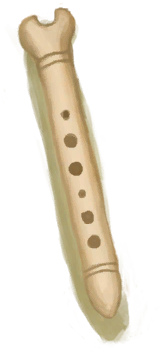

# Bone Flute  
> A simple wind instrument.  
  
<table class="table table-bordered" data-toggle="table"  data-show-header="false"><thead style="display:none"><tr ><th  style="width:50%;text-align:left;vertical-align:top;"  >title</th><th  style="width:50%;text-align:left;vertical-align:top;"  ></th></tr></thead><tr ><td  style="width:50%;text-align:left;vertical-align:top;"  >** Cannot Be Trashed **  **Weight：**100  **Tag：**	[“Decoration”](tag_Decoration.md)</td><td  style="width:50%;text-align:left;vertical-align:top;"  >

<a href="FluteBone.md" style="color:black">Bone Flute</a>

</td></tr></tbody></table>  
  
## Got From  

Finished!

[Unfinished  Bone Flute](FluteBone_Unfinished.md)

  
  
## Action  

<table><tr><td rowspan="2" style="width:200px;text-align:center;font-size:1.3em;font-weight:bold">

Practice

1h

</td><td></td></tr><tr><td></td></tr><tr><td colspan="2"><b>Require：</b>[

[Wind Instruments(Skill)](Skill_WindInstruments.md)](Skill_WindInstruments.md): <b>0-30</b></td></tr><tr><td colspan="2"><b>StatChange：</b>[

[Wind Instruments(Skill)](Skill_WindInstruments.md)](Skill_WindInstruments.md)<b>+1</b>, [

[Stamina](Stamina.md)](Stamina.md)<b>-3</b> (/TP), [

[Morale](Morale.md)](Morale.md)<b>+2</b> (/TP), [

[Stress](Stress.md)](Stress.md)<b>-24</b>, [

[Entertainment](Entertainment.md)](Entertainment.md)<b>+8</b></td></tr></table>
  

<table><tr><td rowspan="2" style="width:200px;text-align:center;font-size:1.3em;font-weight:bold">

Compose

2h

</td><td></td></tr><tr><td></td></tr><tr><td colspan="2"><b>Require：</b>[

[Wind Instruments(Skill)](Skill_WindInstruments.md)](Skill_WindInstruments.md): <b>15-150</b></td></tr><tr><td colspan="2"><b>StatChange：</b>[

[Wind Instruments(Skill)](Skill_WindInstruments.md)](Skill_WindInstruments.md)<b>+1</b>, [

[Stamina](Stamina.md)](Stamina.md)<b>-3</b> (/TP), [

[Morale](Morale.md)](Morale.md)<b>+2</b> (/TP), [

[Stress](Stress.md)](Stress.md)<b>-24</b>, [

[Entertainment](Entertainment.md)](Entertainment.md)<b>+8</b></td></tr><tr><td colspan="2">

<table style="margin-bottom:3px;"><tr><td rowspan=2 style="text-align:center" width="80px">
Base Weight

1000
</td><td style="font-size:0.6em;line-height:0.6em;font-weight:bold">Nothing</td></tr><tr><td></td></tr></table>

<table style="margin-bottom:3px;"><tr><td rowspan=2 style="text-align:center" width="80px">
Base Weight

1000
</td><td style="font-size:0.6em;line-height:0.6em;font-weight:bold">Simple</td></tr><tr><td>[

[Simple Tune(Event)](Event_NewTuneSimple.md)](Event_NewTuneSimple.md)(<b>+1</b>)</td></tr><tr><td colspan=2><li>[Tune - Simple](Tune_Simple.md) in <b>0</b>, weight<b>+0</b>，否则权重-1000000</li></td></tr></table>

<table style="margin-bottom:3px;"><tr><td rowspan=2 style="text-align:center" width="80px">
Base Weight

0
</td><td style="font-size:0.6em;line-height:0.6em;font-weight:bold">Happy</td></tr><tr><td>[

[Happy Tune(Event)](Event_NewTuneHappy.md)](Event_NewTuneHappy.md)(<b>+1</b>)</td></tr><tr><td colspan=2><li>[

[Wind Instruments(Skill)](Skill_WindInstruments.md)](Skill_WindInstruments.md) in <b>30～150(20%～100%)</b>, weight<b>-1000～+0</b></li><li>[

[Morale](Morale.md)](Morale.md) in <b>-350～350</b>, weight<b>-1000～+1000</b></li><li>[Tune - Happy](Tune_Happy.md) in <b>0</b>, weight<b>+0</b>，否则权重-1000000</li><li>[Tune - Simple](Tune_Simple.md) in <b>1</b>, weight<b>+0</b>，否则权重-1000000</li></td></tr></table>

<table style="margin-bottom:3px;"><tr><td rowspan=2 style="text-align:center" width="80px">
Base Weight

0
</td><td style="font-size:0.6em;line-height:0.6em;font-weight:bold">Sad</td></tr><tr><td>[

[Sad Tune(Event)](Event_NewTuneSad.md)](Event_NewTuneSad.md)(<b>+1</b>)</td></tr><tr><td colspan=2><li>[

[Wind Instruments(Skill)](Skill_WindInstruments.md)](Skill_WindInstruments.md) in <b>30～150(20%～100%)</b>, weight<b>-1000～+0</b></li><li>[

[Morale](Morale.md)](Morale.md) in <b>-350～350</b>, weight<b>+1000～-1000</b></li><li>[Tune - Sad](Tune_Sad.md) in <b>0</b>, weight<b>+0</b>，否则权重-1000000</li><li>[Tune - Simple](Tune_Simple.md) in <b>1</b>, weight<b>+0</b>，否则权重-1000000</li></td></tr></table>

<table style="margin-bottom:3px;"><tr><td rowspan=2 style="text-align:center" width="80px">
Base Weight

0
</td><td style="font-size:0.6em;line-height:0.6em;font-weight:bold">Lonely</td></tr><tr><td>[

[Lonely Tune(Event)](Event_NewTuneLonely.md)](Event_NewTuneLonely.md)(<b>+1</b>)</td></tr><tr><td colspan=2><li>[

[Wind Instruments(Skill)](Skill_WindInstruments.md)](Skill_WindInstruments.md) in <b>30～150(20%～100%)</b>, weight<b>-1000～+0</b></li><li>[

[Loneliness](Loneliness.md)](Loneliness.md) in <b>0～4880</b>, weight<b>-1000～+1000</b></li><li>[Tune - Lonely](Tune_Lonely.md) in <b>0</b>, weight<b>+0</b>，否则权重-1000000</li><li>[Tune - Simple](Tune_Simple.md) in <b>1</b>, weight<b>+0</b>，否则权重-1000000</li></td></tr></table>

<table style="margin-bottom:3px;"><tr><td rowspan=2 style="text-align:center" width="80px">
Base Weight

0
</td><td style="font-size:0.6em;line-height:0.6em;font-weight:bold">Weston</td></tr><tr><td>[

[Weston's Tune(Event)](Event_NewTuneWeston.md)](Event_NewTuneWeston.md)(<b>+1</b>)</td></tr><tr><td colspan=2><li>[

[Wind Instruments(Skill)](Skill_WindInstruments.md)](Skill_WindInstruments.md) in <b>30～150(20%～100%)</b>, weight<b>-1000～+0</b></li><li>[Weston Propinquity](WestonPropinquity.md) in <b>4000～5000</b>, weight<b>+0～+1000</b>，否则权重-1000000</li><li>[Tune - Weston](Tune_Weston.md) in <b>0</b>, weight<b>+0</b>，否则权重-1000000</li><li>[Tune - Simple](Tune_Simple.md) in <b>1</b>, weight<b>+0</b>，否则权重-1000000</li></td></tr></table>

<table style="margin-bottom:3px;"><tr><td rowspan=2 style="text-align:center" width="80px">
Base Weight

0
</td><td style="font-size:0.6em;line-height:0.6em;font-weight:bold">Advanced</td></tr><tr><td>[

[Advanced Tune(Event)](Event_NewTuneAdvanced.md)](Event_NewTuneAdvanced.md)(<b>+1</b>)</td></tr><tr><td colspan=2><li>[

[Wind Instruments(Skill)](Skill_WindInstruments.md)](Skill_WindInstruments.md) in <b>75～150(50%～100%)</b>, weight<b>+0～+1000</b></li><li>[Tune - Advanced](Tune_Advanced.md) in <b>0</b>, weight<b>+0</b>，否则权重-1000000</li><li>[Tune - Simple](Tune_Simple.md) in <b>1</b>, weight<b>+0</b>，否则权重-1000000</li></td></tr></table>

<table style="margin-bottom:3px;"><tr><td rowspan=2 style="text-align:center" width="80px">
Base Weight

0
</td><td style="font-size:0.6em;line-height:0.6em;font-weight:bold">Sea</td></tr><tr><td>[

[Sea Tune(Event)](Event_NewTuneSea.md)](Event_NewTuneSea.md)(<b>+1</b>)</td></tr><tr><td colspan=2><li>[

[Wind Instruments(Skill)](Skill_WindInstruments.md)](Skill_WindInstruments.md) in <b>50～150(33.33%～100%)</b>, weight<b>-1000～+0</b>，否则权重-1000000</li><li>[Tune - Sea](Tune_Sea.md) in <b>0</b>, weight<b>+0</b>，否则权重-1000000</li><li>[Tune - Simple](Tune_Simple.md) in <b>1</b>, weight<b>+0</b>，否则权重-1000000</li><li>[“Sea”](tag_Sea.md) On *Hand/Board*，Weight<b>+1000</b>,</li></td></tr></table>

<table style="margin-bottom:3px;"><tr><td rowspan=2 style="text-align:center" width="80px">
Base Weight

0
</td><td style="font-size:0.6em;line-height:0.6em;font-weight:bold">Jungle</td></tr><tr><td>[

[Jungle Tune(Event)](Event_NewTuneJungle.md)](Event_NewTuneJungle.md)(<b>+1</b>)</td></tr><tr><td colspan=2><li>[

[Wind Instruments(Skill)](Skill_WindInstruments.md)](Skill_WindInstruments.md) in <b>50～150(33.33%～100%)</b>, weight<b>-1000～+0</b>，否则权重-1000000</li><li>[Tune - Jungle](Tune_Jungle.md) in <b>0</b>, weight<b>+0</b>，否则权重-1000000</li><li>[Tune - Simple](Tune_Simple.md) in <b>1</b>, weight<b>+0</b>，否则权重-1000000</li><li>[“Jungle”](tag_Jungle.md) On *Hand/Board*，Weight<b>+1000</b>,</li></td></tr></table>

<table style="margin-bottom:3px;"><tr><td rowspan=2 style="text-align:center" width="80px">
Base Weight

0
</td><td style="font-size:0.6em;line-height:0.6em;font-weight:bold">Cave</td></tr><tr><td>[

[Cave Tune(Event)](Event_NewTuneCave.md)](Event_NewTuneCave.md)(<b>+1</b>)</td></tr><tr><td colspan=2><li>[

[Wind Instruments(Skill)](Skill_WindInstruments.md)](Skill_WindInstruments.md) in <b>50～150(33.33%～100%)</b>, weight<b>-1000～+0</b>，否则权重-1000000</li><li>[Tune - Cave](Tune_Cave.md) in <b>0</b>, weight<b>+0</b>，否则权重-1000000</li><li>[Tune - Simple](Tune_Simple.md) in <b>1</b>, weight<b>+0</b>，否则权重-1000000</li><li>[“Cave System”](tag_EnvCaveSystem.md) On *Hand/Board*，Weight<b>+1000</b>,</li></td></tr></table>
<button class="btn btn-secondary btn-sm" style="" data-toggle="modal" onclick="setCollectionDataBase64('eyJ0aXRsZSI6IlNpbXVsYXRvcjogQ29tcG9zZSAoQm9uZSBGbHV0ZSkiLCJjb2xsZWN0aW9ucyI6W3siZHJvcCI6Ii0iLCJiYXNlIjoxMDAwLCJjb25kaXRpb24iOltdfSx7ImRyb3AiOiI8ZGl2IHN0eWxlPVwid2lkdGg6MjVweDtkaXNwbGF5OmlubGluZS1ibG9jazt0ZXh0LWFsaWduOmNlbnRlclwiPjxpbWcgZGVjb2Rpbmc9XCJhc3luY1wiIHNyYz1cIlNwcml0ZS9EcnVtLnBuZ1wiIGhyZWY9XCJhLm1kXCIgc3R5bGU9XCJtYXgtd2lkdGg6MjVweDttYXgtaGVpZ2h0OjI1cHg7XCI+PC9kaXY+U2ltcGxlIFR1bmUoRXZlbnQpIiwiYmFzZSI6MTAwMCwiY29uZGl0aW9uIjpbeyJrZXkiOiJUdW5lX1NpbXBsZSIsInRpdGxlIjoiVHVuZSAtIFNpbXBsZSIsInR5cGUiOiJyYW5nZSIsIm1heCI6WzAsMV0sInJhbmdlIjpbMCwwXSwid2VpZ2h0IjpbMCwwXSwiZGVmYXVsdFZhbHVlIjowLCJ3aGVuT3V0T2ZSYW5nZSI6Mn1dfSx7ImRyb3AiOiI8ZGl2IHN0eWxlPVwid2lkdGg6MjVweDtkaXNwbGF5OmlubGluZS1ibG9jazt0ZXh0LWFsaWduOmNlbnRlclwiPjxpbWcgZGVjb2Rpbmc9XCJhc3luY1wiIHNyYz1cIlNwcml0ZS9EcnVtLnBuZ1wiIGhyZWY9XCJhLm1kXCIgc3R5bGU9XCJtYXgtd2lkdGg6MjVweDttYXgtaGVpZ2h0OjI1cHg7XCI+PC9kaXY+SGFwcHkgVHVuZShFdmVudCkiLCJiYXNlIjowLCJjb25kaXRpb24iOlt7ImtleSI6IlNraWxsX1dpbmRJbnN0cnVtZW50cyIsInRpdGxlIjoiV2luZCBJbnN0cnVtZW50cyhTa2lsbCkiLCJ0eXBlIjoicmFuZ2UiLCJtYXgiOlswLDE1MF0sInJhbmdlIjpbMzAsMTUwXSwid2VpZ2h0IjpbLTEwMDAsMF0sImRlZmF1bHRWYWx1ZSI6MCwid2hlbk91dE9mUmFuZ2UiOjB9LHsia2V5IjoiTW9yYWxlIiwidGl0bGUiOiJNb3JhbGUiLCJ0eXBlIjoicmFuZ2UiLCJtYXgiOlstMzUwLDM1MF0sInJhbmdlIjpbLTM1MCwzNTBdLCJ3ZWlnaHQiOlstMTAwMCwxMDAwXSwiZGVmYXVsdFZhbHVlIjowLCJ3aGVuT3V0T2ZSYW5nZSI6MH0seyJrZXkiOiJUdW5lX0hhcHB5IiwidGl0bGUiOiJUdW5lIC0gSGFwcHkiLCJ0eXBlIjoicmFuZ2UiLCJtYXgiOlswLDFdLCJyYW5nZSI6WzAsMF0sIndlaWdodCI6WzAsMF0sImRlZmF1bHRWYWx1ZSI6MCwid2hlbk91dE9mUmFuZ2UiOjJ9LHsia2V5IjoiVHVuZV9TaW1wbGUiLCJ0aXRsZSI6IlR1bmUgLSBTaW1wbGUiLCJ0eXBlIjoicmFuZ2UiLCJtYXgiOlswLDFdLCJyYW5nZSI6WzEsMV0sIndlaWdodCI6WzAsMF0sImRlZmF1bHRWYWx1ZSI6MCwid2hlbk91dE9mUmFuZ2UiOjJ9XX0seyJkcm9wIjoiPGRpdiBzdHlsZT1cIndpZHRoOjI1cHg7ZGlzcGxheTppbmxpbmUtYmxvY2s7dGV4dC1hbGlnbjpjZW50ZXJcIj48aW1nIGRlY29kaW5nPVwiYXN5bmNcIiBzcmM9XCJTcHJpdGUvRHJ1bS5wbmdcIiBocmVmPVwiYS5tZFwiIHN0eWxlPVwibWF4LXdpZHRoOjI1cHg7bWF4LWhlaWdodDoyNXB4O1wiPjwvZGl2PlNhZCBUdW5lKEV2ZW50KSIsImJhc2UiOjAsImNvbmRpdGlvbiI6W3sia2V5IjoiU2tpbGxfV2luZEluc3RydW1lbnRzIiwidGl0bGUiOiJXaW5kIEluc3RydW1lbnRzKFNraWxsKSIsInR5cGUiOiJyYW5nZSIsIm1heCI6WzAsMTUwXSwicmFuZ2UiOlszMCwxNTBdLCJ3ZWlnaHQiOlstMTAwMCwwXSwiZGVmYXVsdFZhbHVlIjowLCJ3aGVuT3V0T2ZSYW5nZSI6MH0seyJrZXkiOiJNb3JhbGUiLCJ0aXRsZSI6Ik1vcmFsZSIsInR5cGUiOiJyYW5nZSIsIm1heCI6Wy0zNTAsMzUwXSwicmFuZ2UiOlstMzUwLDM1MF0sIndlaWdodCI6WzEwMDAsLTEwMDBdLCJkZWZhdWx0VmFsdWUiOjAsIndoZW5PdXRPZlJhbmdlIjowfSx7ImtleSI6IlR1bmVfU2FkIiwidGl0bGUiOiJUdW5lIC0gU2FkIiwidHlwZSI6InJhbmdlIiwibWF4IjpbMCwxXSwicmFuZ2UiOlswLDBdLCJ3ZWlnaHQiOlswLDBdLCJkZWZhdWx0VmFsdWUiOjAsIndoZW5PdXRPZlJhbmdlIjoyfSx7ImtleSI6IlR1bmVfU2ltcGxlIiwidGl0bGUiOiJUdW5lIC0gU2ltcGxlIiwidHlwZSI6InJhbmdlIiwibWF4IjpbMCwxXSwicmFuZ2UiOlsxLDFdLCJ3ZWlnaHQiOlswLDBdLCJkZWZhdWx0VmFsdWUiOjAsIndoZW5PdXRPZlJhbmdlIjoyfV19LHsiZHJvcCI6IjxkaXYgc3R5bGU9XCJ3aWR0aDoyNXB4O2Rpc3BsYXk6aW5saW5lLWJsb2NrO3RleHQtYWxpZ246Y2VudGVyXCI+PGltZyBkZWNvZGluZz1cImFzeW5jXCIgc3JjPVwiU3ByaXRlL0RydW0ucG5nXCIgaHJlZj1cImEubWRcIiBzdHlsZT1cIm1heC13aWR0aDoyNXB4O21heC1oZWlnaHQ6MjVweDtcIj48L2Rpdj5Mb25lbHkgVHVuZShFdmVudCkiLCJiYXNlIjowLCJjb25kaXRpb24iOlt7ImtleSI6IlNraWxsX1dpbmRJbnN0cnVtZW50cyIsInRpdGxlIjoiV2luZCBJbnN0cnVtZW50cyhTa2lsbCkiLCJ0eXBlIjoicmFuZ2UiLCJtYXgiOlswLDE1MF0sInJhbmdlIjpbMzAsMTUwXSwid2VpZ2h0IjpbLTEwMDAsMF0sImRlZmF1bHRWYWx1ZSI6MCwid2hlbk91dE9mUmFuZ2UiOjB9LHsia2V5IjoiTG9uZWxpbmVzcyIsInRpdGxlIjoiTG9uZWxpbmVzcyIsInR5cGUiOiJyYW5nZSIsIm1heCI6WzAsNDg4MF0sInJhbmdlIjpbMCw0ODgwXSwid2VpZ2h0IjpbLTEwMDAsMTAwMF0sImRlZmF1bHRWYWx1ZSI6MCwid2hlbk91dE9mUmFuZ2UiOjB9LHsia2V5IjoiVHVuZV9Mb25lbHkiLCJ0aXRsZSI6IlR1bmUgLSBMb25lbHkiLCJ0eXBlIjoicmFuZ2UiLCJtYXgiOlswLDFdLCJyYW5nZSI6WzAsMF0sIndlaWdodCI6WzAsMF0sImRlZmF1bHRWYWx1ZSI6MCwid2hlbk91dE9mUmFuZ2UiOjJ9LHsia2V5IjoiVHVuZV9TaW1wbGUiLCJ0aXRsZSI6IlR1bmUgLSBTaW1wbGUiLCJ0eXBlIjoicmFuZ2UiLCJtYXgiOlswLDFdLCJyYW5nZSI6WzEsMV0sIndlaWdodCI6WzAsMF0sImRlZmF1bHRWYWx1ZSI6MCwid2hlbk91dE9mUmFuZ2UiOjJ9XX0seyJkcm9wIjoiPGRpdiBzdHlsZT1cIndpZHRoOjI1cHg7ZGlzcGxheTppbmxpbmUtYmxvY2s7dGV4dC1hbGlnbjpjZW50ZXJcIj48aW1nIGRlY29kaW5nPVwiYXN5bmNcIiBzcmM9XCJTcHJpdGUvRHJ1bS5wbmdcIiBocmVmPVwiYS5tZFwiIHN0eWxlPVwibWF4LXdpZHRoOjI1cHg7bWF4LWhlaWdodDoyNXB4O1wiPjwvZGl2Pldlc3RvbidzIFR1bmUoRXZlbnQpIiwiYmFzZSI6MCwiY29uZGl0aW9uIjpbeyJrZXkiOiJTa2lsbF9XaW5kSW5zdHJ1bWVudHMiLCJ0aXRsZSI6IldpbmQgSW5zdHJ1bWVudHMoU2tpbGwpIiwidHlwZSI6InJhbmdlIiwibWF4IjpbMCwxNTBdLCJyYW5nZSI6WzMwLDE1MF0sIndlaWdodCI6Wy0xMDAwLDBdLCJkZWZhdWx0VmFsdWUiOjAsIndoZW5PdXRPZlJhbmdlIjowfSx7ImtleSI6Ildlc3RvblByb3BpbnF1aXR5IiwidGl0bGUiOiJXZXN0b24gUHJvcGlucXVpdHkiLCJ0eXBlIjoicmFuZ2UiLCJtYXgiOlswLDUwMDBdLCJyYW5nZSI6WzQwMDAsNTAwMF0sIndlaWdodCI6WzAsMTAwMF0sImRlZmF1bHRWYWx1ZSI6MCwid2hlbk91dE9mUmFuZ2UiOjJ9LHsia2V5IjoiVHVuZV9XZXN0b24iLCJ0aXRsZSI6IlR1bmUgLSBXZXN0b24iLCJ0eXBlIjoicmFuZ2UiLCJtYXgiOlswLDFdLCJyYW5nZSI6WzAsMF0sIndlaWdodCI6WzAsMF0sImRlZmF1bHRWYWx1ZSI6MCwid2hlbk91dE9mUmFuZ2UiOjJ9LHsia2V5IjoiVHVuZV9TaW1wbGUiLCJ0aXRsZSI6IlR1bmUgLSBTaW1wbGUiLCJ0eXBlIjoicmFuZ2UiLCJtYXgiOlswLDFdLCJyYW5nZSI6WzEsMV0sIndlaWdodCI6WzAsMF0sImRlZmF1bHRWYWx1ZSI6MCwid2hlbk91dE9mUmFuZ2UiOjJ9XX0seyJkcm9wIjoiPGRpdiBzdHlsZT1cIndpZHRoOjI1cHg7ZGlzcGxheTppbmxpbmUtYmxvY2s7dGV4dC1hbGlnbjpjZW50ZXJcIj48aW1nIGRlY29kaW5nPVwiYXN5bmNcIiBzcmM9XCJTcHJpdGUvRHJ1bS5wbmdcIiBocmVmPVwiYS5tZFwiIHN0eWxlPVwibWF4LXdpZHRoOjI1cHg7bWF4LWhlaWdodDoyNXB4O1wiPjwvZGl2PkFkdmFuY2VkIFR1bmUoRXZlbnQpIiwiYmFzZSI6MCwiY29uZGl0aW9uIjpbeyJrZXkiOiJTa2lsbF9XaW5kSW5zdHJ1bWVudHMiLCJ0aXRsZSI6IldpbmQgSW5zdHJ1bWVudHMoU2tpbGwpIiwidHlwZSI6InJhbmdlIiwibWF4IjpbMCwxNTBdLCJyYW5nZSI6Wzc1LDE1MF0sIndlaWdodCI6WzAsMTAwMF0sImRlZmF1bHRWYWx1ZSI6MCwid2hlbk91dE9mUmFuZ2UiOjB9LHsia2V5IjoiVHVuZV9BZHZhbmNlZCIsInRpdGxlIjoiVHVuZSAtIEFkdmFuY2VkIiwidHlwZSI6InJhbmdlIiwibWF4IjpbMCwxXSwicmFuZ2UiOlswLDBdLCJ3ZWlnaHQiOlswLDBdLCJkZWZhdWx0VmFsdWUiOjAsIndoZW5PdXRPZlJhbmdlIjoyfSx7ImtleSI6IlR1bmVfU2ltcGxlIiwidGl0bGUiOiJUdW5lIC0gU2ltcGxlIiwidHlwZSI6InJhbmdlIiwibWF4IjpbMCwxXSwicmFuZ2UiOlsxLDFdLCJ3ZWlnaHQiOlswLDBdLCJkZWZhdWx0VmFsdWUiOjAsIndoZW5PdXRPZlJhbmdlIjoyfV19LHsiZHJvcCI6IjxkaXYgc3R5bGU9XCJ3aWR0aDoyNXB4O2Rpc3BsYXk6aW5saW5lLWJsb2NrO3RleHQtYWxpZ246Y2VudGVyXCI+PGltZyBkZWNvZGluZz1cImFzeW5jXCIgc3JjPVwiU3ByaXRlL0RydW0ucG5nXCIgaHJlZj1cImEubWRcIiBzdHlsZT1cIm1heC13aWR0aDoyNXB4O21heC1oZWlnaHQ6MjVweDtcIj48L2Rpdj5TZWEgVHVuZShFdmVudCkiLCJiYXNlIjowLCJjb25kaXRpb24iOlt7ImtleSI6IlNraWxsX1dpbmRJbnN0cnVtZW50cyIsInRpdGxlIjoiV2luZCBJbnN0cnVtZW50cyhTa2lsbCkiLCJ0eXBlIjoicmFuZ2UiLCJtYXgiOlswLDE1MF0sInJhbmdlIjpbNTAsMTUwXSwid2VpZ2h0IjpbLTEwMDAsMF0sImRlZmF1bHRWYWx1ZSI6MCwid2hlbk91dE9mUmFuZ2UiOjJ9LHsia2V5IjoiVHVuZV9TZWEiLCJ0aXRsZSI6IlR1bmUgLSBTZWEiLCJ0eXBlIjoicmFuZ2UiLCJtYXgiOlswLDFdLCJyYW5nZSI6WzAsMF0sIndlaWdodCI6WzAsMF0sImRlZmF1bHRWYWx1ZSI6MCwid2hlbk91dE9mUmFuZ2UiOjJ9LHsia2V5IjoiVHVuZV9TaW1wbGUiLCJ0aXRsZSI6IlR1bmUgLSBTaW1wbGUiLCJ0eXBlIjoicmFuZ2UiLCJtYXgiOlswLDFdLCJyYW5nZSI6WzEsMV0sIndlaWdodCI6WzAsMF0sImRlZmF1bHRWYWx1ZSI6MCwid2hlbk91dE9mUmFuZ2UiOjJ9LHsia2V5IjoidGFnX1NlYSIsInRpdGxlIjoi4oCcU2Vh4oCdIE9uICpIYW5kL0JvYXJkKu+8jCIsInR5cGUiOiJ0b2dnbGUiLCJyYW5nZSI6WzAsMV0sIm1heCI6WzAsMV0sIndlaWdodCI6WzAsMTAwMF0sImRlZmF1bHRWYWx1ZSI6MCwid2hlbk91dE9mUmFuZ2UiOjAsIm1heFN0YWNrR3JvdXAiOiIifV19LHsiZHJvcCI6IjxkaXYgc3R5bGU9XCJ3aWR0aDoyNXB4O2Rpc3BsYXk6aW5saW5lLWJsb2NrO3RleHQtYWxpZ246Y2VudGVyXCI+PGltZyBkZWNvZGluZz1cImFzeW5jXCIgc3JjPVwiU3ByaXRlL0RydW0ucG5nXCIgaHJlZj1cImEubWRcIiBzdHlsZT1cIm1heC13aWR0aDoyNXB4O21heC1oZWlnaHQ6MjVweDtcIj48L2Rpdj5KdW5nbGUgVHVuZShFdmVudCkiLCJiYXNlIjowLCJjb25kaXRpb24iOlt7ImtleSI6IlNraWxsX1dpbmRJbnN0cnVtZW50cyIsInRpdGxlIjoiV2luZCBJbnN0cnVtZW50cyhTa2lsbCkiLCJ0eXBlIjoicmFuZ2UiLCJtYXgiOlswLDE1MF0sInJhbmdlIjpbNTAsMTUwXSwid2VpZ2h0IjpbLTEwMDAsMF0sImRlZmF1bHRWYWx1ZSI6MCwid2hlbk91dE9mUmFuZ2UiOjJ9LHsia2V5IjoiVHVuZV9KdW5nbGUiLCJ0aXRsZSI6IlR1bmUgLSBKdW5nbGUiLCJ0eXBlIjoicmFuZ2UiLCJtYXgiOlswLDFdLCJyYW5nZSI6WzAsMF0sIndlaWdodCI6WzAsMF0sImRlZmF1bHRWYWx1ZSI6MCwid2hlbk91dE9mUmFuZ2UiOjJ9LHsia2V5IjoiVHVuZV9TaW1wbGUiLCJ0aXRsZSI6IlR1bmUgLSBTaW1wbGUiLCJ0eXBlIjoicmFuZ2UiLCJtYXgiOlswLDFdLCJyYW5nZSI6WzEsMV0sIndlaWdodCI6WzAsMF0sImRlZmF1bHRWYWx1ZSI6MCwid2hlbk91dE9mUmFuZ2UiOjJ9LHsia2V5IjoidGFnX0p1bmdsZSIsInRpdGxlIjoi4oCcSnVuZ2xl4oCdIE9uICpIYW5kL0JvYXJkKu+8jCIsInR5cGUiOiJ0b2dnbGUiLCJyYW5nZSI6WzAsMV0sIm1heCI6WzAsMV0sIndlaWdodCI6WzAsMTAwMF0sImRlZmF1bHRWYWx1ZSI6MCwid2hlbk91dE9mUmFuZ2UiOjAsIm1heFN0YWNrR3JvdXAiOiIifV19LHsiZHJvcCI6IjxkaXYgc3R5bGU9XCJ3aWR0aDoyNXB4O2Rpc3BsYXk6aW5saW5lLWJsb2NrO3RleHQtYWxpZ246Y2VudGVyXCI+PGltZyBkZWNvZGluZz1cImFzeW5jXCIgc3JjPVwiU3ByaXRlL0RydW0ucG5nXCIgaHJlZj1cImEubWRcIiBzdHlsZT1cIm1heC13aWR0aDoyNXB4O21heC1oZWlnaHQ6MjVweDtcIj48L2Rpdj5DYXZlIFR1bmUoRXZlbnQpIiwiYmFzZSI6MCwiY29uZGl0aW9uIjpbeyJrZXkiOiJTa2lsbF9XaW5kSW5zdHJ1bWVudHMiLCJ0aXRsZSI6IldpbmQgSW5zdHJ1bWVudHMoU2tpbGwpIiwidHlwZSI6InJhbmdlIiwibWF4IjpbMCwxNTBdLCJyYW5nZSI6WzUwLDE1MF0sIndlaWdodCI6Wy0xMDAwLDBdLCJkZWZhdWx0VmFsdWUiOjAsIndoZW5PdXRPZlJhbmdlIjoyfSx7ImtleSI6IlR1bmVfQ2F2ZSIsInRpdGxlIjoiVHVuZSAtIENhdmUiLCJ0eXBlIjoicmFuZ2UiLCJtYXgiOlswLDFdLCJyYW5nZSI6WzAsMF0sIndlaWdodCI6WzAsMF0sImRlZmF1bHRWYWx1ZSI6MCwid2hlbk91dE9mUmFuZ2UiOjJ9LHsia2V5IjoiVHVuZV9TaW1wbGUiLCJ0aXRsZSI6IlR1bmUgLSBTaW1wbGUiLCJ0eXBlIjoicmFuZ2UiLCJtYXgiOlswLDFdLCJyYW5nZSI6WzEsMV0sIndlaWdodCI6WzAsMF0sImRlZmF1bHRWYWx1ZSI6MCwid2hlbk91dE9mUmFuZ2UiOjJ9LHsia2V5IjoidGFnX0VudkNhdmVTeXN0ZW0iLCJ0aXRsZSI6IuKAnENhdmUgU3lzdGVt4oCdIE9uICpIYW5kL0JvYXJkKu+8jCIsInR5cGUiOiJ0b2dnbGUiLCJyYW5nZSI6WzAsMV0sIm1heCI6WzAsMV0sIndlaWdodCI6WzAsMTAwMF0sImRlZmF1bHRWYWx1ZSI6MCwid2hlbk91dE9mUmFuZ2UiOjAsIm1heFN0YWNrR3JvdXAiOiIifV19XX0=')" data-target="#modelCollectionSimulator">Simulator</button>
</td></tr></table>
  

<table><tr><td rowspan="2" style="width:200px;text-align:center;font-size:1.3em;font-weight:bold">

Play Tune

</td><td></td></tr><tr><td></td></tr><tr><td colspan="2"><b>Require：</b>[Tune - Simple](Tune_Simple.md): <b>1-1</b></td></tr><tr><td colspan="2">[

[Page 1(Event)](Event_FluteTunes1.md)](Event_FluteTunes1.md)(<b>+1</b>)</td></tr></table>
  
  
  

