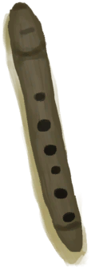

# Unfinished  Wooden Flute  
> A work in progress. Should continue working on it with a knife.  
  
<table class="table table-bordered" data-toggle="table"  data-show-header="false"><thead style="display:none"><tr ><th  style="width:50%;text-align:left;vertical-align:top;"  >title</th><th  style="width:50%;text-align:left;vertical-align:top;"  ></th></tr></thead><tr ><td  style="width:50%;text-align:left;vertical-align:top;"  >**Weight：**150  **Tag：**	[“Fuel”](tag_Fuel.md)</td><td  style="width:50%;text-align:left;vertical-align:top;"  >

<a href="FluteWooden_Unfinished.md" style="color:black">Unfinished  Wooden Flute</a>

</td></tr></tbody></table>  
  
## Got From  

Craft BluePrint

[Wooden Flute(BluePrint)](Bp_FluteWooden.md)

  
  
## Drag With  

<table style="margin-bottom:0px;"><tr><td style="width:40%;text-align:left; background-color:#FEFEFE"><b>With：</b>[“Cutter Advanced”](tag_CutterAdv.md)</td><td style="width:40%;font-size:1em;font-weight:bold;background-color:#FEFEFE">Carve (30m) [“HandAction(Group)”](HandAction.md), [“CraftAction(Group)”](CraftAction.md)</td></tr><tr><td colspan="2"><b>Require：</b>[

[Light](Light.md)](Light.md): <b>10-100</b></td></tr><tr style="background-color:#FFFFFF"><td style=""><b>Receiving：</b>Usage  <b>-1</b></td><td style=""><b>Self：</b>Progress  <b>+1(25%)</b></td></tr><tr><td colspan="2"><b>StatChange：</b>[

[Woodworking(Skill)](Skill_Woodworking.md)](Skill_Woodworking.md)<b>+0.5</b>, [

[Hand Damage](HandDamage.md)](HandDamage.md)<b>+20</b>, [

[Morale](Morale.md)](Morale.md)<b>+5</b>, [

[Stress](Stress.md)](Stress.md)<b>-10</b>, [

[Entertainment](Entertainment.md)](Entertainment.md)<b>+16</b></td></tr></table>
  
  
## Drag To  

[Alembic(Off)](AlembicOff.md)

[Alembic(On)](AlembicOn.md)

[Campfire](Campfire.md)

[Campfire(Off)](CampfireExtinguished.md)

[Clay Fire Pit](ClayFirePit.md)

[Clay Fire Pit(Off)](ClayFirePitExtinguished.md)

[Fire](Fire.md)

[Fire(Off)](FireExtinguished.md)

[Forge](Forge.md)

[Forge(Off)](ForgeExtinguished.md)

[Kiln](Kiln.md)

[Advanced Kiln](KilnAdvanced.md)

[Advanced Kiln(Off)](KilnAdvancedExtinguished.md)

[Kiln(Off)](KilnExtinguished.md)

[Stove](Stove.md)

[Stove(Off)](StoveExtinguished.md)

  
  
## Durability   

<table style="margin-bottom:0px;"><tr><td style="width:30%;text-align:left; background-color:#FEFEFE;font-size:1.3em;font-weight:bold;">Progress</td><td style="font-size:1em;background-color:#FEFEFE">Starting：0 , Max：4 -</td></tr><tr style="background-color:#FFFFFF"><td colspan=2>** On Full：Finished! ** Self: →Dismiss 

<table style="margin-bottom:3px;"><tr><td rowspan=2 style="text-align:center" width="80px">
Base Weight

210
</td><td style="font-size:0.6em;line-height:0.6em;font-weight:bold">Ruined</td></tr><tr><td></td></tr><tr><td colspan=2><li>[

[Woodworking(Skill)](Skill_Woodworking.md)](Skill_Woodworking.md) in <b>30～150</b>, weight<b>+0～-200</b></li></td></tr></table>

<table style="margin-bottom:3px;"><tr><td rowspan=2 style="text-align:center" width="80px">
Base Weight

90
</td><td style="font-size:0.6em;line-height:0.6em;font-weight:bold">Success</td></tr><tr><td>[

[Wooden Flute](FluteWooden.md)](FluteWooden.md)(<b>+1</b>)[

[Morale](Morale.md)](Morale.md)<b>+10</b></td></tr></table>
<button class="btn btn-secondary btn-sm" style="" data-toggle="modal" onclick="setCollectionDataBase64('eyJ0aXRsZSI6IlNpbXVsYXRvcjogdW5kZWZpbmVkIiwiY29sbGVjdGlvbnMiOlt7ImRyb3AiOiItIiwiYmFzZSI6MjEwLCJjb25kaXRpb24iOlt7ImtleSI6IlNraWxsX1dvb2R3b3JraW5nIiwidGl0bGUiOiJXb29kd29ya2luZyhTa2lsbCkiLCJ0eXBlIjoicmFuZ2UiLCJtYXgiOlswLDE1MF0sInJhbmdlIjpbMzAsMTUwXSwid2VpZ2h0IjpbMCwtMjAwXSwiZGVmYXVsdFZhbHVlIjowLCJ3aGVuT3V0T2ZSYW5nZSI6MH1dfSx7ImRyb3AiOiI8ZGl2IHN0eWxlPVwid2lkdGg6MjVweDtkaXNwbGF5OmlubGluZS1ibG9jazt0ZXh0LWFsaWduOmNlbnRlclwiPjxpbWcgZGVjb2Rpbmc9XCJhc3luY1wiIHNyYz1cIlNwcml0ZS9GbHV0ZVdvb2Rlbi5wbmdcIiBocmVmPVwiYS5tZFwiIHN0eWxlPVwibWF4LXdpZHRoOjI1cHg7bWF4LWhlaWdodDoyNXB4O1wiPjwvZGl2Pldvb2RlbiBGbHV0ZSIsImJhc2UiOjkwLCJjb25kaXRpb24iOltdfV19')" data-target="#modelCollectionSimulator">Simulator</button>
</td></tr></table>
  

