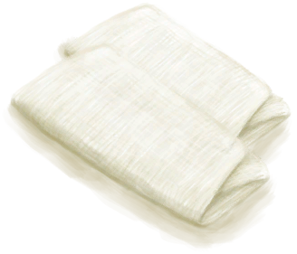

# Foot Protection  
> Protects your feet from different types of damage.  
  

<b>Base Value: </b> 0 
  

<b>Value Range: </b> 0 ~ 10 
  

<b>Base Rate: </b> - 
  
## Related Cards  
[Foot Callouses](CallousesFeet.md)  
## Change By  
<table class="table table-bordered" data-toggle="table"  ><thead style=""><tr ><th  style="text-align:left;vertical-align:top;"  >From</th><th  style="text-align:left;vertical-align:top;"  >Operation</th><th  style="text-align:left;vertical-align:top;"  data-sortable="true"  >Value</th></tr></thead><tr ><td  style="text-align:left;vertical-align:top;"  >[

[Military Boots](MilitaryBoots.md)](MilitaryBoots.md)</td><td  style="text-align:left;vertical-align:top;"  >Passive Effects</td><td  style="text-align:left;vertical-align:top;"  >12</td></tr><tr ><td  style="text-align:left;vertical-align:top;"  >[

[Leather Shoes](LeatherShoes.md)](LeatherShoes.md)</td><td  style="text-align:left;vertical-align:top;"  >Passive Effects</td><td  style="text-align:left;vertical-align:top;"  >8</td></tr><tr ><td  style="text-align:left;vertical-align:top;"  >[

[Sneakers](Sneakers.md)](Sneakers.md)</td><td  style="text-align:left;vertical-align:top;"  >Passive Effects</td><td  style="text-align:left;vertical-align:top;"  >8</td></tr><tr ><td  style="text-align:left;vertical-align:top;"  >[

[Coconut Sandals](CoconutSandals.md)](CoconutSandals.md)</td><td  style="text-align:left;vertical-align:top;"  >Passive Effects</td><td  style="text-align:left;vertical-align:top;"  >5</td></tr><tr ><td  style="text-align:left;vertical-align:top;"  >[

[Flipflops](Flipflops.md)](Flipflops.md)</td><td  style="text-align:left;vertical-align:top;"  >Passive Effects</td><td  style="text-align:left;vertical-align:top;"  >4</td></tr><tr ><td  style="text-align:left;vertical-align:top;"  >[

[Foot Wrappings](FootWrappings.md)](FootWrappings.md)</td><td  style="text-align:left;vertical-align:top;"  >Passive Effects</td><td  style="text-align:left;vertical-align:top;"  >2</td></tr><tr ><td  style="text-align:left;vertical-align:top;"  >[

[Socks](Socks.md)](Socks.md)</td><td  style="text-align:left;vertical-align:top;"  >Passive Effects</td><td  style="text-align:left;vertical-align:top;"  >2</td></tr></tbody></table>  
  
## Required By  
<table class="table table-bordered" data-toggle="table"  ><thead style=""><tr ><th  style="text-align:left;vertical-align:top;"  >From</th><th  style="text-align:left;vertical-align:top;"  >Operation</th><th  style="text-align:left;vertical-align:top;"  data-sortable="true"  >Value</th></tr></thead><tr ><td  style="text-align:left;vertical-align:top;"  >[Urchin!!(Event)](Event_Urchin.md)</td><td  style="text-align:left;vertical-align:top;"  >My shoes protected me!</td><td  style="text-align:left;vertical-align:top;"  >5 ~ 10</td></tr><tr ><td  style="text-align:left;vertical-align:top;"  >[A spider!!(Event)](Event_Spider.md)</td><td  style="text-align:left;vertical-align:top;"  >Didn't manage to hurt me</td><td  style="text-align:left;vertical-align:top;"  >4 ~ 10</td></tr><tr ><td  style="text-align:left;vertical-align:top;"  >[A spider!!(Event)](Event_Spider.md)</td><td  style="text-align:left;vertical-align:top;"  >Check Wound</td><td  style="text-align:left;vertical-align:top;"  >1 ~ 3.9</td></tr><tr ><td  style="text-align:left;vertical-align:top;"  >[A spider!!(Event)](Event_Spider.md)</td><td  style="text-align:left;vertical-align:top;"  >Check Wound</td><td  style="text-align:left;vertical-align:top;"  >0</td></tr><tr ><td  style="text-align:left;vertical-align:top;"  >[Urchin!!(Event)](Event_Urchin.md)</td><td  style="text-align:left;vertical-align:top;"  >Check Wound</td><td  style="text-align:left;vertical-align:top;"  >0 ~ 4</td></tr></tbody></table>  
  

