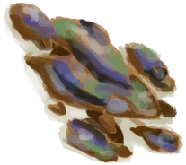

# Cooked Fried Bananas  
> Ready to eat.  
  
<table class="table table-bordered" data-toggle="table"  data-show-header="false"><thead style="display:none"><tr ><th  style="width:50%;text-align:left;vertical-align:top;"  >title</th><th  style="width:50%;text-align:left;vertical-align:top;"  ></th></tr></thead><tr ><td  style="width:50%;text-align:left;vertical-align:top;"  >**Weight：**350  **Tag：**	[“Cookable”](tag_Cookable.md)</td><td  style="width:50%;text-align:left;vertical-align:top;"  >

<a href="FriedBananasCooked.md" style="color:black">Cooked Fried Bananas</a>

</td></tr></tbody></table>  
  
## Got From  

Fried Bananas

[Uncooked Fried Bananas](FriedBananasUncooked.md)

Fried Bananas

[Uncooked Fried Bananas](FriedBananasUncooked.md)

Fried Bananas

[Uncooked Fried Bananas](FriedBananasUncooked.md)

Fried Bananas

[Uncooked Fried Bananas](FriedBananasUncooked.md)

Fried Bananas

[Uncooked Fried Bananas](FriedBananasUncooked.md)

  
  
## Action  

<table><tr><td rowspan="2" style="width:200px;text-align:center;font-size:1.3em;font-weight:bold">

Take

3m

</td><td></td></tr><tr><td><b>Self：</b>→ [

[Cooking Pot](CookingPot.md)](CookingPot.md)</td></tr><tr><td colspan="2">[

[Fried Banana](FriedBanana.md)](FriedBanana.md)(<b>+5</b>)</td></tr></table>
  
  
  
## Durability   

<table style="margin-bottom:0px;"><tr><td style="width:30%;text-align:left; background-color:#FEFEFE;font-size:1.3em;font-weight:bold;">Spoilage</td><td style="font-size:1em;background-color:#FEFEFE">Starting：192 -1/TP , Duration ：2d</td></tr><tr style="background-color:#FFFFFF"><td colspan=2>** On Zero： ** Self: → [

[Cooking Pot](CookingPot.md)](CookingPot.md) [

[Rotten Remains](RottenRemains.md)](RottenRemains.md)(<b>+1</b>)</td></tr></table>
  

