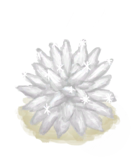
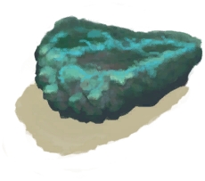

# Geode  
> It might contain something nice inside.  
  
<table class="table table-bordered" data-toggle="table"  data-show-header="false"><thead style="display:none"><tr ><th  style="width:50%;text-align:left;vertical-align:top;"  >title</th><th  style="width:50%;text-align:left;vertical-align:top;"  ></th></tr></thead><tr ><td  style="width:50%;text-align:left;vertical-align:top;"  >** Cannot Be Trashed **  **Weight：**750  **Tag：**	[“Hammer”](tag_Hammer.md)</td><td  style="width:50%;text-align:left;vertical-align:top;"  >

<a href="Geode.md" style="color:black">Geode</a>

</td></tr></tbody></table>  
  
## Got From  

Explore

[Crystal Chamber(High Chamber)](CrystalChamber.md)

Explore

[Damp Chamber](DampChamber.md)

Explore

[Flooded Chamber](FloodedChamber.md)

Explore

[High Chamber](HighChamber.md)

Explore

[Low Chamber(High Chamber)](LowChamber.md)

Explore

[Medium Chamber(High Chamber)](MidChamber.md)

Explore

[Narrow Tunnel(High Chamber)](NarrowTunnel.md)

Explore

[Acid Lake(Volcano)](AcidLake.md)

Explore

[Eastern Highlands](HighlandsEastern.md)

Explore

[Western Highlands](HighlandsWestern.md)

Explore

[Volcano](Volcano.md)

  
  
## Drag With  

<table style="margin-bottom:0px;"><tr><td style="width:40%;text-align:left; background-color:#FEFEFE"><b>With：</b>[“Hammer”](tag_Hammer.md)</td><td style="width:40%;font-size:1em;font-weight:bold;background-color:#FEFEFE">Crack (1h) [“HandAction(Group)”](HandAction.md)</td></tr><tr><td colspan="2"><b>Require：</b>[

[Light](Light.md)](Light.md): <b>10-100</b></td></tr><tr style="background-color:#FFFFFF"><td style=""><b>Receiving：</b></td><td style=""><b>Self：</b>→Dismiss</td></tr><tr><td colspan="2"><b>StatChange：</b>[

[Hand Damage](HandDamage.md)](HandDamage.md)<b>+15</b></td></tr><tr><td colspan="2">

<table style="margin-bottom:3px;"><tr><td rowspan=2 style="text-align:center" width="80px">
Base Weight

55
</td><td style="font-size:0.6em;line-height:0.6em;font-weight:bold">Stone</td></tr><tr><td>[

[Stone](Stone.md)](Stone.md)(<b>+1</b>)</td></tr></table>

<table style="margin-bottom:3px;"><tr><td rowspan=2 style="text-align:center" width="80px">
Base Weight

40
</td><td style="font-size:0.6em;line-height:0.6em;font-weight:bold">Calcite</td></tr><tr><td>[

[Calcite Crystal](Calcite.md)](Calcite.md)(<b>+1</b>)</td></tr></table>

<table style="margin-bottom:3px;"><tr><td rowspan=2 style="text-align:center" width="80px">
Base Weight

10
</td><td style="font-size:0.6em;line-height:0.6em;font-weight:bold">Malachite</td></tr><tr><td>[

[Copper Ore](CopperOre.md)](CopperOre.md)(<b>+1</b>)</td></tr></table>

</td></tr></table>
  
  
## Drag To  

[Copper Vein(High Chamber)](CopperVein.md)

[Dirt Pile](DirtPile.md)

[Stove(Off)](StoveExtinguished.md)

[Mud Pile](MudPile.md)

[Watering Trough](WateringTrough.md)

[Bone Splinters](BoneSplinters.md)

[Bones](Bones.md)

[Charcoal](Charcoal.md)

[Coconut](Coconut.md)

[Husked Coconut](CoconutHusked.md)

[Perforated Coconut](CoconutPerforated.md)

[Rotten Coconut](CoconutRotten.md)

[Conch](Conch.md)

[Copper Decoration](CopperDecoration_Mold.md)

[Feathers](Feathers.md)

[Dried Chilies](ChiliesDried.md)

[Conch Meat](ConchMeat.md)

[Ginger](Ginger.md)

[Dried Ginger](GingerDried.md)

[Jasmine Flowers](JasmineFlowers.md)

[Kava Root](KavaRoot.md)

[Dried Kava Root](KavaRootDried.md)

[Lemongrass](LemongrassStalks.md)

[Snake Grass](SnakeGrass.md)

[Spider Lily Leaves](SpiderLilyLeaves.md)

[Dried Spider Lily Leaves](SpiderLilyLeavesDried.md)

[Geode](Geode.md)

[Giant Conch](GiantConch.md)

[Burnt Mortar](MortarBurnt.md)

[Mud Brick](MudBrick.md)

[Niter Crystals](NiterCrystals.md)

[Oyster](Oyster.md)

[Burnt Stone](StoneBurnt.md)

[Burnt Heavy Stone](StoneHeavyBurnt.md)

[Tropical Almonds](TropicalAlmonds.md)

[Urchin](Urchin.md)

[Brimstone Vent(Volcano)](VentBrimstone.md)

[Weston](Weston.md)

[Narrow Passage(High Chamber)](CrystalChamberEntranceClosed.md)

[Narrow Passage(Damp Chamber)](DarkCaveCaveEntranceClosed.md)

[Narrow Passage(High Chamber)](DarkChamberCaveEntranceClosed.md)

[Narrow Passage(High Chamber)](FloodedChamberEntranceClosed.md)

[Narrow Passage(Tunnel)](HighChamberEntranceClosed.md)

[Water Filter](WaterFilter.md)

  
  

