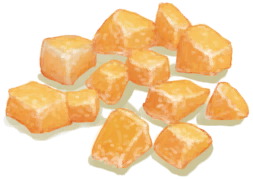

# Ginger  
> Can be ground and prepared into a brew that should boost my immune system and help with stomach problems.  
  
<table class="table table-bordered" data-toggle="table"  data-show-header="false"><thead style="display:none"><tr ><th  style="width:50%;text-align:left;vertical-align:top;"  >title</th><th  style="width:50%;text-align:left;vertical-align:top;"  ></th></tr></thead><tr ><td  style="width:50%;text-align:left;vertical-align:top;"  >**Weight：**75  **Tag：**	[“Feed Omnivorous”](tag_FeedOmnivorous.md), [“Feed Herbivore”](tag_FeedHerb.md), [“Feed”](tag_Feed.md), [“Cookable”](tag_Cookable.md), [“Medium Sugars”](tag_SugarsMedium.md)</td><td  style="width:50%;text-align:left;vertical-align:top;"  >

<a href="Ginger.md" style="color:black">Ginger</a>

"This plant has an edible root with many health benefits.  By grinding it an soaking it in boiling water once can brew an energizing ginger tea that can help settle the stomach</td></tr></tbody></table>  
  
## Got From  

Harvest Roots

[Ginger Plant](GingerPlant.md)

  
  
## Action  

<table><tr><td rowspan="2" style="width:200px;text-align:center;font-size:1.3em;font-weight:bold">

Eat

15m

</td><td>[“VegetarianAction(Group)”](VegetarianAction.md), [“EatingAction(Group)”](EatingAction.md)</td></tr><tr><td><b>Self：</b>→Dismiss</td></tr><tr><td colspan="2"><b>StatChange：</b>[

[Satiation](Satiation.md)](Satiation.md)<b>+10</b>, [

[Stomach](Stomach.md)](Stomach.md)<b>+4</b>, [

[Hydration ](Hydration.md)](Hydration.md)<b>+1</b>, [

[Saturation Vegetables](SaturationVegetables.md)](SaturationVegetables.md)<b>+30</b>, [

[Ginger](GingerEffect.md)](GingerEffect.md)<b>+4</b>, [

[Filth](Filth.md)](Filth.md)<b>+2</b></td></tr></table>
  
  
  
## Drag With  

<table style="margin-bottom:0px;"><tr><td style="width:40%;text-align:left; background-color:#FEFEFE"><b>With：</b>[“Hammer”](tag_Hammer.md)</td><td style="width:40%;font-size:1em;font-weight:bold;background-color:#FEFEFE">Grind Root (15m) [“HandAction(Group)”](HandAction.md)</td></tr><tr><td colspan="2"><b>Require：</b>[

[Light](Light.md)](Light.md): <b>10-100</b></td></tr><tr style="background-color:#FFFFFF"><td style=""><b>Receiving：</b></td><td style=""><b>Self：</b>→ [

[Ground Ginger](GingerGround.md)](GingerGround.md)</td></tr><tr><td colspan="2"><b>StatChange：</b>[

[Weight](Weight.md)](Weight.md)<b>-1</b>, [

[Filth](Filth.md)](Filth.md)<b>+4</b>, [

[Hand Damage](HandDamage.md)](HandDamage.md)<b>+20</b>, [

[Herbology(Skill)](Skill_Herbology.md)](Skill_Herbology.md)<b>+1</b></td></tr></table>
  
  
## Drag To  

[Boar Feeder](BoarFeeder.md)

[Boar Feeder(Empty)](BoarFeederEmpty.md)

[Compost Bin](CompostBin.md)

[Empty Crop Plot(Empty)](CropPlotEmpty.md)

[Goat Feeder](GoatFeeder.md)

[Goat Feeder(Empty)](GoatFeederEmpty.md)

[Partridge Feeder](PartridgeFeeder.md)

[Partridge Feeder(Empty)](PartridgeFeederEmpty.md)

[Trapped Macaque](CageTrapMacaque.md)

[Sow](BoarEnclosureFemale.md)

[Boar](BoarEnclosureMale.md)

[Piglet](BoarEnclosurePiglet.md)

[Sow](BoarTiedFemale.md)

[Boar](BoarTiedMale.md)

[Piglet](BoarTiedPiglet.md)

[Goat](GoatEnclosureFemale.md)

[Juvenile Goat](GoatEnclosureKid.md)

[Lactating Goat](GoatEnclosureLactating.md)

[Male Goat](GoatEnclosureMale.md)

[Goat](GoatTiedFemale.md)

[Lactating Goat](GoatTiedFemaleLactating.md)

[Juvenile Goat](GoatTiedKid.md)

[Male Goat](GoatTiedMale.md)

[Macaque Friend](MacaqueFriend.md)

[Wounded Macaque](MacaqueWounded.md)

[Chick](PartridgeChick.md)

[Partridge](PartridgeFemaleEnclosure.md)

[Partridge](PartridgeFemaleLive.md)

[Male Partridge](PartridgeMaleEnclosure.md)

[Male Partridge](PartridgeMaleLive.md)

  
  
## Use In BluePrint  

<a href="Bp_CandiedGinger.md" style="color:black">Candied Ginger</a>

<a href="Bp_DrunkenCrab.md" style="color:black">Drunken Crab</a>

  
  
  
## Use To Transform  
<table class="table table-bordered" data-toggle="table"  ><thead style=""><tr ><th  style="text-align:left;vertical-align:top;"  >Transform to</th><th  style="text-align:left;vertical-align:top;"  >Container</th></tr></thead><tr ><td  style="text-align:left;vertical-align:top;"  >[

[Dried Ginger](GingerDried.md)](GingerDried.md)</td><td  style="text-align:left;vertical-align:top;"  >[

[Drying Rack](DryingRack.md)](DryingRack.md)</td></tr></tbody></table>  
  
## Durability   

<table style="margin-bottom:0px;"><tr><td style="width:30%;text-align:left; background-color:#FEFEFE;font-size:1.3em;font-weight:bold;">Spoilage</td><td style="font-size:1em;background-color:#FEFEFE">Starting：672 -1/TP , Duration ：7d</td></tr><tr style="background-color:#FFFFFF"><td colspan=2>** On Zero： ** Self: → [

[Rotten Remains](RottenRemains.md)](RottenRemains.md)</td></tr></table>
  

<table style="margin-bottom:0px;"><tr><td style="width:30%;text-align:left; background-color:#FEFEFE;font-size:1.3em;font-weight:bold;">Progress</td><td style="font-size:1em;background-color:#FEFEFE">Starting：0 , Max：336 -</td></tr><tr style="background-color:#FFFFFF"><td colspan=2>** On Full： ** Self: → [

[Dried Ginger](GingerDried.md)](GingerDried.md)</td></tr></table>
  
## Passive Effects  
<table class="table table-bordered" data-toggle="table"  ><thead style=""><tr ><th  style="text-align:left;vertical-align:top;"  >Name</th><th  style="text-align:left;vertical-align:top;"  >Condition</th><th  style="text-align:left;vertical-align:top;"  >Change(Each TP)</th><th  style="text-align:left;vertical-align:top;"  data-sortable="true"  >Status</th></tr></thead><tr ><td  style="text-align:left;vertical-align:top;"  >Drying</td><td  style="text-align:left;vertical-align:top;"  >** Require Card：** [“Dry Environment”](tag_EnvDry.md) ** Require Stat：** [

[Rain Value](RainValue.md)](RainValue.md): <b>0-0</b></td><td  style="text-align:left;vertical-align:top;"  >Progress+1(0.29%)</td><td  style="text-align:left;vertical-align:top;"  ></td></tr></tbody></table>  
  

