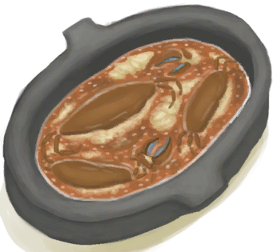

# Ginger  
> "Stabilizes your digestive system  
> "This plant has an edible root with many health benefits.  By grinding it an soaking it in boiling water once can brew an energizing ginger tea that can help settle the stomach  
  

<b>Base Value: </b> 0 
  

<b>Value Range: </b> 0 ~ 48 
  

<b>Base Rate: </b> -1 / /TP 
  
## Statuses  

<table><tr style="height:2em;"><td style="background-color:#F0F0F0;text-align:center;width:180px;font-size:1.4em;font-weight:bold;vertical-align:middle;">
1 ～ 24

2% ～ 50%
</td><td colspan=2 style="font-size:1.1em;vertical-align:middle;background-color:#F9F9F9;">
<b>

Small Dose</b>

</td></tr><tr><td colspan=2><b>Effect：</b>[

[Pain](Pain.md)](Pain.md)<b>-25</b>, [

[Courage](Courage.md)](Courage.md)<b>+50</b>, [

[Wakefulness](Wakefulness.md)](Wakefulness.md)addition<b>+0.5</b>, [

[Nausea](Nausea.md)](Nausea.md)addition<b>-0.5</b>, [

[Stool Liquidity](Diarrhoea.md)](Diarrhoea.md)addition<b>-4</b>, [

[Appetite](Appetite.md)](Appetite.md)<b>+50</b>, [

[Immune System](ImmuneSystem.md)](ImmuneSystem.md)<b>+50</b>, [

[Saturation Bananas](SaturationBananas.md)](SaturationBananas.md)addition<b>-1</b>, [

[Saturation Bird](SaturationBird.md)](SaturationBird.md)addition<b>-1</b>, [

[Saturation Coconuts](SaturationCoconuts.md)](SaturationCoconuts.md)addition<b>-1</b>, [

[Saturation Crustaceans](SaturationCrustaceans.md)](SaturationCrustaceans.md)addition<b>-1</b>, [

[Saturation Dairy](SaturationDairy.md)](SaturationDairy.md)addition<b>-1</b>, [

[Saturation Eggs](SaturationEggs.md)](SaturationEggs.md)addition<b>-1</b>, [

[Saturation Fish](SaturationFish.md)](SaturationFish.md)addition<b>-1</b>, [

[Saturation Fruits](SaturationFruits.md)](SaturationFruits.md)addition<b>-1</b>, [

[Saturation Meat](SaturationMeat.md)](SaturationMeat.md)addition<b>-1</b>, [

[Saturation Reptile](SaturationReptile.md)](SaturationReptile.md)addition<b>-1</b>, [

[Saturation Mollusks](SaturationMollusks.md)](SaturationMollusks.md)addition<b>-1</b>, [

[Saturation Mushrooms](SaturationMushrooms.md)](SaturationMushrooms.md)addition<b>-1</b>, [

[Saturation Nuts](SaturationNuts.md)](SaturationNuts.md)addition<b>-1</b>, [

[Saturation Rations](SaturationRations.md)](SaturationRations.md)addition<b>-1</b>, [

[Saturation Rice](SaturationRice.md)](SaturationRice.md)addition<b>-1</b>, [

[Saturation Sago](SaturationSago.md)](SaturationSago.md)addition<b>-1</b>, [

[Saturation Sugar](SaturationSugar.md)](SaturationSugar.md)addition<b>-1</b>, [

[Saturation Yam](SaturationYam.md)](SaturationYam.md)addition<b>-1</b>, [

[Saturation Vegetables](SaturationVegetables.md)](SaturationVegetables.md)addition<b>-1</b></td></tr><tr><td colspan=2></td></tr><tr style="height:2em;"><td style="background-color:#F0F0F0;text-align:center;width:180px;font-size:1.4em;font-weight:bold;vertical-align:middle;">
25 ～ 48

52% ～ 100%
</td><td colspan=2 style="font-size:1.1em;vertical-align:middle;background-color:#F9F9F9;">
<b>

High Dose</b>

</td></tr><tr><td colspan=2><b>Effect：</b>[

[Pain](Pain.md)](Pain.md)<b>-50</b>, [

[Courage](Courage.md)](Courage.md)<b>+100</b>, [

[Wakefulness](Wakefulness.md)](Wakefulness.md)addition<b>+0.75</b>, [

[Nausea](Nausea.md)](Nausea.md)addition<b>-0.5</b>, [

[Stool Liquidity](Diarrhoea.md)](Diarrhoea.md)addition<b>-8</b>, [

[Appetite](Appetite.md)](Appetite.md)<b>+50</b>, [

[Immune System](ImmuneSystem.md)](ImmuneSystem.md)<b>+100</b>, [

[Saturation Bananas](SaturationBananas.md)](SaturationBananas.md)addition<b>-1～+0</b>, [

[Saturation Bird](SaturationBird.md)](SaturationBird.md)addition<b>-1～+0</b>, [

[Saturation Coconuts](SaturationCoconuts.md)](SaturationCoconuts.md)addition<b>-1～+0</b>, [

[Saturation Crustaceans](SaturationCrustaceans.md)](SaturationCrustaceans.md)addition<b>-1～+0</b>, [

[Saturation Dairy](SaturationDairy.md)](SaturationDairy.md)addition<b>-1～+0</b>, [

[Saturation Eggs](SaturationEggs.md)](SaturationEggs.md)addition<b>-1～+0</b>, [

[Saturation Fish](SaturationFish.md)](SaturationFish.md)addition<b>-1～+0</b>, [

[Saturation Fruits](SaturationFruits.md)](SaturationFruits.md)addition<b>-1～+0</b>, [

[Saturation Meat](SaturationMeat.md)](SaturationMeat.md)addition<b>-1～+0</b>, [

[Saturation Mollusks](SaturationMollusks.md)](SaturationMollusks.md)addition<b>-1～+0</b>, [

[Saturation Mushrooms](SaturationMushrooms.md)](SaturationMushrooms.md)addition<b>-1～+0</b>, [

[Saturation Nuts](SaturationNuts.md)](SaturationNuts.md)addition<b>-1～+0</b>, [

[Saturation Rations](SaturationRations.md)](SaturationRations.md)addition<b>-1～+0</b>, [

[Saturation Reptile](SaturationReptile.md)](SaturationReptile.md)addition<b>-1～+0</b>, [

[Saturation Rice](SaturationRice.md)](SaturationRice.md)addition<b>-1～+0</b>, [

[Saturation Sago](SaturationSago.md)](SaturationSago.md)addition<b>-1～+0</b>, [

[Saturation Sugar](SaturationSugar.md)](SaturationSugar.md)addition<b>-1～+0</b>, [

[Saturation Vegetables](SaturationVegetables.md)](SaturationVegetables.md)addition<b>-1～+0</b></td></tr><tr><td colspan=2></td></tr></table>
  
## Change By  
<table class="table table-bordered" data-toggle="table"  ><thead style=""><tr ><th  style="text-align:left;vertical-align:top;"  >From</th><th  style="text-align:left;vertical-align:top;"  >Operation</th><th  style="text-align:left;vertical-align:top;"  data-sortable="true"  >Value</th></tr></thead><tr ><td  style="text-align:left;vertical-align:top;"  >[

[Ginger Tea](LQ_GingerTea.md)](LQ_GingerTea.md)</td><td  style="text-align:left;vertical-align:top;"  >Drink</td><td  style="text-align:left;vertical-align:top;"  >24</td></tr><tr ><td  style="text-align:left;vertical-align:top;"  >[

[Ground Ginger](GingerGround.md)](GingerGround.md)</td><td  style="text-align:left;vertical-align:top;"  >Eat</td><td  style="text-align:left;vertical-align:top;"  >8</td></tr><tr ><td  style="text-align:left;vertical-align:top;"  >[

[Drunken Crab](DrunkenCrab.md)](DrunkenCrab.md)</td><td  style="text-align:left;vertical-align:top;"  >Eat</td><td  style="text-align:left;vertical-align:top;"  >6</td></tr><tr ><td  style="text-align:left;vertical-align:top;"  >[

[Ginger](Ginger.md)](Ginger.md)</td><td  style="text-align:left;vertical-align:top;"  >Eat</td><td  style="text-align:left;vertical-align:top;"  >4</td></tr><tr ><td  style="text-align:left;vertical-align:top;"  >[

[Dried Ginger](GingerDried.md)](GingerDried.md)</td><td  style="text-align:left;vertical-align:top;"  >Eat</td><td  style="text-align:left;vertical-align:top;"  >4</td></tr><tr ><td  style="text-align:left;vertical-align:top;"  >[

[Candied Ginger](CandiedGinger.md)](CandiedGinger.md)</td><td  style="text-align:left;vertical-align:top;"  >Eat</td><td  style="text-align:left;vertical-align:top;"  >2</td></tr></tbody></table>  
  

