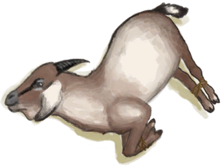

# Goat  
> Can milk it when it's lactating or slaughter it for its meat and leather.  
  
<table class="table table-bordered" data-toggle="table"  data-show-header="false"><thead style="display:none"><tr ><th  style="width:50%;text-align:left;vertical-align:top;"  >title</th><th  style="width:50%;text-align:left;vertical-align:top;"  ></th></tr></thead><tr ><td  style="width:50%;text-align:left;vertical-align:top;"  >** Can Be Renamed **  ** DoseNotPile **  **Weight：**2250  **Tag：**	[“Goat”](tag_Goat.md), [“Large”](tag_Large.md), [“Large Animal”](tag_LargeAnimal.md)  **Usage：**288</td><td  style="width:50%;text-align:left;vertical-align:top;"  >

<a href="GoatEnclosureFemale.md" style="color:black">Goat</a>

"These animals can be seen frequenting the island's <b>Grasslands and Highlands</b>.  They can be hunted for their meat and leather or captured live through the use of <b>Trapping Pits</b>. Captured goats can then be released on enclosures and if a members of both sexes are present</td></tr></tbody></table>  
  
## Got From  

Transform

[Juvenile Goat](GoatEnclosureKid.md)

End Lactation

[Lactating Goat](GoatEnclosureLactating.md)

Release in Enclosure

[Goat](GoatTiedFemale.md)

End Lactation

[Lactating Goat](GoatTiedFemaleLactating.md)

  
  
## Action  

<table><tr><td rowspan="2" style="width:200px;text-align:center;font-size:1.3em;font-weight:bold">

Set Free

15m

</td><td></td></tr><tr><td><b>Self：</b>→Dismiss</td></tr><tr><td colspan="2"><b>Require：</b>~~In [

[Enclosure(Environment)](Env_Enclosure.md)](Env_Enclosure.md)~~</td></tr><tr><td colspan="2"><b>StatChange：</b>[Population Goats](Pop_Goat.md)<b>+1000</b></td></tr></table>
  

<table><tr><td rowspan="2" style="width:200px;text-align:center;font-size:1.3em;font-weight:bold">

Pick Up

30m

</td><td>[“HandAction(Group)”](HandAction.md)</td></tr><tr><td><b>Self：</b>→ [

[Goat](GoatTiedFemale.md)](GoatTiedFemale.md), Stress

  <b>-250(-25%)</b></td></tr><tr><td colspan="2"><b>Require：</b>Pregnancy

: <b>0～192(0%～14.29%)</b>, [

[Light](Light.md)](Light.md): <b>10-100</b></td></tr></table>
  

<table><tr><td rowspan="2" style="width:200px;text-align:center;font-size:1.3em;font-weight:bold">

Pet

15m

</td><td></td></tr><tr><td><b>Self：</b>Stress

  <b>+25(2.5%)</b></td></tr><tr><td colspan="2"><b>StatChange：</b>[

[Loneliness](Loneliness.md)](Loneliness.md)<b>-20</b>, [

[Stress](Stress.md)](Stress.md)<b>-10</b></td></tr></table>
  
  
  
## Drag With  

<table style="margin-bottom:0px;"><tr><td style="width:40%;text-align:left; background-color:#FEFEFE"><b>With：</b>[“Rich Fibers”](tag_FibersRich.md) | [“Rich Sugars”](tag_SugarsRich.md)</td><td style="width:40%;font-size:1em;font-weight:bold;background-color:#FEFEFE">Feed (3m) </td></tr><tr style="background-color:#FFFFFF"><td style=""><b>Receiving：</b>→Dismiss</td><td style=""><b>Self：</b>Hunger

  <b>+384(66.67%)</b>, Stress

  <b>+25(2.5%)</b></td></tr></table>
  

<table style="margin-bottom:0px;"><tr><td style="width:40%;text-align:left; background-color:#FEFEFE"><b>With：</b>[“Medium Fibers”](tag_FibersMedium.md) | [“Medium Sugars”](tag_SugarsMedium.md)</td><td style="width:40%;font-size:1em;font-weight:bold;background-color:#FEFEFE">Feed (3m) </td></tr><tr style="background-color:#FFFFFF"><td style=""><b>Receiving：</b>→Dismiss</td><td style=""><b>Self：</b>Hunger

  <b>+192(33.33%)</b>, Stress

  <b>+25(2.5%)</b></td></tr></table>
  

<table style="margin-bottom:0px;"><tr><td style="width:40%;text-align:left; background-color:#FEFEFE"><b>With：</b>[“Poor Fibers”](tag_FibersPoor.md) | [“Poor Sugars”](tag_SugarsPoor.md)</td><td style="width:40%;font-size:1em;font-weight:bold;background-color:#FEFEFE">Feed (3m) </td></tr><tr style="background-color:#FFFFFF"><td style=""><b>Receiving：</b>→Dismiss</td><td style=""><b>Self：</b>Hunger

  <b>+48(8.33%)</b>, Stress

  <b>+25(2.5%)</b></td></tr></table>
  

<table style="margin-bottom:0px;"><tr><td style="width:40%;text-align:left; background-color:#FEFEFE"><b>With：</b>[“Water Container”](tag_WaterContainer.md) ([“Water Fresh(Group)”](GpTag_WaterFresh.md) x 1)</td><td style="width:40%;font-size:1em;font-weight:bold;background-color:#FEFEFE">Give Water  </td></tr><tr style="background-color:#FFFFFF"><td style=""><b>Receiving：</b></td><td style=""><b>Self：</b>Thirst

  <b>+48(16.67%)</b>, Stress

  <b>+25(2.5%)</b></td></tr></table>
  

<table style="margin-bottom:0px;"><tr><td style="width:40%;text-align:left; background-color:#FEFEFE"><b>With：</b>[

[Heavy Stone](StoneHeavy.md)](StoneHeavy.md) | [“Cutter”](tag_Cutter.md) | [“Axe”](tag_Axe.md) | [“Spear T1”](tag_Spear.md)</td><td style="width:40%;font-size:1em;font-weight:bold;background-color:#FEFEFE">Kill (30m) [“HandAction(Group)”](HandAction.md)</td></tr><tr><td colspan="2"><b>Require：</b>[

[Light](Light.md)](Light.md): <b>10-100</b></td></tr><tr style="background-color:#FFFFFF"><td style=""><b>Receiving：</b></td><td style=""><b>Self：</b>→ [

[Goat Carcass](GoatCarcassFemale.md)](GoatCarcassFemale.md)</td></tr><tr><td colspan="2"><b>StatChange：</b>[

[Filth](Filth.md)](Filth.md)<b>+20</b></td></tr></table>
  
  
## Durability   

<table style="margin-bottom:0px;"><tr><td style="width:30%;text-align:left; background-color:#FEFEFE;font-size:1.3em;font-weight:bold;">

Hunger</td><td style="font-size:1em;background-color:#FEFEFE">Starting：288 , Max：576 -1/TP , Duration ：6d</td></tr><tr style="background-color:#FFFFFF"><td colspan=2>** On Zero：Oh no! ** Self: → [

[Goat Carcass](GoatCarcassFemale.md)](GoatCarcassFemale.md)</td></tr></table>
  

<table style="margin-bottom:0px;"><tr><td style="width:30%;text-align:left; background-color:#FEFEFE;font-size:1.3em;font-weight:bold;">

Thirst</td><td style="font-size:1em;background-color:#FEFEFE">Starting：288 , Max：288 -1/TP , Duration ：3d</td></tr><tr style="background-color:#FFFFFF"><td colspan=2>** On Zero：Dead of Thirst ** Self: → [

[Goat Carcass](GoatCarcassFemale.md)](GoatCarcassFemale.md)</td></tr></table>
  

<table style="margin-bottom:0px;"><tr><td style="width:30%;text-align:left; background-color:#FEFEFE;font-size:1.3em;font-weight:bold;">

Pregnancy</td><td style="font-size:1em;background-color:#FEFEFE">Starting：0 , Max：1344 -1/TP , Duration ：14d</td></tr><tr style="background-color:#FFFFFF"><td colspan=2>** On Full： ** Self: → [

[Lactating Goat](GoatEnclosureLactating.md)](GoatEnclosureLactating.md) 

<table style="margin-bottom:3px;"><tr><td rowspan=2 style="text-align:center" width="80px">
Base Weight

5
</td><td style="font-size:0.6em;line-height:0.6em;font-weight:bold">0 kids</td></tr><tr><td>[

[Juvenile Goat Carcass](GoatCarcassKid.md)](GoatCarcassKid.md)(<b>+1</b>)</td></tr><tr><td colspan=2><li>Stress

in<b>0～750(0%～75%)</b>, weight<b>+100～+0</b></li></td></tr></table>

<table style="margin-bottom:3px;"><tr><td rowspan=2 style="text-align:center" width="80px">
Base Weight

65
</td><td style="font-size:0.6em;line-height:0.6em;font-weight:bold">1 kid</td></tr><tr><td>[

[Juvenile Goat](GoatEnclosureKid.md)](GoatEnclosureKid.md)(<b>+1</b>)</td></tr></table>

<table style="margin-bottom:3px;"><tr><td rowspan=2 style="text-align:center" width="80px">
Base Weight

25
</td><td style="font-size:0.6em;line-height:0.6em;font-weight:bold">2 kids</td></tr><tr><td>[

[Juvenile Goat](GoatEnclosureKid.md)](GoatEnclosureKid.md)(<b>+2</b>)</td></tr></table>
<button class="btn btn-secondary btn-sm" style="" data-toggle="modal" onclick="setCollectionDataBase64('eyJ0aXRsZSI6IlNpbXVsYXRvcjogdW5kZWZpbmVkIiwiY29sbGVjdGlvbnMiOlt7ImRyb3AiOiI8ZGl2IHN0eWxlPVwid2lkdGg6MjVweDtkaXNwbGF5OmlubGluZS1ibG9jazt0ZXh0LWFsaWduOmNlbnRlclwiPjxpbWcgZGVjb2Rpbmc9XCJhc3luY1wiIHNyYz1cIlNwcml0ZS9Hb2F0Q2FyY2Fzc0tpZC5wbmdcIiBocmVmPVwiYS5tZFwiIHN0eWxlPVwibWF4LXdpZHRoOjI1cHg7bWF4LWhlaWdodDoyNXB4O1wiPjwvZGl2Pkp1dmVuaWxlIEdvYXQgQ2FyY2FzcyIsImJhc2UiOjUsImNvbmRpdGlvbiI6W3sia2V5IjoiUHJvZ3Jlc3MiLCJ0aXRsZSI6IlN0cmVzczxkaXYgc3R5bGU9XCJ3aWR0aDoyMHB4O2Rpc3BsYXk6aW5saW5lLWJsb2NrO3RleHQtYWxpZ246Y2VudGVyXCI+PGltZyBkZWNvZGluZz1cImFzeW5jXCIgc3JjPVwiU3ByaXRlL0NvbnRlbnQucG5nXCIgaHJlZj1cImEubWRcIiBzdHlsZT1cIm1heC13aWR0aDoyMHB4O21heC1oZWlnaHQ6MjBweDtcIj48L2Rpdj4iLCJ0eXBlIjoicmFuZ2UiLCJtYXgiOlswLDc1MF0sInJhbmdlIjpbMCw3NTBdLCJ3ZWlnaHQiOlsxMDAsMF0sImRlZmF1bHRWYWx1ZSI6MCwid2hlbk91dE9mUmFuZ2UiOjB9XX0seyJkcm9wIjoiPGRpdiBzdHlsZT1cIndpZHRoOjI1cHg7ZGlzcGxheTppbmxpbmUtYmxvY2s7dGV4dC1hbGlnbjpjZW50ZXJcIj48aW1nIGRlY29kaW5nPVwiYXN5bmNcIiBzcmM9XCJTcHJpdGUvR29hdEtpZEVuY2xvc3VyZS5wbmdcIiBocmVmPVwiYS5tZFwiIHN0eWxlPVwibWF4LXdpZHRoOjI1cHg7bWF4LWhlaWdodDoyNXB4O1wiPjwvZGl2Pkp1dmVuaWxlIEdvYXQiLCJiYXNlIjo2NSwiY29uZGl0aW9uIjpbXX0seyJkcm9wIjoiPGRpdiBzdHlsZT1cIndpZHRoOjI1cHg7ZGlzcGxheTppbmxpbmUtYmxvY2s7dGV4dC1hbGlnbjpjZW50ZXJcIj48aW1nIGRlY29kaW5nPVwiYXN5bmNcIiBzcmM9XCJTcHJpdGUvR29hdEtpZEVuY2xvc3VyZS5wbmdcIiBocmVmPVwiYS5tZFwiIHN0eWxlPVwibWF4LXdpZHRoOjI1cHg7bWF4LWhlaWdodDoyNXB4O1wiPjwvZGl2Pkp1dmVuaWxlIEdvYXQiLCJiYXNlIjoyNSwiY29uZGl0aW9uIjpbXX1dfQ==')" data-target="#modelCollectionSimulator">Simulator</button>
</td></tr></table>
  

<table style="margin-bottom:0px;"><tr><td style="width:30%;text-align:left; background-color:#FEFEFE;font-size:1.3em;font-weight:bold;">

Stress</td><td style="font-size:1em;background-color:#FEFEFE">Starting：0 , Max：1000 -4/TP , Duration ：2d14h30m</td></tr><tr style="background-color:#FFFFFF"><td colspan=2></td></tr></table>
  

<table style="margin-bottom:0px;"><tr><td style="width:30%;text-align:left; background-color:#FEFEFE;font-size:1.3em;font-weight:bold;">Poop</td><td style="font-size:1em;background-color:#FEFEFE">Starting：96 , Max：96 -1/TP , Duration ：1d</td></tr><tr style="background-color:#FFFFFF"><td colspan=2>** On Zero： ** Self: Poop  <b>+96(100%)</b> [

[Manure](Manure.md)](Manure.md)(<b>+1</b>)</td></tr></table>
  
## Passive Effects  
<table class="table table-bordered" data-toggle="table"  ><thead style=""><tr ><th  style="text-align:left;vertical-align:top;"  >Name</th><th  style="text-align:left;vertical-align:top;"  >Condition</th><th  style="text-align:left;vertical-align:top;"  >Change(Each TP)</th><th  style="text-align:left;vertical-align:top;"  >Status</th></tr></thead><tr ><td  style="text-align:left;vertical-align:top;"  >Eat</td><td  style="text-align:left;vertical-align:top;"  >** Require Card：** [Goat Feeder](GoatFeeder.md)</td><td  style="text-align:left;vertical-align:top;"  >Hunger

 +2(0.34%)</td><td  style="text-align:left;vertical-align:top;"  ></td></tr><tr ><td  style="text-align:left;vertical-align:top;"  >Drink</td><td  style="text-align:left;vertical-align:top;"  >** Require Card：** [Watering Trough](WateringTrough.md)</td><td  style="text-align:left;vertical-align:top;"  >Thirst

 +2(0.69%)</td><td  style="text-align:left;vertical-align:top;"  ></td></tr><tr ><td  style="text-align:left;vertical-align:top;"  >Cure Stress</td><td  style="text-align:left;vertical-align:top;"  >** Require Durability：** Hunger

: <b>288～576(50%～100%)</b> Thirst

: <b>144～288(50%～100%)</b></td><td  style="text-align:left;vertical-align:top;"  >Stress

+10(1%)</td><td  style="text-align:left;vertical-align:top;"  ></td></tr><tr ><td  style="text-align:left;vertical-align:top;"  >Pregnant</td><td  style="text-align:left;vertical-align:top;"  >** Require Durability：** Pregnancy

: <b>193～1344(14.36%～100%)</b></td><td  style="text-align:left;vertical-align:top;"  >Pregnancy

 +2(0.14%)</td><td  style="text-align:left;vertical-align:top;"  ></td></tr><tr ><td  style="text-align:left;vertical-align:top;"  >Impregnate</td><td  style="text-align:left;vertical-align:top;"  >** Require Durability：** Pregnancy

: <b>0～192(0%～14.29%)</b> ** Require Card：** [Male Goat](GoatEnclosureMale.md)</td><td  style="text-align:left;vertical-align:top;"  >Pregnancy

 +2(0.14%)</td><td  style="text-align:left;vertical-align:top;"  ></td></tr><tr ><td  style="text-align:left;vertical-align:top;"  >Overcrowding</td><td  style="text-align:left;vertical-align:top;"  >** Require Durability：** Pregnancy

: <b>1～1536(0.07%～114.29%)</b> ** Require Card(可叠加)：** [“Large Animal”](tag_LargeAnimal.md)</td><td  style="text-align:left;vertical-align:top;"  >Stress

-0.66(-0.07%)</td><td  style="text-align:left;vertical-align:top;"  ></td></tr><tr ><td  style="text-align:left;vertical-align:top;"  >Poop</td><td  style="text-align:left;vertical-align:top;"  >** Require Card(可叠加)：** [Manure](Manure.md)</td><td  style="text-align:left;vertical-align:top;"  >Stress

-0.01(-0.01%)</td><td  style="text-align:left;vertical-align:top;"  ></td></tr><tr ><td  style="text-align:left;vertical-align:top;"  >Company</td><td  style="text-align:left;vertical-align:top;"  ></td><td  style="text-align:left;vertical-align:top;"  ></td><td  style="text-align:left;vertical-align:top;"  >[

[Loneliness](Loneliness.md)](Loneliness.md)addition<b>-1</b></td></tr></tbody></table>  
  

