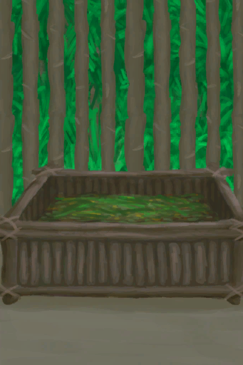

# Goat Feeder  
> A device to feed goats with minimal work.  
  
<table class="table table-bordered" data-toggle="table"  data-show-header="false"><thead style="display:none"><tr ><th  style="width:50%;text-align:left;vertical-align:top;"  >title</th><th  style="width:50%;text-align:left;vertical-align:top;"  ></th></tr></thead><tr ><td  style="width:50%;text-align:left;vertical-align:top;"  >**Weight：**1000</td><td  style="width:50%;text-align:left;vertical-align:top;"  >

<a href="GoatFeeder.md" style="color:black">Goat Feeder</a>

This useful but simple device can be built with <b>Wood and Cord</b> on an <b>Enclosure</b> to help you feed your <b>Goats</b> more efficiently.  It can be filled with any plant food and with <b>Goat Feed</b> for even more efficiency.</td></tr></tbody></table>  
  
## Got From  

** With：**[Goat Feed](FeedGoat.md)Feed

[Goat Feeder(Empty)](GoatFeederEmpty.md)

** With：**[“Rich Fibers”](tag_FibersRich.md) , [“Rich Sugars”](tag_SugarsRich.md)Feed

[Goat Feeder(Empty)](GoatFeederEmpty.md)

** With：**[“Medium Fibers”](tag_FibersMedium.md) , [“Medium Sugars”](tag_SugarsMedium.md)Feed

[Goat Feeder(Empty)](GoatFeederEmpty.md)

** With：**[“Poor Fibers”](tag_FibersPoor.md) , [“Poor Sugars”](tag_SugarsPoor.md)Feed

[Goat Feeder(Empty)](GoatFeederEmpty.md)

  
  
## Action  

<table><tr><td rowspan="2" style="width:200px;text-align:center;font-size:1.3em;font-weight:bold">

Dismantle

2h

</td><td>[“HandAction(Group)”](HandAction.md)</td></tr><tr><td><b>Self：</b>→Dismiss</td></tr><tr><td colspan="2">[

[Wood](Wood.md)](Wood.md)(<b>+6</b>), [

[Fiber Cord](CordFiber.md)](CordFiber.md)(<b>+4</b>)</td></tr></table>
  
  
  
## Drag With  

<table style="margin-bottom:0px;"><tr><td style="width:40%;text-align:left; background-color:#FEFEFE"><b>With：</b>[

[Goat Feed](FeedGoat.md)](FeedGoat.md)</td><td style="width:40%;font-size:1em;font-weight:bold;background-color:#FEFEFE">Feed  </td></tr><tr style="background-color:#FFFFFF"><td style=""><b>Receiving：</b>→Dismiss</td><td style=""><b>Self：</b>Food

  <b>+1120(16.67%)</b></td></tr></table>
  

<table style="margin-bottom:0px;"><tr><td style="width:40%;text-align:left; background-color:#FEFEFE"><b>With：</b>[“Rich Fibers”](tag_FibersRich.md) | [“Rich Sugars”](tag_SugarsRich.md)</td><td style="width:40%;font-size:1em;font-weight:bold;background-color:#FEFEFE">Feed  </td></tr><tr style="background-color:#FFFFFF"><td style=""><b>Receiving：</b>→Dismiss</td><td style=""><b>Self：</b>Food

  <b>+384(5.71%)</b></td></tr></table>
  

<table style="margin-bottom:0px;"><tr><td style="width:40%;text-align:left; background-color:#FEFEFE"><b>With：</b>[“Medium Fibers”](tag_FibersMedium.md) | [“Medium Sugars”](tag_SugarsMedium.md)</td><td style="width:40%;font-size:1em;font-weight:bold;background-color:#FEFEFE">Feed  </td></tr><tr style="background-color:#FFFFFF"><td style=""><b>Receiving：</b>→Dismiss</td><td style=""><b>Self：</b>Food

  <b>+192(2.86%)</b></td></tr></table>
  

<table style="margin-bottom:0px;"><tr><td style="width:40%;text-align:left; background-color:#FEFEFE"><b>With：</b>[“Poor Fibers”](tag_FibersPoor.md) | [“Poor Sugars”](tag_SugarsPoor.md)</td><td style="width:40%;font-size:1em;font-weight:bold;background-color:#FEFEFE">Feed  </td></tr><tr style="background-color:#FFFFFF"><td style=""><b>Receiving：</b>→Dismiss</td><td style=""><b>Self：</b>Food

  <b>+48(0.71%)</b></td></tr></table>
  
  
## Durability   

<table style="margin-bottom:0px;"><tr><td style="width:30%;text-align:left; background-color:#FEFEFE;font-size:1.3em;font-weight:bold;">

Food</td><td style="font-size:1em;background-color:#FEFEFE">Starting：0 , Max：6720 -1/TP , Duration ：70d</td></tr><tr style="background-color:#FFFFFF"><td colspan=2>** On Zero： ** Self: → [

[Goat Feeder(Empty)](GoatFeederEmpty.md)](GoatFeederEmpty.md)</td></tr></table>
  
## Passive Effects  
<table class="table table-bordered" data-toggle="table"  ><thead style=""><tr ><th  style="text-align:left;vertical-align:top;"  >Name</th><th  style="text-align:left;vertical-align:top;"  >Condition</th><th  style="text-align:left;vertical-align:top;"  >Change(Each TP)</th><th  style="text-align:left;vertical-align:top;"  data-sortable="true"  >Status</th></tr></thead><tr ><td  style="text-align:left;vertical-align:top;"  >Feed Goats</td><td  style="text-align:left;vertical-align:top;"  >** Require Card(可叠加)：** [“Goat”](tag_Goat.md)</td><td  style="text-align:left;vertical-align:top;"  >Food

 -3(-0.05%)</td><td  style="text-align:left;vertical-align:top;"  ></td></tr><tr ><td  style="text-align:left;vertical-align:top;"  >Feed Goat Kids</td><td  style="text-align:left;vertical-align:top;"  >** Require Card(可叠加)：** [“Goat Kid”](tag_GoatKid.md)</td><td  style="text-align:left;vertical-align:top;"  >Food

 -2(-0.03%)</td><td  style="text-align:left;vertical-align:top;"  ></td></tr></tbody></table>  
  

