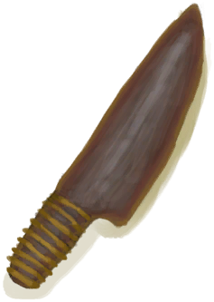

# “Cutting Tool(Group)”  

<a href="StoneSharpened.md" style="color:black">Sharpened Stone</a>

<a href="KnifeBone.md" style="color:black">Bone Knife</a>

<a href="KnifeCopper.md" style="color:black">Copper Knife</a>

<a href="KnifeFlint.md" style="color:black">Flint Knife</a>

<a href="KnifeGrandpa.md" style="color:black">Grandfather's Knife</a>

<a href="KnifeMilitary.md" style="color:black">Military Knife</a>

<a href="KnifeObsidian.md" style="color:black">Obsidian Knife</a>

<a href="KnifeScrap.md" style="color:black">Scrap Knife</a>

<a href="SafetyKnife.md" style="color:black">Safety Knife</a>

<a href="CeremonialDagger.md" style="color:black">Ceremonial Dagger</a>

  
  

