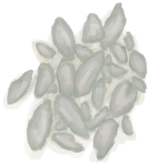

# “Quality Bird Feed (Group)”  

<a href="RiceGrains.md" style="color:black">Rice Grain</a>

<a href="SagoFlour.md" style="color:black">Sago Flour</a>

<a href="Bees.md" style="color:black">Bees</a>

<a href="NipaSeeds.md" style="color:black">Nipa Seeds</a>

<a href="TropicalAlmondKernels.md" style="color:black">Tropical Almond Kernels</a>

<a href="TropicalAlmondsRoasted.md" style="color:black">Roasted Tropical Almond</a>

<a href="CoconutMeat.md" style="color:black">Coconut Meat</a>

<a href="CoconutMeatCooked.md" style="color:black">Roasted Coconut Meat</a>

<a href="Banana.md" style="color:black">Banana</a>

  
  

