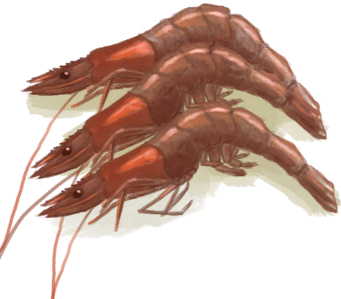

# “Basic Bird Feed(Group)”  

<a href="Bugs.md" style="color:black">Bugs</a>

<a href="Prawns.md" style="color:black">Prawns</a>

<a href="PrawnsCooked.md" style="color:black">Roasted Prawns</a>

<a href="PalmBushSeeds.md" style="color:black">Palm Bush Seeds</a>

<a href="SnakegrassSeeds.md" style="color:black">Snakegrass Seeds</a>

<a href="SagoSeeds.md" style="color:black">Sago Seeds</a>

  
  

