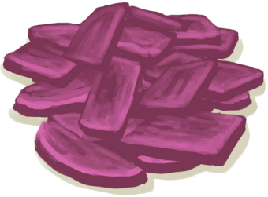

# “Boar Feed Veggies(Group)”  

<a href="RiceGrains.md" style="color:black">Rice Grain</a>

<a href="RiceCooked.md" style="color:black">Rice</a>

<a href="Yam.md" style="color:black">Yam</a>

<a href="YamCut.md" style="color:black">Cut Yam</a>

<a href="YamBoiled.md" style="color:black">Boiled Yam</a>

<a href="TropicalAlmonds.md" style="color:black">Tropical Almonds</a>

<a href="TropicalAlmondsRoasted.md" style="color:black">Roasted Tropical Almond</a>

<a href="TropicalAlmondKernels.md" style="color:black">Tropical Almond Kernels</a>

<a href="SagoFlour.md" style="color:black">Sago Flour</a>

  
  

