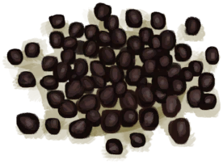
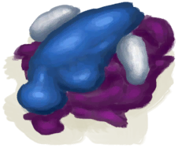
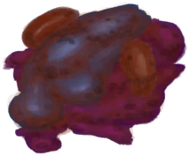
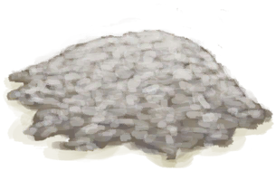
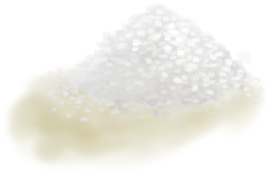
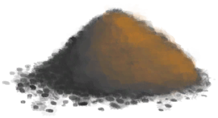

# “Fertilizer(Group)”  

<a href="Manure.md" style="color:black">Manure</a>

<a href="RottenRemains.md" style="color:black">Rotten Remains</a>

<a href="FishScraps.md" style="color:black">Fish Scraps</a>

<a href="FishScrapsCooked.md" style="color:black">Cooked Fish Scraps</a>

<a href="Fertilizer.md" style="color:black">Fertilizer</a>

<a href="Guano.md" style="color:black">Guano</a>

<a href="Saltpeter.md" style="color:black">Saltpeter</a>

<a href="Bonemeal.md" style="color:black">Bonemeal</a>

<a href="Feathermeal.md" style="color:black">Feathermeal</a>

  
  

