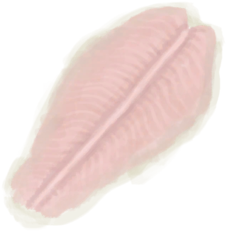
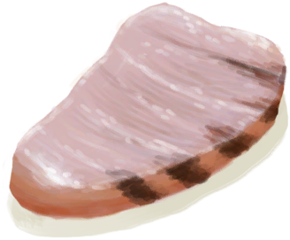
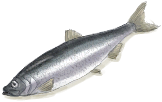

# “Fish(Group)”  

<a href="BonefishMeat.md" style="color:black">Bonefish Meat</a>

<a href="ParrotFish.md" style="color:black">Parrot Fish</a>

<a href="Goatfish.md" style="color:black">Goatfish</a>

<a href="ThreadfinMeat.md" style="color:black">Threadfin Meat</a>

<a href="SharkMeat.md" style="color:black">Shark Meat</a>

<a href="Herring.md" style="color:black">Herring</a>

  
  

