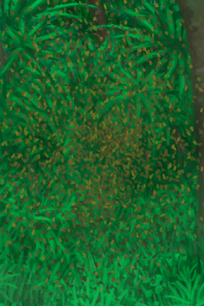
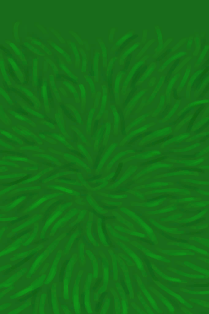
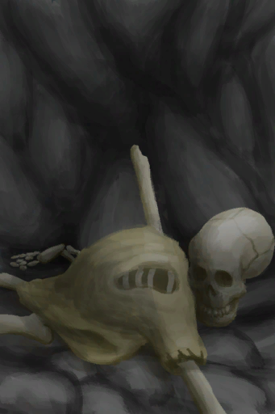
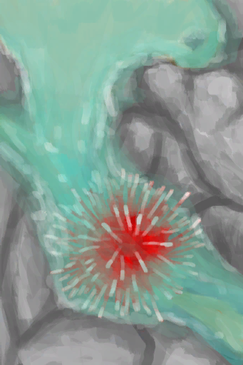

# 【Other】Events  

<table><tr style="height:10px"><td rowspan=3 style="width:80px">

</td><td style="font-size: 1.2em">[A Bee Swarm!(Event)](Event_BeesSwarming.md)</td></tr><tr><td>They're swarming me!</td></tr><tr><td>

My clothes protected me!

My clothes partially protected me!

Not the Bees!

</td></tr></table>

  

<table><tr style="height:10px"><td rowspan=3 style="width:80px">

</td><td style="font-size: 1.2em">[A partridge nest!(Event)](Event_PartridgeNest.md)</td></tr><tr><td>All its contents are yours.</td></tr><tr><td>

Continue

</td></tr></table>

  

<table><tr style="height:10px"><td rowspan=3 style="width:80px">

</td><td style="font-size: 1.2em">[A Sea Krait!!(Event)](Event_SeaKraitStep.md)</td></tr><tr><td>It bit me!</td></tr><tr><td>

Didn't manage to hurt me

Continue...

Continue...

</td></tr></table>

  

<table><tr style="height:10px"><td rowspan=3 style="width:80px">

</td><td style="font-size: 1.2em">[A Sea Krait!!(Event)](Event_SeaKraitSwim.md)</td></tr><tr><td></td></tr><tr><td>

I avoided it!

It bit me...

</td></tr></table>

  

<table><tr style="height:10px"><td rowspan=3 style="width:80px">

</td><td style="font-size: 1.2em">[You made it!(Event)](Event_SeagullNest.md)</td></tr><tr><td>"You climbed to the nest</td></tr><tr><td>

Continue

</td></tr></table>

  

<b>Trigger: </b>
[

[Satiation](Satiation.md)](Satiation.md): <b>0-1000</b>, [

[Skeleton(Hole)](Skeleton.md)](Skeleton.md) On Hand/Board  

<table><tr style="height:10px"><td rowspan=3 style="width:80px">

</td><td style="font-size: 1.2em">[A Skeleton!(Event)(Hole)](Event_SkeletonSeen.md)</td></tr><tr><td>There's a skeleton here. Someone's remains... will I end up the same way? This is not good...</td></tr><tr><td>

Continue

</td></tr></table>

  

<table><tr style="height:10px"><td rowspan=3 style="width:80px">

</td><td style="font-size: 1.2em">[A spider!!(Event)](Event_Spider.md)</td></tr><tr><td>I stepped on a spider!</td></tr><tr><td>

Didn't manage to hurt me

Check Wound

Check Wound

</td></tr></table>

  

<table><tr style="height:10px"><td rowspan=3 style="width:80px">

</td><td style="font-size: 1.2em">[Urchin!!(Event)](Event_Urchin.md)</td></tr><tr><td>I stepped on an urchin!</td></tr><tr><td>

My shoes protected me!

Check Wound

</td></tr></table>

  

<b>Trigger: </b>
[SleepRisk](SleepRisk.md): <b>1-999</b>，[Sleep Clock](SleepClock.md): <b>2-14</b>  

<table><tr style="height:10px"><td rowspan=3 style="width:80px">

</td><td style="font-size: 1.2em">[A Spider bit me!(Event)](Event_SpiderNight.md)</td></tr><tr><td>"You just woke up to a sharp pain!  A large spider is walking on you</td></tr><tr><td>

Push Spider away!

</td></tr></table>

  

