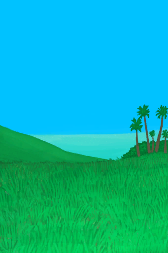

# 【Explored】Events  

<table><tr style="height:10px"><td rowspan=3 style="width:80px">

</td><td style="font-size: 1.2em">[Area Explored(Event)](Event_AcidLakeExplored.md)</td></tr><tr><td>I think I found all landmarks in this area.</td></tr><tr><td>

Continue

</td></tr></table>

  

<table><tr style="height:10px"><td rowspan=3 style="width:80px">

</td><td style="font-size: 1.2em">[Area Explored(Event)(Bay)](Event_BayExplored.md)</td></tr><tr><td>I think I found all landmarks in this area.</td></tr><tr><td>

Continue

</td></tr></table>

  

<table><tr style="height:10px"><td rowspan=3 style="width:80px">

</td><td style="font-size: 1.2em">[Area Explored(Event)(Beach)](Event_BeachExplored.md)</td></tr><tr><td>I think I found all landmarks in this area.</td></tr><tr><td>

Continue

</td></tr></table>

  

<table><tr style="height:10px"><td rowspan=3 style="width:80px">

</td><td style="font-size: 1.2em">[Area Explored(Event)(Bird Rock)](Event_BirdRockExplored.md)</td></tr><tr><td>I think I found all landmarks in this area.</td></tr><tr><td>

Continue

</td></tr></table>

  

<table><tr style="height:10px"><td rowspan=3 style="width:80px">

</td><td style="font-size: 1.2em">[Area Explored(Event)](Event_CoveExplored.md)</td></tr><tr><td>I think I found all landmarks in this area.</td></tr><tr><td>

Continue

</td></tr></table>

  

<table><tr style="height:10px"><td rowspan=3 style="width:80px">

</td><td style="font-size: 1.2em">[Area Explored(Event)(Jungle)](Event_DeepJungleExplored.md)</td></tr><tr><td>I think I found all landmarks in this area.</td></tr><tr><td>

Continue

</td></tr></table>

  

<table><tr style="height:10px"><td rowspan=3 style="width:80px">

</td><td style="font-size: 1.2em">[Area Explored(Event)(Desolate Beach)](Event_DesolateBeachExplored.md)</td></tr><tr><td>I think I found all landmarks in this area.</td></tr><tr><td>

Continue

</td></tr></table>

  

<table><tr style="height:10px"><td rowspan=3 style="width:80px">

</td><td style="font-size: 1.2em">[Area Explored(Event)(Eastern Grasslands)](Event_GrasslandsEExplored.md)</td></tr><tr><td>I think I found all landmarks in this area.</td></tr><tr><td>

Continue

</td></tr></table>

  

<table><tr style="height:10px"><td rowspan=3 style="width:80px">

</td><td style="font-size: 1.2em">[Area Explored(Event)(Western Grasslands)](Event_GrasslandsWExplored.md)</td></tr><tr><td>I think I found all landmarks in this area.</td></tr><tr><td>

Continue

</td></tr></table>

  

<table><tr style="height:10px"><td rowspan=3 style="width:80px">

</td><td style="font-size: 1.2em">[Area Explored(Event)(Eastern Highlands)](Event_HighlandsEExplored.md)</td></tr><tr><td>I think I found all landmarks in this area.</td></tr><tr><td>

Continue

</td></tr></table>

  

<table><tr style="height:10px"><td rowspan=3 style="width:80px">

</td><td style="font-size: 1.2em">[Area Explored(Event)(Western Highlands)](Event_HighlandsWExplored.md)</td></tr><tr><td>I think I found all landmarks in this area.</td></tr><tr><td>

Continue

</td></tr></table>

  

<table><tr style="height:10px"><td rowspan=3 style="width:80px">

</td><td style="font-size: 1.2em">[Area Explored(Event)](Event_JungleExplored.md)</td></tr><tr><td>I think I found all landmarks in this area.</td></tr><tr><td>

Continue

</td></tr></table>

  

<table><tr style="height:10px"><td rowspan=3 style="width:80px">

</td><td style="font-size: 1.2em">[Area Explored(Event)(Jungle Highlands)](Event_JungleHighlandsExplored.md)</td></tr><tr><td>I think I found all landmarks in this area.</td></tr><tr><td>

Continue

</td></tr></table>

  

<table><tr style="height:10px"><td rowspan=3 style="width:80px">

</td><td style="font-size: 1.2em">[Area Explored(Event)(Mangrove Forest)](Event_MangrovesExplored.md)</td></tr><tr><td>I think I found all landmarks in this area.</td></tr><tr><td>

Continue

</td></tr></table>

  

<table><tr style="height:10px"><td rowspan=3 style="width:80px">

</td><td style="font-size: 1.2em">[Area Explored(Event)](Event_OutskirtsExplored.md)</td></tr><tr><td>I think I found all landmarks in this area.</td></tr><tr><td>

Continue

</td></tr></table>

  

<table><tr style="height:10px"><td rowspan=3 style="width:80px">

</td><td style="font-size: 1.2em">[Area Explored(Event)](Event_RocksExplored.md)</td></tr><tr><td>I think I found all landmarks in this area.</td></tr><tr><td>

Continue

</td></tr></table>

  

<table><tr style="height:10px"><td rowspan=3 style="width:80px">

</td><td style="font-size: 1.2em">[Area Explored(Event)(Secret Valley)](Event_SecretValleyExplored.md)</td></tr><tr><td>I think I found all landmarks in this area.</td></tr><tr><td>

Continue

</td></tr></table>

  

<table><tr style="height:10px"><td rowspan=3 style="width:80px">

</td><td style="font-size: 1.2em">[Area Explored(Event)](Event_VolcanoExplored.md)</td></tr><tr><td>I think I found all landmarks in this area.</td></tr><tr><td>

Continue

</td></tr></table>

  

<table><tr style="height:10px"><td rowspan=3 style="width:80px">

</td><td style="font-size: 1.2em">[Area Explored(Event)(Wetlands)](Event_WetlandsExplored.md)</td></tr><tr><td>I think I found all landmarks in this area.</td></tr><tr><td>

Continue

</td></tr></table>

  

