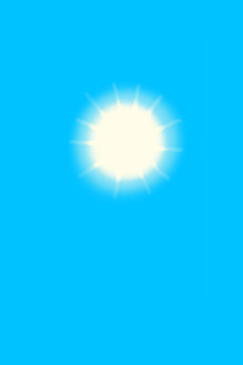

# 【Flute Tunes】Events  

<table><tr style="height:10px"><td rowspan=3 style="width:80px">

</td><td style="font-size: 1.2em">[Page 1(Event)](Event_FluteTunes1.md)</td></tr><tr><td>A selection of tunes.</td></tr><tr><td>

Simple Tune

Happy Tune

Sad Tune

Nex Page

</td></tr></table>

<table><tr style="height:10px"><td rowspan=3 style="width:45px">↳</td><td rowspan=3 style="width:80px">

</td><td style="font-size: 1.2em">[Page 2(Event)](Event_FluteTunes2.md)</td></tr><tr><td>A selection of tunes.</td></tr><tr><td>

Lonely Tune

Weston's Tune

Advanced Tune

Nex Page

</td></tr></table>

<table><tr style="height:10px"><td rowspan=3 style="width:45px"></td><td rowspan=3 style="width:45px">↳</td><td rowspan=3 style="width:80px">

</td><td style="font-size: 1.2em">[Page 3(Event)](Event_FluteTunes3.md)</td></tr><tr><td>A selection of tunes.</td></tr><tr><td>

Sea Tune

Jungle Tune

Cave Tune

Cancel

</td></tr></table>

  

