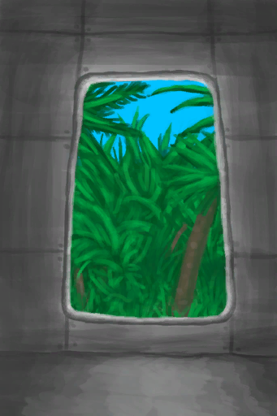

# 【Opening】Events  

<table><tr style="height:10px"><td rowspan=3 style="width:80px">

</td><td style="font-size: 1.2em">[Intro(Event)](Event_IntroFarmer.md)</td></tr><tr><td>... a terrible hurricane has destroyed your grandfather's farm and the poor man looks worse than ever.  Make sure to keep him fed and hydrated or he might not make it for much longer.</td></tr><tr><td>

Let's Start

</td></tr></table>

  

<table><tr style="height:10px"><td rowspan=3 style="width:80px">

</td><td style="font-size: 1.2em">[Lost(Event)](Event_IntroNormal.md)</td></tr><tr><td>"...you wake up on the sandy shores of a tropical island</td></tr><tr><td>

Stand Up

</td></tr></table>

  

<table><tr style="height:10px"><td rowspan=3 style="width:80px">

</td><td style="font-size: 1.2em">[Parachute(Event)](Event_IntroParachute.md)</td></tr><tr><td>"You wake up hunging from your parachute</td></tr><tr><td>

Stand Up

</td></tr></table>

  

<table><tr style="height:10px"><td rowspan=3 style="width:80px">

</td><td style="font-size: 1.2em">[Shipwrecked(Event)](Event_IntroSmart.md)</td></tr><tr><td>"...you wake up on the sandy shores of a tropical island</td></tr><tr><td>

Stand Up

</td></tr></table>

  

<table><tr style="height:10px"><td rowspan=3 style="width:80px">

</td><td style="font-size: 1.2em">[Plane Crash(Event)](Event_IntroTourist1.md)</td></tr><tr><td>"As you slowly open your eyes</td></tr><tr><td>

Continue

</td></tr></table>

<table><tr style="height:10px"><td rowspan=3 style="width:45px">↳</td><td rowspan=3 style="width:80px">

</td><td style="font-size: 1.2em">[Plane Crash(Event)](Event_IntroTourist2.md)</td></tr><tr><td>... wait a moment. Is that a macaque holding your belt bag over there?  Yes it is! And it's running away now! Your passport's in there!</td></tr><tr><td>

Get up!

</td></tr></table>

  

<table><tr style="height:10px"><td rowspan=3 style="width:80px">

</td><td style="font-size: 1.2em">[Lost(Event)](Event_Liferaft.md)</td></tr><tr><td>"...you wake up on the sandy shores of a tropical island</td></tr><tr><td>

Stand Up

</td></tr></table>

  

