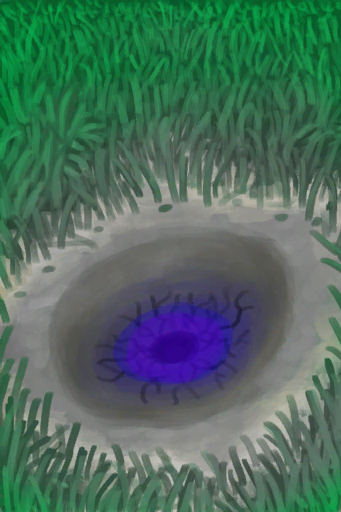

# 【Other】Events  

<table><tr style="height:10px"><td rowspan=3 style="width:80px">

</td><td style="font-size: 1.2em">[Asteroid Impact!(Event)](Event_AlienCrater.md)</td></tr><tr><td>What was that!?</td></tr><tr><td>

Continue

</td></tr></table>

  

<table><tr style="height:10px"><td rowspan=3 style="width:80px">

</td><td style="font-size: 1.2em">[Ouch!(Event)](Event_DiveLaceration.md)</td></tr><tr><td>You cut yourself while exploring the shipwreck!</td></tr><tr><td>

Nice

</td></tr></table>

  

<table><tr style="height:10px"><td rowspan=3 style="width:80px">

</td><td style="font-size: 1.2em">[BOOOOOM!!(Event)](Event_JerrycanExplosion.md)</td></tr><tr><td>The jerrycan exploded!</td></tr><tr><td>

It burns!!

</td></tr></table>

  

<table><tr style="height:10px"><td rowspan=3 style="width:80px">

</td><td style="font-size: 1.2em">[I'm not going to make it....(Event)](Event_SwimFail.md)</td></tr><tr><td>This isn't working...  I should swim back to land.</td></tr><tr><td>

Swim back

</td></tr></table>

  

