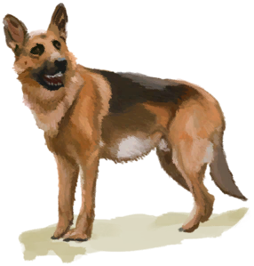

# 【Pet】Events  

<table><tr style="height:10px"><td rowspan=3 style="width:80px">

</td><td style="font-size: 1.2em">[Ouch!!!!(Event)](Event_DogFriendAnger.md)</td></tr><tr><td>Your dog just bit you! It's probably all the stress!</td></tr><tr><td>

Continue

</td></tr></table>

  

<table><tr style="height:10px"><td rowspan=3 style="width:80px">

</td><td style="font-size: 1.2em">[A gift!(Event)](Event_DogFriendGift.md)</td></tr><tr><td>Your friend seems to have brought you a gift!</td></tr><tr><td>

Check Gift

</td></tr></table>

  

<table><tr style="height:10px"><td rowspan=3 style="width:80px">

</td><td style="font-size: 1.2em">[Ouch!!!!(Event)](Event_MacaqueFriendAnger.md)</td></tr><tr><td>Your macaque just bit you! It's probably all the stress!</td></tr><tr><td>

Continue

</td></tr></table>

  

<table><tr style="height:10px"><td rowspan=3 style="width:80px">

</td><td style="font-size: 1.2em">[A gift!(Event)](Event_MacaqueFriendGift.md)</td></tr><tr><td>Your friend seems to have brought you a gift!</td></tr><tr><td>

Check Gift

</td></tr></table>

  

