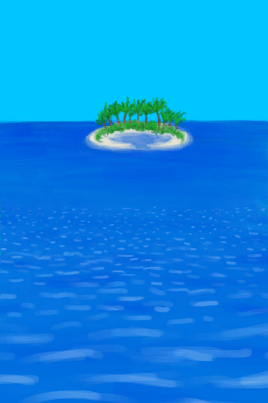
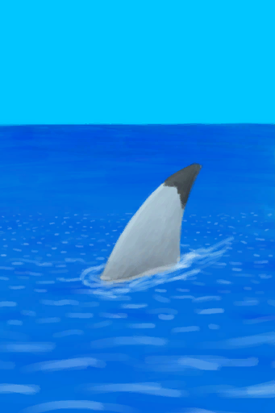
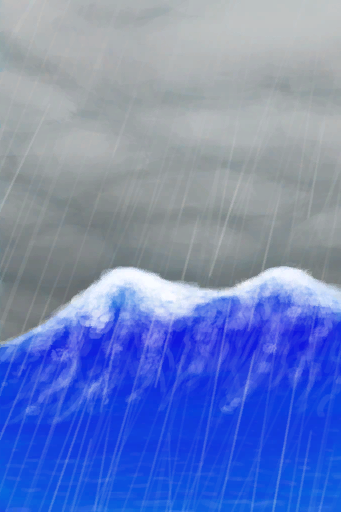

# 【木筏事件】Events  

<b>Trigger: </b>
[

[Distance](Distance.md)](Distance.md): <b>336-2016</b>或[

[Distance](Distance.md)](Distance.md): <b>672-2016</b>或[

[Distance](Distance.md)](Distance.md): <b>1008-2016</b>或[

[Distance](Distance.md)](Distance.md): <b>1344-2016</b>或[

[Distance](Distance.md)](Distance.md): <b>1680-2016</b>  

<table><tr style="height:10px"><td rowspan=3 style="width:80px">

</td><td style="font-size: 1.2em">[Land Ahead!(Event)](Event_Raft_Atoll.md)</td></tr><tr><td>"It's just a tiny atoll</td></tr><tr><td>

Stop Here

Keep Going

</td></tr></table>

  

<b>Trigger: </b>
[

[Distance](Distance.md)](Distance.md): <b>336-2016</b>或[

[Distance](Distance.md)](Distance.md): <b>672-2016</b>或[

[Distance](Distance.md)](Distance.md): <b>1008-2016</b>或[

[Distance](Distance.md)](Distance.md): <b>1344-2016</b>或[

[Distance](Distance.md)](Distance.md): <b>1680-2016</b>  

<table><tr style="height:10px"><td rowspan=3 style="width:80px">

</td><td style="font-size: 1.2em">[Floating Debris!(Event)](Event_Raft_FloatingDebris.md)</td></tr><tr><td>I could probably find something useful in there.</td></tr><tr><td>

Continue

</td></tr></table>

<table><tr style="height:10px"><td rowspan=3 style="width:45px">↳</td><td rowspan=3 style="width:80px">

</td><td style="font-size: 1.2em">[Floating Debris Missed(Event)](Event_FloatingDebrisMissed.md)</td></tr><tr><td>That floating debris is now out of my range. Shame I missed it.</td></tr><tr><td>

Continue

</td></tr></table>

  

<b>Trigger: </b>
[

[Distance](Distance.md)](Distance.md): <b>336-2016</b>或[

[Distance](Distance.md)](Distance.md): <b>672-2016</b>或[

[Distance](Distance.md)](Distance.md): <b>1008-2016</b>或[

[Distance](Distance.md)](Distance.md): <b>1344-2016</b>或[

[Distance](Distance.md)](Distance.md): <b>1680-2016</b>  

<table><tr style="height:10px"><td rowspan=3 style="width:80px">

</td><td style="font-size: 1.2em">[A Passing Ship!(Event)](Event_Raft_PassingShip.md)</td></tr><tr><td>I should try to get its attention before it gets too far!</td></tr><tr><td>

Continue

</td></tr></table>

<table><tr style="height:10px"><td rowspan=3 style="width:45px">↳</td><td rowspan=3 style="width:80px">

</td><td style="font-size: 1.2em">[Ship Missed(Event)](Event_ShipMissed.md)</td></tr><tr><td>The Ship is now gone. If only I had been able to get its attention....</td></tr><tr><td>

Continue

</td></tr></table>

<table><tr style="height:10px"><td rowspan=3 style="width:45px">↳</td><td rowspan=3 style="width:80px">

</td><td style="font-size: 1.2em">[Ship Rescue(Event)](Event_ShipRescue.md)</td></tr><tr><td>The ship has seen you! It's sounding its horn! They're coming to get you!</td></tr><tr><td>

Continue

</td></tr></table>

  

<b>Trigger: </b>
[

[Distance](Distance.md)](Distance.md): <b>336-2016</b>或[

[Distance](Distance.md)](Distance.md): <b>672-2016</b>或[

[Distance](Distance.md)](Distance.md): <b>1008-2016</b>或[

[Distance](Distance.md)](Distance.md): <b>1344-2016</b>或[

[Distance](Distance.md)](Distance.md): <b>1680-2016</b>  

<table><tr style="height:10px"><td rowspan=3 style="width:80px">

</td><td style="font-size: 1.2em">[A Shark!(Event)](Event_Raft_SharkVisitor.md)</td></tr><tr><td>It seems to be following the Raft. This isn't good!</td></tr><tr><td>

Continue

</td></tr></table>

  

<b>Trigger: </b>
[

[Distance](Distance.md)](Distance.md): <b>2016-2016</b> 
<b>Effect: </b>
[Sleep Interrupt](SleepInterrupt.md)<b>+1</b>  

<table><tr style="height:10px"><td rowspan=3 style="width:80px">

</td><td style="font-size: 1.2em">[Ship Incoming!(Event)](Event_ShipRescueDistance.md)</td></tr><tr><td>A ship has appeared and it seems to be coming straight towards you! It's sounding it's horn! They've seen you!</td></tr><tr><td>

Continue

</td></tr></table>

<table><tr style="height:10px"><td rowspan=3 style="width:45px">↳</td><td rowspan=3 style="width:80px">

</td><td style="font-size: 1.2em">[VICTORY!(Event)](Event_ShipEscape.md)</td></tr><tr><td>CONGRATULATIONS! A ship has rescued you! </td></tr><tr><td>

Return to civilization

</td></tr></table>

  

<b>Trigger: </b>
[WaveCounter](WaveCounter.md): <b>24-24</b>，[Sea Agitation](SeaAgitation.md): <b>4-5</b> 
<b>Effect: </b>
[WaveCounter](WaveCounter.md)<b>-24</b> <b>Blocked By ：</b>[

[Calm](OpenSea_Calm.md)](OpenSea_Calm.md),[

[Favourable Wind](OpenSea_Favourable.md)](OpenSea_Favourable.md),[

[Unfavourable Wind](OpenSea_UnFavourable.md)](OpenSea_UnFavourable.md),[

[Very Favourable Wind](OpenSea_VeryFavourable.md)](OpenSea_VeryFavourable.md),[

[Very Unfavourable Wind](OpenSea_VeryUnFavourable.md)](OpenSea_VeryUnFavourable.md)  

<table><tr style="height:10px"><td rowspan=3 style="width:80px">

</td><td style="font-size: 1.2em">[A huge wave strikes the raft!(Event)](Event_Wave.md)</td></tr><tr><td></td></tr><tr><td>

Brace yourself!

</td></tr></table>

  

