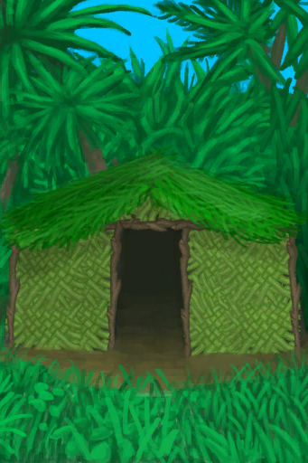

# 【Damage】Events  

<b>Trigger: </b>
[Mouse Raid Counter](MouseDamageCounter.md): <b>192-192</b>, [

[Distance](Distance.md)](Distance.md): <b>0-0</b>, ~~[

[Door](Imp_Door.md)](Imp_Door.md) On Hand/Board~~，~~In [

[Bird Rock(Environment)](Env_BirdRock.md)](Env_BirdRock.md)~~, [“Feed”](tag_Feed.md) On Board/不在容器中 
<b>Effect: </b>
[Mouse Raid Counter](MouseDamageCounter.md)<b>-192</b>  

<table><tr style="height:10px"><td rowspan=3 style="width:80px">

</td><td style="font-size: 1.2em">[Mouse Damage(Event)](Event_MouseDamage.md)</td></tr><tr><td>There are signs of mouse activity in the area.</td></tr><tr><td>

Assess the damage

</td></tr></table>

  

<b>Trigger: </b>
[Storm Counter](StormCounter.md): <b>6-6</b>, [

[Sheltered](Sheltered.md)](Sheltered.md): <b>0-0</b>, [“Seagull Compatible”](tag_Coastal.md) On Hand/Board 
<b>Effect: </b>
[Storm Counter](StormCounter.md)<b>-5</b> <b>Blocked By ：</b>[

[Dark Cave(Environment)](Env_CaveDark.md)](Env_CaveDark.md),[Cave(Environment)](Env_CaveGrasslands.md),[Cave(Environment)](Env_CaveSea.md),[Tidal Cave(Environment)](Env_CaveTidal.md),[

[Cellar(Environment)](Env_Cellar.md)](Env_Cellar.md),[

[Enclosure(Environment)](Env_Enclosure.md)](Env_Enclosure.md),[

[Flooded Chamber(Environment)](Env_FloodedChamber.md)](Env_FloodedChamber.md),[

[Eastern Grasslands(Environment)](Env_GrasslandsE.md)](Env_GrasslandsE.md),[

[Western Grasslands(Environment)](Env_GrasslandsW.md)](Env_GrasslandsW.md),[

[Eastern Highlands(Environment)](Env_HighlandsEastern.md)](Env_HighlandsEastern.md),[

[Western Highlands(Environment)](Env_HighlandsWestern.md)](Env_HighlandsWestern.md),[

[Jungle(Environment)](Env_Jungle.md)](Env_Jungle.md),[

[Mud Hut(Environment)](Env_MudHut.md)](Env_MudHut.md),[

[Shed(Environment)](Env_Shed.md)](Env_Shed.md),[

[Stone Hut(Environment)](Env_StoneHut.md)](Env_StoneHut.md),[

[Tunnel(Environment)](Env_Tunnel.md)](Env_Tunnel.md),[

[Volcano(Environment)](Env_Volcano.md)](Env_Volcano.md),[

[Wetlands(Environment)](Env_Wetlands.md)](Env_Wetlands.md)  

<table><tr style="height:10px"><td rowspan=3 style="width:80px">

</td><td style="font-size: 1.2em">[The wind is too strong!(Event)](Event_Storm.md)</td></tr><tr><td></td></tr><tr><td>

Take Shelter

</td></tr></table>

  

<b>Trigger: </b>
[Storm Bay](Storm_Bay.md): <b>1-1</b>, ~~[

[Storm](TropicalIsland_Storm.md)](TropicalIsland_Storm.md) On Hand/Board~~，In [

[Bay(Environment)](Env_Bay.md)](Env_Bay.md)或[Storm Beach](Storm_Beach.md): <b>1-1</b>, ~~[

[Storm](TropicalIsland_Storm.md)](TropicalIsland_Storm.md) On Hand/Board~~，In [

[Beach(Environment)](Env_Beach.md)](Env_Beach.md)或[Storm Desolate Beach](Storm_DesolateBeach.md): <b>1-1</b>, ~~[

[Storm](TropicalIsland_Storm.md)](TropicalIsland_Storm.md) On Hand/Board~~，[

[Desolate Beach](DesolateBeach.md)](DesolateBeach.md) On Hand/Board或[Storm Mangroves](Storm_Mangroves.md): <b>1-1</b>, ~~[

[Storm](TropicalIsland_Storm.md)](TropicalIsland_Storm.md) On Hand/Board~~，In [

[Mangrove Forest(Environment)](Env_Mangroves.md)](Env_Mangroves.md)或[Storm Outskirts](Storm_Outskirts.md): <b>1-1</b>, ~~[

[Storm](TropicalIsland_Storm.md)](TropicalIsland_Storm.md) On Hand/Board~~，In [

[Outskirts(Environment)](Env_Outskirts.md)](Env_Outskirts.md)或[Storm Rocks](Storm_Rocks.md): <b>1-1</b>, ~~[

[Storm](TropicalIsland_Storm.md)](TropicalIsland_Storm.md) On Hand/Board~~，In [

[Rocks(Environment)](Env_Rocks.md)](Env_Rocks.md) <b>Blocked By ：</b>[

[Dark Cave(Environment)](Env_CaveDark.md)](Env_CaveDark.md),[Cave(Environment)](Env_CaveGrasslands.md),[Cave(Environment)](Env_CaveSea.md),[Tidal Cave(Environment)](Env_CaveTidal.md),[

[Cellar(Environment)](Env_Cellar.md)](Env_Cellar.md),[

[Enclosure(Environment)](Env_Enclosure.md)](Env_Enclosure.md),[

[Flooded Chamber(Environment)](Env_FloodedChamber.md)](Env_FloodedChamber.md),[

[Eastern Grasslands(Environment)](Env_GrasslandsE.md)](Env_GrasslandsE.md),[

[Western Grasslands(Environment)](Env_GrasslandsW.md)](Env_GrasslandsW.md),[

[Eastern Highlands(Environment)](Env_HighlandsEastern.md)](Env_HighlandsEastern.md),[

[Western Highlands(Environment)](Env_HighlandsWestern.md)](Env_HighlandsWestern.md),[

[Jungle(Environment)](Env_Jungle.md)](Env_Jungle.md),[

[Mud Hut(Environment)](Env_MudHut.md)](Env_MudHut.md),[

[Shed(Environment)](Env_Shed.md)](Env_Shed.md),[

[Stone Hut(Environment)](Env_StoneHut.md)](Env_StoneHut.md),[

[Tunnel(Environment)](Env_Tunnel.md)](Env_Tunnel.md),[

[Volcano(Environment)](Env_Volcano.md)](Env_Volcano.md),[

[Wetlands(Environment)](Env_Wetlands.md)](Env_Wetlands.md)  

<table><tr style="height:10px"><td rowspan=3 style="width:80px">

</td><td style="font-size: 1.2em">[Storm Damage(Event)](Event_StormDamage.md)</td></tr><tr><td>The storm hit this area...</td></tr><tr><td>

Assess the damage

</td></tr></table>

  

<b>Trigger: </b>
[WaveCounter](WaveCounter.md): <b>24-24</b>，[Sea Agitation](SeaAgitation.md): <b>4-5</b> 
<b>Effect: </b>
[WaveCounter](WaveCounter.md)<b>-24</b> <b>Blocked By ：</b>[

[Calm](OpenSea_Calm.md)](OpenSea_Calm.md),[

[Favourable Wind](OpenSea_Favourable.md)](OpenSea_Favourable.md),[

[Unfavourable Wind](OpenSea_UnFavourable.md)](OpenSea_UnFavourable.md),[

[Very Favourable Wind](OpenSea_VeryFavourable.md)](OpenSea_VeryFavourable.md),[

[Very Unfavourable Wind](OpenSea_VeryUnFavourable.md)](OpenSea_VeryUnFavourable.md)  

<table><tr style="height:10px"><td rowspan=3 style="width:80px">

</td><td style="font-size: 1.2em">[A huge wave strikes the raft!(Event)](Event_Wave.md)</td></tr><tr><td></td></tr><tr><td>

Brace yourself!

</td></tr></table>

  

