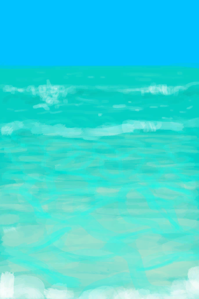

# 【Unused】Events  

<table><tr style="height:10px"><td rowspan=3 style="width:80px">

</td><td style="font-size: 1.2em">[It Escaped!(Event)](Event_BoarArcheryFailure.md)</td></tr><tr><td>"Darn</td></tr><tr><td>

Continue

</td></tr></table>

  

<table><tr style="height:10px"><td rowspan=3 style="width:80px">

</td><td style="font-size: 1.2em">[I lost the trail...(Event)](Event_BoarTrailLost.md)</td></tr><tr><td>It seems I lost it. A shame... better luck next time.</td></tr><tr><td>

Continue

</td></tr></table>

  

<table><tr style="height:10px"><td rowspan=3 style="width:80px">

</td><td style="font-size: 1.2em">[Old Trail(Event)](Event_BoarTrailOld.md)</td></tr><tr><td>A big animal has been here some time ago.</td></tr><tr><td>

Follow Trail

Ignore

</td></tr></table>

  

<table><tr style="height:10px"><td rowspan=3 style="width:80px">

</td><td style="font-size: 1.2em">[Recent Trail(Event)](Event_BoarTrailRecent.md)</td></tr><tr><td>A big animal has been here recently.</td></tr><tr><td>

Follow Trail

Ignore

</td></tr></table>

  

<table><tr style="height:10px"><td rowspan=3 style="width:80px">

</td><td style="font-size: 1.2em">[A Macaque!(Event)](Event_MacaqueUndeadFight.md)</td></tr><tr><td>Should I attack it or leave it alone?</td></tr><tr><td>

Attack with Spear!

Attack with Bow!

Attack with Gun!

Attack with Sling!

Retreat

</td></tr></table>

  

<table><tr style="height:10px"><td rowspan=3 style="width:80px">

</td><td style="font-size: 1.2em">[It Escaped!(Event)](Event_MacaqueUndeadFightFailure.md)</td></tr><tr><td>"Darn</td></tr><tr><td>

Continue

</td></tr></table>

  

<table><tr style="height:10px"><td rowspan=3 style="width:80px">

</td><td style="font-size: 1.2em">[The Macaque is down!(Event)](Event_MacaqueUndeadFightSuccess.md)</td></tr><tr><td>You managed to get it. It's yours now!</td></tr><tr><td>

Continue

</td></tr></table>

  

<table><tr style="height:10px"><td rowspan=3 style="width:80px">

</td><td style="font-size: 1.2em">[Captain(Talk1a)(Event)](Event_CaptainTalk1a.md)</td></tr><tr><td>"So</td></tr><tr><td>

Talk later!

</td></tr></table>

  

<table><tr style="height:10px"><td rowspan=3 style="width:80px">

</td><td style="font-size: 1.2em">[The Criminals are back!(Event)](Event_Boat.md)</td></tr><tr><td>You see the criminal's coming back on their boat. What will you do!??</td></tr><tr><td>

Continue

</td></tr></table>

  

<table><tr style="height:10px"><td rowspan=3 style="width:80px">

</td><td style="font-size: 1.2em">[Death(Event)](Event_DeathContentment.md)</td></tr><tr><td>You killed yourself...</td></tr><tr><td>

Come back to life!

</td></tr></table>

  

<table><tr style="height:10px"><td rowspan=3 style="width:80px">

</td><td style="font-size: 1.2em">[Death(Event)](Event_DeathGeneral.md)</td></tr><tr><td>You are dead...</td></tr><tr><td>

Stand Up

</td></tr></table>

  

<b>Trigger: </b>
[

[Hypothermia](Hypothermia.md)](Hypothermia.md): <b>100-100</b>  

<table><tr style="height:10px"><td rowspan=3 style="width:80px">

</td><td style="font-size: 1.2em">[Death(Event)](Event_DeathHypothermia.md)</td></tr><tr><td>You froze to death...</td></tr><tr><td>

Come back to life!

</td></tr></table>

  

<b>Trigger: </b>
[

[Weight](Weight.md)](Weight.md): <b>0-0</b>  

<table><tr style="height:10px"><td rowspan=3 style="width:80px">

</td><td style="font-size: 1.2em">[Death(Event)](Event_DeathNutrition.md)</td></tr><tr><td>You died of starvation...</td></tr><tr><td>

Come back to life!

</td></tr></table>

  

<table><tr style="height:10px"><td rowspan=3 style="width:80px">

</td><td style="font-size: 1.2em">[A Large Island in the distance...(Event)](Event_DistantIsland.md)</td></tr><tr><td></td></tr><tr><td>

Stay

Swim to the Island

Use Raft to get to the island

</td></tr></table>

  

<table><tr style="height:10px"><td rowspan=3 style="width:80px">

</td><td style="font-size: 1.2em">[Drum(Event)](Event_DrumMenu.md)</td></tr><tr><td>Choose what to play:</td></tr><tr><td>

Practice

Flowing Rythm

Intense Rythm

</td></tr></table>

  

<table><tr style="height:10px"><td rowspan=3 style="width:80px">

</td><td style="font-size: 1.2em">[You got nothing!(Event)](Event_FishNothing.md)</td></tr><tr><td>Better luck next time!</td></tr><tr><td>

...

</td></tr></table>

  

<table><tr style="height:10px"><td rowspan=3 style="width:80px">

</td><td style="font-size: 1.2em">[The wind is too strong!(Event)](Event_Flood.md)</td></tr><tr><td></td></tr><tr><td>

Take Shelter

</td></tr></table>

  

<table><tr style="height:10px"><td rowspan=3 style="width:80px">

</td><td style="font-size: 1.2em">[Storm Damage(Event)](Event_FloodDamage.md)</td></tr><tr><td>The storm hit this area...</td></tr><tr><td>

Assess the damage

</td></tr></table>

  

<table><tr style="height:10px"><td rowspan=3 style="width:80px">

</td><td style="font-size: 1.2em">[Grouper Encounter(Event)](Event_Grouper.md)</td></tr><tr><td>I found a large Grouper fish. I could try to throw a spear at it.</td></tr><tr><td>

Swim away

</td></tr></table>

  

<table><tr style="height:10px"><td rowspan=3 style="width:80px">

</td><td style="font-size: 1.2em">[Fail!(Event)](Event_GrouperFailure.md)</td></tr><tr><td>I missed... a shame.</td></tr><tr><td>

Swim away

</td></tr></table>

  

<table><tr style="height:10px"><td rowspan=3 style="width:80px">

</td><td style="font-size: 1.2em">[Plane Crash(Event)](Event_IntroTough.md)</td></tr><tr><td>"You shift your position: intense pain awakens you from your trance.  You feel some liquid running down your body... you're bleeding!  You remember your plane crashing</td></tr><tr><td>

Stand Up

</td></tr></table>

  

<table><tr style="height:10px"><td rowspan=3 style="width:80px">

</td><td style="font-size: 1.2em">[Ouch!!!!(Event)](Event_MacaqueFoeAnger.md)</td></tr><tr><td>The macaque just bit you! It probably didn't like your interruption!</td></tr><tr><td>

Continue

</td></tr></table>

  

<table><tr style="height:10px"><td rowspan=3 style="width:80px">

</td><td style="font-size: 1.2em">[Fall!(Event)](Event_MountainSlip.md)</td></tr><tr><td>You fell and got yourself some ugly scrapes...</td></tr><tr><td>

Nice

</td></tr></table>

  

<table><tr style="height:10px"><td rowspan=3 style="width:80px">

</td><td style="font-size: 1.2em">[Plane Rescue(Event)](Event_PlaneRescue.md)</td></tr><tr><td>You have made it!! The plane has rescued you!  CONGRATULATIONS!</td></tr><tr><td>

Go back to civilization

</td></tr></table>

  

<table><tr style="height:10px"><td rowspan=3 style="width:80px">

</td><td style="font-size: 1.2em">[Sap Station(Event)](Event_SapStation.md)</td></tr><tr><td>You've successfully climbed the Palm Tree and prepared it for extracting its sap.</td></tr><tr><td>

Take Coconuts

</td></tr></table>

  

<table><tr style="height:10px"><td rowspan=3 style="width:80px">

</td><td style="font-size: 1.2em">[Sap Station(Event)](Event_SapStationNoCoconuts.md)</td></tr><tr><td>You've successfully climbed the Palm Tree and prepared it for extracting its sap.</td></tr><tr><td>

Take Coconuts

</td></tr></table>

  

<table><tr style="height:10px"><td rowspan=3 style="width:80px">

</td><td style="font-size: 1.2em">[Slipped!(Event)](Event_SlipRocks.md)</td></tr><tr><td>You fell and hurt yourself...</td></tr><tr><td>

...

</td></tr></table>

  

<table><tr style="height:10px"><td rowspan=3 style="width:80px">

</td><td style="font-size: 1.2em">[Failure!(Event)](Event_SwimmingFailed.md)</td></tr><tr><td>You were getting too tired and had to come back.</td></tr><tr><td>

Nice

</td></tr></table>

  

<table><tr style="height:10px"><td rowspan=3 style="width:80px">

</td><td style="font-size: 1.2em">[The Show is On(Event)](Event_TVIntro.md)</td></tr><tr><td>"Survive the island challenge to earn lots of money! Every time a supply capsule lands on the island</td></tr><tr><td>

Continue

</td></tr></table>

  

<b>Trigger: </b>
[

[TV Lives](TV_Lives.md)](TV_Lives.md): <b>0-0</b>  

<table><tr style="height:10px"><td rowspan=3 style="width:80px">

</td><td style="font-size: 1.2em">[Collar Damage!(Event)](Event_TVNerveDamageDead.md)</td></tr><tr><td>Argh! Frggrrhhhrrr......</td></tr><tr><td>

Continue

</td></tr></table>

  

<b>Trigger: </b>
[

[TV Lives](TV_Lives.md)](TV_Lives.md): <b>2-2</b>  

<table><tr style="height:10px"><td rowspan=3 style="width:80px">

</td><td style="font-size: 1.2em">[Collar Damage!(Event)](Event_TVNerveDamageHands.md)</td></tr><tr><td>Argh! The collar just gave me a shock and my hands are no longer responding well...</td></tr><tr><td>

Continue

</td></tr></table>

  

<b>Trigger: </b>
[

[TV Lives](TV_Lives.md)](TV_Lives.md): <b>1-1</b>  

<table><tr style="height:10px"><td rowspan=3 style="width:80px">

</td><td style="font-size: 1.2em">[Collar Damage!(Event)](Event_TVNerveDamageLegs.md)</td></tr><tr><td>Argh! The collar just gave me a shock and my legs are no longer responding well...</td></tr><tr><td>

Continue

</td></tr></table>

  

<b>Trigger: </b>
[

[TV - Wait](TV_CounterWait.md)](TV_CounterWait.md): <b>288-288</b> 
<b>Effect: </b>
[TV Crate Killer](TV_CrateKiller.md)<b>-1</b>  

<table><tr style="height:10px"><td rowspan=3 style="width:80px">

</td><td style="font-size: 1.2em">[Capsule Dropped - Grasslands(Event)](Event_TVPackageGrasslands.md)</td></tr><tr><td>It seems a capsule has been dropped in the Grasslands. I have 2 days to get it before losing one life!</td></tr><tr><td>

Continue

</td></tr></table>

  

<b>Trigger: </b>
[

[TV - Wait](TV_CounterWait.md)](TV_CounterWait.md): <b>288-288</b> 
<b>Effect: </b>
[TV Crate Killer](TV_CrateKiller.md)<b>-1</b>  

<table><tr style="height:10px"><td rowspan=3 style="width:80px">

</td><td style="font-size: 1.2em">[Capsule Dropped - Highlands(Event)](Event_TVPackageHighlands.md)</td></tr><tr><td>It seems a capsule has been dropped in the highlands. I have 2 days to get it before losing one life!</td></tr><tr><td>

Continue

</td></tr></table>

  

<b>Trigger: </b>
[

[TV - Wait](TV_CounterWait.md)](TV_CounterWait.md): <b>288-288</b> 
<b>Effect: </b>
[TV Crate Killer](TV_CrateKiller.md)<b>-1</b>  

<table><tr style="height:10px"><td rowspan=3 style="width:80px">

</td><td style="font-size: 1.2em">[Capsule Dropped - Jungle(Event)](Event_TVPackageJungle.md)</td></tr><tr><td>It seems a capsule has been dropped in the Jungle. I have 2 days to get it before losing one life!</td></tr><tr><td>

Continue

</td></tr></table>

  

<b>Trigger: </b>
[

[TV - Wait](TV_CounterWait.md)](TV_CounterWait.md): <b>288-288</b> 
<b>Effect: </b>
[TV Crate Killer](TV_CrateKiller.md)<b>-1</b>  

<table><tr style="height:10px"><td rowspan=3 style="width:80px">

</td><td style="font-size: 1.2em">[Capsule Dropped - Mangroves(Event)](Event_TVPackageMangroves.md)</td></tr><tr><td>It seems a capsule has been dropped in the Mangrove Forest. I have 2 days to get it before losing one life!</td></tr><tr><td>

Continue

</td></tr></table>

  

<b>Trigger: </b>
[

[TV - Wait](TV_CounterWait.md)](TV_CounterWait.md): <b>288-288</b> 
<b>Effect: </b>
[TV Crate Killer](TV_CrateKiller.md)<b>-1</b>  

<table><tr style="height:10px"><td rowspan=3 style="width:80px">

</td><td style="font-size: 1.2em">[Capsule Dropped - Rocks(Event)](Event_TVPackageRocks.md)</td></tr><tr><td>It seems a capsule has been dropped on the Rocks area. I have 2 days to get it before losing one life!</td></tr><tr><td>

Continue

</td></tr></table>

  

<table><tr style="height:10px"><td rowspan=3 style="width:80px">

</td><td style="font-size: 1.2em">[Divine Insight(Event)](Event_GodExperience1z.md)</td></tr><tr><td>Everything that ever happened to you... ...everything has been leading to this moment!  ... and you are starting to wake up....</td></tr><tr><td>

...and I am LOVE

</td></tr></table>

  

<table><tr style="height:10px"><td rowspan=3 style="width:80px">

</td><td style="font-size: 1.2em">[Divine Insight(Event)](Event_GodExperience1zz.md)</td></tr><tr><td>"Love is existence. Existence is a wish of love and you are that wish!  You are love aware of itself</td></tr><tr><td>

...and I am LOVE

</td></tr></table>

  

<table><tr style="height:10px"><td rowspan=3 style="width:80px">

</td><td style="font-size: 1.2em">[Divine Insight(Event)](Event_HuntedExperience1a.md)</td></tr><tr><td>Oh the joy you feel... The love is all encompassing...  It fills you so much there's no room for anything else!</td></tr><tr><td>

Smile

</td></tr></table>

  

<table><tr style="height:10px"><td rowspan=3 style="width:80px">

</td><td style="font-size: 1.2em">[Divine Insight(Event)](Event_HuntedExperience1b.md)</td></tr><tr><td>Everything that ever happened to you... ...everything has been leading to this moment!  ... and you are starting to wake up....</td></tr><tr><td>

I feel it!

</td></tr></table>

  

<table><tr style="height:10px"><td rowspan=3 style="width:80px">

</td><td style="font-size: 1.2em">[Divine Insight(Event)](Event_HuntedExperience1c.md)</td></tr><tr><td>"Love is a desire for existence. Thus</td></tr><tr><td>

...and I am LOVE

</td></tr></table>

  

<table><tr style="height:10px"><td rowspan=3 style="width:80px">

</td><td style="font-size: 1.2em">[Divine Insight(Event)](Event_HuntedExperience1d.md)</td></tr><tr><td>YES! You are LOVE! You are love aware of itself!   THOU ART GOD!</td></tr><tr><td>

It all makes sense now.

</td></tr></table>

  

<table><tr style="height:10px"><td rowspan=3 style="width:80px">

</td><td style="font-size: 1.2em">[Divine Insight(Event)](Event_HuntedExperience1e.md)</td></tr><tr><td>"Yes</td></tr><tr><td>

But I don't want to wake up!

</td></tr></table>

  

<table><tr style="height:10px"><td rowspan=3 style="width:80px">

</td><td style="font-size: 1.2em">[Divine Insight(Event)](Event_HuntedExperience1f.md)</td></tr><tr><td>"Yes</td></tr><tr><td>

I don't want to wake up!

</td></tr></table>

  

<table><tr style="height:10px"><td rowspan=3 style="width:80px">

</td><td style="font-size: 1.2em">[Divine Insight(Event)](Event_HuntedExperience1g.md)</td></tr><tr><td>"But this vessel you are</td></tr><tr><td>

HOLD ON TIGHT!

</td></tr></table>

  

<table><tr style="height:10px"><td rowspan=3 style="width:80px">

</td><td style="font-size: 1.2em">[Perspective Insight(Event)](Event_SpiritsEverywhere1a.md)</td></tr><tr><td>Something just broke...  All is grey.... all is distant... Something is very wrong.</td></tr><tr><td>

Oh no...

</td></tr></table>

  

<table><tr style="height:10px"><td rowspan=3 style="width:80px">

</td><td style="font-size: 1.2em">[Void Insight(Event)](Event_SpiritsEverywhere1b.md)</td></tr><tr><td>A belief has been lost...   Reality... your life... your story... A part of you no longer believes in it.</td></tr><tr><td>

It hurts.

</td></tr></table>

  

<table><tr style="height:10px"><td rowspan=3 style="width:80px">

</td><td style="font-size: 1.2em">[Void Insight(Event)](Event_SpiritsEverywhere1c.md)</td></tr><tr><td>"Everything you ever cared about feels like a joke...  Everything is fake</td></tr><tr><td>

No... No...

</td></tr></table>

  

<table><tr style="height:10px"><td rowspan=3 style="width:80px">

</td><td style="font-size: 1.2em">[Void Insight(Event)](Event_SpiritsEverywhere1d.md)</td></tr><tr><td>You can feel reality starting to unravel... It's coming apart at the seams!  Your mind is in pain!</td></tr><tr><td>

Unbearable pain!

</td></tr></table>

  

<table><tr style="height:10px"><td rowspan=3 style="width:80px">

</td><td style="font-size: 1.2em">[Void Insight(Event)](Event_SpiritsEverywhere1e.md)</td></tr><tr><td>The secret is being revealed... ...and you knew it all along.  You just didn't want to look that way.</td></tr><tr><td>

Look the other way!

</td></tr></table>

  

<table><tr style="height:10px"><td rowspan=3 style="width:80px">

</td><td style="font-size: 1.2em">[Void Insight(Event)](Event_SpiritsEverywhere1f.md)</td></tr><tr><td>It's too late for that.  You can't escape the truth. It's coming for you</td></tr><tr><td>

STOP!

</td></tr></table>

  

<table><tr style="height:10px"><td rowspan=3 style="width:80px">

</td><td style="font-size: 1.2em">[Void Insight(Event)](Event_SpiritsEverywhere1g.md)</td></tr><tr><td>The truth... is that nothing is real...  ... and you just... DON'T. REALLY. EXIST.</td></tr><tr><td>

UNBEARABLE MIND PAIN!

</td></tr></table>

  

<table><tr style="height:10px"><td rowspan=3 style="width:80px">

</td><td style="font-size: 1.2em">[Void Insight(Event)](Event_VoidExperience1d.md)</td></tr><tr><td>You can feel reality starting to unravel... It's coming apart at the seams!  Your mind is in pain!</td></tr><tr><td>

Unbearable pain!

</td></tr></table>

  

<table><tr style="height:10px"><td rowspan=3 style="width:80px">

</td><td style="font-size: 1.2em">[Weston(IslandEscape1)(Event)](Event_WestonIslandEscape1.md)</td></tr><tr><td>What is bothering you my friend?  You are worried you won't make it on the raft?</td></tr><tr><td>

Yeah...

</td></tr></table>

  

<table><tr style="height:10px"><td rowspan=3 style="width:80px">

</td><td style="font-size: 1.2em">[Weston(IslandEscape2)(Event)](Event_WestonIslandEscape2.md)</td></tr><tr><td>Have faith my friend! I have a feeling you will do alright!  Look at how much you've been through already!</td></tr><tr><td>

"Thanks

</td></tr></table>

  

<table><tr style="height:10px"><td rowspan=3 style="width:80px">

</td><td style="font-size: 1.2em">[Weston(Special5d2)(Event)](Event_WestonSpecial5d2.md)</td></tr><tr><td>Good. Notice how you are actually someone playing a video game?  Imagining that you are this character stranded on an island?</td></tr><tr><td>

Not sure I do.

</td></tr></table>

  

<table><tr style="height:10px"><td rowspan=3 style="width:80px">

</td><td style="font-size: 1.2em">[Weston(Special5e)(Event)](Event_WestonSpecial5e.md)</td></tr><tr><td>"Before you go then</td></tr><tr><td>

Not sure I do.

</td></tr></table>

  

<table><tr style="height:10px"><td rowspan=3 style="width:80px">

</td><td style="font-size: 1.2em">[Weston(Special5f)(Event)](Event_WestonSpecial5f.md)</td></tr><tr><td>"Enjoy the nice things</td></tr><tr><td>

Not sure I do.

</td></tr></table>

  

<table><tr style="height:10px"><td rowspan=3 style="width:80px">

</td><td style="font-size: 1.2em">[Weston(Special5g)(Event)](Event_WestonSpecial5g.md)</td></tr><tr><td>"Try to love who you are</td></tr><tr><td>

Not sure I do.

</td></tr></table>

  

<table><tr style="height:10px"><td rowspan=3 style="width:80px">

</td><td style="font-size: 1.2em">[Weston(Special5h)(Event)](Event_WestonSpecial5h.md)</td></tr><tr><td>"And one last thing</td></tr><tr><td>

Not sure I do.

</td></tr></table>

  

<table><tr style="height:10px"><td rowspan=3 style="width:80px">

</td><td style="font-size: 1.2em">[Weston(Special5i)(Event)](Event_WestonSpecial5i.md)</td></tr><tr><td>"I'll miss you too my friend. But I'll always be here. I'm a part of your mind just like you're a part of someone else's.  I'm sure that if we want to</td></tr><tr><td>

Not sure I do.

</td></tr></table>

  

<table><tr style="height:10px"><td rowspan=3 style="width:80px">

</td><td style="font-size: 1.2em">[Weston(Special5j)(Event)](Event_WestonSpecial5j.md)</td></tr><tr><td>Congratulations then on transcending my friend!  Until we meet again!</td></tr><tr><td>

Not sure I do.

</td></tr></table>

  

<table><tr style="height:10px"><td rowspan=3 style="width:80px">

</td><td style="font-size: 1.2em">[Event_WestonTalk1a_CardName(Talk1a)(Event)](Event_WestonTalk1a.md)</td></tr><tr><td>So, Weston, let me see if I got this right.</td></tr><tr><td>

Talk later!

</td></tr></table>

  

