# “HandAction(Group)”  

Rearm Trap [
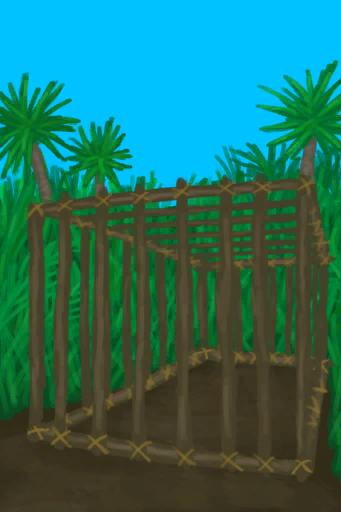
[Disarmed Cage Trap](CageTrapPlacedTriggered.md)](CageTrapPlacedTriggered.md)

Rearm Trap [

[Disarmed Cage Trap](CageTrapPlacedTriggeredPartridgeFemale.md)](CageTrapPlacedTriggeredPartridgeFemale.md)

Rearm Trap [

[Disarmed Cage Trap](CageTrapPlacedTriggeredPartridgeMale.md)](CageTrapPlacedTriggeredPartridgeMale.md)

Rearm Trap [

[Disarmed Cage Trap](CageTrapPlacedTriggeredSeagull.md)](CageTrapPlacedTriggeredSeagull.md)

Destroy [

[Almond Tree Crop Plot](CropPlotAlmondTree.md)](CropPlotAlmondTree.md)

Destroy [

[Aloe Vera Crop Plot](CropPlotAloeVera.md)](CropPlotAloeVera.md)

Destroy [

[Banana Crop Plot](CropPlotBananaTree.md)](CropPlotBananaTree.md)

Destroy [

[Chili Crop Plot](CropPlotChilies.md)](CropPlotChilies.md)

Destroy [

[China Rose Crop Plot](CropPlotChinaRose.md)](CropPlotChinaRose.md)

Destroy [

[Cinchona Crop Plot](CropPlotCinchonaTree.md)](CropPlotCinchonaTree.md)

Destroy [

[Coffee Crop Plot](CropPlotCoffee.md)](CropPlotCoffee.md)

Destroy [

[Ginger Crop Plot](CropPlotGinger.md)](CropPlotGinger.md)

Destroy [

[Jasmine Crop Plot](CropPlotJasmine.md)](CropPlotJasmine.md)

Destroy [

[Kava Crop Plot](CropPlotKava.md)](CropPlotKava.md)

Destroy [

[Lemon Grass Crop Plot](CropPlotLemonGrass.md)](CropPlotLemonGrass.md)

Destroy [

[Mango Crop Plot](CropPlotMangoTree.md)](CropPlotMangoTree.md)

Destroy [

[Nipa Palm Crop Plot](CropPlotNipaPalm.md)](CropPlotNipaPalm.md)

Destroy [

[Palm Bush Crop Plot](CropPlotPalmBush.md)](CropPlotPalmBush.md)

Destroy [

[Palm Tree Crop Plot](CropPlotPalmTree.md)](CropPlotPalmTree.md)

Destroy [

[Rice Crop Plot](CropPlotRice.md)](CropPlotRice.md)

Destroy [

[Ruined Crop Plot](CropPlotRuined.md)](CropPlotRuined.md)

Destroy [

[Sago Palm Crop Plot](CropPlotSagoPalm.md)](CropPlotSagoPalm.md)

Destroy [

[Snake Grass Crop Plot](CropPlotSnakeGrass.md)](CropPlotSnakeGrass.md)

Destroy [

[Spider Lily Crop Plot](CropPlotSpiderLily.md)](CropPlotSpiderLily.md)

Destroy [

[Weevil Lily Crop Plot](CropPlotWeevilLily.md)](CropPlotWeevilLily.md)

Destroy [

[Wild Jujube Crop Plot](CropPlotWildJujube.md)](CropPlotWildJujube.md)

Destroy [

[Yam Crop Plot](CropPlotYam.md)](CropPlotYam.md)

Rearm Trap [

[Deadfall Trap](DeadfallTrapTriggered.md)](DeadfallTrapTriggered.md)

Make Mud [

[Dirt Pile](DirtPile.md)](DirtPile.md)

Crush dirt [

[Dirt Pile](DirtPile.md)](DirtPile.md)

Rearm Trap [

[Log Trap](LogTrapTriggered.md)](LogTrapTriggered.md)

Make Cloth [

[Loom](Loom.md)](Loom.md)

Make Clay [

[Mud Pile](MudPile.md)](MudPile.md)

Apply to Body [

[Mud Pile](MudPile.md)](MudPile.md)

Rearm Trap [

[Snare Trap](SnareTrapTriggered.md)](SnareTrapTriggered.md)

Rearm Trap [

[Trapping Pit](TrappingPitTriggered.md)](TrappingPitTriggered.md)

Craft BluePrint [

[Aloe Gel(BluePrint)](Bp_AloeGel.md)](Bp_AloeGel.md)

Craft BluePrint [

[Arrows(BluePrint)](Bp_Arrow.md)](Bp_Arrow.md)

Craft BluePrint [
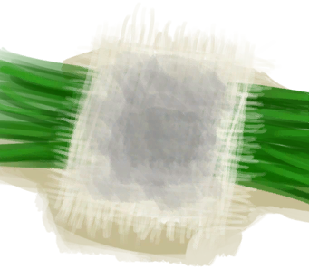
[Ash Dressing(BluePrint)](Bp_AshDressing.md)](Bp_AshDressing.md)

Craft BluePrint [

[Rustic Bed(BluePrint)](Bp_BedRustic.md)](Bp_BedRustic.md)

Craft BluePrint [

[Wooden Bed(BluePrint)](Bp_BedWooden.md)](Bp_BedWooden.md)

Craft BluePrint [

[Bee Skep(BluePrint)](Bp_BeeSkep.md)](Bp_BeeSkep.md)

Craft BluePrint [

[Empty Skep(BluePrint)(Empty)](Bp_BeeSkepEmpty.md)](Bp_BeeSkepEmpty.md)

Craft BluePrint [

[Bee Smoker(BluePrint)](Bp_BeeSmoker.md)](Bp_BeeSmoker.md)

Craft BluePrint [

[Boar Feeder(BluePrint)](Bp_BoarFeeder.md)](Bp_BoarFeeder.md)

Craft BluePrint [

[Bone Knife(BluePrint)](Bp_BoneKnife.md)](Bp_BoneKnife.md)

Craft BluePrint [
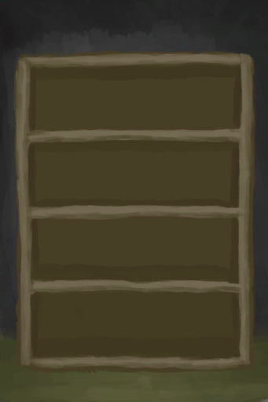
[Bookshelf(BluePrint)](Bp_Bookshelf.md)](Bp_Bookshelf.md)

Craft BluePrint [

[Bow(BluePrint)](Bp_Bow.md)](Bp_Bow.md)

Craft BluePrint [

[Bow Drill(BluePrint)](Bp_BowDrill.md)](Bp_BowDrill.md)

Craft BluePrint [

[Brimstone Gel(BluePrint)](Bp_BrimstoneGel.md)](Bp_BrimstoneGel.md)

Craft BluePrint [

[Broom(BluePrint)](Bp_Broom.md)](Bp_Broom.md)

Craft BluePrint [

[Bug Repellant(BluePrint)](Bp_BugRepellent.md)](Bp_BugRepellent.md)

Craft BluePrint [

[Cage Trap(BluePrint)](Bp_CageTrap.md)](Bp_CageTrap.md)

Craft BluePrint [

[Campfire(BluePrint)](Bp_Campfire.md)](Bp_Campfire.md)

Craft BluePrint [

[Candles(BluePrint)](Bp_Candles.md)](Bp_Candles.md)

Craft BluePrint [

[Citronella Candles(BluePrint)](Bp_CandlesCitronella.md)](Bp_CandlesCitronella.md)

Craft BluePrint [

[Jasmine Candles(BluePrint)](Bp_CandlesJasmine.md)](Bp_CandlesJasmine.md)

Craft BluePrint [

[Cellar(BluePrint)](Bp_Cellar.md)](Bp_Cellar.md)

Craft BluePrint [

[Ceremonial Dagger(BluePrint)](Bp_CeremonialDagger.md)](Bp_CeremonialDagger.md)

Craft BluePrint [

[Chair(BluePrint)](Bp_Chair.md)](Bp_Chair.md)

Craft BluePrint [

[Chest(BluePrint)](Bp_Chest.md)](Bp_Chest.md)

Craft BluePrint [

[Cistern(BluePrint)](Bp_Cistern.md)](Bp_Cistern.md)

Craft BluePrint [

[Compost Bin(BluePrint)](Bp_CompostBin.md)](Bp_CompostBin.md)

Craft BluePrint [

[Copper Axe(BluePrint)](Bp_CopperAxe.md)](Bp_CopperAxe.md)

Craft BluePrint [
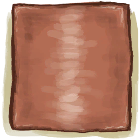
[Copper Sheet(BluePrint)](Bp_CopperSheet.md)](Bp_CopperSheet.md)

Craft BluePrint [

[Copper Shovel(BluePrint)](Bp_CopperShovel.md)](Bp_CopperShovel.md)

Craft BluePrint [

[Copper Spear(BluePrint)](Bp_CopperSpear.md)](Bp_CopperSpear.md)

Craft BluePrint [

[Crop Plot(BluePrint)](Bp_CropPlot.md)](Bp_CropPlot.md)

Craft BluePrint [

[Deadfall Trap(BluePrint)](Bp_DeadfallTrap.md)](Bp_DeadfallTrap.md)

Craft BluePrint [

[Drum(BluePrint)](Bp_Drum.md)](Bp_Drum.md)

Craft BluePrint [

[Drying Rack(BluePrint)](Bp_DryingRack.md)](Bp_DryingRack.md)

Craft BluePrint [

[Dynamite(BluePrint)](Bp_Dynamite.md)](Bp_Dynamite.md)

Craft BluePrint [

[Wooden Eating Utensils(BluePrint)](Bp_EatingUtensilsWooden.md)](Bp_EatingUtensilsWooden.md)

Craft BluePrint [

[Enclosure(BluePrint)](Bp_Enclosure.md)](Bp_Enclosure.md)

Craft BluePrint [

[Bird Feed(BluePrint)](Bp_FeedBird.md)](Bp_FeedBird.md)

Craft BluePrint [

[Boar Feed(BluePrint)](Bp_FeedBoar.md)](Bp_FeedBoar.md)

Craft BluePrint [
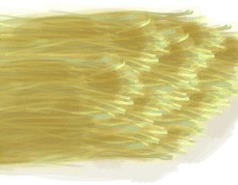
[Goat Feed(BluePrint)](Bp_FeedGoat.md)](Bp_FeedGoat.md)

Craft BluePrint [

[Fire(BluePrint)](Bp_Fire.md)](Bp_Fire.md)

Craft BluePrint [

[Fish Bait(BluePrint)](Bp_FishBait.md)](Bp_FishBait.md)

Craft BluePrint [

[Fish Trap(BluePrint)](Bp_FishTrap.md)](Bp_FishTrap.md)

Craft BluePrint [

[Fishing Rod(BluePrint)](Bp_FishingRod.md)](Bp_FishingRod.md)

Craft BluePrint [
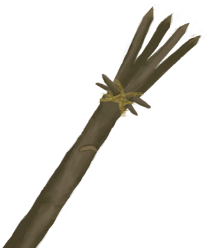
[Fishing Spear(BluePrint)](Bp_FishingSpear.md)](Bp_FishingSpear.md)

Craft BluePrint [

[Flint Axe(BluePrint)](Bp_FlintAxe.md)](Bp_FlintAxe.md)

Craft BluePrint [

[Flint Knife(BluePrint)](Bp_FlintKnife.md)](Bp_FlintKnife.md)

Craft BluePrint [

[Flint Spear(BluePrint)](Bp_FlintSpear.md)](Bp_FlintSpear.md)

Craft BluePrint [

[Bone Flute(BluePrint)](Bp_FluteBone.md)](Bp_FluteBone.md)

Craft BluePrint [
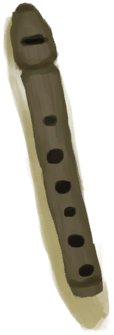
[Wooden Flute(BluePrint)](Bp_FluteWooden.md)](Bp_FluteWooden.md)

Craft BluePrint [

[Forge(BluePrint)](Bp_Forge.md)](Bp_Forge.md)

Craft BluePrint [

[Glue(BluePrint)](Bp_Glue.md)](Bp_Glue.md)

Craft BluePrint [

[Goat Feeder(BluePrint)](Bp_GoatFeeder.md)](Bp_GoatFeeder.md)

Craft BluePrint [

[Hand Drill(BluePrint)](Bp_HandDrill.md)](Bp_HandDrill.md)

Craft BluePrint [

[Harpoon(BluePrint)](Bp_Harpoon.md)](Bp_Harpoon.md)

Craft BluePrint [

[Honey(BluePrint)](Bp_Honey.md)](Bp_Honey.md)

Craft BluePrint [

[Kiln(BluePrint)](Bp_Kiln.md)](Bp_Kiln.md)

Craft BluePrint [
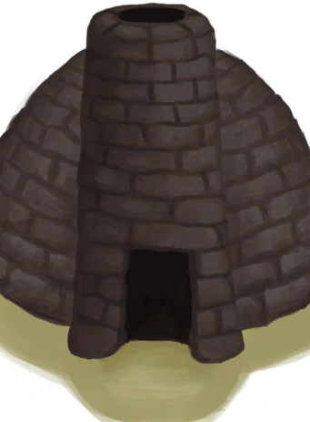
[Advanced Kiln(BluePrint)](Bp_KilnAdvanced.md)](Bp_KilnAdvanced.md)

Craft BluePrint [

[Leaf Bed(BluePrint)](Bp_Leafbed.md)](Bp_Leafbed.md)

Craft BluePrint [

[Lizard Drum(BluePrint)](Bp_LizardDrum.md)](Bp_LizardDrum.md)

Craft BluePrint [

[Log Trap(BluePrint)](Bp_LogTrap.md)](Bp_LogTrap.md)

Craft BluePrint [

[Loom(BluePrint)](Bp_Loom.md)](Bp_Loom.md)

Craft BluePrint [

[Mermaid Nest(BluePrint)](Bp_MermaidNest.md)](Bp_MermaidNest.md)

Craft BluePrint [

[Axe Mold(BluePrint)](Bp_MoldAxe.md)](Bp_MoldAxe.md)

Craft BluePrint [

[Decoration Mold(BluePrint)](Bp_MoldDecoration.md)](Bp_MoldDecoration.md)

Craft BluePrint [

[Knife Mold(BluePrint)](Bp_MoldKnife.md)](Bp_MoldKnife.md)

Craft BluePrint [
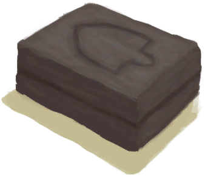
[Shovel Mold(BluePrint)](Bp_MoldShovel.md)](Bp_MoldShovel.md)

Craft BluePrint [

[Spear Mold(BluePrint)](Bp_MoldSpear.md)](Bp_MoldSpear.md)

Craft BluePrint [

[Mortar(BluePrint)](Bp_Mortar.md)](Bp_Mortar.md)

Craft BluePrint [

[Mud Hut(BluePrint)](Bp_MudHut.md)](Bp_MudHut.md)

Craft BluePrint [

[Mushroom Bed(BluePrint)](Bp_MushroomBed.md)](Bp_MushroomBed.md)

Craft BluePrint [
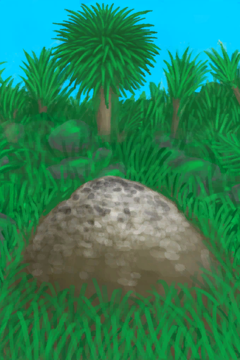
[Niter Bed(BluePrint)](Bp_NiterBed.md)](Bp_NiterBed.md)

Craft BluePrint [

[Obsidian Knife(BluePrint)](Bp_ObsidianKnife.md)](Bp_ObsidianKnife.md)

Craft BluePrint [

[Obsidian Spear(BluePrint)](Bp_ObsidianSpear.md)](Bp_ObsidianSpear.md)

Craft BluePrint [

[Partridge Feeder(BluePrint)](Bp_PartridgeFeeder.md)](Bp_PartridgeFeeder.md)

Craft BluePrint [

[Brimstone Pesticide(BluePrint)](Bp_PesticideBrimstone.md)](Bp_PesticideBrimstone.md)

Craft BluePrint [

[Chilli Pesticide(BluePrint)](Bp_PesticideChilli.md)](Bp_PesticideChilli.md)

Craft BluePrint [

[Wooden Planks(BluePrint)](Bp_Planks.md)](Bp_Planks.md)

Craft BluePrint [

[Pottery Wheel(BluePrint)](Bp_PotteryWheel.md)](Bp_PotteryWheel.md)

Craft BluePrint [

[Cinchona Powder(BluePrint)](Bp_Quinine.md)](Bp_Quinine.md)

Craft BluePrint [

[Quinine Sulfate(BluePrint)](Bp_QuinineSulfate.md)](Bp_QuinineSulfate.md)

Craft BluePrint [

[Raft(BluePrint)](Bp_Raft.md)](Bp_Raft.md)

Craft BluePrint [

[Fish Trap(BluePrint)](Bp_RaftFishTrap.md)](Bp_RaftFishTrap.md)

Craft BluePrint [

[Raft Shelter(BluePrint)](Bp_RaftShelter.md)](Bp_RaftShelter.md)

Craft BluePrint [

[Raincatcher(BluePrint)](Bp_Raincatcher.md)](Bp_Raincatcher.md)

Craft BluePrint [

[Rice Paddy(BluePrint)](Bp_RicePaddy.md)](Bp_RicePaddy.md)

Craft BluePrint [

[Rustic Spear(BluePrint)](Bp_RusticSpear.md)](Bp_RusticSpear.md)

Craft BluePrint [

[Salt Bed(BluePrint)](Bp_SaltBed.md)](Bp_SaltBed.md)

Craft BluePrint [

[Scarecrow(BluePrint)](Bp_Scarecrow.md)](Bp_Scarecrow.md)

Craft BluePrint [
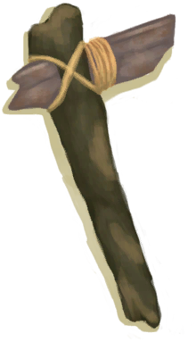
[Scrap Axe(BluePrint)](Bp_ScrapAxe.md)](Bp_ScrapAxe.md)

Craft BluePrint [

[Scrap Knife(BluePrint)](Bp_ScrapKnife.md)](Bp_ScrapKnife.md)

Craft BluePrint [

[Scrap Shovel(BluePrint)](Bp_ScrapShovel.md)](Bp_ScrapShovel.md)

Craft BluePrint [

[Scrap Spear(BluePrint)](Bp_ScrapSpear.md)](Bp_ScrapSpear.md)

Craft BluePrint [

[Sharpened Stone(BluePrint)](Bp_SharpenedStone.md)](Bp_SharpenedStone.md)

Craft BluePrint [

[Shed(BluePrint)](Bp_Shed.md)](Bp_Shed.md)

Craft BluePrint [

[Shelf(BluePrint)](Bp_Shelf.md)](Bp_Shelf.md)

Craft BluePrint [

[Shelter(BluePrint)](Bp_Shelter.md)](Bp_Shelter.md)

Craft BluePrint [

[Shield(BluePrint)](Bp_Shield.md)](Bp_Shield.md)

Craft BluePrint [

[Shower(BluePrint)](Bp_Shower.md)](Bp_Shower.md)

Craft BluePrint [

[Sling(BluePrint)](Bp_Sling.md)](Bp_Sling.md)

Craft BluePrint [

[Snare Trap(BluePrint)](Bp_SnareTrap.md)](Bp_SnareTrap.md)

Craft BluePrint [

[Soap(BluePrint)](Bp_Soap.md)](Bp_Soap.md)

Craft BluePrint [

[Solar Still(BluePrint)](Bp_SolarStill.md)](Bp_SolarStill.md)

Craft BluePrint [

[Spindle(BluePrint)](Bp_Spindle.md)](Bp_Spindle.md)

Craft BluePrint [

[Splint(BluePrint)](Bp_Splint.md)](Bp_Splint.md)

Craft BluePrint [

[Stone Axe(BluePrint)](Bp_StoneAxe.md)](Bp_StoneAxe.md)

Craft BluePrint [

[Stone Hut(BluePrint)](Bp_StoneHut.md)](Bp_StoneHut.md)

Craft BluePrint [

[Stove(BluePrint)](Bp_Stove.md)](Bp_Stove.md)

Craft BluePrint [

[Supply Chest(BluePrint)](Bp_SupplyChest.md)](Bp_SupplyChest.md)

Craft BluePrint [

[Table(BluePrint)](Bp_Table.md)](Bp_Table.md)

Craft BluePrint [

[Torch(BluePrint)](Bp_Torch.md)](Bp_Torch.md)

Craft BluePrint [

[Tourniquet(BluePrint)](Bp_Tourniquet.md)](Bp_Tourniquet.md)

Craft BluePrint [

[Improvised Tourniquet(BluePrint)](Bp_TourniquetRustic.md)](Bp_TourniquetRustic.md)

Craft BluePrint [

[Trapping Pit(BluePrint)](Bp_TrappingPit.md)](Bp_TrappingPit.md)

Craft BluePrint [

[Travois(BluePrint)](Bp_Travois.md)](Bp_Travois.md)

Craft BluePrint [

[Treenails(BluePrint)](Bp_Treenails.md)](Bp_Treenails.md)

Craft BluePrint [

[Vitriol(BluePrint)](Bp_Vitriol.md)](Bp_Vitriol.md)

Craft BluePrint [

[Water Filter(BluePrint)](Bp_WaterFilter.md)](Bp_WaterFilter.md)

Craft BluePrint [
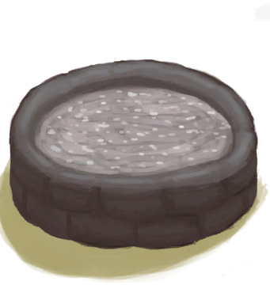
[Water Reservoir(BluePrint)](Bp_WaterReservoir.md)](Bp_WaterReservoir.md)

Craft BluePrint [
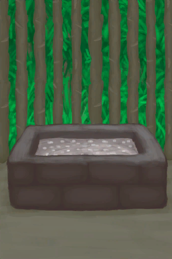
[Watering Trough(BluePrint)](Bp_WateringTrough.md)](Bp_WateringTrough.md)

Craft BluePrint [

[Well(BluePrint)](Bp_Well.md)](Bp_Well.md)

Craft BluePrint [

[Weston(BluePrint)](Bp_Weston.md)](Bp_Weston.md)

Craft BluePrint [

[Wood Carvings(BluePrint)](Bp_WoodCarvings.md)](Bp_WoodCarvings.md)

Craft BluePrint [

[Wood Shavings(BluePrint)](Bp_WoodShavings.md)](Bp_WoodShavings.md)

Craft BluePrint [

[Wooden Shovel(BluePrint)](Bp_WoodenShovel.md)](Bp_WoodenShovel.md)

Craft BluePrint [

[Woven Backpack(BluePrint)](Bp_WovenBackpack.md)](Bp_WovenBackpack.md)

Craft BluePrint [

[Woven Basket(BluePrint)](Bp_WovenBasket.md)](Bp_WovenBasket.md)

Craft BluePrint [

[Woven Hat(BluePrint)](Bp_WovenHat.md)](Bp_WovenHat.md)

Craft BluePrint [

[Bedroll(BluePrint)](Bp_Bedroll.md)](Bp_Bedroll.md)

Craft BluePrint [

[Bone Broth(BluePrint)](Bp_BoneBroth.md)](Bp_BoneBroth.md)

Craft BluePrint [

[Butter(BluePrint)](Bp_Butter.md)](Bp_Butter.md)

Craft BluePrint [

[Butter Baked Oysters(BluePrint)](Bp_ButterBakedOysters.md)](Bp_ButterBakedOysters.md)

Craft BluePrint [

[Candied Ginger(BluePrint)](Bp_CandiedGinger.md)](Bp_CandiedGinger.md)

Craft BluePrint [

[Cheese(BluePrint)](Bp_Cheese.md)](Bp_Cheese.md)

Craft BluePrint [

[Chicken Sandwich(BluePrint)](Bp_ChickenSandwich.md)](Bp_ChickenSandwich.md)

Craft BluePrint [

[Coconut Fish(BluePrint)](Bp_CoconutFish.md)](Bp_CoconutFish.md)

Craft BluePrint [

[Coconut Milk(BluePrint)](Bp_CoconutMilk.md)](Bp_CoconutMilk.md)

Craft BluePrint [

[Drunken Crab(BluePrint)](Bp_DrunkenCrab.md)](Bp_DrunkenCrab.md)

Craft BluePrint [

[Egg Fried Rice(BluePrint)](Bp_EggFriedRice.md)](Bp_EggFriedRice.md)

Craft BluePrint [

[Fish N' Chips(BluePrint)](Bp_FishNChips.md)](Bp_FishNChips.md)

Craft BluePrint [

[Fish Omelette(BluePrint)](Bp_FishOmelette.md)](Bp_FishOmelette.md)

Craft BluePrint [

[Salted Fish Meat(BluePrint)](Bp_FishSalted.md)](Bp_FishSalted.md)

Craft BluePrint [

[Fish Taco(BluePrint)](Bp_FishTaco.md)](Bp_FishTaco.md)

Craft BluePrint [

[Fried Bananas(BluePrint)](Bp_FriedBananas.md)](Bp_FriedBananas.md)

Craft BluePrint [

[Fried Puffballs(BluePrint)](Bp_FriedPuffballs.md)](Bp_FriedPuffballs.md)

Craft BluePrint [

[Goat Stew(BluePrint)](Bp_GoatStew.md)](Bp_GoatStew.md)

Craft BluePrint [

[Hearty Feast(BluePrint)](Bp_HeartyFeast.md)](Bp_HeartyFeast.md)

Craft BluePrint [

[Honey Candy(BluePrint)](Bp_HoneyCandy.md)](Bp_HoneyCandy.md)

Craft BluePrint [

[Honey Glazed Pork(BluePrint)](Bp_HoneyGlazedPork.md)](Bp_HoneyGlazedPork.md)

Craft BluePrint [

[Island Chicken(BluePrint)](Bp_IslandChicken.md)](Bp_IslandChicken.md)

Craft BluePrint [

[Jungle Salad(BluePrint)](Bp_JungleSalad.md)](Bp_JungleSalad.md)

Craft BluePrint [

[Lizard Fry(BluePrint)](Bp_LizardFry.md)](Bp_LizardFry.md)

Craft BluePrint [

[Macaque Skewers(BluePrint)](Bp_MacaqueSkewers.md)](Bp_MacaqueSkewers.md)

Craft BluePrint [

[Salted Meat(BluePrint)](Bp_MeatSalted.md)](Bp_MeatSalted.md)

Craft BluePrint [

[Protein Bar(BluePrint)](Bp_ProteinBar.md)](Bp_ProteinBar.md)

Craft BluePrint [

[Sago Cake(BluePrint)](Bp_SagoCake.md)](Bp_SagoCake.md)

Craft BluePrint [

[Sago Slime(BluePrint)](Bp_SagoSlime.md)](Bp_SagoSlime.md)

Craft BluePrint [

[Seafood Cup(BluePrint)](Bp_SeafoodCup.md)](Bp_SeafoodCup.md)

Craft BluePrint [

[Sushi(BluePrint)](Bp_Sushi.md)](Bp_Sushi.md)

Craft BluePrint [

[Tonic Water(BluePrint)](Bp_TonicWater.md)](Bp_TonicWater.md)

Craft BluePrint [

[Yam Curry(BluePrint)](Bp_YamCurry.md)](Bp_YamCurry.md)

Craft BluePrint [

[Yam Jam(BluePrint)](Bp_YamJam.md)](Bp_YamJam.md)

Craft BluePrint [

[Alembic(BluePrint)](Bp_Alembic.md)](Bp_Alembic.md)

Craft BluePrint [

[Clay Bowl(BluePrint)](Bp_ClayBowl.md)](Bp_ClayBowl.md)

Craft BluePrint [

[Clay Fire Pit(BluePrint)](Bp_ClayFirePit.md)](Bp_ClayFirePit.md)

Craft BluePrint [

[Clay Jar(BluePrint)](Bp_ClayJar.md)](Bp_ClayJar.md)

Craft BluePrint [

[Clay Pot Cooler(BluePrint)](Bp_ClayPotCooler.md)](Bp_ClayPotCooler.md)

Craft BluePrint [

[Clay Vase(BluePrint)](Bp_ClayVase.md)](Bp_ClayVase.md)

Craft BluePrint [

[Cooking Pot(BluePrint)](Bp_CookingPot.md)](Bp_CookingPot.md)

Craft BluePrint [

[Glazed Vase(BluePrint)](Bp_GlazedVase.md)](Bp_GlazedVase.md)

Craft BluePrint [

[Bee Suit(BluePrint)](Bp_BeeSuit.md)](Bp_BeeSuit.md)

Craft BluePrint [

[Bellows(BluePrint)](Bp_Bellows.md)](Bp_Bellows.md)

Craft BluePrint [

[Coconut Sandals(BluePrint)](Bp_CoconutSandals.md)](Bp_CoconutSandals.md)

Craft BluePrint [
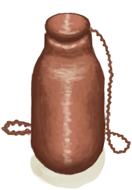
[Copper Bottle(BluePrint)](Bp_CopperBottle.md)](Bp_CopperBottle.md)

Craft BluePrint [

[Copper Jar(BluePrint)](Bp_CopperJar.md)](Bp_CopperJar.md)

Craft BluePrint [

[Copper Necklace(BluePrint)](Bp_CopperNecklace.md)](Bp_CopperNecklace.md)

Craft BluePrint [

[Copper Needles(BluePrint)](Bp_CopperNeedles.md)](Bp_CopperNeedles.md)

Craft BluePrint [

[Copper Eating Utensils(BluePrint)](Bp_EatingUtensilsCopper.md)](Bp_EatingUtensilsCopper.md)

Craft BluePrint [

[Flower Necklace(BluePrint)](Bp_FlowerNecklace.md)](Bp_FlowerNecklace.md)

Craft BluePrint [

[Gas Mask(BluePrint)](Bp_GasMask.md)](Bp_GasMask.md)

Craft BluePrint [

[Hammock(BluePrint)](Bp_Hammock.md)](Bp_Hammock.md)

Craft BluePrint [

[Leaf Skirt(BluePrint)](Bp_LeafSkirt.md)](Bp_LeafSkirt.md)

Craft BluePrint [

[Leather Backpack(BluePrint)](Bp_LeatherBackpack.md)](Bp_LeatherBackpack.md)

Craft BluePrint [
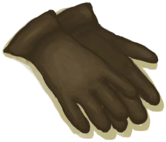
[Leather Gloves(BluePrint)](Bp_LeatherGloves.md)](Bp_LeatherGloves.md)

Craft BluePrint [

[Leather Pants(BluePrint)](Bp_LeatherPants.md)](Bp_LeatherPants.md)

Craft BluePrint [

[Leather Shoes(BluePrint)](Bp_LeatherShoes.md)](Bp_LeatherShoes.md)

Craft BluePrint [

[Pearl Necklace(BluePrint)](Bp_PearlNecklace.md)](Bp_PearlNecklace.md)

Craft BluePrint [

[Quiver(BluePrint)](Bp_Quiver.md)](Bp_Quiver.md)

Craft BluePrint [

[Raincoat(BluePrint)](Bp_Raincoat.md)](Bp_Raincoat.md)

Craft BluePrint [

[Sack(BluePrint)](Bp_Sack.md)](Bp_Sack.md)

Craft BluePrint [

[Satchel(BluePrint)](Bp_Satchel.md)](Bp_Satchel.md)

Craft BluePrint [

[Seagull Charm(BluePrint)](Bp_SeagullCharm.md)](Bp_SeagullCharm.md)

Craft BluePrint [
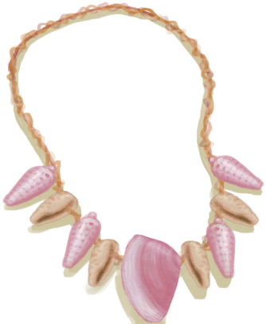
[Seashell Necklace(BluePrint)](Bp_SeashellNecklace.md)](Bp_SeashellNecklace.md)

Craft BluePrint [

[Shark Headpiece(BluePrint)](Bp_SharkHeadpiece.md)](Bp_SharkHeadpiece.md)

Craft BluePrint [

[Shirt(BluePrint)](Bp_Shirt.md)](Bp_Shirt.md)

Craft BluePrint [

[Straw Cape(BluePrint)](Bp_StrawCape.md)](Bp_StrawCape.md)

Craft BluePrint [

[Waterskin(BluePrint)](Bp_Waterskin.md)](Bp_Waterskin.md)

Craft BluePrint [

[Wooden Needles(BluePrint)](Bp_WoodenNeedles.md)](Bp_WoodenNeedles.md)

Craft BluePrint [
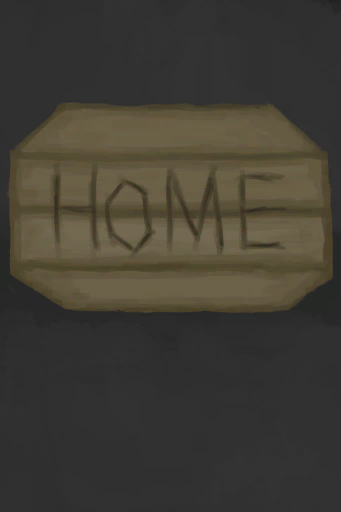
[Home Sign](Imp_HomeSign.md)](Imp_HomeSign.md)

Apply [

[Aloe Vera Gel](AloeVeraGel.md)](AloeVeraGel.md)

Apply [

[Aloe Vera Leaf](AloeVeraLeaf.md)](AloeVeraLeaf.md)

Craft Hook [

[Bone Splinters](BoneSplinters.md)](BoneSplinters.md)

Craft Needle [

[Bone Splinters](BoneSplinters.md)](BoneSplinters.md)

Craft Hook [

[Bird Bones](BonesBird.md)](BonesBird.md)

Craft Needle [

[Bird Bones](BonesBird.md)](BonesBird.md)

Train [

[Rustic Bow](BowRustic.md)](BowRustic.md)

Apply [

[Bug Repellent](BugRepellent.md)](BugRepellent.md)

Craft Bandage [

[Cloth](Cloth.md)](Cloth.md)

Craft Foot Wrappings [

[Cloth](Cloth.md)](Cloth.md)

Craft Hand Wrappings [

[Cloth](Cloth.md)](Cloth.md)

Extract Fibers [

[Coconut Husk](CoconutHusk.md)](CoconutHusk.md)

Practice Rock Throwing [
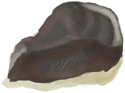
[Flint](Flint.md)](Flint.md)

Make bandage [

[Weevil Lily Leaves](WeevilLilyLeaves.md)](WeevilLilyLeaves.md)

Train [

[Sling](Sling.md)](Sling.md)

Wash yourself [

[Wet Soap](SoapWet.md)](SoapWet.md)

Practice Rock Throwing [

[Stone](Stone.md)](Stone.md)

Apply [

[Sun Screen](SunScreen.md)](SunScreen.md)

Wash yourself [

[Tide Pool(Rocks)](TidePool.md)](TidePool.md)

Wash yourself [

[Flooded Tide Pool(Rocks)](TidePoolFlooded.md)](TidePoolFlooded.md)

Train [

[Broom](Broom.md)](Broom.md)

Train [

[Harpoon](HarpoonBone.md)](HarpoonBone.md)

Train [

[Copper Spear](SpearCopper.md)](SpearCopper.md)

Train [

[Fishing Spear](SpearFishing.md)](SpearFishing.md)

Train [

[Flint Spear](SpearFlint.md)](SpearFlint.md)

Train [

[Obsidian Spear](SpearObsidian.md)](SpearObsidian.md)

Train [

[Rustic Spear](SpearRustic.md)](SpearRustic.md)

Train [

[Scrap Spear](SpearScrap.md)](SpearScrap.md)

Wash Yourself [

[Water](LQ_Water.md)](LQ_Water.md)

Wash Yourself [

[Salt Water](LQ_WaterSalt.md)](LQ_WaterSalt.md)

Wash Yourself [

[Toxic Water](LQ_WaterToxic.md)](LQ_WaterToxic.md)

Wash Yourself [

[Unsafe Water](LQ_WaterUnsafe.md)](LQ_WaterUnsafe.md)

Wash yourself [

[Seawater(Flooded Chamber)](Sea_Cave.md)](Sea_Cave.md)

Dig [
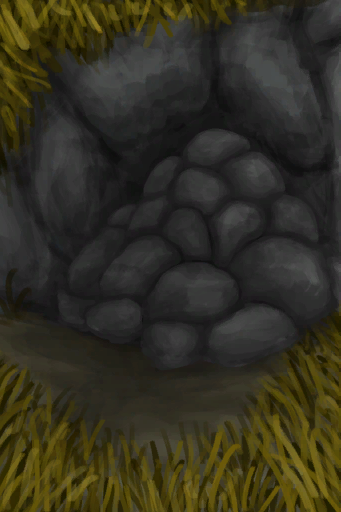
[Collapsed Tunnel Entrance(Eastern Highlands)](TunnelEntranceClosed.md)](TunnelEntranceClosed.md)

Dig up Mud [

[Mud Deposit](MudDeposit.md)](MudDeposit.md)

Build a Sand Castle [

[Sand(Atoll)](SandSource.md)](SandSource.md)

Wash yourself [

[Sea(Atoll)](Sea_Atoll.md)](Sea_Atoll.md)

Wash yourself [

[Sea(Bay)](Sea_Bay.md)](Sea_Bay.md)

Wash yourself [

[Sea(Beach)](Sea_Beach.md)](Sea_Beach.md)

Wash yourself [

[Sea(Secret Cove)](Sea_Cove.md)](Sea_Cove.md)

Wash yourself [

[Sea(Desolate Beach)](Sea_DesolateBeach.md)](Sea_DesolateBeach.md)

Wash yourself [

[Sea(Mangrove Forest)](Sea_Mangroves.md)](Sea_Mangroves.md)

Wash yourself [
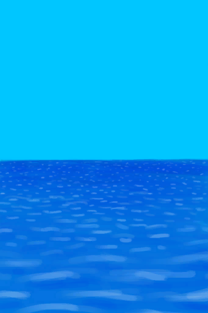
[Sea](Sea_Raft.md)](Sea_Raft.md)

Wash yourself [

[Sea(Bird Rock)](Sea_Rocks.md)](Sea_Rocks.md)

Harvest Chilies [

[Chilli Plant](ChiliPlant.md)](ChiliPlant.md)

Harvest [

[Coffee Bush](CoffeePlant.md)](CoffeePlant.md)

Harvest Roots [

[Ginger Plant](GingerPlant.md)](GingerPlant.md)

Harvest Roots [

[Kava Plant](KavaPlant.md)](KavaPlant.md)

Harvest [

[Palm Bush](PalmBush.md)](PalmBush.md)

Harvest [

[Snakegrass Patch](SnakegrassPatch.md)](SnakegrassPatch.md)

Harvest Leaves [

[Spider Lily](SpiderLily.md)](SpiderLily.md)

Dig Up Tubers [

[Wild Yam](YamPlant.md)](YamPlant.md)

Dig up Mud [

[Dry Puddle(Wetlands)](Puddle.md)](Puddle.md)

Dig up Dirt [

[Dry Puddle(Wetlands)](Puddle.md)](Puddle.md)

Take a Shower [

[Shower](Shower.md)](Shower.md)

Place [

[Dismantled Wooden Bed](BedWoodenDismantled.md)](BedWoodenDismantled.md)

Dismantle [

[Rustic Bed](BedRustic.md)](BedRustic.md)

Take apart and Pick Up [

[Wooden Bed](BedWooden.md)](BedWooden.md)

Dismantle [

[Boar Feeder](BoarFeeder.md)](BoarFeeder.md)

Dismantle [

[Boar Feeder(Empty)](BoarFeederEmpty.md)](BoarFeederEmpty.md)

Place [
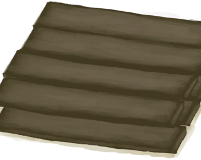
[Dismantled BookShelf](BookShelfDismantled.md)](BookShelfDismantled.md)

Deconstruct [

[Cage Trap](CageTrap.md)](CageTrap.md)

Pick Up [

[Cage Trap](CageTrapPlaced.md)](CageTrapPlaced.md)

Pick Up [

[Disarmed Cage Trap](CageTrapPlacedTriggered.md)](CageTrapPlacedTriggered.md)

Pick Up [

[Disarmed Cage Trap](CageTrapPlacedTriggeredPartridgeFemale.md)](CageTrapPlacedTriggeredPartridgeFemale.md)

Pick Up [

[Disarmed Cage Trap](CageTrapPlacedTriggeredPartridgeMale.md)](CageTrapPlacedTriggeredPartridgeMale.md)

Pick Up [

[Disarmed Cage Trap](CageTrapPlacedTriggeredSeagull.md)](CageTrapPlacedTriggeredSeagull.md)

Place [

[Chair](Chair.md)](Chair.md)

Pick Up [

[Chair](ChairPlaced.md)](ChairPlaced.md)

Dismantle [

[Compost Bin](CompostBin.md)](CompostBin.md)

Mine [

[Copper Vein(High Chamber)](CopperVein.md)](CopperVein.md)

Disassemble trap [

[Deadfall Trap](DeadfallTrap.md)](DeadfallTrap.md)

Disassemble trap [

[Deadfall Trap](DeadfallTrapTriggered.md)](DeadfallTrapTriggered.md)

Dissasemble [

[Drying Rack](DryingRack.md)](DryingRack.md)

Demolish [

[Stove(Off)](StoveExtinguished.md)](StoveExtinguished.md)

Deconstruct [

[Fish Trap](FishTrap.md)](FishTrap.md)

Dismantle [

[Goat Feeder](GoatFeeder.md)](GoatFeeder.md)

Dismantle [

[Goat Feeder(Empty)](GoatFeederEmpty.md)](GoatFeederEmpty.md)

Cut into Wood [

[Half Log](HalfLog.md)](HalfLog.md)

Cut plastic sheet [

[Deflated Life Raft](LifeRaftDeflated.md)](LifeRaftDeflated.md)

Split into two [

[Log](Log.md)](Log.md)

Disassemble trap [

[Log Trap](LogTrap.md)](LogTrap.md)

Disassemble trap [

[Log Trap](LogTrapTriggered.md)](LogTrapTriggered.md)

Enlarge Cloth [

[Loom](Loom.md)](Loom.md)

Disassemble Loom [

[Loom (Empty)(Empty)](LoomEmpty.md)](LoomEmpty.md)

Make a Mud Brick [

[Mud Pile](MudPile.md)](MudPile.md)

Cut plastic sheet [

[Deployed Parachute](ParachuteDeployed.md)](ParachuteDeployed.md)

Dismantle [

[Partridge Feeder](PartridgeFeeder.md)](PartridgeFeeder.md)

Take apart and Pick Up [

[Pottery Wheel](PotteryWheel.md)](PotteryWheel.md)

Place [
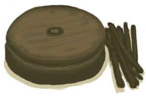
[Dismantled PotteryWheel](PotteryWheelDismantled.md)](PotteryWheelDismantled.md)

Take Apart [

[Seat](Seat.md)](Seat.md)

Detach [

[Seat](SeatAttached.md)](SeatAttached.md)

Take Apart [

[Seat](SeatPlaced.md)](SeatPlaced.md)

Disassemble trap [

[Snare Trap](SnareTrap.md)](SnareTrap.md)

Disassemble trap [

[Snare Trap](SnareTrapTriggered.md)](SnareTrapTriggered.md)

Take apart and Pick Up [

[Table](Table.md)](Table.md)

Place [

[Dismantled Table](TableDismantled.md)](TableDismantled.md)

Disassemble trap [

[Trapping Pit](TrappingPit.md)](TrappingPit.md)

Disassemble trap [

[Trapping Pit](TrappingPitTriggered.md)](TrappingPitTriggered.md)

Demolish [

[Watering Trough](WateringTrough.md)](WateringTrough.md)

Thread [

[Bone Needle](BoneNeedle.md)](BoneNeedle.md)

Remove Cord [

[Threaded Needle](BoneNeedleThreaded.md)](BoneNeedleThreaded.md)

Break [

[Bones](Bones.md)](Bones.md)

Crush [

[Charcoal](Charcoal.md)](Charcoal.md)

Craft Bowl [

[Clay](Clay.md)](Clay.md)

Rip Cloth [

[Cloth](Cloth.md)](Cloth.md)

Craft Tourniquet [

[Cloth](Cloth.md)](Cloth.md)

Makeshift Mask [

[Large Cloth](ClothLarge.md)](ClothLarge.md)

Rip Cloth [

[Large Cloth](ClothLarge.md)](ClothLarge.md)

Make Ash Dressing [

[Small Cloth](ClothSmall.md)](ClothSmall.md)

Rip Cloth [

[Very Large Cloth](ClothVeryLarge.md)](ClothVeryLarge.md)

Dismantle [

[Bee Suit](BeeSuit.md)](BeeSuit.md)

Repair [

[Bee Suit](BeeSuit.md)](BeeSuit.md)

Rip off cloth [

[Foot Wrappings](FootWrappings.md)](FootWrappings.md)

Rip off cloth [

[Hand Wrappings](HandWrappings.md)](HandWrappings.md)

Repair [

[Survival Hat](HatSurvival.md)](HatSurvival.md)

Rip off cloth [

[Hawaiian Shirt](HawaiianShirt.md)](HawaiianShirt.md)

Repair [

[Hawaiian Shirt](HawaiianShirt.md)](HawaiianShirt.md)

Rip off cloth [

[Head Wrappings](HeadWrappings.md)](HeadWrappings.md)

Rip off cloth [

[Hoodie](HoodieRetromation.md)](HoodieRetromation.md)

Repair [

[Hoodie](HoodieRetromation.md)](HoodieRetromation.md)

Repair [

[Leather Gloves](LeatherGloves.md)](LeatherGloves.md)

Dismantle [

[Leather Pants](LeatherPants.md)](LeatherPants.md)

Repair [

[Leather Pants](LeatherPants.md)](LeatherPants.md)

Repair [

[Leather Shoes](LeatherShoes.md)](LeatherShoes.md)

Repair [

[Military Boots](MilitaryBoots.md)](MilitaryBoots.md)

Rip off cloth [

[Military Pants](MilitaryPants.md)](MilitaryPants.md)

Repair [

[Military Pants](MilitaryPants.md)](MilitaryPants.md)

Rip off cloth [Cloth Pants](PantsCloth.md)

Repair [Cloth Pants](PantsCloth.md)

Repair [

[Pearl Necklace](PearlNecklace.md)](PearlNecklace.md)

Dismantle [

[Raincoat](Raincoat.md)](Raincoat.md)

Repair [

[Raincoat](Raincoat.md)](Raincoat.md)

Repair [

[Shark Headpiece](SharkHeadpiece.md)](SharkHeadpiece.md)

Rip off cloth [

[Shirt](ShirtFiber.md)](ShirtFiber.md)

Repair [

[Shirt](ShirtFiber.md)](ShirtFiber.md)

Rip off cloth [

[Shorts](Shorts.md)](Shorts.md)

Repair [

[Shorts](Shorts.md)](Shorts.md)

Repair [
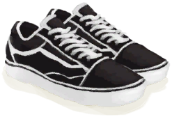
[Sneakers](Sneakers.md)](Sneakers.md)

Rip off cloth [

[Socks](Socks.md)](Socks.md)

Repair [

[Socks](Socks.md)](Socks.md)

Dismantle [

[Straw Cape](StrawCape.md)](StrawCape.md)

Rip off cloth [

[T-Shirt](T-Shirt.md)](T-Shirt.md)

Repair [

[T-Shirt](T-Shirt.md)](T-Shirt.md)

Rip off cloth [

[Underwear](Underwear.md)](Underwear.md)

Repair [

[Underwear](Underwear.md)](Underwear.md)

Perforate Coconut [

[Coconut](Coconut.md)](Coconut.md)

Crack Coconut open [

[Coconut](Coconut.md)](Coconut.md)

Remove Meat [
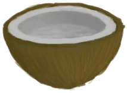
[Coconut Half](CoconutHalf.md)](CoconutHalf.md)

Peel [

[Husked Coconut](CoconutHusked.md)](CoconutHusked.md)

Crack Coconut open [

[Perforated Coconut](CoconutPerforated.md)](CoconutPerforated.md)

Crack open [

[Rotten Coconut](CoconutRotten.md)](CoconutRotten.md)

Break Conch [

[Conch](Conch.md)](Conch.md)

Crack Open [

[Copper Decoration](CopperDecoration_Mold.md)](CopperDecoration_Mold.md)

Thread [

[Copper Needle](CopperNeedle.md)](CopperNeedle.md)

Remove Cord [

[Threaded Needle](CopperNeedleThreaded.md)](CopperNeedleThreaded.md)

Make Yarn [

[Fiber Cord](CordFiber.md)](CordFiber.md)

Light with Hand Drill [

[Feathers](Feathers.md)](Feathers.md)

Light with Bow Drill [

[Feathers](Feathers.md)](Feathers.md)

Light with Hand Drill [

[Fibers](Fibers.md)](Fibers.md)

Light with Bow Drill [

[Fibers](Fibers.md)](Fibers.md)

Cord [

[Fibers](Fibers.md)](Fibers.md)

Practice Knapping [

[Flint](Flint.md)](Flint.md)

Carve [

[Unfinished  Bone Flute](FluteBone_Unfinished.md)](FluteBone_Unfinished.md)

Carve [

[Unfinished  Wooden Flute](FluteWooden_Unfinished.md)](FluteWooden_Unfinished.md)

Cut Open [

[Bonefish](Bonefish.md)](Bonefish.md)

Make Bait [

[Cooked Bonefish](BonefishCooked.md)](BonefishCooked.md)

Make Bait [

[Bonefish Meat](BonefishMeat.md)](BonefishMeat.md)

Put Down [

[Trapped Macaque](CageTrapMacaque.md)](CageTrapMacaque.md)

Skin [

[Dead Cobra](CobraDead.md)](CobraDead.md)

Harvest Beans [

[Coffee Berries](CoffeeBerries.md)](CoffeeBerries.md)

Soften [

[Conch Meat](ConchMeat.md)](ConchMeat.md)

Make Bait [

[Dried Fish](FishDried.md)](FishDried.md)

Make Bait [

[Salted Fish](FishSalted.md)](FishSalted.md)

Make Bait [

[Drying Salted Fish](FishSaltedDrying.md)](FishSaltedDrying.md)

Grind Root [

[Ginger](Ginger.md)](Ginger.md)

Grind Root [

[Dried Ginger](GingerDried.md)](GingerDried.md)

Make Bait [

[Goatfish](Goatfish.md)](Goatfish.md)

Make Bait [

[Cooked Goatfish](GoatfishCooked.md)](GoatfishCooked.md)

Make Bait [

[Smoked Goatfish](GoatfishSmoked.md)](GoatfishSmoked.md)

Make Bait [

[Herring](Herring.md)](Herring.md)

Make Bait [

[Cooked Herring](HerringCooked.md)](HerringCooked.md)

Make Bait [

[Smoked Herring](HerringSmoked.md)](HerringSmoked.md)

Grind [

[Jasmine Flowers](JasmineFlowers.md)](JasmineFlowers.md)

Grind Root [

[Kava Root](KavaRoot.md)](KavaRoot.md)

Grind Root [

[Dried Kava Root](KavaRootDried.md)](KavaRootDried.md)

Cut Meat [
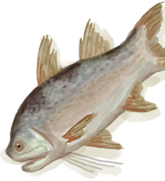
[King Threadfin](KingThreadfin.md)](KingThreadfin.md)

Skin [
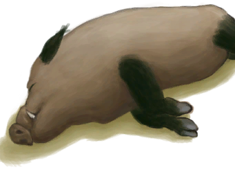
[Boar Carcass](BoarCarcass.md)](BoarCarcass.md)

Skin [

[Piglet Carcass](BoarCarcassPiglet.md)](BoarCarcassPiglet.md)

Pick Up [

[Sow](BoarEnclosureFemale.md)](BoarEnclosureFemale.md)

Kill [

[Sow](BoarEnclosureFemale.md)](BoarEnclosureFemale.md)

Pick Up [

[Boar](BoarEnclosureMale.md)](BoarEnclosureMale.md)

Kill [

[Boar](BoarEnclosureMale.md)](BoarEnclosureMale.md)

Pick Up [

[Piglet](BoarEnclosurePiglet.md)](BoarEnclosurePiglet.md)

Kill [

[Piglet](BoarEnclosurePiglet.md)](BoarEnclosurePiglet.md)

Butcher [

[Skinned Boar](BoarSkinned.md)](BoarSkinned.md)

Butcher [

[Skinned Piglet](BoarSkinnedPiglet.md)](BoarSkinnedPiglet.md)

Kill [

[Sow](BoarTiedFemale.md)](BoarTiedFemale.md)

Kill [

[Boar](BoarTiedMale.md)](BoarTiedMale.md)

Kill [

[Piglet](BoarTiedPiglet.md)](BoarTiedPiglet.md)

Murder! [

[Dog Friend](DogFriend.md)](DogFriend.md)

Skin [

[Goat Carcass](GoatCarcassFemale.md)](GoatCarcassFemale.md)

Skin [

[Juvenile Goat Carcass](GoatCarcassKid.md)](GoatCarcassKid.md)

Skin [

[Goat Carcass](GoatCarcassMale.md)](GoatCarcassMale.md)

Pick Up [

[Goat](GoatEnclosureFemale.md)](GoatEnclosureFemale.md)

Kill [

[Goat](GoatEnclosureFemale.md)](GoatEnclosureFemale.md)

Pick Up [

[Juvenile Goat](GoatEnclosureKid.md)](GoatEnclosureKid.md)

Kill [

[Juvenile Goat](GoatEnclosureKid.md)](GoatEnclosureKid.md)

Pick Up [

[Lactating Goat](GoatEnclosureLactating.md)](GoatEnclosureLactating.md)

Kill [

[Lactating Goat](GoatEnclosureLactating.md)](GoatEnclosureLactating.md)

Milk [

[Lactating Goat](GoatEnclosureLactating.md)](GoatEnclosureLactating.md)

Pick Up [
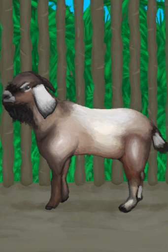
[Male Goat](GoatEnclosureMale.md)](GoatEnclosureMale.md)

Kill [

[Male Goat](GoatEnclosureMale.md)](GoatEnclosureMale.md)

Butcher [

[Skinned Goat](GoatSkinned.md)](GoatSkinned.md)

Butcher [

[Skinned Kid](GoatSkinnedKid.md)](GoatSkinnedKid.md)

Kill [

[Goat](GoatTiedFemale.md)](GoatTiedFemale.md)

Kill [

[Lactating Goat](GoatTiedFemaleLactating.md)](GoatTiedFemaleLactating.md)

Kill [

[Juvenile Goat](GoatTiedKid.md)](GoatTiedKid.md)

Kill [

[Male Goat](GoatTiedMale.md)](GoatTiedMale.md)

Murder! [
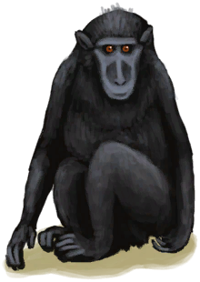
[Macaque Friend](MacaqueFriend.md)](MacaqueFriend.md)

Cut Meat [

[Sea Hound Carcass](SeahoundCarcass.md)](SeahoundCarcass.md)

Cut Meat [

[Shark Carcass](SharkCarcass.md)](SharkCarcass.md)

Grind [

[Lemongrass](LemongrassStalks.md)](LemongrassStalks.md)

Butcher [

[Macaque Carcass](MacaqueCarcass.md)](MacaqueCarcass.md)

Put Down [

[Wounded Macaque](MacaqueWounded.md)](MacaqueWounded.md)

Make Bait [

[Parrot Fish](ParrotFish.md)](ParrotFish.md)

Make Bait [

[Cooked Parrot Fish](ParrotFishCooked.md)](ParrotFishCooked.md)

Make Bait [

[Smoked Parrot Fish](ParrotFishSmoked.md)](ParrotFishSmoked.md)

Harvest [

[Partridge Carcass](PartridgeCarcass.md)](PartridgeCarcass.md)

Cut Open [

[Dead Partridge](PartridgeDead.md)](PartridgeDead.md)

Cut Open [

[Partridge](PartridgeFemaleEnclosure.md)](PartridgeFemaleEnclosure.md)

Cut Open [

[Partridge](PartridgeFemaleLive.md)](PartridgeFemaleLive.md)

Cut Open [

[Male Partridge](PartridgeMaleEnclosure.md)](PartridgeMaleEnclosure.md)

Cut Open [

[Male Partridge](PartridgeMaleLive.md)](PartridgeMaleLive.md)

Skin [

[Dead Sea Krait](SeaKraitDead.md)](SeaKraitDead.md)

Harvest [
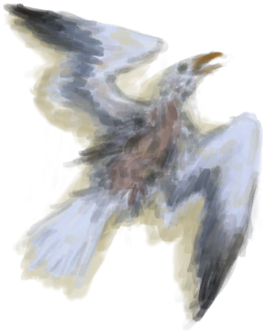
[Seagull Carcass](SeagullCarcass.md)](SeagullCarcass.md)

Cut Open [

[Dead Seagull](SeagullDead.md)](SeagullDead.md)

Make Bait [

[Cooked Shark](SharkCooked.md)](SharkCooked.md)

Make Bait [

[Shark Meat](SharkMeat.md)](SharkMeat.md)

Extract Fibers [

[Snake Grass](SnakeGrass.md)](SnakeGrass.md)

Grind [

[Snake Grass](SnakeGrass.md)](SnakeGrass.md)

Grind Leaves [

[Spider Lily Leaves](SpiderLilyLeaves.md)](SpiderLilyLeaves.md)

Grind Leaves [

[Dried Spider Lily Leaves](SpiderLilyLeavesDried.md)](SpiderLilyLeavesDried.md)

Make Bait [

[Cooked Threadfin](ThreadfinCooked.md)](ThreadfinCooked.md)

Make Bait [

[Threadfin Meat](ThreadfinMeat.md)](ThreadfinMeat.md)

Peel & Cut  [

[Yam](Yam.md)](Yam.md)

Crack [

[Geode](Geode.md)](Geode.md)

Break Conch [

[Giant Conch](GiantConch.md)](GiantConch.md)

Craft Stone Axe [
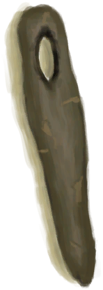
[Wood Handle](HandleWood.md)](HandleWood.md)

Take apart and Pick Up [

[Bookshelf](Bookshelf.md)](Bookshelf.md)

Dismantle [

[Satchel](Satchel.md)](Satchel.md)

Dismantle [

[Satchel](SatchelHunter.md)](SatchelHunter.md)

Dismantle [

[Travois](Travois.md)](Travois.md)

Light with Hand Drill [
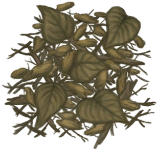
[Dry Leaves](LeavesDry.md)](LeavesDry.md)

Light with Bow Drill [

[Dry Leaves](LeavesDry.md)](LeavesDry.md)

Skin [

[Lizard Carcass](MonitorCarcass.md)](MonitorCarcass.md)

Butcher [

[Skinned Lizard](MonitorSkinned.md)](MonitorSkinned.md)

Ground [

[Burnt Mortar](MortarBurnt.md)](MortarBurnt.md)

Break [

[Mud Brick](MudBrick.md)](MudBrick.md)

Light with Hand Drill [

[Nest](Nest.md)](Nest.md)

Light with Bow Drill [

[Nest](Nest.md)](Nest.md)

Extract Seeds [

[Nipa Fruit](NipaFruit.md)](NipaFruit.md)

Ground [

[Niter Crystals](NiterCrystals.md)](NiterCrystals.md)

Practice Knapping [

[Obsidian](Obsidian.md)](Obsidian.md)

Open [

[Oyster](Oyster.md)](Oyster.md)

Weave [

[Palm Fronds](PalmFronds.md)](PalmFronds.md)

Light with Hand Drill [

[Papers](Papers.md)](Papers.md)

Light with Bow Drill [

[Papers](Papers.md)](Papers.md)

Unbraid [

[Rope](Rope.md)](Rope.md)

Flesh Skin [

[Fresh Skin](SkinFresh.md)](SkinFresh.md)

Flesh Skin [

[Fresh Reptile Skin](SkinFreshReptile.md)](SkinFreshReptile.md)

Break Long Stick [

[Long Stick](StickLong.md)](StickLong.md)

Craft Rustic Spear [

[Long Stick](StickLong.md)](StickLong.md)

Craft Hand Drill [

[Sticks](Sticks.md)](Sticks.md)

Craft Tourniquet [

[Sticks](Sticks.md)](Sticks.md)

Sharpen Stone [

[Stone](Stone.md)](Stone.md)

Ground [
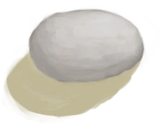
[Burnt Stone](StoneBurnt.md)](StoneBurnt.md)

Sharpen Stone [

[Heavy Stone](StoneHeavy.md)](StoneHeavy.md)

Sharpen Stone [

[Sulphurous Stone](StoneHeavyBrimstone.md)](StoneHeavyBrimstone.md)

Ground [
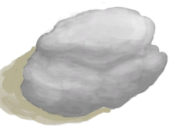
[Burnt Heavy Stone](StoneHeavyBurnt.md)](StoneHeavyBurnt.md)

Forage [

[Tide Pool(Rocks)](TidePool.md)](TidePool.md)

Break [

[Scrap Axe](AxeScrap.md)](AxeScrap.md)

Sharpen [
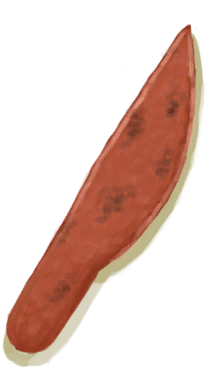
[Copper Knife](KnifeCopper.md)](KnifeCopper.md)

Sharpen [

[Blunt Knife](KnifeCopperBlunt.md)](KnifeCopperBlunt.md)

Sharpen [

[Grandfather's Knife](KnifeGrandpa.md)](KnifeGrandpa.md)

Sharpen [

[Grandfather's Blunt Knife](KnifeGrandpaBlunt.md)](KnifeGrandpaBlunt.md)

Sharpen [

[Military Knife](KnifeMilitary.md)](KnifeMilitary.md)

Sharpen [

[Blunt Knife](KnifeMilitaryBlunt.md)](KnifeMilitaryBlunt.md)

Break [

[Scrap Shovel](ShovelScrap.md)](ShovelScrap.md)

Dismantle [

[Copper Spear](SpearCopper.md)](SpearCopper.md)

Dismantle [

[Flint Spear](SpearFlint.md)](SpearFlint.md)

Dismantle [

[Obsidian Spear](SpearObsidian.md)](SpearObsidian.md)

Dismantle [

[Scrap Spear](SpearScrap.md)](SpearScrap.md)

Crack Almond open [

[Tropical Almonds](TropicalAlmonds.md)](TropicalAlmonds.md)

Carve [

[Boar Tusk](Tusk.md)](Tusk.md)

Break Urchin [

[Urchin](Urchin.md)](Urchin.md)

Murder! [

[Weston](Weston.md)](Weston.md)

Cut Shavings [

[Wood](Wood.md)](Wood.md)

Prepare Fire [

[Wood](Wood.md)](Wood.md)

Carve [

[Unfinished Wood Carving](WoodCarving_Unfinished.md)](WoodCarving_Unfinished.md)

Light with Hand Drill [

[Wood Shavings](WoodShavings.md)](WoodShavings.md)

Light with Bow Drill [

[Wood Shavings](WoodShavings.md)](WoodShavings.md)

Thread [

[Wooden Needle](WoodenNeedle.md)](WoodenNeedle.md)

Remove Cord [

[Threaded Needle](WoodenNeedleThreaded.md)](WoodenNeedleThreaded.md)

Clean (water) [

[Abrasion](W_Abrasion.md)](W_Abrasion.md)

Clean (honeywater) [

[Abrasion](W_Abrasion.md)](W_Abrasion.md)

Clean (lye) [

[Abrasion](W_Abrasion.md)](W_Abrasion.md)

Apply Honey [

[Abrasion](W_Abrasion.md)](W_Abrasion.md)

Clean (water) [

[Arm Laceration](W_ArmLacerationL.md)](W_ArmLacerationL.md)

Clean (honeywater) [

[Arm Laceration](W_ArmLacerationL.md)](W_ArmLacerationL.md)

Clean (lye) [

[Arm Laceration](W_ArmLacerationL.md)](W_ArmLacerationL.md)

Apply Honey [

[Arm Laceration](W_ArmLacerationL.md)](W_ArmLacerationL.md)

Stitch [

[Arm Laceration](W_ArmLacerationL.md)](W_ArmLacerationL.md)

Clean (water) [

[Stitched Arm Laceration](W_ArmLacerationLStitched.md)](W_ArmLacerationLStitched.md)

Clean (honeywater) [

[Stitched Arm Laceration](W_ArmLacerationLStitched.md)](W_ArmLacerationLStitched.md)

Clean (lye) [

[Stitched Arm Laceration](W_ArmLacerationLStitched.md)](W_ArmLacerationLStitched.md)

Apply Honey [

[Stitched Arm Laceration](W_ArmLacerationLStitched.md)](W_ArmLacerationLStitched.md)

Clean (water) [

[Arm Laceration](W_ArmLacerationR.md)](W_ArmLacerationR.md)

Clean (honeywater) [

[Arm Laceration](W_ArmLacerationR.md)](W_ArmLacerationR.md)

Clean (lye) [

[Arm Laceration](W_ArmLacerationR.md)](W_ArmLacerationR.md)

Apply Honey [

[Arm Laceration](W_ArmLacerationR.md)](W_ArmLacerationR.md)

Stitch [

[Arm Laceration](W_ArmLacerationR.md)](W_ArmLacerationR.md)

Clean (water) [

[Arm Laceration](W_ArmLacerationRStitched.md)](W_ArmLacerationRStitched.md)

Clean (honeywater) [

[Arm Laceration](W_ArmLacerationRStitched.md)](W_ArmLacerationRStitched.md)

Clean (lye) [

[Arm Laceration](W_ArmLacerationRStitched.md)](W_ArmLacerationRStitched.md)

Apply Honey [

[Arm Laceration](W_ArmLacerationRStitched.md)](W_ArmLacerationRStitched.md)

Clean (water) [

[Dog Bite](W_DogBite.md)](W_DogBite.md)

Clean (honeywater) [

[Dog Bite](W_DogBite.md)](W_DogBite.md)

Clean (lye) [

[Dog Bite](W_DogBite.md)](W_DogBite.md)

Apply Honey [

[Dog Bite](W_DogBite.md)](W_DogBite.md)

Clean (water) [

[Leg Laceration](W_LegLacerationL.md)](W_LegLacerationL.md)

Clean (honeywater) [

[Leg Laceration](W_LegLacerationL.md)](W_LegLacerationL.md)

Clean (lye) [

[Leg Laceration](W_LegLacerationL.md)](W_LegLacerationL.md)

Apply Honey [

[Leg Laceration](W_LegLacerationL.md)](W_LegLacerationL.md)

Stitch [

[Leg Laceration](W_LegLacerationL.md)](W_LegLacerationL.md)

Clean (water) [

[Leg Laceration](W_LegLacerationLStitched.md)](W_LegLacerationLStitched.md)

Clean (honeywater) [

[Leg Laceration](W_LegLacerationLStitched.md)](W_LegLacerationLStitched.md)

Clean (lye) [

[Leg Laceration](W_LegLacerationLStitched.md)](W_LegLacerationLStitched.md)

Apply Honey [

[Leg Laceration](W_LegLacerationLStitched.md)](W_LegLacerationLStitched.md)

Clean (water) [

[Leg Laceration](W_LegLacerationR.md)](W_LegLacerationR.md)

Clean (honeywater) [

[Leg Laceration](W_LegLacerationR.md)](W_LegLacerationR.md)

Clean (lye) [

[Leg Laceration](W_LegLacerationR.md)](W_LegLacerationR.md)

Apply Honey [

[Leg Laceration](W_LegLacerationR.md)](W_LegLacerationR.md)

Stitch [

[Leg Laceration](W_LegLacerationR.md)](W_LegLacerationR.md)

Clean (water) [

[Leg Laceration](W_LegLacerationRStitched.md)](W_LegLacerationRStitched.md)

Clean (honeywater) [

[Leg Laceration](W_LegLacerationRStitched.md)](W_LegLacerationRStitched.md)

Clean (lye) [

[Leg Laceration](W_LegLacerationRStitched.md)](W_LegLacerationRStitched.md)

Apply Honey [

[Leg Laceration](W_LegLacerationRStitched.md)](W_LegLacerationRStitched.md)

Clean (water) [

[Macaque Bite](W_MacaqueBite.md)](W_MacaqueBite.md)

Clean (honeywater) [

[Macaque Bite](W_MacaqueBite.md)](W_MacaqueBite.md)

Clean (lye) [

[Macaque Bite](W_MacaqueBite.md)](W_MacaqueBite.md)

Apply Honey [

[Macaque Bite](W_MacaqueBite.md)](W_MacaqueBite.md)

Clean (water) [

[Minor Laceration](W_MinorLaceration.md)](W_MinorLaceration.md)

Clean (honeywater) [

[Minor Laceration](W_MinorLaceration.md)](W_MinorLaceration.md)

Clean (lye) [

[Minor Laceration](W_MinorLaceration.md)](W_MinorLaceration.md)

Apply Honey [

[Minor Laceration](W_MinorLaceration.md)](W_MinorLaceration.md)

Stitch [

[Minor Laceration](W_MinorLaceration.md)](W_MinorLaceration.md)

Clean (water) [

[Minor Laceration](W_MinorLacerationStitched.md)](W_MinorLacerationStitched.md)

Clean (honeywater) [

[Minor Laceration](W_MinorLacerationStitched.md)](W_MinorLacerationStitched.md)

Clean (lye) [

[Minor Laceration](W_MinorLacerationStitched.md)](W_MinorLacerationStitched.md)

Apply Honey [

[Minor Laceration](W_MinorLacerationStitched.md)](W_MinorLacerationStitched.md)

Clean (water) [

[Lizard Bite](W_MonitorBite.md)](W_MonitorBite.md)

Clean (honeywater) [

[Lizard Bite](W_MonitorBite.md)](W_MonitorBite.md)

Clean (lye) [

[Lizard Bite](W_MonitorBite.md)](W_MonitorBite.md)

Apply Honey [

[Lizard Bite](W_MonitorBite.md)](W_MonitorBite.md)

Clean (water) [
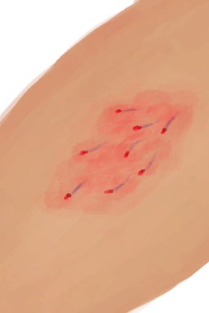
[Seahound Sting](W_SeahoundSting.md)](W_SeahoundSting.md)

Clean (honeywater) [

[Seahound Sting](W_SeahoundSting.md)](W_SeahoundSting.md)

Clean (lye) [

[Seahound Sting](W_SeahoundSting.md)](W_SeahoundSting.md)

Apply Honey [

[Seahound Sting](W_SeahoundSting.md)](W_SeahoundSting.md)

Clean (water) [

[Shark Bite](W_SharkBite.md)](W_SharkBite.md)

Clean (honeywater) [

[Shark Bite](W_SharkBite.md)](W_SharkBite.md)

Clean (lye) [

[Shark Bite](W_SharkBite.md)](W_SharkBite.md)

Apply Honey [

[Shark Bite](W_SharkBite.md)](W_SharkBite.md)

Clean (water) [

[Spider Bite](W_SpiderBite.md)](W_SpiderBite.md)

Clean (honeywater) [

[Spider Bite](W_SpiderBite.md)](W_SpiderBite.md)

Clean (lye) [

[Spider Bite](W_SpiderBite.md)](W_SpiderBite.md)

Apply Honey [

[Spider Bite](W_SpiderBite.md)](W_SpiderBite.md)

Clean (water) [

[Urchin Wound](W_UrchinWound.md)](W_UrchinWound.md)

Clean (honeywater) [

[Urchin Wound](W_UrchinWound.md)](W_UrchinWound.md)

Clean (lye) [

[Urchin Wound](W_UrchinWound.md)](W_UrchinWound.md)

Apply Honey [

[Urchin Wound](W_UrchinWound.md)](W_UrchinWound.md)

Divide into cords [

[Yarn](YarnFiber.md)](YarnFiber.md)

Make rope [

[Yarn](YarnFiber.md)](YarnFiber.md)

Cut Down [

[Blooming Alien Growth](AlienGrowth.md)](AlienGrowth.md)

Cut Down [

[Alien Growth](AlienGrowthCleared.md)](AlienGrowthCleared.md)

Cut Tree [

[Cinchona Tree](CinchonaTree.md)](CinchonaTree.md)

Harvest Bark [

[Cinchona Tree](CinchonaTree.md)](CinchonaTree.md)

Cut Tree [

[Cleared Cinchona Tree](CinchonaTreeCleared.md)](CinchonaTreeCleared.md)

Clean [

[Bat Cave](CaveBats.md)](CaveBats.md)

Clean [

[Grasslands Cave(Cave)](CaveGrasslands.md)](CaveGrasslands.md)

Clean [

[Sea Cave(Cave)](CaveSea.md)](CaveSea.md)

Clean [

[Crystal Chamber(High Chamber)](CrystalChamber.md)](CrystalChamber.md)

Dig [

[Narrow Passage(High Chamber)](CrystalChamberEntranceClosed.md)](CrystalChamberEntranceClosed.md)

Clean [

[Damp Chamber](DampChamber.md)](DampChamber.md)

Dig [

[Narrow Passage(Damp Chamber)](DarkCaveCaveEntranceClosed.md)](DarkCaveCaveEntranceClosed.md)

Clean [

[Darkness(Dark Chamber)](DarkChamber.md)](DarkChamber.md)

Dig [

[Narrow Passage(High Chamber)](DarkChamberCaveEntranceClosed.md)](DarkChamberCaveEntranceClosed.md)

Clean [

[Flooded Chamber](FloodedChamber.md)](FloodedChamber.md)

Dig [

[Narrow Passage(High Chamber)](FloodedChamberEntranceClosed.md)](FloodedChamberEntranceClosed.md)

Clean [

[High Chamber](HighChamber.md)](HighChamber.md)

Dig [

[Narrow Passage(Tunnel)](HighChamberEntranceClosed.md)](HighChamberEntranceClosed.md)

Clean [

[Low Chamber(High Chamber)](LowChamber.md)](LowChamber.md)

Clean [

[Medium Chamber(High Chamber)](MidChamber.md)](MidChamber.md)

Clean [

[Narrow Tunnel(High Chamber)](NarrowTunnel.md)](NarrowTunnel.md)

Clean [

[Tunnel](Tunnel.md)](Tunnel.md)

Clean [

[Tidal Cave](CaveTidal.md)](CaveTidal.md)

Clean [

[Cellar](Cellar.md)](Cellar.md)

Clean [

[Dark Cave](DarkCave.md)](DarkCave.md)

Clean [

[Enclosure](Enclosure.md)](Enclosure.md)

Clean [

[Macaque Den](MacaqueDen.md)](MacaqueDen.md)

Clean [

[Mud Hut](MudHut.md)](MudHut.md)

Clean [

[Mud Hut](MudHutRuins.md)](MudHutRuins.md)

Clean [

[Plane Crash(Crashed Plane)](PlaneCrash.md)](PlaneCrash.md)

Clean [

[Shed](Shed.md)](Shed.md)

Clean [

[Stone Hut](StoneHut.md)](StoneHut.md)

Cut Tree [

[Young Mango Tree](MangoTreeYoung.md)](MangoTreeYoung.md)

Dig Up Mud [

[Mud Deposit](MudDeposit.md)](MudDeposit.md)

Cut Wood [

[Deep Jungle(Jungle)](DeepJungle.md)](DeepJungle.md)

Dig Up Soil [

[Eastern Grasslands](GrasslandsE.md)](GrasslandsE.md)

Dig Up Soil [

[Western Grasslands](GrasslandsW.md)](GrasslandsW.md)

Cut Wood [
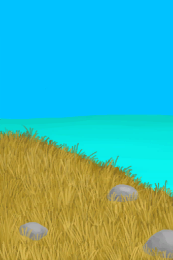
[Eastern Highlands](HighlandsEastern.md)](HighlandsEastern.md)

Cut Wood [

[Western Highlands](HighlandsWestern.md)](HighlandsWestern.md)

Cut Wood [

[Jungle](Jungle.md)](Jungle.md)

Cut Wood [

[Jungle Highlands](JungleHighlands.md)](JungleHighlands.md)

Cut Wood [

[Mangrove Forest](Mangroves.md)](Mangroves.md)

Cut Wood [

[Jungle Outskirts(Outskirts)](Outskirts.md)](Outskirts.md)

Gather Sand [

[Sand(Atoll)](SandSource.md)](SandSource.md)

Dig Up Sand [

[Sand(Atoll)](SandSource.md)](SandSource.md)

Spear Fish [

[Sea(Atoll)](Sea_Atoll.md)](Sea_Atoll.md)

Spear Fish [

[Sea(Bay)](Sea_Bay.md)](Sea_Bay.md)

Spear Fish [

[Sea(Beach)](Sea_Beach.md)](Sea_Beach.md)

Spear Fish [

[Sea(Secret Cove)](Sea_Cove.md)](Sea_Cove.md)

Spear Fish [

[Sea(Desolate Beach)](Sea_DesolateBeach.md)](Sea_DesolateBeach.md)

Spear Fish [

[Sea(Mangrove Forest)](Sea_Mangroves.md)](Sea_Mangroves.md)

Spear Fish [

[Sea](Sea_Raft.md)](Sea_Raft.md)

Spear Fish [

[Sea(Bird Rock)](Sea_Rocks.md)](Sea_Rocks.md)

Dig Up Soil [

[Secret Valley](SecretValley.md)](SecretValley.md)

Cut Wood [

[Wetland Jungle(Wetlands)](Wetlands.md)](Wetlands.md)

Cut Tree [

[Young palm Tree](PalmTreeYoung.md)](PalmTreeYoung.md)

Cut Down Tree [

[Cleared Banana Tree](BananaTreeCleared.md)](BananaTreeCleared.md)

Cut Tree [

[Large Tree](LargeTree.md)](LargeTree.md)

Clean Log of braches [

[Felled Large Tree](LargeTreeFelled.md)](LargeTreeFelled.md)

Cut Down Tree [

[Cleared Mango Tree](MangoTreeCleared.md)](MangoTreeCleared.md)

Cut Down [

[Cleared Palm Tree](PalmTreeCleared.md)](PalmTreeCleared.md)

Clear [

[Felled Palm Tree](PalmTreeFelled.md)](PalmTreeFelled.md)

Cut Down [

[Palm Tree](PalmTreeNew.md)](PalmTreeNew.md)

Throw Rock [

[Palm Tree](PalmTreeNew.md)](PalmTreeNew.md)

Cut Down [

[Palm Tree](PalmTreeNewMultiEventOld.md)](PalmTreeNewMultiEventOld.md)

Cut Down [

[Palm Tree](PalmTreeOld.md)](PalmTreeOld.md)

Hit Coconut [

[Palm Tree](PalmTreeOld.md)](PalmTreeOld.md)

Cut Down [

[Sap Station](PalmTreeSapStation.md)](PalmTreeSapStation.md)

Cut Down [

[Empty Sap Station(Empty)](PalmTreeSapStationEmpty.md)](PalmTreeSapStationEmpty.md)

Cut Tree [

[Sago Palm](SagoPalm.md)](SagoPalm.md)

Split Log [
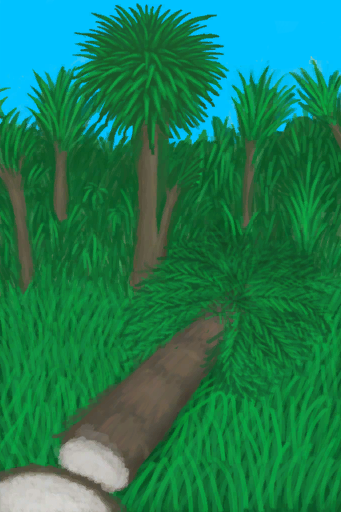
[Felled Sago Palm](SagoPalmFelled.md)](SagoPalmFelled.md)

Extract Sawdust [
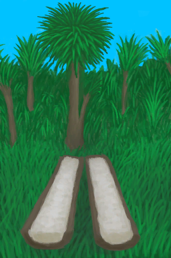
[Split Log](SagoSplitLog.md)](SagoSplitLog.md)

Collect Tropical Almonds [

[Tropical Almond Tree](TropicalAlmondTree.md)](TropicalAlmondTree.md)

Cut Down Tree [

[Cleared Tropical Almond Tree](TropicalAlmondTreeCleared.md)](TropicalAlmondTreeCleared.md)

Clean Branches [

[Felled Tropical Almond Tree](TropicalAlmondTreeFelled.md)](TropicalAlmondTreeFelled.md)

Dig Up Mud [

[Dry Puddle(Wetlands)](Puddle.md)](Puddle.md)

Dig Up Dirt [

[Dry Puddle(Wetlands)](Puddle.md)](Puddle.md)

Dismantle [

[Rain Catcher](RainCatcher.md)](RainCatcher.md)

Cut Tree [

[Small Palm](SmallPalm.md)](SmallPalm.md)

Cut Tree [

[Small Tree](SmallTree.md)](SmallTree.md)

Cut Tree [

[Young Almond Tree](TropicalAlmondTreeYoung.md)](TropicalAlmondTreeYoung.md)

Demolish [

[Water Filter](WaterFilter.md)](WaterFilter.md)

Cut Down [

[Wild Jujube](WildJujube.md)](WildJujube.md)

Cut Down [

[Cleared Wild Jujube](WildJujubeCleared.md)](WildJujubeCleared.md)

  
  

