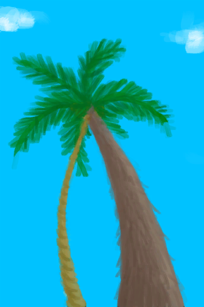
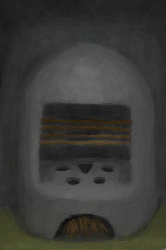
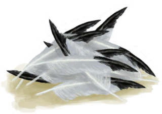
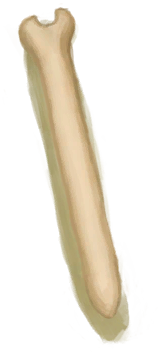
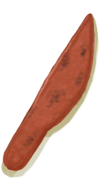
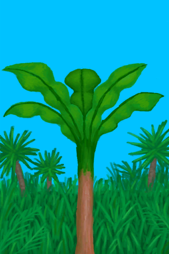

# Hand Damage  
> Caused by working with your hands. Can be neutralized with hand wrappings or gloves.  
  

<b>Base Value: </b> 0 
  

<b>Value Range: </b> 0 ~ 1000 
  

<b>Base Rate: </b> -1 / /TP 
  
## Statuses  

<table><tr style="height:2em;"><td style="background-color:#F0F0F0;text-align:center;width:180px;font-size:1.4em;font-weight:bold;vertical-align:middle;">
250 ～ 500

25% ～ 50%
</td><td colspan=2 style="font-size:1.1em;vertical-align:middle;background-color:#F9F9F9;">
<b>

My Hands Hurt</b>

&nbsp;&nbsp;Cuts and abrasions are making it hard to use my hands.
</td></tr><tr><td colspan=2><b>Effect：</b>[

[Hand Callouses](CallousesHands.md)](CallousesHands.md)addition<b>+1</b>, [

[Pain](Pain.md)](Pain.md)<b>+150</b>, [

[Skin Integrity](SkinIntegrity.md)](SkinIntegrity.md)<b>-1</b></td></tr><tr><td colspan=2></td></tr><tr style="height:2em;"><td style="background-color:#F0F0F0;text-align:center;width:180px;font-size:1.4em;font-weight:bold;vertical-align:middle;">
501 ～ 1000

50% ～ 100%
</td><td colspan=2 style="font-size:1.1em;vertical-align:middle;background-color:#F9F9F9;">
<b>

My Hands hurt too much</b>

&nbsp;&nbsp;"My hands are bloody and covered in cuts
</td></tr><tr><td colspan=2><b>Effect：</b>[

[Hand Callouses](CallousesHands.md)](CallousesHands.md)addition<b>+2</b>, [

[Pain](Pain.md)](Pain.md)<b>+250</b>, [

[Skin Integrity](SkinIntegrity.md)](SkinIntegrity.md)<b>-3</b></td></tr><tr><td colspan=2></td></tr></table>
  
## Related Cards  
[Hand Callouses](CallousesHands.md)  |  [Aloe Gel Protection](AloeVeraGelProtection.md)  |  [Brimstone Gel Protection](BrimstoneGelProtection.md)  
## Change By  
<table class="table table-bordered" data-toggle="table"  ><thead style=""><tr ><th  style="text-align:left;vertical-align:top;"  >From</th><th  style="text-align:left;vertical-align:top;"  >Operation</th><th  style="text-align:left;vertical-align:top;"  data-sortable="true"  >Value</th></tr></thead><tr ><td  style="text-align:left;vertical-align:top;"  >[

[Half Log](HalfLog.md)](HalfLog.md)</td><td  style="text-align:left;vertical-align:top;"  >Cut into Wood ** With：**[Stone Axe](StoneAxe.md)</td><td  style="text-align:left;vertical-align:top;"  >160</td></tr><tr ><td  style="text-align:left;vertical-align:top;"  >[

[Wooden Planks(BluePrint)](Bp_Planks.md)](Bp_Planks.md)</td><td  style="text-align:left;vertical-align:top;"  >Craft BluePrint</td><td  style="text-align:left;vertical-align:top;"  >150</td></tr><tr ><td  style="text-align:left;vertical-align:top;"  >[

[Half Log](HalfLog.md)](HalfLog.md)</td><td  style="text-align:left;vertical-align:top;"  >Cut into Wood ** With：**[“Axe”](tag_Axe.md)</td><td  style="text-align:left;vertical-align:top;"  >120</td></tr><tr ><td  style="text-align:left;vertical-align:top;"  >[

[Copper Vein(High Chamber)](CopperVein.md)](CopperVein.md)</td><td  style="text-align:left;vertical-align:top;"  >Mine ** With：**[“Hammer”](tag_Hammer.md)</td><td  style="text-align:left;vertical-align:top;"  >100</td></tr><tr ><td  style="text-align:left;vertical-align:top;"  >[

[Log](Log.md)](Log.md)</td><td  style="text-align:left;vertical-align:top;"  >Split into two ** With：**[Stone Axe](StoneAxe.md)</td><td  style="text-align:left;vertical-align:top;"  >80</td></tr><tr ><td  style="text-align:left;vertical-align:top;"  >[

[Large Tree](LargeTree.md)](LargeTree.md)</td><td  style="text-align:left;vertical-align:top;"  >Cut Tree ** With：**[Stone Axe](StoneAxe.md)</td><td  style="text-align:left;vertical-align:top;"  >80</td></tr><tr ><td  style="text-align:left;vertical-align:top;"  >[

[Felled Large Tree](LargeTreeFelled.md)](LargeTreeFelled.md)</td><td  style="text-align:left;vertical-align:top;"  >Clean Log of braches ** With：**[Stone Axe](StoneAxe.md)</td><td  style="text-align:left;vertical-align:top;"  >80</td></tr><tr ><td  style="text-align:left;vertical-align:top;"  >[

[Cleared Mango Tree](MangoTreeCleared.md)](MangoTreeCleared.md)</td><td  style="text-align:left;vertical-align:top;"  >Cut Down Tree ** With：**[Stone Axe](StoneAxe.md)</td><td  style="text-align:left;vertical-align:top;"  >80</td></tr><tr ><td  style="text-align:left;vertical-align:top;"  >[

[Cleared Palm Tree](PalmTreeCleared.md)](PalmTreeCleared.md)</td><td  style="text-align:left;vertical-align:top;"  >Cut Down ** With：**[Stone Axe](StoneAxe.md)</td><td  style="text-align:left;vertical-align:top;"  >80</td></tr><tr ><td  style="text-align:left;vertical-align:top;"  >[

[Felled Palm Tree](PalmTreeFelled.md)](PalmTreeFelled.md)</td><td  style="text-align:left;vertical-align:top;"  >Clear ** With：**[Stone Axe](StoneAxe.md)</td><td  style="text-align:left;vertical-align:top;"  >80</td></tr><tr ><td  style="text-align:left;vertical-align:top;"  >[

[Palm Tree](PalmTreeNew.md)](PalmTreeNew.md)</td><td  style="text-align:left;vertical-align:top;"  >Cut Down ** With：**[Stone Axe](StoneAxe.md)</td><td  style="text-align:left;vertical-align:top;"  >80</td></tr><tr ><td  style="text-align:left;vertical-align:top;"  >[

[Palm Tree](PalmTreeNewMultiEventOld.md)](PalmTreeNewMultiEventOld.md)</td><td  style="text-align:left;vertical-align:top;"  >Cut Down ** With：**[Stone Axe](StoneAxe.md)</td><td  style="text-align:left;vertical-align:top;"  >80</td></tr><tr ><td  style="text-align:left;vertical-align:top;"  >[

[Palm Tree](PalmTreeOld.md)](PalmTreeOld.md)(未实装)</td><td  style="text-align:left;vertical-align:top;"  >Cut Down ** With：**[Stone Axe](StoneAxe.md)</td><td  style="text-align:left;vertical-align:top;"  >80</td></tr><tr ><td  style="text-align:left;vertical-align:top;"  >[

[Sap Station](PalmTreeSapStation.md)](PalmTreeSapStation.md)(未实装)</td><td  style="text-align:left;vertical-align:top;"  >Cut Down ** With：**[Stone Axe](StoneAxe.md)</td><td  style="text-align:left;vertical-align:top;"  >80</td></tr><tr ><td  style="text-align:left;vertical-align:top;"  >[

[Empty Sap Station(Empty)](PalmTreeSapStationEmpty.md)](PalmTreeSapStationEmpty.md)(未实装)</td><td  style="text-align:left;vertical-align:top;"  >Cut Down ** With：**[Stone Axe](StoneAxe.md)</td><td  style="text-align:left;vertical-align:top;"  >80</td></tr><tr ><td  style="text-align:left;vertical-align:top;"  >[

[Palm Tree](PalmTree_IH.md)](PalmTree_IH.md)(未实装)</td><td  style="text-align:left;vertical-align:top;"  >Cut Down ** With：**[Stone Axe](StoneAxe.md)</td><td  style="text-align:left;vertical-align:top;"  >80</td></tr><tr ><td  style="text-align:left;vertical-align:top;"  >[

[Sago Palm](SagoPalm.md)](SagoPalm.md)</td><td  style="text-align:left;vertical-align:top;"  >Cut Tree ** With：**[Stone Axe](StoneAxe.md)</td><td  style="text-align:left;vertical-align:top;"  >80</td></tr><tr ><td  style="text-align:left;vertical-align:top;"  >[

[Felled Sago Palm](SagoPalmFelled.md)](SagoPalmFelled.md)</td><td  style="text-align:left;vertical-align:top;"  >Split Log ** With：**[Stone Axe](StoneAxe.md)</td><td  style="text-align:left;vertical-align:top;"  >80</td></tr><tr ><td  style="text-align:left;vertical-align:top;"  >[

[Cleared Tropical Almond Tree](TropicalAlmondTreeCleared.md)](TropicalAlmondTreeCleared.md)</td><td  style="text-align:left;vertical-align:top;"  >Cut Down Tree ** With：**[Stone Axe](StoneAxe.md)</td><td  style="text-align:left;vertical-align:top;"  >80</td></tr><tr ><td  style="text-align:left;vertical-align:top;"  >[

[Felled Tropical Almond Tree](TropicalAlmondTreeFelled.md)](TropicalAlmondTreeFelled.md)(未实装)</td><td  style="text-align:left;vertical-align:top;"  >Clean Branches ** With：**[Stone Axe](StoneAxe.md)</td><td  style="text-align:left;vertical-align:top;"  >80</td></tr><tr ><td  style="text-align:left;vertical-align:top;"  >[

[Nipa Fruit](NipaFruit.md)](NipaFruit.md)</td><td  style="text-align:left;vertical-align:top;"  >Extract Seeds ** With：**[“Cutter”](tag_Cutter.md)</td><td  style="text-align:left;vertical-align:top;"  >75</td></tr><tr ><td  style="text-align:left;vertical-align:top;"  >[

[Collapsed Tunnel Entrance(Eastern Highlands)](TunnelEntranceClosed.md)](TunnelEntranceClosed.md)</td><td  style="text-align:left;vertical-align:top;"  >Dig</td><td  style="text-align:left;vertical-align:top;"  >75</td></tr><tr ><td  style="text-align:left;vertical-align:top;"  >[

[Log](Log.md)](Log.md)</td><td  style="text-align:left;vertical-align:top;"  >Split into two ** With：**[“Axe”](tag_Axe.md)</td><td  style="text-align:left;vertical-align:top;"  >60</td></tr><tr ><td  style="text-align:left;vertical-align:top;"  >[

[Copper Sheet(BluePrint)](Bp_CopperSheet.md)](Bp_CopperSheet.md)</td><td  style="text-align:left;vertical-align:top;"  >Craft BluePrint</td><td  style="text-align:left;vertical-align:top;"  >60</td></tr><tr ><td  style="text-align:left;vertical-align:top;"  >[

[Large Tree](LargeTree.md)](LargeTree.md)</td><td  style="text-align:left;vertical-align:top;"  >Cut Tree ** With：**[“Hammer”](tag_AxeAdv.md)</td><td  style="text-align:left;vertical-align:top;"  >60</td></tr><tr ><td  style="text-align:left;vertical-align:top;"  >[

[Felled Large Tree](LargeTreeFelled.md)](LargeTreeFelled.md)</td><td  style="text-align:left;vertical-align:top;"  >Clean Log of braches ** With：**[“Axe”](tag_Axe.md)</td><td  style="text-align:left;vertical-align:top;"  >60</td></tr><tr ><td  style="text-align:left;vertical-align:top;"  >[

[Cleared Mango Tree](MangoTreeCleared.md)](MangoTreeCleared.md)</td><td  style="text-align:left;vertical-align:top;"  >Cut Down Tree ** With：**[“Hammer”](tag_AxeAdv.md)</td><td  style="text-align:left;vertical-align:top;"  >60</td></tr><tr ><td  style="text-align:left;vertical-align:top;"  >[

[Cleared Palm Tree](PalmTreeCleared.md)](PalmTreeCleared.md)</td><td  style="text-align:left;vertical-align:top;"  >Cut Down ** With：**[“Hammer”](tag_AxeAdv.md)</td><td  style="text-align:left;vertical-align:top;"  >60</td></tr><tr ><td  style="text-align:left;vertical-align:top;"  >[

[Felled Palm Tree](PalmTreeFelled.md)](PalmTreeFelled.md)</td><td  style="text-align:left;vertical-align:top;"  >Clear ** With：**[“Axe”](tag_Axe.md)</td><td  style="text-align:left;vertical-align:top;"  >60</td></tr><tr ><td  style="text-align:left;vertical-align:top;"  >[

[Palm Tree](PalmTreeNew.md)](PalmTreeNew.md)</td><td  style="text-align:left;vertical-align:top;"  >Cut Down ** With：**[“Hammer”](tag_AxeAdv.md)</td><td  style="text-align:left;vertical-align:top;"  >60</td></tr><tr ><td  style="text-align:left;vertical-align:top;"  >[

[Palm Tree](PalmTreeNewMultiEventOld.md)](PalmTreeNewMultiEventOld.md)</td><td  style="text-align:left;vertical-align:top;"  >Cut Down ** With：**[“Hammer”](tag_AxeAdv.md)</td><td  style="text-align:left;vertical-align:top;"  >60</td></tr><tr ><td  style="text-align:left;vertical-align:top;"  >[

[Palm Tree](PalmTreeOld.md)](PalmTreeOld.md)(未实装)</td><td  style="text-align:left;vertical-align:top;"  >Cut Down ** With：**[“Hammer”](tag_AxeAdv.md)</td><td  style="text-align:left;vertical-align:top;"  >60</td></tr><tr ><td  style="text-align:left;vertical-align:top;"  >[

[Sap Station](PalmTreeSapStation.md)](PalmTreeSapStation.md)(未实装)</td><td  style="text-align:left;vertical-align:top;"  >Cut Down ** With：**[“Axe”](tag_Axe.md)</td><td  style="text-align:left;vertical-align:top;"  >60</td></tr><tr ><td  style="text-align:left;vertical-align:top;"  >[

[Empty Sap Station(Empty)](PalmTreeSapStationEmpty.md)](PalmTreeSapStationEmpty.md)(未实装)</td><td  style="text-align:left;vertical-align:top;"  >Cut Down ** With：**[“Axe”](tag_Axe.md)</td><td  style="text-align:left;vertical-align:top;"  >60</td></tr><tr ><td  style="text-align:left;vertical-align:top;"  >[

[Palm Tree](PalmTree_IH.md)](PalmTree_IH.md)(未实装)</td><td  style="text-align:left;vertical-align:top;"  >Cut Down ** With：**[Copper Axe](AxeCopper.md)</td><td  style="text-align:left;vertical-align:top;"  >60</td></tr><tr ><td  style="text-align:left;vertical-align:top;"  >[

[Sago Palm](SagoPalm.md)](SagoPalm.md)</td><td  style="text-align:left;vertical-align:top;"  >Cut Tree ** With：**[“Axe”](tag_Axe.md)</td><td  style="text-align:left;vertical-align:top;"  >60</td></tr><tr ><td  style="text-align:left;vertical-align:top;"  >[

[Felled Sago Palm](SagoPalmFelled.md)](SagoPalmFelled.md)</td><td  style="text-align:left;vertical-align:top;"  >Split Log ** With：**[“Axe”](tag_Axe.md)</td><td  style="text-align:left;vertical-align:top;"  >60</td></tr><tr ><td  style="text-align:left;vertical-align:top;"  >[

[Cleared Tropical Almond Tree](TropicalAlmondTreeCleared.md)](TropicalAlmondTreeCleared.md)</td><td  style="text-align:left;vertical-align:top;"  >Cut Down Tree ** With：**[“Hammer”](tag_AxeAdv.md)</td><td  style="text-align:left;vertical-align:top;"  >60</td></tr><tr ><td  style="text-align:left;vertical-align:top;"  >[

[Felled Tropical Almond Tree](TropicalAlmondTreeFelled.md)](TropicalAlmondTreeFelled.md)(未实装)</td><td  style="text-align:left;vertical-align:top;"  >Clean Branches ** With：**[“Axe”](tag_Axe.md)</td><td  style="text-align:left;vertical-align:top;"  >60</td></tr><tr ><td  style="text-align:left;vertical-align:top;"  >[

[Bookshelf(BluePrint)](Bp_Bookshelf.md)](Bp_Bookshelf.md)</td><td  style="text-align:left;vertical-align:top;"  >Craft BluePrint</td><td  style="text-align:left;vertical-align:top;"  >50</td></tr><tr ><td  style="text-align:left;vertical-align:top;"  >[

[Shelf(BluePrint)](Bp_Shelf.md)](Bp_Shelf.md)</td><td  style="text-align:left;vertical-align:top;"  >Craft BluePrint</td><td  style="text-align:left;vertical-align:top;"  >50</td></tr><tr ><td  style="text-align:left;vertical-align:top;"  >[

[Debris(Mud Hut)](Debris.md)](Debris.md)</td><td  style="text-align:left;vertical-align:top;"  >Clear</td><td  style="text-align:left;vertical-align:top;"  >50</td></tr><tr ><td  style="text-align:left;vertical-align:top;"  >[

[Narrow Passage(High Chamber)](CrystalChamberEntranceClosed.md)](CrystalChamberEntranceClosed.md)</td><td  style="text-align:left;vertical-align:top;"  >Dig ** With：**[“Hammer”](tag_Hammer.md)</td><td  style="text-align:left;vertical-align:top;"  >50</td></tr><tr ><td  style="text-align:left;vertical-align:top;"  >[

[Narrow Passage(Damp Chamber)](DarkCaveCaveEntranceClosed.md)](DarkCaveCaveEntranceClosed.md)</td><td  style="text-align:left;vertical-align:top;"  >Dig ** With：**[“Hammer”](tag_Hammer.md)</td><td  style="text-align:left;vertical-align:top;"  >50</td></tr><tr ><td  style="text-align:left;vertical-align:top;"  >[

[Narrow Passage(High Chamber)](DarkChamberCaveEntranceClosed.md)](DarkChamberCaveEntranceClosed.md)</td><td  style="text-align:left;vertical-align:top;"  >Dig ** With：**[“Hammer”](tag_Hammer.md)</td><td  style="text-align:left;vertical-align:top;"  >50</td></tr><tr ><td  style="text-align:left;vertical-align:top;"  >[

[Narrow Passage(High Chamber)](FloodedChamberEntranceClosed.md)](FloodedChamberEntranceClosed.md)</td><td  style="text-align:left;vertical-align:top;"  >Dig ** With：**[“Hammer”](tag_Hammer.md)</td><td  style="text-align:left;vertical-align:top;"  >50</td></tr><tr ><td  style="text-align:left;vertical-align:top;"  >[

[Narrow Passage(Tunnel)](HighChamberEntranceClosed.md)](HighChamberEntranceClosed.md)</td><td  style="text-align:left;vertical-align:top;"  >Dig ** With：**[“Hammer”](tag_Hammer.md)</td><td  style="text-align:left;vertical-align:top;"  >50</td></tr><tr ><td  style="text-align:left;vertical-align:top;"  >[

[Stove(Off)](StoveExtinguished.md)](StoveExtinguished.md)</td><td  style="text-align:left;vertical-align:top;"  >Demolish ** With：**[“Hammer”](tag_Hammer.md)</td><td  style="text-align:left;vertical-align:top;"  >40</td></tr><tr ><td  style="text-align:left;vertical-align:top;"  >[

[Wood Shavings(BluePrint)](Bp_WoodShavings.md)](Bp_WoodShavings.md)</td><td  style="text-align:left;vertical-align:top;"  >Craft BluePrint</td><td  style="text-align:left;vertical-align:top;"  >40</td></tr><tr ><td  style="text-align:left;vertical-align:top;"  >[

[Feathers](Feathers.md)](Feathers.md)</td><td  style="text-align:left;vertical-align:top;"  >Light with Hand Drill ** With：**[Hand Drill](HandDrill.md)</td><td  style="text-align:left;vertical-align:top;"  >40</td></tr><tr ><td  style="text-align:left;vertical-align:top;"  >[

[Fibers](Fibers.md)](Fibers.md)</td><td  style="text-align:left;vertical-align:top;"  >Light with Hand Drill ** With：**[Hand Drill](HandDrill.md)</td><td  style="text-align:left;vertical-align:top;"  >40</td></tr><tr ><td  style="text-align:left;vertical-align:top;"  >[

[Dry Leaves](LeavesDry.md)](LeavesDry.md)</td><td  style="text-align:left;vertical-align:top;"  >Light with Hand Drill ** With：**[Hand Drill](HandDrill.md)</td><td  style="text-align:left;vertical-align:top;"  >40</td></tr><tr ><td  style="text-align:left;vertical-align:top;"  >[

[Nest](Nest.md)](Nest.md)</td><td  style="text-align:left;vertical-align:top;"  >Light with Hand Drill ** With：**[Hand Drill](HandDrill.md)</td><td  style="text-align:left;vertical-align:top;"  >40</td></tr><tr ><td  style="text-align:left;vertical-align:top;"  >[

[Nipa Fruit](NipaFruit.md)](NipaFruit.md)</td><td  style="text-align:left;vertical-align:top;"  >Extract Seeds ** With：**[“Axe”](tag_Axe.md)</td><td  style="text-align:left;vertical-align:top;"  >40</td></tr><tr ><td  style="text-align:left;vertical-align:top;"  >[

[Papers](Papers.md)](Papers.md)</td><td  style="text-align:left;vertical-align:top;"  >Light with Hand Drill ** With：**[Hand Drill](HandDrill.md)</td><td  style="text-align:left;vertical-align:top;"  >40</td></tr><tr ><td  style="text-align:left;vertical-align:top;"  >[

[Stone](Stone.md)](Stone.md)</td><td  style="text-align:left;vertical-align:top;"  >Sharpen Stone ** With：**[Stone](Stone.md)</td><td  style="text-align:left;vertical-align:top;"  >40</td></tr><tr ><td  style="text-align:left;vertical-align:top;"  >[

[Hand Drill](FirePlow.md)](FirePlow.md)(未实装)</td><td  style="text-align:left;vertical-align:top;"  >Light Tinder ** With：**[“Tinder”](tag_Tinder.md)</td><td  style="text-align:left;vertical-align:top;"  >40</td></tr><tr ><td  style="text-align:left;vertical-align:top;"  >[

[Wood Shavings](WoodShavings.md)](WoodShavings.md)</td><td  style="text-align:left;vertical-align:top;"  >Light with Hand Drill ** With：**[Hand Drill](HandDrill.md)</td><td  style="text-align:left;vertical-align:top;"  >40</td></tr><tr ><td  style="text-align:left;vertical-align:top;"  >[

[Water Filter](WaterFilter.md)](WaterFilter.md)</td><td  style="text-align:left;vertical-align:top;"  >Demolish ** With：**[“Hammer”](tag_Hammer.md)</td><td  style="text-align:left;vertical-align:top;"  >40</td></tr><tr ><td  style="text-align:left;vertical-align:top;"  >[

[Watering Trough](WateringTrough.md)](WateringTrough.md)</td><td  style="text-align:left;vertical-align:top;"  >Demolish ** With：**[“Hammer”](tag_Hammer.md)</td><td  style="text-align:left;vertical-align:top;"  >35</td></tr><tr ><td  style="text-align:left;vertical-align:top;"  >[

[Blunt Axe Head](AxeHeadBlunt.md)](AxeHeadBlunt.md)</td><td  style="text-align:left;vertical-align:top;"  >Sharpen ** With：**[Stone](Stone.md) , [Heavy Stone](StoneHeavy.md)</td><td  style="text-align:left;vertical-align:top;"  >30</td></tr><tr ><td  style="text-align:left;vertical-align:top;"  >[

[Chair(BluePrint)](Bp_Chair.md)](Bp_Chair.md)</td><td  style="text-align:left;vertical-align:top;"  >Craft BluePrint</td><td  style="text-align:left;vertical-align:top;"  >25</td></tr><tr ><td  style="text-align:left;vertical-align:top;"  >[

[Treenails(BluePrint)](Bp_Treenails.md)](Bp_Treenails.md)</td><td  style="text-align:left;vertical-align:top;"  >Craft BluePrint</td><td  style="text-align:left;vertical-align:top;"  >25</td></tr><tr ><td  style="text-align:left;vertical-align:top;"  >[

[Debris(Mud Hut)](Debris.md)](Debris.md)</td><td  style="text-align:left;vertical-align:top;"  >Clear ** With：**[“Shovel”](tag_Shovel.md)</td><td  style="text-align:left;vertical-align:top;"  >25</td></tr><tr ><td  style="text-align:left;vertical-align:top;"  >[

[Deep Jungle(Jungle)](DeepJungle.md)](DeepJungle.md)</td><td  style="text-align:left;vertical-align:top;"  >Cut Wood ** With：**[“Hammer”](tag_AxeAdv.md)</td><td  style="text-align:left;vertical-align:top;"  >25</td></tr><tr ><td  style="text-align:left;vertical-align:top;"  >[

[Deep Jungle(Jungle)](DeepJungle.md)](DeepJungle.md)</td><td  style="text-align:left;vertical-align:top;"  >Cut Wood ** With：**[“Axe”](tag_Axe.md)</td><td  style="text-align:left;vertical-align:top;"  >25</td></tr><tr ><td  style="text-align:left;vertical-align:top;"  >[

[Eastern Highlands](HighlandsEastern.md)](HighlandsEastern.md)</td><td  style="text-align:left;vertical-align:top;"  >Cut Wood ** With：**[“Hammer”](tag_AxeAdv.md)</td><td  style="text-align:left;vertical-align:top;"  >25</td></tr><tr ><td  style="text-align:left;vertical-align:top;"  >[

[Eastern Highlands](HighlandsEastern.md)](HighlandsEastern.md)</td><td  style="text-align:left;vertical-align:top;"  >Cut Wood ** With：**[“Axe”](tag_Axe.md)</td><td  style="text-align:left;vertical-align:top;"  >25</td></tr><tr ><td  style="text-align:left;vertical-align:top;"  >[

[Western Highlands](HighlandsWestern.md)](HighlandsWestern.md)</td><td  style="text-align:left;vertical-align:top;"  >Cut Wood ** With：**[“Hammer”](tag_AxeAdv.md)</td><td  style="text-align:left;vertical-align:top;"  >25</td></tr><tr ><td  style="text-align:left;vertical-align:top;"  >[

[Western Highlands](HighlandsWestern.md)](HighlandsWestern.md)</td><td  style="text-align:left;vertical-align:top;"  >Cut Wood ** With：**[“Axe”](tag_Axe.md)</td><td  style="text-align:left;vertical-align:top;"  >25</td></tr><tr ><td  style="text-align:left;vertical-align:top;"  >[

[Jungle](Jungle.md)](Jungle.md)</td><td  style="text-align:left;vertical-align:top;"  >Cut Wood ** With：**[“Hammer”](tag_AxeAdv.md)</td><td  style="text-align:left;vertical-align:top;"  >25</td></tr><tr ><td  style="text-align:left;vertical-align:top;"  >[

[Jungle](Jungle.md)](Jungle.md)</td><td  style="text-align:left;vertical-align:top;"  >Cut Wood ** With：**[“Axe”](tag_Axe.md)</td><td  style="text-align:left;vertical-align:top;"  >25</td></tr><tr ><td  style="text-align:left;vertical-align:top;"  >[

[Jungle Highlands](JungleHighlands.md)](JungleHighlands.md)</td><td  style="text-align:left;vertical-align:top;"  >Cut Wood ** With：**[“Hammer”](tag_AxeAdv.md)</td><td  style="text-align:left;vertical-align:top;"  >25</td></tr><tr ><td  style="text-align:left;vertical-align:top;"  >[

[Jungle Highlands](JungleHighlands.md)](JungleHighlands.md)</td><td  style="text-align:left;vertical-align:top;"  >Cut Wood ** With：**[“Axe”](tag_Axe.md)</td><td  style="text-align:left;vertical-align:top;"  >25</td></tr><tr ><td  style="text-align:left;vertical-align:top;"  >[

[Mangrove Forest](Mangroves.md)](Mangroves.md)</td><td  style="text-align:left;vertical-align:top;"  >Cut Wood ** With：**[“Hammer”](tag_AxeAdv.md)</td><td  style="text-align:left;vertical-align:top;"  >25</td></tr><tr ><td  style="text-align:left;vertical-align:top;"  >[

[Mangrove Forest](Mangroves.md)](Mangroves.md)</td><td  style="text-align:left;vertical-align:top;"  >Cut Wood ** With：**[“Axe”](tag_Axe.md)</td><td  style="text-align:left;vertical-align:top;"  >25</td></tr><tr ><td  style="text-align:left;vertical-align:top;"  >[

[Jungle Outskirts(Outskirts)](Outskirts.md)](Outskirts.md)</td><td  style="text-align:left;vertical-align:top;"  >Cut Wood ** With：**[“Hammer”](tag_AxeAdv.md)</td><td  style="text-align:left;vertical-align:top;"  >25</td></tr><tr ><td  style="text-align:left;vertical-align:top;"  >[

[Jungle Outskirts(Outskirts)](Outskirts.md)](Outskirts.md)</td><td  style="text-align:left;vertical-align:top;"  >Cut Wood ** With：**[“Axe”](tag_Axe.md)</td><td  style="text-align:left;vertical-align:top;"  >25</td></tr><tr ><td  style="text-align:left;vertical-align:top;"  >[

[Wetland Jungle(Wetlands)](Wetlands.md)](Wetlands.md)</td><td  style="text-align:left;vertical-align:top;"  >Cut Wood ** With：**[“Hammer”](tag_AxeAdv.md)</td><td  style="text-align:left;vertical-align:top;"  >25</td></tr><tr ><td  style="text-align:left;vertical-align:top;"  >[

[Wetland Jungle(Wetlands)](Wetlands.md)](Wetlands.md)</td><td  style="text-align:left;vertical-align:top;"  >Cut Wood ** With：**[“Axe”](tag_Axe.md)</td><td  style="text-align:left;vertical-align:top;"  >25</td></tr><tr ><td  style="text-align:left;vertical-align:top;"  >[

[Wild Yam](YamPlant.md)](YamPlant.md)</td><td  style="text-align:left;vertical-align:top;"  >Dig Up Tubers</td><td  style="text-align:left;vertical-align:top;"  >25</td></tr><tr ><td  style="text-align:left;vertical-align:top;"  >[

[A huge wave strikes the raft!(Event)](Event_Wave.md)](Event_Wave.md)</td><td  style="text-align:left;vertical-align:top;"  >Brace yourself!</td><td  style="text-align:left;vertical-align:top;"  >20</td></tr><tr ><td  style="text-align:left;vertical-align:top;"  >[

[Flint](Flint.md)](Flint.md)</td><td  style="text-align:left;vertical-align:top;"  >Practice Knapping ** With：**[Stone](Stone.md)</td><td  style="text-align:left;vertical-align:top;"  >20</td></tr><tr ><td  style="text-align:left;vertical-align:top;"  >[

[Unfinished  Bone Flute](FluteBone_Unfinished.md)](FluteBone_Unfinished.md)</td><td  style="text-align:left;vertical-align:top;"  >Carve ** With：**[“Cutter Advanced”](tag_CutterAdv.md)</td><td  style="text-align:left;vertical-align:top;"  >20</td></tr><tr ><td  style="text-align:left;vertical-align:top;"  >[

[Unfinished  Wooden Flute](FluteWooden_Unfinished.md)](FluteWooden_Unfinished.md)</td><td  style="text-align:left;vertical-align:top;"  >Carve ** With：**[“Cutter Advanced”](tag_CutterAdv.md)</td><td  style="text-align:left;vertical-align:top;"  >20</td></tr><tr ><td  style="text-align:left;vertical-align:top;"  >[

[Ginger](Ginger.md)](Ginger.md)</td><td  style="text-align:left;vertical-align:top;"  >Grind Root ** With：**[“Hammer”](tag_Hammer.md)</td><td  style="text-align:left;vertical-align:top;"  >20</td></tr><tr ><td  style="text-align:left;vertical-align:top;"  >[

[Dried Ginger](GingerDried.md)](GingerDried.md)</td><td  style="text-align:left;vertical-align:top;"  >Grind Root ** With：**[“Hammer”](tag_Hammer.md)</td><td  style="text-align:left;vertical-align:top;"  >20</td></tr><tr ><td  style="text-align:left;vertical-align:top;"  >[

[Jasmine Flowers](JasmineFlowers.md)](JasmineFlowers.md)</td><td  style="text-align:left;vertical-align:top;"  >Grind ** With：**[“Hammer”](tag_Hammer.md)</td><td  style="text-align:left;vertical-align:top;"  >20</td></tr><tr ><td  style="text-align:left;vertical-align:top;"  >[

[Kava Root](KavaRoot.md)](KavaRoot.md)</td><td  style="text-align:left;vertical-align:top;"  >Grind Root ** With：**[“Hammer”](tag_Hammer.md)</td><td  style="text-align:left;vertical-align:top;"  >20</td></tr><tr ><td  style="text-align:left;vertical-align:top;"  >[

[Dried Kava Root](KavaRootDried.md)](KavaRootDried.md)</td><td  style="text-align:left;vertical-align:top;"  >Grind Root ** With：**[“Hammer”](tag_Hammer.md)</td><td  style="text-align:left;vertical-align:top;"  >20</td></tr><tr ><td  style="text-align:left;vertical-align:top;"  >[

[Lemongrass](LemongrassStalks.md)](LemongrassStalks.md)</td><td  style="text-align:left;vertical-align:top;"  >Grind ** With：**[“Hammer”](tag_Hammer.md)</td><td  style="text-align:left;vertical-align:top;"  >20</td></tr><tr ><td  style="text-align:left;vertical-align:top;"  >[

[Snake Grass](SnakeGrass.md)](SnakeGrass.md)</td><td  style="text-align:left;vertical-align:top;"  >Grind ** With：**[“Hammer”](tag_Hammer.md)</td><td  style="text-align:left;vertical-align:top;"  >20</td></tr><tr ><td  style="text-align:left;vertical-align:top;"  >[

[Spider Lily Leaves](SpiderLilyLeaves.md)](SpiderLilyLeaves.md)</td><td  style="text-align:left;vertical-align:top;"  >Grind Leaves ** With：**[“Hammer”](tag_Hammer.md)</td><td  style="text-align:left;vertical-align:top;"  >20</td></tr><tr ><td  style="text-align:left;vertical-align:top;"  >[

[Dried Spider Lily Leaves](SpiderLilyLeavesDried.md)](SpiderLilyLeavesDried.md)</td><td  style="text-align:left;vertical-align:top;"  >Grind Leaves ** With：**[“Hammer”](tag_Hammer.md)</td><td  style="text-align:left;vertical-align:top;"  >20</td></tr><tr ><td  style="text-align:left;vertical-align:top;"  >[

[Obsidian](Obsidian.md)](Obsidian.md)</td><td  style="text-align:left;vertical-align:top;"  >Practice Knapping ** With：**[Stone](Stone.md)</td><td  style="text-align:left;vertical-align:top;"  >20</td></tr><tr ><td  style="text-align:left;vertical-align:top;"  >[

[Heavy Stone](StoneHeavy.md)](StoneHeavy.md)</td><td  style="text-align:left;vertical-align:top;"  >Sharpen Stone ** With：**[Stone](Stone.md)</td><td  style="text-align:left;vertical-align:top;"  >20</td></tr><tr ><td  style="text-align:left;vertical-align:top;"  >[

[Sulphurous Stone](StoneHeavyBrimstone.md)](StoneHeavyBrimstone.md)</td><td  style="text-align:left;vertical-align:top;"  >Sharpen Stone ** With：**[Stone](Stone.md)</td><td  style="text-align:left;vertical-align:top;"  >20</td></tr><tr ><td  style="text-align:left;vertical-align:top;"  >[

[Broom](Broom.md)](Broom.md)</td><td  style="text-align:left;vertical-align:top;"  >Train</td><td  style="text-align:left;vertical-align:top;"  >20</td></tr><tr ><td  style="text-align:left;vertical-align:top;"  >[

[Blunt Knife](KnifeCopperBlunt.md)](KnifeCopperBlunt.md)</td><td  style="text-align:left;vertical-align:top;"  >Sharpen ** With：**[Stone](Stone.md) , [Heavy Stone](StoneHeavy.md)</td><td  style="text-align:left;vertical-align:top;"  >20</td></tr><tr ><td  style="text-align:left;vertical-align:top;"  >[

[Grandfather's Blunt Knife](KnifeGrandpaBlunt.md)](KnifeGrandpaBlunt.md)</td><td  style="text-align:left;vertical-align:top;"  >Sharpen ** With：**[Stone](Stone.md) , [Heavy Stone](StoneHeavy.md) , [Sulphurous Stone](StoneHeavyBrimstone.md)</td><td  style="text-align:left;vertical-align:top;"  >20</td></tr><tr ><td  style="text-align:left;vertical-align:top;"  >[

[Copper Spear](SpearCopper.md)](SpearCopper.md)</td><td  style="text-align:left;vertical-align:top;"  >Train</td><td  style="text-align:left;vertical-align:top;"  >20</td></tr><tr ><td  style="text-align:left;vertical-align:top;"  >[

[Fishing Spear](SpearFishing.md)](SpearFishing.md)</td><td  style="text-align:left;vertical-align:top;"  >Train</td><td  style="text-align:left;vertical-align:top;"  >20</td></tr><tr ><td  style="text-align:left;vertical-align:top;"  >[

[Flint Spear](SpearFlint.md)](SpearFlint.md)</td><td  style="text-align:left;vertical-align:top;"  >Train</td><td  style="text-align:left;vertical-align:top;"  >20</td></tr><tr ><td  style="text-align:left;vertical-align:top;"  >[

[Blunt Spear Head](SpearHeadBlunt.md)](SpearHeadBlunt.md)</td><td  style="text-align:left;vertical-align:top;"  >Sharpen ** With：**[Stone](Stone.md) , [Heavy Stone](StoneHeavy.md)</td><td  style="text-align:left;vertical-align:top;"  >20</td></tr><tr ><td  style="text-align:left;vertical-align:top;"  >[

[Obsidian Spear](SpearObsidian.md)](SpearObsidian.md)</td><td  style="text-align:left;vertical-align:top;"  >Train</td><td  style="text-align:left;vertical-align:top;"  >20</td></tr><tr ><td  style="text-align:left;vertical-align:top;"  >[

[Rustic Spear](SpearRustic.md)](SpearRustic.md)</td><td  style="text-align:left;vertical-align:top;"  >Train</td><td  style="text-align:left;vertical-align:top;"  >20</td></tr><tr ><td  style="text-align:left;vertical-align:top;"  >[

[Scrap Spear](SpearScrap.md)](SpearScrap.md)</td><td  style="text-align:left;vertical-align:top;"  >Train</td><td  style="text-align:left;vertical-align:top;"  >20</td></tr><tr ><td  style="text-align:left;vertical-align:top;"  >[

[Wood](Wood.md)](Wood.md)</td><td  style="text-align:left;vertical-align:top;"  >Cut Shavings ** With：**[“Cutter Advanced”](tag_CutterAdv.md)</td><td  style="text-align:left;vertical-align:top;"  >20</td></tr><tr ><td  style="text-align:left;vertical-align:top;"  >[

[Unfinished Wood Carving](WoodCarving_Unfinished.md)](WoodCarving_Unfinished.md)</td><td  style="text-align:left;vertical-align:top;"  >Carve ** With：**[“Cutter Advanced”](tag_CutterAdv.md)</td><td  style="text-align:left;vertical-align:top;"  >20</td></tr><tr ><td  style="text-align:left;vertical-align:top;"  >[

[Blooming Alien Growth](AlienGrowth.md)](AlienGrowth.md)</td><td  style="text-align:left;vertical-align:top;"  >Cut Down ** With：**[“Axe”](tag_Axe.md)</td><td  style="text-align:left;vertical-align:top;"  >20</td></tr><tr ><td  style="text-align:left;vertical-align:top;"  >[

[Alien Growth](AlienGrowthCleared.md)](AlienGrowthCleared.md)</td><td  style="text-align:left;vertical-align:top;"  >Cut Down ** With：**[“Axe”](tag_Axe.md)</td><td  style="text-align:left;vertical-align:top;"  >20</td></tr><tr ><td  style="text-align:left;vertical-align:top;"  >[

[Cinchona Tree](CinchonaTree.md)](CinchonaTree.md)</td><td  style="text-align:left;vertical-align:top;"  >Cut Tree ** With：**[“Axe”](tag_Axe.md)</td><td  style="text-align:left;vertical-align:top;"  >20</td></tr><tr ><td  style="text-align:left;vertical-align:top;"  >[

[Cleared Cinchona Tree](CinchonaTreeCleared.md)](CinchonaTreeCleared.md)</td><td  style="text-align:left;vertical-align:top;"  >Cut Tree ** With：**[“Axe”](tag_Axe.md)</td><td  style="text-align:left;vertical-align:top;"  >20</td></tr><tr ><td  style="text-align:left;vertical-align:top;"  >[

[Young Mango Tree](MangoTreeYoung.md)](MangoTreeYoung.md)</td><td  style="text-align:left;vertical-align:top;"  >Cut Tree ** With：**[“Axe”](tag_Axe.md)</td><td  style="text-align:left;vertical-align:top;"  >20</td></tr><tr ><td  style="text-align:left;vertical-align:top;"  >[

[Eastern Grasslands](GrasslandsE.md)](GrasslandsE.md)</td><td  style="text-align:left;vertical-align:top;"  >Dig Up Soil ** With：**[“Shovel”](tag_Shovel.md)</td><td  style="text-align:left;vertical-align:top;"  >20</td></tr><tr ><td  style="text-align:left;vertical-align:top;"  >[

[Western Grasslands](GrasslandsW.md)](GrasslandsW.md)</td><td  style="text-align:left;vertical-align:top;"  >Dig Up Soil ** With：**[“Shovel”](tag_Shovel.md)</td><td  style="text-align:left;vertical-align:top;"  >20</td></tr><tr ><td  style="text-align:left;vertical-align:top;"  >[

[Secret Valley](SecretValley.md)](SecretValley.md)</td><td  style="text-align:left;vertical-align:top;"  >Dig Up Soil ** With：**[“Shovel”](tag_Shovel.md)</td><td  style="text-align:left;vertical-align:top;"  >20</td></tr><tr ><td  style="text-align:left;vertical-align:top;"  >[

[Young palm Tree](PalmTreeYoung.md)](PalmTreeYoung.md)</td><td  style="text-align:left;vertical-align:top;"  >Cut Tree ** With：**[“Axe”](tag_Axe.md)</td><td  style="text-align:left;vertical-align:top;"  >20</td></tr><tr ><td  style="text-align:left;vertical-align:top;"  >[

[To Jungle Highlands(Secret Cove)](Path_CoveToJungleHighlands.md)](Path_CoveToJungleHighlands.md)</td><td  style="text-align:left;vertical-align:top;"  >Climb Up</td><td  style="text-align:left;vertical-align:top;"  >20</td></tr><tr ><td  style="text-align:left;vertical-align:top;"  >[

[To Secret Cove(Jungle Highlands)](Path_JungleHighlandsToCove.md)](Path_JungleHighlandsToCove.md)</td><td  style="text-align:left;vertical-align:top;"  >Climb Down</td><td  style="text-align:left;vertical-align:top;"  >20</td></tr><tr ><td  style="text-align:left;vertical-align:top;"  >[

[To Valley Cliffs](Path_JungleHighlandsToValley.md)](Path_JungleHighlandsToValley.md)(未实装)</td><td  style="text-align:left;vertical-align:top;"  >Climb Down</td><td  style="text-align:left;vertical-align:top;"  >20</td></tr><tr ><td  style="text-align:left;vertical-align:top;"  >[

[To Wetlands Cliff](Path_JungleHighlandsToWetlands.md)](Path_JungleHighlandsToWetlands.md)</td><td  style="text-align:left;vertical-align:top;"  >Climb</td><td  style="text-align:left;vertical-align:top;"  >20</td></tr><tr ><td  style="text-align:left;vertical-align:top;"  >[

[To Jungle Highlands](Path_ValleyToJungleHighlands.md)](Path_ValleyToJungleHighlands.md)(未实装)</td><td  style="text-align:left;vertical-align:top;"  >Climb Up</td><td  style="text-align:left;vertical-align:top;"  >20</td></tr><tr ><td  style="text-align:left;vertical-align:top;"  >[

[To Jungle Highlands(Wetlands)](Path_WetlandsToJungleHighlands.md)](Path_WetlandsToJungleHighlands.md)</td><td  style="text-align:left;vertical-align:top;"  >Climb Up</td><td  style="text-align:left;vertical-align:top;"  >20</td></tr><tr ><td  style="text-align:left;vertical-align:top;"  >[

[Cleared Banana Tree](BananaTreeCleared.md)](BananaTreeCleared.md)</td><td  style="text-align:left;vertical-align:top;"  >Cut Down Tree ** With：**[Stone Axe](StoneAxe.md)</td><td  style="text-align:left;vertical-align:top;"  >20</td></tr><tr ><td  style="text-align:left;vertical-align:top;"  >[

[Small Palm](SmallPalm.md)](SmallPalm.md)</td><td  style="text-align:left;vertical-align:top;"  >Cut Tree ** With：**[“Axe”](tag_Axe.md)</td><td  style="text-align:left;vertical-align:top;"  >20</td></tr><tr ><td  style="text-align:left;vertical-align:top;"  >[

[Small Tree](SmallTree.md)](SmallTree.md)</td><td  style="text-align:left;vertical-align:top;"  >Cut Tree ** With：**[“Axe”](tag_Axe.md)</td><td  style="text-align:left;vertical-align:top;"  >20</td></tr><tr ><td  style="text-align:left;vertical-align:top;"  >[

[Young Almond Tree](TropicalAlmondTreeYoung.md)](TropicalAlmondTreeYoung.md)</td><td  style="text-align:left;vertical-align:top;"  >Cut Tree ** With：**[“Axe”](tag_Axe.md)</td><td  style="text-align:left;vertical-align:top;"  >20</td></tr><tr ><td  style="text-align:left;vertical-align:top;"  >[

[Wild Jujube](WildJujube.md)](WildJujube.md)</td><td  style="text-align:left;vertical-align:top;"  >Cut Down ** With：**[“Axe”](tag_Axe.md)</td><td  style="text-align:left;vertical-align:top;"  >20</td></tr><tr ><td  style="text-align:left;vertical-align:top;"  >[

[Cleared Wild Jujube](WildJujubeCleared.md)](WildJujubeCleared.md)</td><td  style="text-align:left;vertical-align:top;"  >Cut Down ** With：**[“Axe”](tag_Axe.md)</td><td  style="text-align:left;vertical-align:top;"  >20</td></tr><tr ><td  style="text-align:left;vertical-align:top;"  >[

[Geode](Geode.md)](Geode.md)</td><td  style="text-align:left;vertical-align:top;"  >Crack ** With：**[“Hammer”](tag_Hammer.md)</td><td  style="text-align:left;vertical-align:top;"  >15</td></tr><tr ><td  style="text-align:left;vertical-align:top;"  >[

[Cinchona Tree](CinchonaTree.md)](CinchonaTree.md)</td><td  style="text-align:left;vertical-align:top;"  >Harvest Bark ** With：**[“Cutter”](tag_Cutter.md)</td><td  style="text-align:left;vertical-align:top;"  >15</td></tr><tr ><td  style="text-align:left;vertical-align:top;"  >[

[Feathers](Feathers.md)](Feathers.md)</td><td  style="text-align:left;vertical-align:top;"  >Light with Bow Drill ** With：**[Bow Drill](BowDrill.md)</td><td  style="text-align:left;vertical-align:top;"  >10</td></tr><tr ><td  style="text-align:left;vertical-align:top;"  >[

[Fibers](Fibers.md)](Fibers.md)</td><td  style="text-align:left;vertical-align:top;"  >Light with Bow Drill ** With：**[Bow Drill](BowDrill.md)</td><td  style="text-align:left;vertical-align:top;"  >10</td></tr><tr ><td  style="text-align:left;vertical-align:top;"  >[

[Dry Leaves](LeavesDry.md)](LeavesDry.md)</td><td  style="text-align:left;vertical-align:top;"  >Light with Bow Drill ** With：**[Bow Drill](BowDrill.md)</td><td  style="text-align:left;vertical-align:top;"  >10</td></tr><tr ><td  style="text-align:left;vertical-align:top;"  >[

[Nest](Nest.md)](Nest.md)</td><td  style="text-align:left;vertical-align:top;"  >Light with Bow Drill ** With：**[Bow Drill](BowDrill.md)</td><td  style="text-align:left;vertical-align:top;"  >10</td></tr><tr ><td  style="text-align:left;vertical-align:top;"  >[

[Papers](Papers.md)](Papers.md)</td><td  style="text-align:left;vertical-align:top;"  >Light with Bow Drill ** With：**[Bow Drill](BowDrill.md)</td><td  style="text-align:left;vertical-align:top;"  >10</td></tr><tr ><td  style="text-align:left;vertical-align:top;"  >[

[Blunt Survival Axe](AxeSurvivalBlunt.md)](AxeSurvivalBlunt.md)</td><td  style="text-align:left;vertical-align:top;"  >Sharpen ** With：**[Stone](Stone.md) , [Heavy Stone](StoneHeavy.md)</td><td  style="text-align:left;vertical-align:top;"  >10</td></tr><tr ><td  style="text-align:left;vertical-align:top;"  >[

[Blunt Knife](KnifeMilitaryBlunt.md)](KnifeMilitaryBlunt.md)</td><td  style="text-align:left;vertical-align:top;"  >Sharpen ** With：**[Stone](Stone.md) , [Heavy Stone](StoneHeavy.md)</td><td  style="text-align:left;vertical-align:top;"  >10</td></tr><tr ><td  style="text-align:left;vertical-align:top;"  >[

[Boar Tusk](Tusk.md)](Tusk.md)</td><td  style="text-align:left;vertical-align:top;"  >Carve ** With：**[“Cutter Advanced”](tag_CutterAdv.md)</td><td  style="text-align:left;vertical-align:top;"  >10</td></tr><tr ><td  style="text-align:left;vertical-align:top;"  >[

[Wood Shavings](WoodShavings.md)](WoodShavings.md)</td><td  style="text-align:left;vertical-align:top;"  >Light with Bow Drill ** With：**[Bow Drill](BowDrill.md)</td><td  style="text-align:left;vertical-align:top;"  >10</td></tr><tr ><td  style="text-align:left;vertical-align:top;"  >[

[Floating Debris](FloatingDebris.md)](FloatingDebris.md)</td><td  style="text-align:left;vertical-align:top;"  >Harvest</td><td  style="text-align:left;vertical-align:top;"  >10</td></tr><tr ><td  style="text-align:left;vertical-align:top;"  >[

[Narrow Tunnel(High Chamber)](NarrowTunnelEntrance.md)](NarrowTunnelEntrance.md)</td><td  style="text-align:left;vertical-align:top;"  >Enter</td><td  style="text-align:left;vertical-align:top;"  >10</td></tr><tr ><td  style="text-align:left;vertical-align:top;"  >[

[Low Chamber](NarrowTunnelExit.md)](NarrowTunnelExit.md)</td><td  style="text-align:left;vertical-align:top;"  >Enter</td><td  style="text-align:left;vertical-align:top;"  >10</td></tr><tr ><td  style="text-align:left;vertical-align:top;"  >[

[Shaft](ShaftCrystalChamberToFloodedChamber.md)](ShaftCrystalChamberToFloodedChamber.md)</td><td  style="text-align:left;vertical-align:top;"  >Climb Down</td><td  style="text-align:left;vertical-align:top;"  >10</td></tr><tr ><td  style="text-align:left;vertical-align:top;"  >[

[Shaft](ShaftFloodedChamberToCrystalChamber.md)](ShaftFloodedChamberToCrystalChamber.md)</td><td  style="text-align:left;vertical-align:top;"  >Climb Up</td><td  style="text-align:left;vertical-align:top;"  >10</td></tr><tr ><td  style="text-align:left;vertical-align:top;"  >[

[Shaft(High Chamber)](ShaftHighChamberToMidChamber.md)](ShaftHighChamberToMidChamber.md)</td><td  style="text-align:left;vertical-align:top;"  >Climb Down</td><td  style="text-align:left;vertical-align:top;"  >10</td></tr><tr ><td  style="text-align:left;vertical-align:top;"  >[

[Shaft](ShaftLowChamberToMidChamber.md)](ShaftLowChamberToMidChamber.md)</td><td  style="text-align:left;vertical-align:top;"  >Climb Up</td><td  style="text-align:left;vertical-align:top;"  >10</td></tr><tr ><td  style="text-align:left;vertical-align:top;"  >[

[Shaft](ShaftMidChamberToHighChamber.md)](ShaftMidChamberToHighChamber.md)</td><td  style="text-align:left;vertical-align:top;"  >Climb Up</td><td  style="text-align:left;vertical-align:top;"  >10</td></tr><tr ><td  style="text-align:left;vertical-align:top;"  >[

[Shaft(High Chamber)](ShaftMidChamberToLowChamber.md)](ShaftMidChamberToLowChamber.md)</td><td  style="text-align:left;vertical-align:top;"  >Climb Down</td><td  style="text-align:left;vertical-align:top;"  >10</td></tr><tr ><td  style="text-align:left;vertical-align:top;"  >[

[Cleared Banana Tree](BananaTreeCleared.md)](BananaTreeCleared.md)</td><td  style="text-align:left;vertical-align:top;"  >Cut Down Tree ** With：**[“Axe”](tag_Axe.md)</td><td  style="text-align:left;vertical-align:top;"  >10</td></tr><tr ><td  style="text-align:left;vertical-align:top;"  >[

[Wild Yam](YamPlant.md)](YamPlant.md)</td><td  style="text-align:left;vertical-align:top;"  >Dig Up Tubers ** With：**[“Shovel”](tag_Shovel.md)</td><td  style="text-align:left;vertical-align:top;"  >10</td></tr><tr ><td  style="text-align:left;vertical-align:top;"  >[

[Copper Decoration](CopperDecoration_Mold.md)](CopperDecoration_Mold.md)</td><td  style="text-align:left;vertical-align:top;"  >Crack Open ** With：**[“Hammer”](tag_Hammer.md)</td><td  style="text-align:left;vertical-align:top;"  >5</td></tr><tr ><td  style="text-align:left;vertical-align:top;"  >[

[Oyster](Oyster.md)](Oyster.md)</td><td  style="text-align:left;vertical-align:top;"  >Open ** With：**[“Hammer”](tag_Hammer.md) , [“Cutter”](tag_Cutter.md)</td><td  style="text-align:left;vertical-align:top;"  >5</td></tr><tr ><td  style="text-align:left;vertical-align:top;"  >[

[Hand Wrappings](HandWrappings.md)](HandWrappings.md)</td><td  style="text-align:left;vertical-align:top;"  >Passive Effects</td><td  style="text-align:left;vertical-align:top;"  >-200</td></tr><tr ><td  style="text-align:left;vertical-align:top;"  >[

[Leather Gloves](LeatherGloves.md)](LeatherGloves.md)</td><td  style="text-align:left;vertical-align:top;"  >Passive Effects</td><td  style="text-align:left;vertical-align:top;"  >-300</td></tr></tbody></table>  
  

