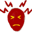

# Headache  
> Can be caused by multiple things. Produces pain.  
  

<b>Base Value: </b> 0 
  

<b>Value Range: </b> 0 ~ 600 
  

<b>Base Rate: </b> -1 / /TP 
  
## Statuses  

<table><tr style="height:2em;"><td style="background-color:#F0F0F0;text-align:center;width:180px;font-size:1.4em;font-weight:bold;vertical-align:middle;">
1 ～ 150

0% ～ 25%
</td><td colspan=2 style="font-size:1.1em;vertical-align:middle;background-color:#F9F9F9;">
<b>

Mild Headache</b>

&nbsp;&nbsp;I have a bit of a headache
</td></tr><tr><td colspan=2><b>Effect：</b>[

[Pain](Pain.md)](Pain.md)<b>+100</b></td></tr><tr><td colspan=2></td></tr><tr style="height:2em;"><td style="background-color:#F0F0F0;text-align:center;width:180px;font-size:1.4em;font-weight:bold;vertical-align:middle;">
151 ～ 299

25% ～ 49%
</td><td colspan=2 style="font-size:1.1em;vertical-align:middle;background-color:#F9F9F9;">
<b>

Headache</b>

&nbsp;&nbsp;My head hurts.
</td></tr><tr><td colspan=2><b>Effect：</b>[

[Pain](Pain.md)](Pain.md)<b>+200</b></td></tr><tr><td colspan=2></td></tr><tr style="height:2em;"><td style="background-color:#F0F0F0;text-align:center;width:180px;font-size:1.4em;font-weight:bold;vertical-align:middle;">
300 ～ 600

50% ～ 100%
</td><td colspan=2 style="font-size:1.1em;vertical-align:middle;background-color:#F9F9F9;">
<b>

Severe Headache</b>

&nbsp;&nbsp;My head is killing me!
</td></tr><tr><td colspan=2><b>Effect：</b>[

[Pain](Pain.md)](Pain.md)<b>+500</b></td></tr><tr><td colspan=2></td></tr></table>
  
## Related Cards  
[Camp Fever](BacteriaTyphus.md)  |  [Parasite Malaria](ParasiteMalaria.md)  |  [Bee Stings](BeeStings.md)  |  [Quinine](Quinine.md)  

