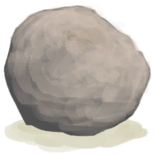
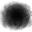

# High Chamber  
> "A proper cave  
  

<a href="HighChamber.md" style="color:black">High Chamber</a>

<a href="MidChamber.md" style="color:black">Medium Chamber</a>

  
  
<table class="table table-bordered" data-toggle="table"  data-show-header="false"><thead style="display:none"><tr ><th  style="width:50%;text-align:left;vertical-align:top;"  >title</th><th  style="width:50%;text-align:left;vertical-align:top;"  data-sortable="true"  ></th></tr></thead><tr ><td  style="width:50%;text-align:left;vertical-align:top;"  >** Unique On Board **  **Environment：**[High Chamber(Environment)](Env_HighChamber.md)  **Tag：**	[“Indoors”](tag_EnvIndoors.md), [“Cave System”](tag_EnvCaveSystem.md)  ** Effect: ** [

[Comfort](Comfort.md)](Comfort.md)<b>-500</b>  ** EnvironmentEffect: ** [

[Rain Value](RainValue.md)](RainValue.md)<b>-5</b> [

[Heat Insulation](InsulationHeat.md)](InsulationHeat.md)<b>+6</b> [

[Sun Protection](SunProtection.md)](SunProtection.md)<b>+6</b> [

[Sun Strength](SunStrength.md)](SunStrength.md)<b>-6</b> [

[Sheltered](Sheltered.md)](Sheltered.md)<b>+1</b> [IsNight](IsNight.md)<b>+1</b>  ** WeightCapacity： **30000  ** Improvements: ** [Stitched-Hide Floor](Imp_StitchedHideFloor.md) , [White Washed Walls](Imp_WhiteWashedWalls.md) , [Sea Trophy](Imp_SeaTrophy.md) , [Home Sign](Imp_HomeSign.md)</td><td  style="width:50%;text-align:left;vertical-align:top;"  ></td></tr></tbody></table>  
  
## Exploration  
<table class="table table-bordered" data-toggle="table"  ><thead style=""><tr ><th  style="text-align:left;vertical-align:top;"  >Progress</th><th  style="text-align:left;vertical-align:top;"  >Target</th></tr></thead><tr ><td  style="text-align:left;vertical-align:top;"  >50%</td><td  style="text-align:left;vertical-align:top;"  >[Copper Vein(High Chamber)](CopperVein.md)</td></tr><tr ><td  style="text-align:left;vertical-align:top;"  >100%</td><td  style="text-align:left;vertical-align:top;"  >[Shaft(High Chamber)](ShaftHighChamberToMidChamber.md)</td></tr></tbody></table>  
  
## Action  

<table><tr><td rowspan="2" style="width:200px;text-align:center;font-size:1.3em;font-weight:bold">

Explore

15m

</td><td></td></tr><tr><td></td></tr><tr><td colspan="2"><b>Require：</b>[

[Light](Light.md)](Light.md): <b>5-100</b></td></tr><tr><td colspan="2"><b>StatChange：</b>[

[Filth](Filth.md)](Filth.md)<b>+2</b></td></tr><tr><td colspan="2">

<table style="margin-bottom:3px;"><tr><td rowspan=2 style="text-align:center" width="80px">
Base Weight

10
</td><td style="font-size:0.6em;line-height:0.6em;font-weight:bold">Stone</td></tr><tr><td>[

[Stone](Stone.md)](Stone.md)(<b>+1</b>)</td></tr></table>

<table style="margin-bottom:3px;"><tr><td rowspan=2 style="text-align:center" width="80px">
Base Weight

3
</td><td style="font-size:0.6em;line-height:0.6em;font-weight:bold">Geode❗3 limit</td></tr><tr><td>[

[Geode](Geode.md)](Geode.md)(<b>+1</b>)</td></tr></table>

<table style="margin-bottom:3px;"><tr><td rowspan=2 style="text-align:center" width="80px">
Base Weight

1
</td><td style="font-size:0.6em;line-height:0.6em;font-weight:bold">Flint❗4 limit</td></tr><tr><td>[

[Flint](Flint.md)](Flint.md)(<b>+1</b>)</td></tr></table>

<table style="margin-bottom:3px;"><tr><td rowspan=2 style="text-align:center" width="80px">
Base Weight

1
</td><td style="font-size:0.6em;line-height:0.6em;font-weight:bold">Flint Slab❗1 limit</td></tr><tr><td>[

[Flint Slab](FlintSlab.md)](FlintSlab.md)(<b>+1</b>)</td></tr></table>

</td></tr></table>
  
  
  
## Drag With  

<table style="margin-bottom:0px;"><tr><td style="width:40%;text-align:left; background-color:#FEFEFE"><b>With：</b>[

[Broom](Broom.md)](Broom.md)</td><td style="width:40%;font-size:1em;font-weight:bold;background-color:#FEFEFE">Clean (30m) [“HandAction(Group)”](HandAction.md)</td></tr><tr><td colspan="2"><b>Require：</b>[

[Light](Light.md)](Light.md): <b>5-100</b></td></tr><tr style="background-color:#FFFFFF"><td style=""><b>Receiving：</b>Usage  <b>-1(-2.5%)</b></td><td style=""><b>Self：</b>Filthiness

  <b>-250(-25%)</b></td></tr><tr><td colspan="2"><b>StatChange：</b>[

[Stress](Stress.md)](Stress.md)<b>-10</b>, [

[Morale](Morale.md)](Morale.md)<b>+5</b></td></tr></table>
  
  
## Durability   

<table style="margin-bottom:0px;"><tr><td style="width:30%;text-align:left; background-color:#FEFEFE;font-size:1.3em;font-weight:bold;">

Filthiness</td><td style="font-size:1em;background-color:#FEFEFE">Starting：1000 , Max：1000 +3/TP , Duration ：3d11h20m</td></tr><tr style="background-color:#FFFFFF"><td colspan=2></td></tr></table>
  
## Passive Effects  
<table class="table table-bordered" data-toggle="table"  ><thead style=""><tr ><th  style="text-align:left;vertical-align:top;"  >Name</th><th  style="text-align:left;vertical-align:top;"  >Condition</th><th  style="text-align:left;vertical-align:top;"  data-sortable="true"  >Change(Each TP)</th><th  style="text-align:left;vertical-align:top;"  >Status</th></tr></thead><tr ><td  style="text-align:left;vertical-align:top;"  >Minimal Filth</td><td  style="text-align:left;vertical-align:top;"  >** Require Durability：** Filthiness

: <b>100～250(10%～25%)</b></td><td  style="text-align:left;vertical-align:top;"  ></td><td  style="text-align:left;vertical-align:top;"  >[

[Discomfort](Discomfort.md)](Discomfort.md)<b>+175</b></td></tr><tr ><td  style="text-align:left;vertical-align:top;"  >Low Filth</td><td  style="text-align:left;vertical-align:top;"  >** Require Durability：** Filthiness

: <b>251～500(25.1%～50%)</b></td><td  style="text-align:left;vertical-align:top;"  ></td><td  style="text-align:left;vertical-align:top;"  >[

[Discomfort](Discomfort.md)](Discomfort.md)<b>+375</b></td></tr><tr ><td  style="text-align:left;vertical-align:top;"  >Moderate Filth</td><td  style="text-align:left;vertical-align:top;"  >** Require Durability：** Filthiness

: <b>501～750(50.1%～75%)</b></td><td  style="text-align:left;vertical-align:top;"  ></td><td  style="text-align:left;vertical-align:top;"  >[

[Discomfort](Discomfort.md)](Discomfort.md)<b>+625</b></td></tr><tr ><td  style="text-align:left;vertical-align:top;"  >Extreme Filth</td><td  style="text-align:left;vertical-align:top;"  >** Require Durability：** Filthiness

: <b>751～1000(75.1%～100%)</b></td><td  style="text-align:left;vertical-align:top;"  ></td><td  style="text-align:left;vertical-align:top;"  >[

[Discomfort](Discomfort.md)](Discomfort.md)<b>+875</b></td></tr></tbody></table>  
  

