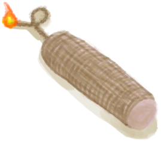

# Narrow Passage  
> "This seems to connect to another chamber  
  
<table class="table table-bordered" data-toggle="table"  data-show-header="false"><thead style="display:none"><tr ><th  style="width:50%;text-align:left;vertical-align:top;"  >title</th><th  style="width:50%;text-align:left;vertical-align:top;"  ></th></tr></thead><tr ><td  style="width:50%;text-align:left;vertical-align:top;"  >** Cannot Be Trashed **  **Environment：**[Tunnel(Environment)](Env_Tunnel.md)</td><td  style="width:50%;text-align:left;vertical-align:top;"  >

<a href="HighChamberEntranceClosed.md" style="color:black">Narrow Passage</a>

</td></tr></tbody></table>  
  
## Drag With  

<table style="margin-bottom:0px;"><tr><td style="width:40%;text-align:left; background-color:#FEFEFE"><b>With：</b>[“Hammer”](tag_Hammer.md)</td><td style="width:40%;font-size:1em;font-weight:bold;background-color:#FEFEFE">Dig (30m) [“HandAction(Group)”](HandAction.md)</td></tr><tr><td colspan="2"><b>Require：</b>[

[Light](Light.md)](Light.md): <b>10-100</b></td></tr><tr style="background-color:#FFFFFF"><td style=""><b>Receiving：</b></td><td style=""><b>Self：</b>Progress  <b>+1(5%)</b></td></tr><tr><td colspan="2"><b>StatChange：</b>[

[Stamina](Stamina.md)](Stamina.md)<b>-5</b>, [

[Hand Damage](HandDamage.md)](HandDamage.md)<b>+50</b></td></tr><tr><td colspan="2">[

[Stone](Stone.md)](Stone.md)(<b>+0～+3</b>), [

[Heavy Stone](StoneHeavy.md)](StoneHeavy.md)(<b>+0～+1</b>)</td></tr></table>
  

<table style="margin-bottom:0px;"><tr><td style="width:40%;text-align:left; background-color:#FEFEFE"><b>With：</b>[

[Dynamite(On)](DynamiteOn.md)](DynamiteOn.md)</td><td style="width:40%;font-size:1em;font-weight:bold;background-color:#FEFEFE">Boom!  </td></tr><tr style="background-color:#FFFFFF"><td style=""><b>Receiving：</b>→Dismiss</td><td style=""><b>Self：</b>Progress  <b>+100(500%)</b></td></tr><tr><td colspan="2">[

[Stone](Stone.md)](Stone.md)(<b>+3～+6</b>)</td></tr></table>
  
  
## Durability   

<table style="margin-bottom:0px;"><tr><td style="width:30%;text-align:left; background-color:#FEFEFE;font-size:1.3em;font-weight:bold;">Progress</td><td style="font-size:1em;background-color:#FEFEFE">Starting：0 , Max：20 -</td></tr><tr style="background-color:#FFFFFF"><td colspan=2>** On Full： ** Self: → [

[Narrow Passage](HighChamberEntrance.md)](HighChamberEntrance.md)</td></tr></table>
  

