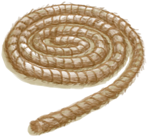

# Hole  
> "That's one ugly drop. There seems to be something down there  
  
<table class="table table-bordered" data-toggle="table"  data-show-header="false"><thead style="display:none"><tr ><th  style="width:50%;text-align:left;vertical-align:top;"  >title</th><th  style="width:50%;text-align:left;vertical-align:top;"  ></th></tr></thead><tr ><td  style="width:50%;text-align:left;vertical-align:top;"  >** Unique On Board **  **Environment：**[Western Highlands(Environment)](Env_HighlandsWestern.md)  <b>Blocked By ：</b> [

[Hole](HighlandHoleEntrance.md)](HighlandHoleEntrance.md)</td><td  style="width:50%;text-align:left;vertical-align:top;"  >

<a href="HighlandHoleNoRope.md" style="color:black">Hole</a>

</td></tr></tbody></table>  
  
## Got From  

探索

[Western Highlands](HighlandsWestern.md)

  
  
## Drag With  

<table style="margin-bottom:0px;"><tr><td style="width:40%;text-align:left; background-color:#FEFEFE"><b>With：</b>[

[Rope](Rope.md)](Rope.md)</td><td style="width:40%;font-size:1em;font-weight:bold;background-color:#FEFEFE">Tie Rope (15m) </td></tr><tr style="background-color:#FFFFFF"><td style=""><b>Receiving：</b>→Dismiss</td><td style=""><b>Self：</b>Progress  <b>+1(33.33%)</b></td></tr></table>
  
  
## Durability   

<table style="margin-bottom:0px;"><tr><td style="width:30%;text-align:left; background-color:#FEFEFE;font-size:1.3em;font-weight:bold;">Progress</td><td style="font-size:1em;background-color:#FEFEFE">Starting：0 , Max：3 -</td></tr><tr style="background-color:#FFFFFF"><td colspan=2>** On Full： ** Self: → [

[Hole](HighlandHoleEntrance.md)](HighlandHoleEntrance.md)</td></tr></table>
  

