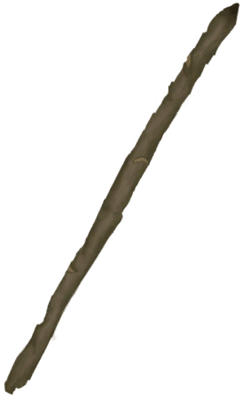
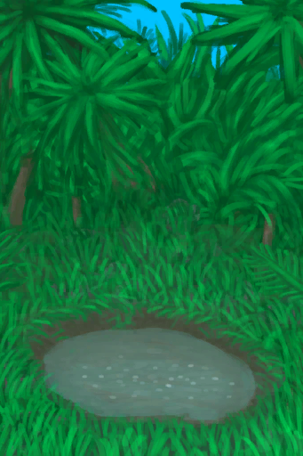
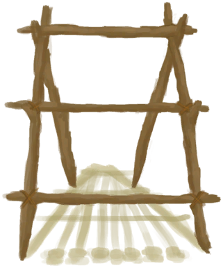
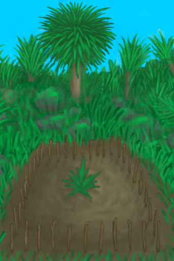
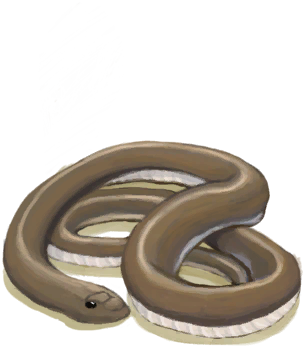
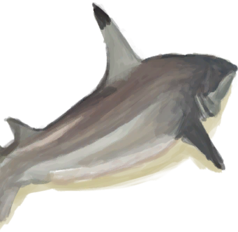

## Hunter  

<table style="margin-bottom:0px;"><tr><td rowspan=2 style="width:160px"></td><td style="font-size:1.8em"><b>Hunter</b></td><td style="width:50%">UnlockPrice：Free</td></tr><tr><td  colspan=2 style=""><i>"You have arrived to the island on your own</i></td><tr><td colspan=2><b>Environment：</b>[

[Bay](Bay.md)](Bay.md)<td colspan=1><b>Weather：</b>[

[Clear](TropicalIsland_ClearStart.md)](TropicalIsland_ClearStart.md)</tr></tr><tr><td colspan=3><b>Perks：</b>

[Islander](Pk_2_Islander.md)

[Dark Skin](Pk_3_DarkSkin.md)

[Optimist](Pk_4_Optimist.md)

[Loner](Pk_4_Loner.md)

[Climber](Pk_5_Climber.md)

[Swimmer](Pk_5_Swimmer.md)

[Knapper](Pk_5_Knapper.md)

[Drummer](Pk_5_Drummer.md)

[Sailor](Pk_4_Sailor.md)

[Spearfisher](Pk_5_SpearFisher.md)

[Spearfighter](Pk_5_SpearFighter.md)

[Stealth Master](Pk_5_StealthMaster.md)

[Immunized](Pk_4_Immunized.md)

[Strong Immune System](Pk_4_ImmuneSystemStrong.md)

[Bug Resistant](Pk_4_BugResistant.md)

[Rough Sleeper](Pk_4_RoughSleeper.md)

  
  
</tr><tr><td colspan=3><b>Clothes：</b> 

<a href="SatchelHunter.md" style="color:black">Satchel</a>

  
  
</tr><tr><td colspan=3><b>Starting Cards：</b> 

<a href="GourdBottle.md" style="color:black">Gourd Bottle</a>

<a href="LeafSKirt.md" style="color:black">Leaf Skirt</a>

<a href="SeashellNecklace.md" style="color:black">Seashell Necklace</a>

<a href="SatchelHunter.md" style="color:black">Satchel</a>

<a href="SagoFlour.md" style="color:black">Sago Flourx4</a>

  
  
</tr><tr><td colspan=3><b>初始蓝图：</b> 

<a href="Bp_FlintKnife.md" style="color:black">Flint Knife</a>

<a href="Bp_FlintSpear.md" style="color:black">Flint Spear</a>

<a href="Bp_FlintAxe.md" style="color:black">Flint Axe</a>

<a href="Bp_ObsidianSpear.md" style="color:black">Obsidian Spear</a>

<a href="Bp_FishingSpear.md" style="color:black">Fishing Spear</a>

<a href="Bp_Harpoon.md" style="color:black">Harpoon</a>

<a href="Bp_SeagullCharm.md" style="color:black">Seagull Charm</a>

<a href="Bp_CeremonialDagger.md" style="color:black">Ceremonial Dagger</a>

<a href="Bp_LizardDrum.md" style="color:black">Lizard Drum</a>

<a href="Bp_SharkHeadpiece.md" style="color:black">Shark Headpiece</a>

  
  
</tr></table>
    
  
## 目标  

<b>SURVIVAL BASICS</b>

<table style="margin-bottom:0px;"><tr><td rowSpan=3 style="width:50px;max-height:100px;text-align:center;vertical-align:top"></td><td colspan=2 >
<b>Explore the Bay</b>
<i>To find new locations and resources.</i></td></tr><tr style=""><td><b>Require：</b>[Exploration Bay](Exploration_Bay.md): <b>10</b> </td></tr><tr style=""><td ><b>Reward：</b>[

[Stress](Stress.md)](Stress.md)<b>-48</b></td></tr><tr style="border-bottom:2px solid #CCC;height:1px;"></tr><tr><td rowSpan=3 style="width:50px;max-height:100px;text-align:center;vertical-align:top"></td><td colspan=2 >
<b>Sharpen a Stone</b>
<i>To use as a cutting tool.</i></td></tr><tr style=""><td><b>Require：</b>[

[Sharpened Stone](StoneSharpened.md)](StoneSharpened.md)x1 </td></tr><tr style=""><td ><b>Reward：</b>[

[Determination](Determination.md)](Determination.md)<b>+50</b>&nbsp;&nbsp;&nbsp;&nbsp;[

[Stress](Stress.md)](Stress.md)<b>-48</b></td></tr><tr style="border-bottom:2px solid #CCC;height:1px;"></tr><tr><td rowSpan=3 style="width:50px;max-height:100px;text-align:center;vertical-align:top"></td><td colspan=2 >
<b>Eat and Drink from a Coconut</b>
<i>Drill a hole to drink or you'll spill the water.</i></td></tr><tr style=""><td><b>Require：</b>Eat [

[Coconut Meat](CoconutMeat.md)](CoconutMeat.md)&nbsp;&nbsp;&nbsp;&nbsp;Drink [

[Coconut Water](LQ_CoconutWater.md)](LQ_CoconutWater.md) </td></tr><tr style=""><td ><b>Reward：</b>[

[Determination](Determination.md)](Determination.md)<b>+50</b>&nbsp;&nbsp;&nbsp;&nbsp;[

[Stress](Stress.md)](Stress.md)<b>-48</b></td></tr><tr style="border-bottom:2px solid #CCC;height:1px;"></tr></table>
 
<b>STARTING CAMP</b>

<table style="margin-bottom:0px;"><tr><td rowSpan=3 style="width:50px;max-height:100px;text-align:center;vertical-align:top"></td><td colspan=2 >
<b>Make a Campfire</b>
<i>To get light at night and a place to cook your food.</i></td></tr><tr style=""><td><b>Require：</b>[

[Campfire(Off)](CampfireExtinguished.md)](CampfireExtinguished.md)x1 </td></tr><tr style=""><td ><b>Reward：</b>[

[Determination](Determination.md)](Determination.md)<b>+100</b>&nbsp;&nbsp;&nbsp;&nbsp;[

[Stress](Stress.md)](Stress.md)<b>-48</b></td></tr><tr style="border-bottom:2px solid #CCC;height:1px;"></tr><tr><td rowSpan=3 style="width:50px;max-height:100px;text-align:center;vertical-align:top"></td><td colspan=2 >
<b>Craft a Stone Axe</b>
<i>To get wood more reliably and chop down trees.</i></td></tr><tr style=""><td><b>Require：</b>[

[Stone Axe](StoneAxe.md)](StoneAxe.md)x1 </td></tr><tr style=""><td ><b>Reward：</b>[

[Determination](Determination.md)](Determination.md)<b>+100</b>&nbsp;&nbsp;&nbsp;&nbsp;[

[Stress](Stress.md)](Stress.md)<b>-48</b></td></tr><tr style="border-bottom:2px solid #CCC;height:1px;"></tr><tr><td rowSpan=3 style="width:50px;max-height:100px;text-align:center;vertical-align:top"></td><td colspan=2 >
<b>Craft a Rustic Spear</b>
<i>To catch fish and hunt.</i></td></tr><tr style=""><td><b>Require：</b>[

[Rustic Spear](SpearRustic.md)](SpearRustic.md)x1 </td></tr><tr style=""><td ><b>Reward：</b>[

[Stress](Stress.md)](Stress.md)<b>-48</b></td></tr><tr style="border-bottom:2px solid #CCC;height:1px;"></tr></table>
 
<b>MOVING FORWARD</b>

<table style="margin-bottom:0px;"><tr><td rowSpan=3 style="width:50px;max-height:100px;text-align:center;vertical-align:top"></td><td colspan=2 >
<b>Cook a Fish</b>
<i>To have a proper meal by the fire. </i></td></tr><tr style=""><td><b>Require：</b>[

[Cooked Bonefish](BonefishCooked.md)](BonefishCooked.md)x1&nbsp;&nbsp;&nbsp;&nbsp;[

[Cooked Goatfish](GoatfishCooked.md)](GoatfishCooked.md)x1&nbsp;&nbsp;&nbsp;&nbsp;[

[Cooked Grouper](GrouperMeatCooked.md)](GrouperMeatCooked.md)x1&nbsp;&nbsp;&nbsp;&nbsp;[

[Cooked Parrot Fish](ParrotFishCooked.md)](ParrotFishCooked.md)x1 </td></tr><tr style=""><td ><b>Reward：</b>[

[Determination](Determination.md)](Determination.md)<b>+100</b>&nbsp;&nbsp;&nbsp;&nbsp;[

[Stress](Stress.md)](Stress.md)<b>-48</b></td></tr><tr style="border-bottom:2px solid #CCC;height:1px;"></tr><tr><td rowSpan=3 style="width:50px;max-height:100px;text-align:center;vertical-align:top"></td><td colspan=2 >
<b>Build a Shelter</b>
<i>To rest better during the night. </i></td></tr><tr style=""><td><b>Require：</b>[

[Shelter](Shelter.md)](Shelter.md)x1 </td></tr><tr style=""><td ><b>Reward：</b>[

[Determination](Determination.md)](Determination.md)<b>+250</b>&nbsp;&nbsp;&nbsp;&nbsp;[

[Stress](Stress.md)](Stress.md)<b>-48</b></td></tr><tr style="border-bottom:2px solid #CCC;height:1px;"></tr><tr><td rowSpan=3 style="width:50px;max-height:100px;text-align:center;vertical-align:top"></td><td colspan=2 >
<b>Find a Puddle</b>
<i>To use as an emergency water source.</i></td></tr><tr style=""><td><b>Require：</b>[

[Dry Puddle(Wetlands)](Puddle.md)](Puddle.md)x1 </td></tr><tr style=""><td ><b>Reward：</b>[

[Determination](Determination.md)](Determination.md)<b>+250</b>&nbsp;&nbsp;&nbsp;&nbsp;[

[Stress](Stress.md)](Stress.md)<b>-48</b></td></tr><tr style="border-bottom:2px solid #CCC;height:1px;"></tr></table>
 
<b>SETTING UP A BASE</b>

<table style="margin-bottom:0px;"><tr><td rowSpan=3 style="width:50px;max-height:100px;text-align:center;vertical-align:top"></td><td colspan=2 >
<b>Build a Loom</b>
<i>To make your own Cloth.</i></td></tr><tr style=""><td><b>Require：</b>[

[Loom (Empty)(Empty)](LoomEmpty.md)](LoomEmpty.md)x1 </td></tr><tr style=""><td ><b>Reward：</b>[

[Determination](Determination.md)](Determination.md)<b>+500</b>&nbsp;&nbsp;&nbsp;&nbsp;[

[Stress](Stress.md)](Stress.md)<b>-48</b></td></tr><tr style="border-bottom:2px solid #CCC;height:1px;"></tr><tr><td rowSpan=3 style="width:50px;max-height:100px;text-align:center;vertical-align:top"></td><td colspan=2 >
<b>Build a Kiln</b>
<i>To fire Clay Vases and other containers.</i></td></tr><tr style=""><td><b>Require：</b>[

[Kiln(Off)](KilnExtinguished.md)](KilnExtinguished.md)x1 </td></tr><tr style=""><td ><b>Reward：</b>[

[Determination](Determination.md)](Determination.md)<b>+500</b>&nbsp;&nbsp;&nbsp;&nbsp;[

[Stress](Stress.md)](Stress.md)<b>-48</b></td></tr><tr style="border-bottom:2px solid #CCC;height:1px;"></tr><tr><td rowSpan=3 style="width:50px;max-height:100px;text-align:center;vertical-align:top"></td><td colspan=2 >
<b>Build a Shed or Mud Hut</b>
<i>To protect yourself from storms and the elements.</i></td></tr><tr style=""><td><b>Require：</b>[

[Shed](ShedEntrance.md)](ShedEntrance.md)x1&nbsp;&nbsp;&nbsp;&nbsp;[

[Mud Hut](MudHutEntrance.md)](MudHutEntrance.md)x1 </td></tr><tr style=""><td ><b>Reward：</b>[

[Stress](Stress.md)](Stress.md)<b>-48</b></td></tr><tr style="border-bottom:2px solid #CCC;height:1px;"></tr></table>
 
<b>Preparations</b>

<table style="margin-bottom:0px;"><tr><td rowSpan=3 style="width:50px;max-height:100px;text-align:center;vertical-align:top"></td><td colspan=2 >
<b>Master the three arts</b>
<i>So you can be ready to face your destiny.</i></td></tr><tr style=""></tr><tr style=""><td ><b>Reward：</b>[

[Stress](Stress.md)](Stress.md)<b>-48</b></td></tr><tr style="border-bottom:2px solid #CCC;height:1px;"></tr><tr><td rowSpan=3 style="width:50px;max-height:100px;text-align:center;vertical-align:top"></td><td colspan=2 >
<b>Shaman</b>
</td></tr><tr style=""><td>
<table style="margin-bottom:0px;"><tr><td rowSpan=3 style="width:50px;max-height:100px;text-align:center;vertical-align:top"></td><td colspan=2 >
<b>Craft Medical Supplies</b>
<i>"You need: <b>Ash Dressing</b></i></td></tr><tr style=""><td><b>Require：</b>[

[Improvised Tourniquet](TourniquetRustic.md)](TourniquetRustic.md)x1&nbsp;&nbsp;&nbsp;&nbsp;[

[Tourniquet](Tourniquet.md)](Tourniquet.md)x1&nbsp;&nbsp;&nbsp;&nbsp;[

[Splint](Splint.md)](Splint.md)x1&nbsp;&nbsp;&nbsp;&nbsp;[

[Ash Dressing](AshDressing.md)](AshDressing.md)x1&nbsp;&nbsp;&nbsp;&nbsp;[

[Threaded Needle](BoneNeedleThreaded.md)](BoneNeedleThreaded.md)x1 </td></tr><tr style=""><td ><b>Reward：</b>[

[Stress](Stress.md)](Stress.md)<b>-48</b></td></tr><tr style="border-bottom:2px solid #CCC;height:1px;"></tr><tr><td rowSpan=3 style="width:50px;max-height:100px;text-align:center;vertical-align:top"></td><td colspan=2 >
<b>Plant Medicinal Herbs</b>
<i>"You need: <b>Kava</b></i></td></tr><tr style=""><td><b>Require：</b>[

[Kava Crop Plot](CropPlotKava.md)](CropPlotKava.md)x1&nbsp;&nbsp;&nbsp;&nbsp;[

[Spider Lily Crop Plot](CropPlotSpiderLily.md)](CropPlotSpiderLily.md)x1&nbsp;&nbsp;&nbsp;&nbsp;[

[Aloe Vera Crop Plot](CropPlotAloeVera.md)](CropPlotAloeVera.md)x1 </td></tr><tr style=""><td ><b>Reward：</b>[

[Stress](Stress.md)](Stress.md)<b>-48</b></td></tr><tr style="border-bottom:2px solid #CCC;height:1px;"></tr><tr><td rowSpan=3 style="width:50px;max-height:100px;text-align:center;vertical-align:top"></td><td colspan=2 >
<b>Craft a Lizard Drum</b>
<i>To summon the Enemy.</i></td></tr><tr style=""><td><b>Require：</b>[

[Lizard Drum](LizardDrum.md)](LizardDrum.md)x1 </td></tr><tr style=""><td ><b>Reward：</b>[

[Stress](Stress.md)](Stress.md)<b>-48</b></td></tr><tr style="border-bottom:2px solid #CCC;height:1px;"></tr></table>
  </td></tr><tr style=""><td ><b>Reward：</b>[

[Stress](Stress.md)](Stress.md)<b>-48</b></td></tr><tr style="border-bottom:2px solid #CCC;height:1px;"></tr><tr><td rowSpan=3 style="width:50px;max-height:100px;text-align:center;vertical-align:top"></td><td colspan=2 >
<b>Artisan</b>
</td></tr><tr style=""><td>
<table style="margin-bottom:0px;"><tr><td rowSpan=3 style="width:50px;max-height:100px;text-align:center;vertical-align:top"></td><td colspan=2 >
<b>Craft Flint Tools</b>
<i>"You need: a <b>Flint Knife</b></i></td></tr><tr style=""><td><b>Require：</b>[

[Flint Knife](KnifeFlint.md)](KnifeFlint.md)x1&nbsp;&nbsp;&nbsp;&nbsp;[

[Flint Spear](SpearFlint.md)](SpearFlint.md)x1&nbsp;&nbsp;&nbsp;&nbsp;[

[Flint Axe](AxeFlint.md)](AxeFlint.md)x1 </td></tr><tr style=""><td ><b>Reward：</b>[

[Stress](Stress.md)](Stress.md)<b>-48</b></td></tr><tr style="border-bottom:2px solid #CCC;height:1px;"></tr><tr><td rowSpan=3 style="width:50px;max-height:100px;text-align:center;vertical-align:top"></td><td colspan=2 >
<b>Craft Fighting Gear</b>
<i>"You Need: <b>Leather Pants</b></i></td></tr><tr style=""><td><b>Require：</b>[

[Obsidian Spear](SpearObsidian.md)](SpearObsidian.md)x1&nbsp;&nbsp;&nbsp;&nbsp;[

[Shield](Shield.md)](Shield.md)x1&nbsp;&nbsp;&nbsp;&nbsp;[

[Leather Pants](LeatherPants.md)](LeatherPants.md)x1 </td></tr><tr style=""><td ><b>Reward：</b>[

[Stress](Stress.md)](Stress.md)<b>-48</b></td></tr><tr style="border-bottom:2px solid #CCC;height:1px;"></tr><tr><td rowSpan=3 style="width:50px;max-height:100px;text-align:center;vertical-align:top"></td><td colspan=2 >
<b>Craft a Ceremonial Dagger</b>
<i>To tempt the Enemy.</i></td></tr><tr style=""><td><b>Require：</b>[

[Ceremonial Dagger](CeremonialDagger.md)](CeremonialDagger.md)x1 </td></tr><tr style=""><td ><b>Reward：</b>[

[Stress](Stress.md)](Stress.md)<b>-48</b></td></tr><tr style="border-bottom:2px solid #CCC;height:1px;"></tr></table>
  </td></tr><tr style=""><td ><b>Reward：</b>[

[Stress](Stress.md)](Stress.md)<b>-48</b></td></tr><tr style="border-bottom:2px solid #CCC;height:1px;"></tr><tr><td rowSpan=3 style="width:50px;max-height:100px;text-align:center;vertical-align:top"></td><td colspan=2 >
<b>Warrior</b>
</td></tr><tr style=""><td>
<table style="margin-bottom:0px;"><tr><td rowSpan=3 style="width:50px;max-height:100px;text-align:center;vertical-align:top"></td><td colspan=2 >
<b>Master the Spear Skill</b>
<i>So there is no room for doubt.</i></td></tr><tr style=""><td><b>Require：</b>[

[Spear Fighting(Skill)](Skill_SpearFighting.md)](Skill_SpearFighting.md): <b>150</b> </td></tr><tr style=""><td ><b>Reward：</b>[

[Stress](Stress.md)](Stress.md)<b>-48</b>&nbsp;&nbsp;&nbsp;&nbsp;[

[Determination](Determination.md)](Determination.md)<b>+250</b></td></tr><tr style="border-bottom:2px solid #CCC;height:1px;"></tr><tr><td rowSpan=3 style="width:50px;max-height:100px;text-align:center;vertical-align:top"></td><td colspan=2 >
<b>Hunt the Beasts of the Island</b>
<i>To better understand its spirit.</i></td></tr><tr style=""><td>
<table style="margin-bottom:0px;"><tr><td rowSpan=3 style="width:50px;max-height:100px;text-align:center;vertical-align:top"></td><td colspan=2 >
<b>Hunt the beasts of the Island</b>
<i>So you can understand its spirit.</i></td></tr><tr style=""></tr><tr style=""><td ><b>Reward：</b>[

[Stress](Stress.md)](Stress.md)<b>-48</b></td></tr><tr style="border-bottom:2px solid #CCC;height:1px;"></tr><tr><td rowSpan=3 style="width:50px;max-height:100px;text-align:center;vertical-align:top"></td><td colspan=2 >
<b>Seagull</b>
</td></tr><tr style=""><td><b>Require：</b>[

[Dead Seagull](SeagullDead.md)](SeagullDead.md)x1 </td></tr><tr style=""><td ><b>Reward：</b>[

[Stress](Stress.md)](Stress.md)<b>-48</b></td></tr><tr style="border-bottom:2px solid #CCC;height:1px;"></tr><tr><td rowSpan=3 style="width:50px;max-height:100px;text-align:center;vertical-align:top"></td><td colspan=2 >
<b>Sea Krait</b>
</td></tr><tr style=""><td><b>Require：</b>[

[Dead Sea Krait](SeaKraitDead.md)](SeaKraitDead.md)x1 </td></tr><tr style=""><td ><b>Reward：</b>[

[Stress](Stress.md)](Stress.md)<b>-48</b></td></tr><tr style="border-bottom:2px solid #CCC;height:1px;"></tr><tr><td rowSpan=3 style="width:50px;max-height:100px;text-align:center;vertical-align:top"></td><td colspan=2 >
<b>Macaque</b>
</td></tr><tr style=""><td><b>Require：</b>[

[Macaque Carcass](MacaqueCarcass.md)](MacaqueCarcass.md)x1 </td></tr><tr style=""><td ><b>Reward：</b>[

[Stress](Stress.md)](Stress.md)<b>-48</b></td></tr><tr style="border-bottom:2px solid #CCC;height:1px;"></tr><tr><td rowSpan=3 style="width:50px;max-height:100px;text-align:center;vertical-align:top"></td><td colspan=2 >
<b>Partridge</b>
</td></tr><tr style=""><td><b>Require：</b>[

[Dead Partridge](PartridgeDead.md)](PartridgeDead.md)x1 </td></tr><tr style=""><td ><b>Reward：</b>[

[Stress](Stress.md)](Stress.md)<b>-48</b></td></tr><tr style="border-bottom:2px solid #CCC;height:1px;"></tr><tr><td rowSpan=3 style="width:50px;max-height:100px;text-align:center;vertical-align:top"></td><td colspan=2 >
<b>Boar</b>
</td></tr><tr style=""><td><b>Require：</b>[

[Boar Carcass](BoarCarcass.md)](BoarCarcass.md)x1 </td></tr><tr style=""><td ><b>Reward：</b>[

[Stress](Stress.md)](Stress.md)<b>-48</b></td></tr><tr style="border-bottom:2px solid #CCC;height:1px;"></tr><tr><td rowSpan=3 style="width:50px;max-height:100px;text-align:center;vertical-align:top"></td><td colspan=2 >
<b>Cobra</b>
</td></tr><tr style=""><td><b>Require：</b>[

[Dead Cobra](CobraDead.md)](CobraDead.md)x1 </td></tr><tr style=""><td ><b>Reward：</b>[

[Stress](Stress.md)](Stress.md)<b>-48</b></td></tr><tr style="border-bottom:2px solid #CCC;height:1px;"></tr><tr><td rowSpan=3 style="width:50px;max-height:100px;text-align:center;vertical-align:top"></td><td colspan=2 >
<b>Monitor</b>
</td></tr><tr style=""><td><b>Require：</b>[

[Lizard Carcass](MonitorCarcass.md)](MonitorCarcass.md)x1 </td></tr><tr style=""><td ><b>Reward：</b>[

[Stress](Stress.md)](Stress.md)<b>-48</b></td></tr><tr style="border-bottom:2px solid #CCC;height:1px;"></tr><tr><td rowSpan=3 style="width:50px;max-height:100px;text-align:center;vertical-align:top"></td><td colspan=2 >
<b>Goat</b>
</td></tr><tr style=""><td><b>Require：</b>[

[Goat Carcass](GoatCarcassMale.md)](GoatCarcassMale.md)x1&nbsp;&nbsp;&nbsp;&nbsp;[

[Goat Carcass](GoatCarcassFemale.md)](GoatCarcassFemale.md)x1 </td></tr><tr style=""><td ><b>Reward：</b>[

[Stress](Stress.md)](Stress.md)<b>-48</b></td></tr><tr style="border-bottom:2px solid #CCC;height:1px;"></tr><tr><td rowSpan=3 style="width:50px;max-height:100px;text-align:center;vertical-align:top"></td><td colspan=2 >
<b>Shark</b>
</td></tr><tr style=""><td><b>Require：</b>[

[Shark Carcass](SharkCarcass.md)](SharkCarcass.md)x1 </td></tr><tr style=""><td ><b>Reward：</b>[

[Stress](Stress.md)](Stress.md)<b>-48</b></td></tr><tr style="border-bottom:2px solid #CCC;height:1px;"></tr></table>
  </td></tr><tr style=""><td ><b>Reward：</b>[

[Stress](Stress.md)](Stress.md)<b>-48</b></td></tr><tr style="border-bottom:2px solid #CCC;height:1px;"></tr><tr><td rowSpan=3 style="width:50px;max-height:100px;text-align:center;vertical-align:top"></td><td colspan=2 >
<b>Craft a Shark Headpiece</b>
<i>To scare the Enemy.</i></td></tr><tr style=""><td><b>Require：</b>[

[Shark Headpiece](SharkHeadpiece.md)](SharkHeadpiece.md)x1 </td></tr><tr style=""><td ><b>Reward：</b>[

[Stress](Stress.md)](Stress.md)<b>-48</b></td></tr><tr style="border-bottom:2px solid #CCC;height:1px;"></tr></table>
  </td></tr><tr style=""><td ><b>Reward：</b>[

[Stress](Stress.md)](Stress.md)<b>-48</b></td></tr><tr style="border-bottom:2px solid #CCC;height:1px;"></tr></table>
 
<b>FACING DESTINY</b>

<table style="margin-bottom:0px;"><tr><td rowSpan=3 style="width:50px;max-height:100px;text-align:center;vertical-align:top"></td><td colspan=2 >
<b>Play the Secret Rythm</b>
<i>To summon your enemy.</i></td></tr><tr style=""><td><b>Require：</b>[

[Enemy Prescence](EnemyDefeated.md)](EnemyDefeated.md): <b>1</b> </td></tr><tr style=""><td ><b>Reward：</b>[

[Stress](Stress.md)](Stress.md)<b>-48</b></td></tr><tr style="border-bottom:2px solid #CCC;height:1px;"></tr><tr><td rowSpan=3 style="width:50px;max-height:100px;text-align:center;vertical-align:top"></td><td colspan=2 >
<b>Defeat the Enemy</b>
<i>To fulfill your destiny.</i></td></tr><tr style=""><td><b>Require：</b>[

[Enemy Prescence](EnemyDefeated.md)](EnemyDefeated.md): <b>2</b> </td></tr><tr style=""><td ><b>Reward：</b>[

[Stress](Stress.md)](Stress.md)<b>-48</b></td></tr><tr style="border-bottom:2px solid #CCC;height:1px;"></tr><tr><td rowSpan=3 style="width:50px;max-height:100px;text-align:center;vertical-align:top"></td><td colspan=2 >
<b>Escape from the Island</b>
</td></tr><tr style=""><td>
<table style="margin-bottom:0px;"><tr><td rowSpan=3 style="width:50px;max-height:100px;text-align:center;vertical-align:top"></td><td colspan=2 >
<b>Build a Raft</b>
<i>To escape the island and get back to civilization.</i></td></tr><tr style=""><td><b>Require：</b>[

[Raft](RaftEntrance.md)](RaftEntrance.md)x1 </td></tr><tr style="border-bottom:2px solid #CCC;height:1px;"></tr><tr><td rowSpan=3 style="width:50px;max-height:100px;text-align:center;vertical-align:top"></td><td colspan=2 >
<b>Return to Civilization</b>
<i>To finish this adventure.</i></td></tr><tr style=""><td><b>Require：</b>[

[Distance](Distance.md)](Distance.md): <b>2016</b> </td></tr><tr style="border-bottom:2px solid #CCC;height:1px;"></tr></table>
  </td></tr><tr style="border-bottom:2px solid #CCC;height:1px;"></tr><tr><td rowSpan=3 style="width:50px;max-height:100px;text-align:center;vertical-align:top"></td><td colspan=2 >
<b>Make the Island your Home</b>
</td></tr><tr style=""><td>
<table style="margin-bottom:0px;"><tr><td rowSpan=3 style="width:50px;max-height:100px;text-align:center;vertical-align:top"></td><td colspan=2 >
<b>Survive in the Island for 120 days</b>
<i>to become familiar with it.</i></td></tr><tr style=""><td><b>Require：</b>[Counter](Counter.md): <b>11520～999999</b> </td></tr><tr style="border-bottom:2px solid #CCC;height:1px;"></tr><tr><td rowSpan=3 style="width:50px;max-height:100px;text-align:center;vertical-align:top"></td><td colspan=2 >
<b>Reach Maximum Comfort</b>
<i>To turn your house into your home.</i></td></tr><tr style=""><td><b>Require：</b>[

[Comfort](Comfort.md)](Comfort.md): <b>1751～2500</b> </td></tr><tr style="border-bottom:2px solid #CCC;height:1px;"></tr></table>
  </td></tr><tr style="border-bottom:2px solid #CCC;height:1px;"></tr></table>
   

