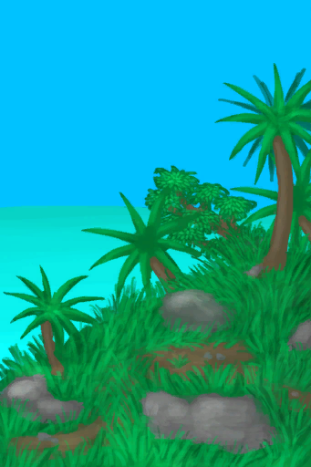

# Hunter's Proximity  
> The hunter is getting closer. Increases stress and alters your mind state.  
> "Perhaps a paranoid delusion  
  

<b>Base Value: </b> -288 
  

<b>Value Range: </b> -96 ~ 96 
  

<b>Base Rate: </b> -1 / /TP 
  

<b>Staleness: </b>Staleness multiplier 25% in 1d(stack:2) 
  
## Statuses  

<table><tr style="height:2em;"><td style="background-color:#F0F0F0;text-align:center;width:180px;font-size:1.4em;font-weight:bold;vertical-align:middle;">
1 ～ 24

1% ～ 25%
</td><td colspan=2 style="font-size:1.1em;vertical-align:middle;background-color:#F9F9F9;">
<b>

I'm being hunted</b>

&nbsp;&nbsp;Something's found my tracks...
</td></tr><tr><td colspan=2><b>Effect：</b>[

[Stress](Stress.md)](Stress.md)addition<b>+0.75</b></td></tr><tr><td colspan=2></td></tr><tr style="height:2em;"><td style="background-color:#F0F0F0;text-align:center;width:180px;font-size:1.4em;font-weight:bold;vertical-align:middle;">
25 ～ 48

26% ～ 50%
</td><td colspan=2 style="font-size:1.1em;vertical-align:middle;background-color:#F9F9F9;">
<b>

I'm being hunted</b>

&nbsp;&nbsp;I can feel it getting closer...
</td></tr><tr><td colspan=2><b>Effect：</b>[

[Stress](Stress.md)](Stress.md)addition<b>+1.5</b>, [

[Altered Mind State](MindState.md)](MindState.md)addition<b>+1</b></td></tr><tr><td colspan=2></td></tr><tr style="height:2em;"><td style="background-color:#F0F0F0;text-align:center;width:180px;font-size:1.4em;font-weight:bold;vertical-align:middle;">
49 ～ 72

51% ～ 75%
</td><td colspan=2 style="font-size:1.1em;vertical-align:middle;background-color:#F9F9F9;">
<b>

I'm being hunted</b>

&nbsp;&nbsp;"It's getting too close
</td></tr><tr><td colspan=2><b>Effect：</b>[

[Stress](Stress.md)](Stress.md)addition<b>+3</b>, [

[Altered Mind State](MindState.md)](MindState.md)addition<b>+0.5</b></td></tr><tr><td colspan=2></td></tr><tr style="height:2em;"><td style="background-color:#F0F0F0;text-align:center;width:180px;font-size:1.4em;font-weight:bold;vertical-align:middle;">
73 ～ 96

76% ～ 100%
</td><td colspan=2 style="font-size:1.1em;vertical-align:middle;background-color:#F9F9F9;">
<b>

I'm being hunted</b>

&nbsp;&nbsp;It's almost here! I need to move!
</td></tr><tr><td colspan=2><b>Effect：</b>[

[Stress](Stress.md)](Stress.md)addition<b>+6</b>, [

[Altered Mind State](MindState.md)](MindState.md)addition<b>+1</b></td></tr><tr><td colspan=2></td></tr></table>
  
## Related Cards  
[Hunter's Insight](HunterInsight.md)  
## Change By  
<table class="table table-bordered" data-toggle="table"  ><thead style=""><tr ><th  style="text-align:left;vertical-align:top;"  >From</th><th  style="text-align:left;vertical-align:top;"  >Operation</th><th  style="text-align:left;vertical-align:top;"  data-sortable="true"  >Value</th></tr></thead><tr ><td  style="text-align:left;vertical-align:top;"  >[

[Jungle(Environment)](Env_DeepJungle.md)](Env_DeepJungle.md)</td><td  style="text-align:left;vertical-align:top;"  >Passive Effects</td><td  style="text-align:left;vertical-align:top;"  >-0.5</td></tr><tr ><td  style="text-align:left;vertical-align:top;"  >[

[Jungle(Environment)](Env_Jungle.md)](Env_Jungle.md)</td><td  style="text-align:left;vertical-align:top;"  >Passive Effects</td><td  style="text-align:left;vertical-align:top;"  >-0.5</td></tr><tr ><td  style="text-align:left;vertical-align:top;"  >[

[Mangrove Forest(Environment)](Env_Mangroves.md)](Env_Mangroves.md)</td><td  style="text-align:left;vertical-align:top;"  >Passive Effects</td><td  style="text-align:left;vertical-align:top;"  >-0.5</td></tr><tr ><td  style="text-align:left;vertical-align:top;"  >[

[Wetlands(Environment)](Env_Wetlands.md)](Env_Wetlands.md)</td><td  style="text-align:left;vertical-align:top;"  >Passive Effects</td><td  style="text-align:left;vertical-align:top;"  >-0.5</td></tr><tr ><td  style="text-align:left;vertical-align:top;"  >[

[To Volcano](Path_AcidLakeToVolcano.md)](Path_AcidLakeToVolcano.md)</td><td  style="text-align:left;vertical-align:top;"  >Go</td><td  style="text-align:left;vertical-align:top;"  >-6</td></tr><tr ><td  style="text-align:left;vertical-align:top;"  >[

[To Jungle Path(Bay)](Path_BayToJungle.md)](Path_BayToJungle.md)</td><td  style="text-align:left;vertical-align:top;"  >Go</td><td  style="text-align:left;vertical-align:top;"  >-6</td></tr><tr ><td  style="text-align:left;vertical-align:top;"  >[

[To Rocks(Beach)](Path_BeachToRocks.md)](Path_BeachToRocks.md)</td><td  style="text-align:left;vertical-align:top;"  >Go</td><td  style="text-align:left;vertical-align:top;"  >-6</td></tr><tr ><td  style="text-align:left;vertical-align:top;"  >[

[To Jungle Highlands(Jungle)](Path_DeepJungleToJungleHighlands.md)](Path_DeepJungleToJungleHighlands.md)</td><td  style="text-align:left;vertical-align:top;"  >Go</td><td  style="text-align:left;vertical-align:top;"  >-6</td></tr><tr ><td  style="text-align:left;vertical-align:top;"  >[

[To Secret Valley(Jungle)](Path_DeepJungleToValley.md)](Path_DeepJungleToValley.md)</td><td  style="text-align:left;vertical-align:top;"  >Go</td><td  style="text-align:left;vertical-align:top;"  >-6</td></tr><tr ><td  style="text-align:left;vertical-align:top;"  >[

[To Wetlands(Jungle)](Path_DeepJungleToWetlands.md)](Path_DeepJungleToWetlands.md)</td><td  style="text-align:left;vertical-align:top;"  >Go</td><td  style="text-align:left;vertical-align:top;"  >-6</td></tr><tr ><td  style="text-align:left;vertical-align:top;"  >[

[To Eastern Grasslands(Desolate Beach)](Path_DesolateBeachToGrasslandsE.md)](Path_DesolateBeachToGrasslandsE.md)</td><td  style="text-align:left;vertical-align:top;"  >Go</td><td  style="text-align:left;vertical-align:top;"  >-6</td></tr><tr ><td  style="text-align:left;vertical-align:top;"  >[

[To Mangrove Forest(Desolate Beach)](Path_DesolateBeachToMangroves.md)](Path_DesolateBeachToMangroves.md)</td><td  style="text-align:left;vertical-align:top;"  >Go</td><td  style="text-align:left;vertical-align:top;"  >-6</td></tr><tr ><td  style="text-align:left;vertical-align:top;"  >[

[To Volcano(Desolate Beach)](Path_DesolateBeachToVolcano.md)](Path_DesolateBeachToVolcano.md)</td><td  style="text-align:left;vertical-align:top;"  >Go</td><td  style="text-align:left;vertical-align:top;"  >-6</td></tr><tr ><td  style="text-align:left;vertical-align:top;"  >[

[To Western Grasslands(Eastern Grasslands)](Path_GrasslandsEToGrasslandsW.md)](Path_GrasslandsEToGrasslandsW.md)</td><td  style="text-align:left;vertical-align:top;"  >Go</td><td  style="text-align:left;vertical-align:top;"  >-6</td></tr><tr ><td  style="text-align:left;vertical-align:top;"  >[

[To Eastern Highlands(Eastern Grasslands)](Path_GrasslandsEToHighlandsE.md)](Path_GrasslandsEToHighlandsE.md)</td><td  style="text-align:left;vertical-align:top;"  >Go</td><td  style="text-align:left;vertical-align:top;"  >-6</td></tr><tr ><td  style="text-align:left;vertical-align:top;"  >[

[To Eastern Grasslands(Western Grasslands)](Path_GrasslandsWToGrasslandsE.md)](Path_GrasslandsWToGrasslandsE.md)</td><td  style="text-align:left;vertical-align:top;"  >Go</td><td  style="text-align:left;vertical-align:top;"  >-6</td></tr><tr ><td  style="text-align:left;vertical-align:top;"  >[

[To Western Highlands(Western Grasslands)](Path_GrasslandsWToHighlandsW.md)](Path_GrasslandsWToHighlandsW.md)</td><td  style="text-align:left;vertical-align:top;"  >Go</td><td  style="text-align:left;vertical-align:top;"  >-6</td></tr><tr ><td  style="text-align:left;vertical-align:top;"  >[

[To Jungle Path](Path_GrasslandsWToJungle.md)](Path_GrasslandsWToJungle.md)</td><td  style="text-align:left;vertical-align:top;"  >Go</td><td  style="text-align:left;vertical-align:top;"  >-6</td></tr><tr ><td  style="text-align:left;vertical-align:top;"  >[

[To Mangrove Forest(Western Grasslands)](Path_GrasslandsWToMangroves.md)](Path_GrasslandsWToMangroves.md)</td><td  style="text-align:left;vertical-align:top;"  >Go</td><td  style="text-align:left;vertical-align:top;"  >-6</td></tr><tr ><td  style="text-align:left;vertical-align:top;"  >[

[To Eastern Grasslands(Eastern Highlands)](Path_HighlandsEToGrasslandsE.md)](Path_HighlandsEToGrasslandsE.md)</td><td  style="text-align:left;vertical-align:top;"  >Go</td><td  style="text-align:left;vertical-align:top;"  >-6</td></tr><tr ><td  style="text-align:left;vertical-align:top;"  >[

[To Western Highlands](Path_HighlandsEToHighlandsW.md)](Path_HighlandsEToHighlandsW.md)</td><td  style="text-align:left;vertical-align:top;"  >Go</td><td  style="text-align:left;vertical-align:top;"  >-6</td></tr><tr ><td  style="text-align:left;vertical-align:top;"  >[

[To Volcano(Eastern Highlands)](Path_HighlandsEToVolcano.md)](Path_HighlandsEToVolcano.md)</td><td  style="text-align:left;vertical-align:top;"  >Go</td><td  style="text-align:left;vertical-align:top;"  >-6</td></tr><tr ><td  style="text-align:left;vertical-align:top;"  >[

[To Western Grasslands(Western Highlands)](Path_HighlandsWToGrasslandsW.md)](Path_HighlandsWToGrasslandsW.md)</td><td  style="text-align:left;vertical-align:top;"  >Go</td><td  style="text-align:left;vertical-align:top;"  >-6</td></tr><tr ><td  style="text-align:left;vertical-align:top;"  >[

[To Eastern Highlands(Western Highlands)](Path_HighlandsWToHighlandsE.md)](Path_HighlandsWToHighlandsE.md)</td><td  style="text-align:left;vertical-align:top;"  >Go</td><td  style="text-align:left;vertical-align:top;"  >-6</td></tr><tr ><td  style="text-align:left;vertical-align:top;"  >[

[To Jungle Highlands(Western Highlands)](Path_HighlandsWToJungleHighlands.md)](Path_HighlandsWToJungleHighlands.md)</td><td  style="text-align:left;vertical-align:top;"  >Go</td><td  style="text-align:left;vertical-align:top;"  >-6</td></tr><tr ><td  style="text-align:left;vertical-align:top;"  >[

[To Deep Jungle(Jungle Highlands)](Path_JungleHighlandsToDeepJungle.md)](Path_JungleHighlandsToDeepJungle.md)</td><td  style="text-align:left;vertical-align:top;"  >Go</td><td  style="text-align:left;vertical-align:top;"  >-6</td></tr><tr ><td  style="text-align:left;vertical-align:top;"  >[

[To Western Highlands(Jungle Highlands)](Path_JungleHighlandsToHighlandsW.md)](Path_JungleHighlandsToHighlandsW.md)</td><td  style="text-align:left;vertical-align:top;"  >Go</td><td  style="text-align:left;vertical-align:top;"  >-6</td></tr><tr ><td  style="text-align:left;vertical-align:top;"  >[

[To Bay(Jungle)](Path_JungleToBay.md)](Path_JungleToBay.md)</td><td  style="text-align:left;vertical-align:top;"  >Go</td><td  style="text-align:left;vertical-align:top;"  >-6</td></tr><tr ><td  style="text-align:left;vertical-align:top;"  >[

[To Western Grasslands(Jungle)](Path_JungleToGrasslandsW.md)](Path_JungleToGrasslandsW.md)</td><td  style="text-align:left;vertical-align:top;"  >Go</td><td  style="text-align:left;vertical-align:top;"  >-6</td></tr><tr ><td  style="text-align:left;vertical-align:top;"  >[

[To Wetlands(Jungle)](Path_JungleToWetlands.md)](Path_JungleToWetlands.md)</td><td  style="text-align:left;vertical-align:top;"  >Go</td><td  style="text-align:left;vertical-align:top;"  >-6</td></tr><tr ><td  style="text-align:left;vertical-align:top;"  >[

[To Grasslands(Mangrove Forest)](Path_MangrovesToGrasslandsW.md)](Path_MangrovesToGrasslandsW.md)</td><td  style="text-align:left;vertical-align:top;"  >Go</td><td  style="text-align:left;vertical-align:top;"  >-6</td></tr><tr ><td  style="text-align:left;vertical-align:top;"  >[

[To Beach(Rocks)](Path_RocksToBeach.md)](Path_RocksToBeach.md)</td><td  style="text-align:left;vertical-align:top;"  >Go</td><td  style="text-align:left;vertical-align:top;"  >-6</td></tr><tr ><td  style="text-align:left;vertical-align:top;"  >[

[To Deep Jungle(Secret Valley)](Path_ValleyToDeepJungle.md)](Path_ValleyToDeepJungle.md)</td><td  style="text-align:left;vertical-align:top;"  >Go</td><td  style="text-align:left;vertical-align:top;"  >-6</td></tr><tr ><td  style="text-align:left;vertical-align:top;"  >[

[To Acid Lake(Volcano)](Path_VolcanoToAcidLake.md)](Path_VolcanoToAcidLake.md)</td><td  style="text-align:left;vertical-align:top;"  >Go</td><td  style="text-align:left;vertical-align:top;"  >-6</td></tr><tr ><td  style="text-align:left;vertical-align:top;"  >[

[To Eastern Highlands(Volcano)](Path_VolcanoToHighlandsE.md)](Path_VolcanoToHighlandsE.md)</td><td  style="text-align:left;vertical-align:top;"  >Go</td><td  style="text-align:left;vertical-align:top;"  >-6</td></tr><tr ><td  style="text-align:left;vertical-align:top;"  >[

[To Deep Jungle(Wetlands)](Path_WetlandsToDeepJungle.md)](Path_WetlandsToDeepJungle.md)</td><td  style="text-align:left;vertical-align:top;"  >Go</td><td  style="text-align:left;vertical-align:top;"  >-6</td></tr><tr ><td  style="text-align:left;vertical-align:top;"  >[

[To Jungle Path(Wetlands)](Path_WetlandsToJungle.md)](Path_WetlandsToJungle.md)</td><td  style="text-align:left;vertical-align:top;"  >Go</td><td  style="text-align:left;vertical-align:top;"  >-6</td></tr><tr ><td  style="text-align:left;vertical-align:top;"  >[

[Shaft](ShaftCrystalChamberToFloodedChamber.md)](ShaftCrystalChamberToFloodedChamber.md)</td><td  style="text-align:left;vertical-align:top;"  >Climb Down</td><td  style="text-align:left;vertical-align:top;"  >-12</td></tr><tr ><td  style="text-align:left;vertical-align:top;"  >[

[Shaft](ShaftFloodedChamberToCrystalChamber.md)](ShaftFloodedChamberToCrystalChamber.md)</td><td  style="text-align:left;vertical-align:top;"  >Climb Up</td><td  style="text-align:left;vertical-align:top;"  >-12</td></tr><tr ><td  style="text-align:left;vertical-align:top;"  >[

[Shaft(High Chamber)](ShaftHighChamberToMidChamber.md)](ShaftHighChamberToMidChamber.md)</td><td  style="text-align:left;vertical-align:top;"  >Climb Down</td><td  style="text-align:left;vertical-align:top;"  >-12</td></tr><tr ><td  style="text-align:left;vertical-align:top;"  >[

[Shaft](ShaftLowChamberToMidChamber.md)](ShaftLowChamberToMidChamber.md)</td><td  style="text-align:left;vertical-align:top;"  >Climb Up</td><td  style="text-align:left;vertical-align:top;"  >-12</td></tr><tr ><td  style="text-align:left;vertical-align:top;"  >[

[Shaft](ShaftMidChamberToHighChamber.md)](ShaftMidChamberToHighChamber.md)</td><td  style="text-align:left;vertical-align:top;"  >Climb Up</td><td  style="text-align:left;vertical-align:top;"  >-12</td></tr><tr ><td  style="text-align:left;vertical-align:top;"  >[

[Shaft(High Chamber)](ShaftMidChamberToLowChamber.md)](ShaftMidChamberToLowChamber.md)</td><td  style="text-align:left;vertical-align:top;"  >Climb Down</td><td  style="text-align:left;vertical-align:top;"  >-12</td></tr><tr ><td  style="text-align:left;vertical-align:top;"  >[

[To Beach(Bay)](Path_BayToBeach.md)](Path_BayToBeach.md)</td><td  style="text-align:left;vertical-align:top;"  >Go</td><td  style="text-align:left;vertical-align:top;"  >-12</td></tr><tr ><td  style="text-align:left;vertical-align:top;"  >[

[To Mangrove Forest](Path_BayToMangroves.md)](Path_BayToMangroves.md)</td><td  style="text-align:left;vertical-align:top;"  >Go</td><td  style="text-align:left;vertical-align:top;"  >-12</td></tr><tr ><td  style="text-align:left;vertical-align:top;"  >[

[To Bay](Path_BeachToBay.md)](Path_BeachToBay.md)</td><td  style="text-align:left;vertical-align:top;"  >Go</td><td  style="text-align:left;vertical-align:top;"  >-12</td></tr><tr ><td  style="text-align:left;vertical-align:top;"  >[

[To Desolate Beach(Eastern Grasslands)](Path_GrasslandsEToDesolateBeach.md)](Path_GrasslandsEToDesolateBeach.md)</td><td  style="text-align:left;vertical-align:top;"  >Go</td><td  style="text-align:left;vertical-align:top;"  >-12</td></tr><tr ><td  style="text-align:left;vertical-align:top;"  >[

[To Jungle Outskirts(Jungle)](Path_JungleToOutskirts.md)](Path_JungleToOutskirts.md)</td><td  style="text-align:left;vertical-align:top;"  >Go</td><td  style="text-align:left;vertical-align:top;"  >-12</td></tr><tr ><td  style="text-align:left;vertical-align:top;"  >[

[To Bay](Path_MangrovesToBay.md)](Path_MangrovesToBay.md)</td><td  style="text-align:left;vertical-align:top;"  >Go</td><td  style="text-align:left;vertical-align:top;"  >-12</td></tr><tr ><td  style="text-align:left;vertical-align:top;"  >[

[To Desolate Beach](Path_MangrovesToDesolateBeach.md)](Path_MangrovesToDesolateBeach.md)</td><td  style="text-align:left;vertical-align:top;"  >Go</td><td  style="text-align:left;vertical-align:top;"  >-12</td></tr><tr ><td  style="text-align:left;vertical-align:top;"  >[

[To Jungle Path](Path_OutskirtsToJungle.md)](Path_OutskirtsToJungle.md)</td><td  style="text-align:left;vertical-align:top;"  >Go</td><td  style="text-align:left;vertical-align:top;"  >-12</td></tr><tr ><td  style="text-align:left;vertical-align:top;"  >[

[To Desolate Beach(Volcano)](Path_VolcanoToDesolateBeach.md)](Path_VolcanoToDesolateBeach.md)</td><td  style="text-align:left;vertical-align:top;"  >Go</td><td  style="text-align:left;vertical-align:top;"  >-12</td></tr><tr ><td  style="text-align:left;vertical-align:top;"  >[

[Secret Cove](Path_BirdRockToCove.md)](Path_BirdRockToCove.md)</td><td  style="text-align:left;vertical-align:top;"  >Swim</td><td  style="text-align:left;vertical-align:top;"  >-24</td></tr><tr ><td  style="text-align:left;vertical-align:top;"  >[

[Desolate Beach(Bird Rock)](Path_BirdRockToDesolateBeach.md)](Path_BirdRockToDesolateBeach.md)</td><td  style="text-align:left;vertical-align:top;"  >Swim</td><td  style="text-align:left;vertical-align:top;"  >-24</td></tr><tr ><td  style="text-align:left;vertical-align:top;"  >[

[Rocks(Bird Rock)](Path_BirdRockToRocks.md)](Path_BirdRockToRocks.md)</td><td  style="text-align:left;vertical-align:top;"  >Swim</td><td  style="text-align:left;vertical-align:top;"  >-24</td></tr><tr ><td  style="text-align:left;vertical-align:top;"  >[

[Bird Rock(Secret Cove)](Path_CoveToBirdRock.md)](Path_CoveToBirdRock.md)</td><td  style="text-align:left;vertical-align:top;"  >Swim</td><td  style="text-align:left;vertical-align:top;"  >-24</td></tr><tr ><td  style="text-align:left;vertical-align:top;"  >[

[Bird Rock](Path_RocksToBirdRock.md)](Path_RocksToBirdRock.md)</td><td  style="text-align:left;vertical-align:top;"  >Swim</td><td  style="text-align:left;vertical-align:top;"  >-24</td></tr><tr ><td  style="text-align:left;vertical-align:top;"  >[

[Shaft](ShaftFloodedChamberToCrystalChamber.md)](ShaftFloodedChamberToCrystalChamber.md)</td><td  style="text-align:left;vertical-align:top;"  >Climb Up</td><td  style="text-align:left;vertical-align:top;"  >-24</td></tr><tr ><td  style="text-align:left;vertical-align:top;"  >[

[Shaft](ShaftLowChamberToMidChamber.md)](ShaftLowChamberToMidChamber.md)</td><td  style="text-align:left;vertical-align:top;"  >Climb Up</td><td  style="text-align:left;vertical-align:top;"  >-24</td></tr><tr ><td  style="text-align:left;vertical-align:top;"  >[

[Shaft](ShaftMidChamberToHighChamber.md)](ShaftMidChamberToHighChamber.md)</td><td  style="text-align:left;vertical-align:top;"  >Climb Up</td><td  style="text-align:left;vertical-align:top;"  >-24</td></tr><tr ><td  style="text-align:left;vertical-align:top;"  >[

[To Jungle Highlands(Secret Cove)](Path_CoveToJungleHighlands.md)](Path_CoveToJungleHighlands.md)</td><td  style="text-align:left;vertical-align:top;"  >Climb Up</td><td  style="text-align:left;vertical-align:top;"  >-24</td></tr><tr ><td  style="text-align:left;vertical-align:top;"  >[

[To Secret Cove(Jungle Highlands)](Path_JungleHighlandsToCove.md)](Path_JungleHighlandsToCove.md)</td><td  style="text-align:left;vertical-align:top;"  >Climb Down</td><td  style="text-align:left;vertical-align:top;"  >-24</td></tr><tr ><td  style="text-align:left;vertical-align:top;"  >[

[To Valley Cliffs](Path_JungleHighlandsToValley.md)](Path_JungleHighlandsToValley.md)(未实装)</td><td  style="text-align:left;vertical-align:top;"  >Climb Down</td><td  style="text-align:left;vertical-align:top;"  >-24</td></tr><tr ><td  style="text-align:left;vertical-align:top;"  >[

[To Wetlands Cliff](Path_JungleHighlandsToWetlands.md)](Path_JungleHighlandsToWetlands.md)</td><td  style="text-align:left;vertical-align:top;"  >Climb</td><td  style="text-align:left;vertical-align:top;"  >-24</td></tr><tr ><td  style="text-align:left;vertical-align:top;"  >[

[To Jungle Highlands](Path_ValleyToJungleHighlands.md)](Path_ValleyToJungleHighlands.md)(未实装)</td><td  style="text-align:left;vertical-align:top;"  >Climb Up</td><td  style="text-align:left;vertical-align:top;"  >-24</td></tr><tr ><td  style="text-align:left;vertical-align:top;"  >[

[To Jungle Highlands(Wetlands)](Path_WetlandsToJungleHighlands.md)](Path_WetlandsToJungleHighlands.md)</td><td  style="text-align:left;vertical-align:top;"  >Climb Up</td><td  style="text-align:left;vertical-align:top;"  >-24</td></tr><tr ><td  style="text-align:left;vertical-align:top;"  >[

[The Hunter is here(Event)](Event_HunterFight.md)](Event_HunterFight.md)</td><td  style="text-align:left;vertical-align:top;"  >Flee</td><td  style="text-align:left;vertical-align:top;"  >-48</td></tr><tr ><td  style="text-align:left;vertical-align:top;"  >[

[To Jungle Highlands(Secret Cove)](Path_CoveToJungleHighlands.md)](Path_CoveToJungleHighlands.md)</td><td  style="text-align:left;vertical-align:top;"  >Climb Up</td><td  style="text-align:left;vertical-align:top;"  >-48</td></tr><tr ><td  style="text-align:left;vertical-align:top;"  >[

[To Jungle Highlands](Path_ValleyToJungleHighlands.md)](Path_ValleyToJungleHighlands.md)(未实装)</td><td  style="text-align:left;vertical-align:top;"  >Climb Up</td><td  style="text-align:left;vertical-align:top;"  >-48</td></tr><tr ><td  style="text-align:left;vertical-align:top;"  >[

[To Jungle Highlands(Wetlands)](Path_WetlandsToJungleHighlands.md)](Path_WetlandsToJungleHighlands.md)</td><td  style="text-align:left;vertical-align:top;"  >Climb Up</td><td  style="text-align:left;vertical-align:top;"  >-48</td></tr><tr ><td  style="text-align:left;vertical-align:top;"  >[

[I failed!(Event)](Event_HunterFightBadFailure.md)](Event_HunterFightBadFailure.md)</td><td  style="text-align:left;vertical-align:top;"  >Close your eyes</td><td  style="text-align:left;vertical-align:top;"  >-999</td></tr><tr ><td  style="text-align:left;vertical-align:top;"  >[

[I failed to escape!(Event)](Event_HunterFightFailedRetreat.md)](Event_HunterFightFailedRetreat.md)</td><td  style="text-align:left;vertical-align:top;"  >Close your eyes</td><td  style="text-align:left;vertical-align:top;"  >-9999</td></tr><tr ><td  style="text-align:left;vertical-align:top;"  >[

[The Hunter was defeated!(Event)](Event_HunterFightSuccess.md)](Event_HunterFightSuccess.md)</td><td  style="text-align:left;vertical-align:top;"  >Victory!</td><td  style="text-align:left;vertical-align:top;"  >-9999</td></tr></tbody></table>  
  
## Required By  
<table class="table table-bordered" data-toggle="table"  ><thead style=""><tr ><th  style="text-align:left;vertical-align:top;"  >From</th><th  style="text-align:left;vertical-align:top;"  >Operation</th><th  style="text-align:left;vertical-align:top;"  data-sortable="true"  >Value</th></tr></thead><tr ><td  style="text-align:left;vertical-align:top;"  >[The Hunter is here(Event)](Event_HunterFight.md)</td><td  style="text-align:left;vertical-align:top;"  >Event</td><td  style="text-align:left;vertical-align:top;"  >96</td></tr></tbody></table>  
  

